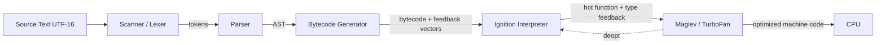
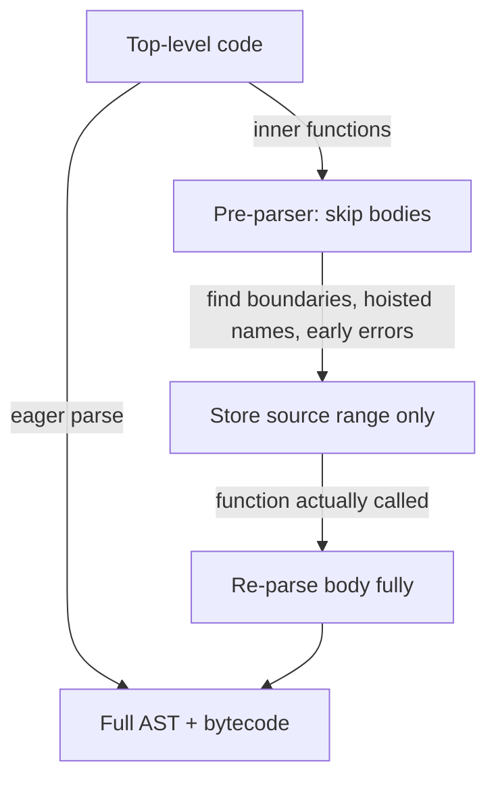
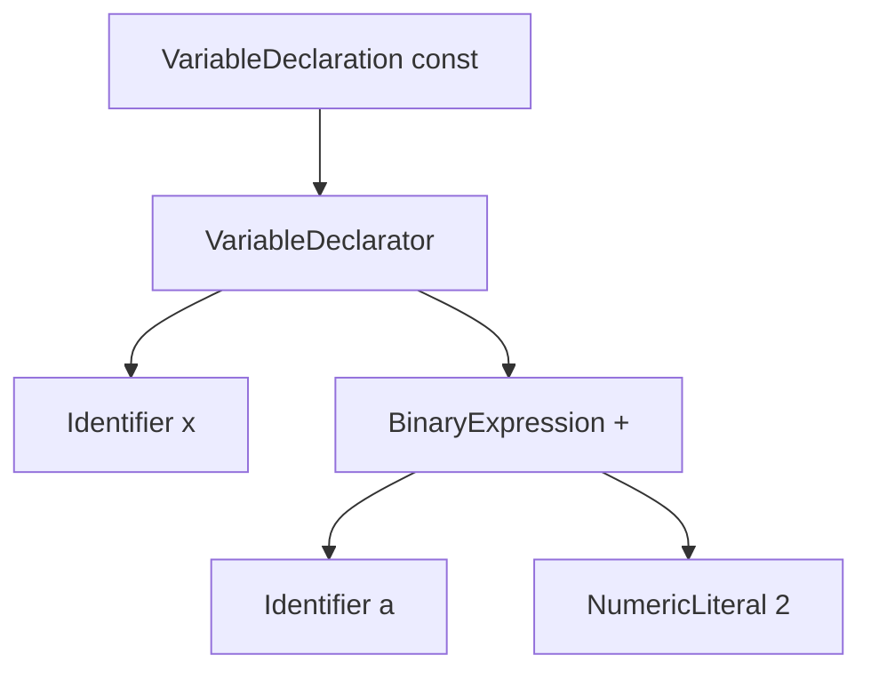

# Parsing AST and Bytecode

## Overview

Before a single line of your JavaScript runs, the engine must turn a **stream of UTF-16 code units** into something it can execute. That transformation is a pipeline: **scanning** (tokenization) → **parsing** (building an Abstract Syntax Tree) → **bytecode generation** (a linear, engine-internal instruction format) → execution by an interpreter (and later, optimizing compilers).

This note is about the *front half* of the engine: how source text becomes an **AST** and then **bytecode**. It is the foundation for [[02-JavaScript/04-Engines-and-Memory/Interpreters JIT and Optimization Tiers|Interpreters JIT and Optimization Tiers]], because you cannot reason about JIT without first understanding what it consumes.

We use **V8** (Chrome, Node.js, Deno, Edge) as the primary reference engine because its pipeline (**Ignition** bytecode interpreter + **Maglev**/**TurboFan** compilers) is the best documented, but we note where **SpiderMonkey** (Firefox) and **JavaScriptCore** (Safari) differ. The concepts—tokens, ASTs, bytecode, lazy compilation—are universal.

ECMAScript the *specification* never mentions ASTs or bytecode; it defines an abstract algorithm over the grammar. ASTs and bytecode are **implementation strategies** every real engine chose because parsing directly into a tree-walking evaluator is too slow and memory-hungry for the modern web.

## Learning Objectives

- Trace the exact stages from source text to executable bytecode
- Explain **lazy (pre-)parsing** and why it dominates startup performance
- Read a real V8 bytecode listing and map it back to source
- Distinguish grammar ambiguities JavaScript resolves at parse time (ASI, arrow vs. grouping, regex vs. division)
- Reason about parse cost when structuring large bundles and hot modules

## Prerequisites

- [[02-JavaScript/00-Orientation/JavaScript Program Lifecycle|JavaScript Program Lifecycle]]
- [[02-JavaScript/02-Execution-and-Functions/Lexical Grammar and Automatic Semicolon Insertion|Lexical Grammar and Automatic Semicolon Insertion]]
- [[01-Computer-Science/08-Languages-and-Computation/Grammars and Parsing|Grammars and Parsing]]
- [[01-Computer-Science/08-Languages-and-Computation/Compilers Interpreters and Virtual Machines|Compilers Interpreters and Virtual Machines]]

## Difficulty

`advanced`

## Estimated Time

- Reading: 2–3 hours
- Exercises: 3 hours
- Mini project: 6 hours

## History

Early engines (Netscape's original **Mocha/SpiderMonkey**, 1995) walked the AST directly—simple but slow. As JavaScript grew from form-validation snippets to megabyte SPAs, parsing became a measurable fraction of page load. Two ideas reshaped the front end:

1. **Bytecode interpreters** (V8 shipped **Ignition** in 2016, replacing the older full-codegen JIT) traded raw execution speed for far smaller memory footprint and faster startup.
2. **Lazy parsing / pre-parsing**: don't fully compile a function until it is actually called. V8's **pre-parser** skips function bodies, doing only enough work to find their boundaries and detect early syntax errors.

The net effect: shipping less code that parses lazily beats shipping cleverly minified code that eagerly compiles.

## Problem It Solves

- **Startup latency**: fully parsing every function on load wastes CPU on code that may never run.
- **Memory**: an eager AST for a large app can dwarf the source itself; bytecode is compact and the AST is discarded after generation.
- **Correctness**: the grammar has genuine ambiguities (`/` as division vs. regex literal; `{` as block vs. object; `(a) => a` vs. `(a)`) that must be resolved deterministically. The parser encodes these rules.

## Internal Implementation

### The full pipeline



### 1. Scanning (lexing)

The scanner reads code units and emits **tokens**: identifiers, keywords, punctuators, numeric/string literals. It handles Unicode, normalizes line terminators, and tracks positions for error messages and source maps. It is also where the **regex-vs-division** ambiguity is resolved using parser context (the scanner is not fully context-free here).

### 2. Parsing into an AST

The parser is a hand-written **recursive descent** parser (in V8 and most engines) that consumes tokens and builds a tree of nodes: `Program`, `FunctionDeclaration`, `BinaryExpression`, `CallExpression`, etc. It enforces the grammar, applies [[02-JavaScript/02-Execution-and-Functions/Lexical Grammar and Automatic Semicolon Insertion|Automatic Semicolon Insertion]], and performs **early error** checks (e.g., duplicate `let`, `return` outside a function).

**Lazy parsing** is the key optimization:



The pre-parser is ~2× faster than the full parser because it skips building nodes for bodies. The cost: functions that *are* called get parsed **twice**. V8 mitigates this with heuristics (functions wrapped in parentheses—the **IIFE hint**—are eagerly compiled because they usually run immediately) and with a **compilation cache**.

### 3. Bytecode generation

The AST is walked once to emit **Ignition bytecode**: a register-based (not stack-based) instruction set with an **accumulator** register. Bytecode is compact and portable across CPU architectures. Alongside each function's bytecode, V8 allocates a **feedback vector** that records runtime type observations—this feedback later drives the optimizing tiers described in [[02-JavaScript/04-Engines-and-Memory/Interpreters JIT and Optimization Tiers|Interpreters JIT and Optimization Tiers]].

Once bytecode is generated, the **AST is thrown away**. Only source position tables (for stack traces / debugging) and bytecode survive.

### Register machine vs. stack machine

Ignition is a **register machine** with an accumulator; compare with the stack-based VM in [[01-Computer-Science/08-Languages-and-Computation/Bytecode and JIT Compilation|Bytecode and JIT Compilation]]. Register bytecode tends to be more compact (fewer push/pop instructions) and maps more directly to the SSA form used by the optimizer.

## Mermaid Diagrams

### Structure of a small AST

For `const x = a + 2;`:



### Compilation as a lifecycle

```mermaid
sequenceDiagram
    participant Loader as Host Loader
    participant Scanner
    participant Parser
    participant BGen as Bytecode Gen
    participant Ignition
    Loader->>Scanner: source text
    Scanner->>Parser: token stream
    Parser->>Parser: pre-parse inner functions (lazy)
    Parser->>BGen: AST (top-level + eager fns)
    BGen->>Ignition: bytecode + feedback vector
    Note over Ignition: executes; on first call to lazy fn, re-parse + gen
```

## Examples

### Minimal Example — inspecting bytecode

Node.js exposes V8 flags. Run:

```bash
node --print-bytecode --print-bytecode-filter=add script.js
```

For:

```javascript
function add(a, b) {
  return a + b;
}
add(1, 2);
```

You will see something close to (abbreviated; exact opcodes vary by version):

```text
[generated bytecode for function: add]
Parameter count 3
Register count 0
  Ldar a1            // load arg b into accumulator
  Add a0, [0]        // accumulator = a0 (a) + acc, feedback slot [0]
  Return             // return accumulator
```

Note the **feedback slot `[0]`** on `Add`: this is where type feedback (are these SMIs? doubles? strings?) accumulates.

### Production-Shaped Example — parse cost and startup

Parsing is a real budget line. Two patterns to control it:

```javascript
// 1. Lazy-load rarely used code so the parser never touches it on startup.
button.addEventListener("click", async () => {
  const { renderHeavyChart } = await import("./heavy-chart.js"); // separate parse
  renderHeavyChart(data);
});

// 2. The IIFE heuristic: wrapping in parens hints "compile me eagerly, I run now".
const config = (function build() {
  // V8 eagerly compiles this instead of pre-parse + re-parse.
  return { featureFlags: readFlags(), startedAt: Date.now() };
})();
```

Measure with Chrome DevTools **Performance** panel (look for "Compile Script" / "Compile Code") or Node's `--prof`. See [[02-JavaScript/07-Production-JavaScript/Measuring and Optimizing Performance|Measuring and Optimizing Performance]].

## Trade-offs

| Dimension | Upside | Downside | When it matters |
| --- | --- | --- | --- |
| Lazy (pre-)parsing | Faster startup, less memory | Double-parse if function is called | Large bundles, cold start |
| Eager compilation (IIFE hint) | No re-parse for immediate code | Wasted work if not run | Config/init modules |
| Bytecode interpreter | Small footprint, fast to produce | Slower steady-state than JIT | Startup, low-heat code |
| Compact register bytecode | Fewer instructions, cache-friendly | Harder to read than stack VM | Engine internals |
| Code caching | Skip parse entirely on repeat visits | Cache invalidation complexity | PWAs, repeat page loads |

### When to Use

- **Code-split and lazy-import** to keep off-critical-path code out of the startup parse.
- Trust the engine's heuristics; write clear code rather than micro-optimizing for the parser.

### When Not to Use

- Do not manually wrap everything in IIFEs to "force eager" compilation—modern V8's heuristics and code caching usually win, and it hurts readability.
- Do not ship one giant bundle assuming minification fixes parse cost; **bytes parsed** matter more than bytes transferred after gzip.

## Exercises

1. Run `node --print-bytecode` on a function with a `for` loop and identify the jump instructions.
2. Write two versions of a module: one giant top-level function, one split into lazily imported chunks. Measure "Compile Script" time in DevTools.
3. Find a snippet where `/` is ambiguous (regex vs. division) and explain how context disambiguates it.
4. Use `node --trace-opt --trace-deopt` on a hot function and correlate with bytecode.
5. Given `(a) => a + 1` vs. `(a)`, explain what the parser must look ahead to decide.

## Mini Project

**Tiny JS-subset compiler.** Build a scanner + recursive-descent parser + bytecode generator for a subset (numbers, `+ - * /`, variables, `print`). Emit bytecode for a stack VM, then write the VM. Include a `--dump-ast` and `--dump-bytecode` flag. This mirrors the real pipeline end-to-end. Cross-reference [[02-JavaScript/code/README|JavaScript code labs]].

## Portfolio Project

Extend the mini project into an **AST explorer web app**: paste JavaScript, visualize the AST (tree view), and show generated bytecode side-by-side using a real parser library (e.g., Acorn/Babel for the AST). Add lazy-parse simulation that highlights which functions would be pre-parsed vs. eagerly compiled.

## Interview Questions

1. Walk through what happens between typing `<script>` and the first bytecode executing.
2. What is lazy parsing and when does it hurt you?
3. Why does V8 discard the AST after bytecode generation?
4. Is Ignition a stack machine or a register machine, and why does it matter?
5. Why can minification reduce transfer size but not proportionally reduce parse time?

### Stretch / Staff-Level

1. Explain how the IIFE heuristic interacts with tree-shaking and bundlers that strip parentheses.
2. How does V8's code cache (`compile hints`, bytecode caching in Node's `vm.Script`) change the parse story across process restarts?

## Common Mistakes

- Believing "JavaScript is interpreted" full stop—it is parsed to bytecode then JIT-compiled.
- Assuming all code is parsed once; hot functions in lazy contexts are parsed twice.
- Confusing the ECMAScript spec's abstract grammar with an engine's concrete AST.
- Micro-optimizing source for the parser instead of reducing code shipped.

## Best Practices

- **Ship less code** and split it; the cheapest parse is the one you avoid.
- Keep initialization code that runs immediately in IIFE form or top-level so it compiles eagerly.
- Use **bytecode/code caching** (browser HTTP cache + V8 code cache, Node `vm` compile cache) for repeat loads.
- Rely on tooling (Acorn, Babel, `@typescript-eslint`) that shares AST vocabulary for lint/codemods.
- Profile compile time explicitly during performance work—don't guess.

## Summary

Every JavaScript engine turns source text into tokens, an AST, and then compact bytecode, discarding the AST afterward. Lazy pre-parsing is the dominant startup optimization: inner function bodies are skipped until called, at the cost of a possible double parse. V8's Ignition is a register-based bytecode interpreter that also records type feedback, setting up the optimizing tiers. Practically, the biggest lever you control is **how much code the engine must parse**—so split, lazy-load, and cache.

## Further Reading

- [[00-References/JavaScript/README|JavaScript References]]
- V8 blog — *Ignition: an interpreter for V8* and *Blazingly fast parsing*
- [[01-Computer-Science/08-Languages-and-Computation/Grammars and Parsing|Grammars and Parsing]]
- [[01-Computer-Science/08-Languages-and-Computation/Bytecode and JIT Compilation|Bytecode and JIT Compilation]]

## Related Notes

- [[02-JavaScript/04-Engines-and-Memory/Interpreters JIT and Optimization Tiers|Interpreters JIT and Optimization Tiers]]
- [[02-JavaScript/04-Engines-and-Memory/Hidden Classes Shapes and Inline Caches|Hidden Classes Shapes and Inline Caches]]
- [[02-JavaScript/04-Engines-and-Memory/Deoptimization and Performance Cliffs|Deoptimization and Performance Cliffs]]
- [[02-JavaScript/00-Orientation/ECMAScript Engines and Host Runtimes|ECMAScript Engines and Host Runtimes]]
- [[02-JavaScript/02-Execution-and-Functions/Lexical Grammar and Automatic Semicolon Insertion|Lexical Grammar and Automatic Semicolon Insertion]]
- [[01-Computer-Science/08-Languages-and-Computation/Compilers Interpreters and Virtual Machines|Compilers Interpreters and Virtual Machines]]

## Progress Checklist

- [ ] Explained from first principles
- [ ] Drew at least one Mermaid diagram
- [ ] Implemented a minimal version
- [ ] Documented trade-offs and non-goals
- [ ] Completed exercises
- [ ] Practiced interview questions aloud
- [ ] Linked prerequisites and dependents
