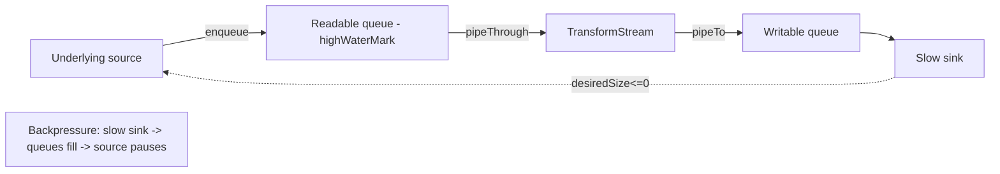
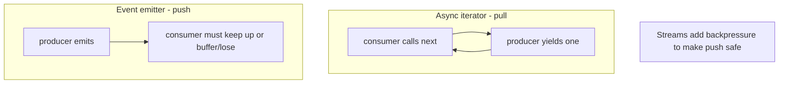
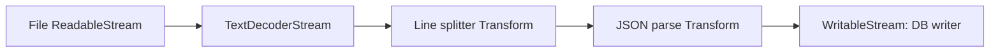

# Async Iteration and Streams

## Overview

Some data doesn't arrive all at once—it arrives **over time and in pieces**: rows from a paginated API, bytes from a network socket, lines from a huge file, events from a sensor. Loading it all into memory is wasteful or impossible. **Async iteration** (`Symbol.asyncIterator`, `for await...of`, async generators) and **streams** (the WHATWG **Web Streams** API: `ReadableStream`, `WritableStream`, `TransformStream`) are JavaScript's answer: pull or push data incrementally, process it as it flows, and apply **backpressure** so a fast producer can't overwhelm a slow consumer.

This note explains the **async iteration protocol**, how **async generators** make producing streams ergonomic, and how **Web Streams** add backpressure and piping. It connects the language-level protocol to the host-level stream APIs, and hands **Node's own `stream` module** internals to [[06-NodeJS/04-Buffers-Streams-and-IO/Readable Writable and Duplex Streams|Readable Writable and Duplex Streams]] and [[06-NodeJS/04-Buffers-Streams-and-IO/pipeline and Finished|pipeline and Finished]] (Node streams predate and differ from Web Streams, though they now interoperate). Backpressure theory lives in [[01-Computer-Science/05-Concurrency-Fundamentals/Backpressure and Resource Contention|Backpressure and Resource Contention]].

## Learning Objectives

- Implement and consume the async iteration protocol (`Symbol.asyncIterator`, `next()` → `Promise<{value, done}>`)
- Write async generators to model paginated/streaming sources cleanly
- Explain `for await...of` semantics, including sequentiality and early termination
- Use `ReadableStream`/`WritableStream`/`TransformStream` and `pipeThrough`/`pipeTo` with backpressure
- Distinguish Web Streams from Node streams and know the interop points

## Prerequisites

- [[02-JavaScript/05-Async-and-Concurrency/Async and Await|Async and Await]]
- [[02-JavaScript/03-Objects-and-Metaprogramming/Iterators and Generators|Iterators and Generators]]
- [[02-JavaScript/05-Async-and-Concurrency/Concurrency Control and Backpressure|Concurrency Control and Backpressure]]

## Difficulty

`advanced`

## Estimated Time

- Reading: 2 hours
- Exercises: 3 hours
- Mini project: 5 hours

## History

Synchronous iterators/generators arrived in ES2015. ES2018 added **async iterators** and `for await...of` to iterate over promised values. The WHATWG **Streams Standard** defined `ReadableStream` (2016+), later `WritableStream` and `TransformStream`, with a **queuing strategy** and backpressure model. Node.js had its own `stream` module since 2010 (objects, `.pipe()`, `highWaterMark`); modern Node bridges to Web Streams (`Readable.toWeb`/`fromWeb`) as the ecosystem converges.

## Problem It Solves

- **Bounded memory** over unbounded/large data: process chunks, don't buffer everything.
- **Time-distributed data**: model sources that yield values as they become available.
- **Flow control**: backpressure prevents a fast source from exhausting memory when the sink is slow (see [[01-Computer-Science/05-Concurrency-Fundamentals/Backpressure and Resource Contention|Backpressure and Resource Contention]]).

## Internal Implementation

### The async iteration protocol

An **async iterable** has a `[Symbol.asyncIterator]()` method returning an **async iterator** whose `next()` returns a **`Promise<{ value, done }>`**. `for await...of` calls `next()`, `await`s it, yields `value`, and repeats until `done`.

```mermaid
sequenceDiagram
    participant Loop as for await...of
    participant It as Async Iterator
    participant Src as Data Source
    Loop->>It: next()
    It->>Src: fetch next chunk (async)
    Src-->>It: chunk
    It-->>Loop: Promise<{value: chunk, done: false}>
    Loop->>Loop: await + run body
    Loop->>It: next() ... until done:true
    Note over Loop,It: on break/throw -> it.return() for cleanup
```

`for await...of` is **sequential by design**: it awaits each `next()` before requesting the next. Early exit (`break`, `return`, `throw`) calls the iterator's `return()` so generators run their `finally` for cleanup.

### Async generators

An `async function*` yields values with `await` in between—the natural way to author async iterables:

```javascript
async function* paginate(url) {
  let next = url;
  while (next) {
    const page = await fetch(next).then((r) => r.json());
    for (const item of page.items) yield item; // stream items
    next = page.nextUrl;                        // may be null -> stop
  }
  // any cleanup here runs on completion OR early termination (return())
}
```

### Web Streams and backpressure

A `ReadableStream` has an internal queue and a **queuing strategy** (`highWaterMark`, `size`). When the consumer is slow, the queue fills; the stream signals the source (via `controller.desiredSize` ≤ 0) to **pause** producing. `pipeTo`/`pipeThrough` wire this automatically so backpressure propagates end-to-end.



`ReadableStream` is itself **async-iterable** in modern runtimes, so `for await (const chunk of readable)` works.

### Web Streams vs. Node streams (handoff)

- **Web Streams** (`ReadableStream`, etc.): the cross-platform standard; async-iterable; built-in backpressure via queuing strategy.
- **Node streams** (`stream.Readable/Writable/Transform`, `.pipe`, `highWaterMark`, object mode): older, event-based (`data`, `end`, `drain`), Node-specific. Interop via `Readable.toWeb()`/`Readable.fromWeb()`. **Node stream internals and `pipeline()` belong to** [[06-NodeJS/04-Buffers-Streams-and-IO/Readable Writable and Duplex Streams|Readable Writable and Duplex Streams]], [[06-NodeJS/04-Buffers-Streams-and-IO/Backpressure and HighWaterMark|Backpressure and HighWaterMark]], and [[06-NodeJS/04-Buffers-Streams-and-IO/pipeline and Finished|pipeline and Finished]]; here we focus on the language protocol and Web Streams.

## Mermaid Diagrams

### Pull vs push



### Transform pipeline



## Examples

### Minimal Example — async generator + for await

```javascript
async function* countdown(n, delayMs = 100) {
  while (n > 0) {
    await new Promise((r) => setTimeout(r, delayMs));
    yield n--;
  }
}

for await (const n of countdown(3)) {
  console.log(n); // 3, 2, 1 (one per 100ms) — sequential
}
```

### Production-Shaped Example — bounded-memory transform pipeline with backpressure

```javascript
// Process a large newline-delimited JSON file without loading it all.
async function processNdjson(readable /* ReadableStream<Uint8Array> */, handle) {
  const lines = readable
    .pipeThrough(new TextDecoderStream())
    .pipeThrough(splitLines()); // custom TransformStream emitting one line per chunk

  for await (const line of lines) {
    if (!line) continue;
    await handle(JSON.parse(line)); // await applies backpressure to the source
  }
}

function splitLines() {
  let buffer = "";
  return new TransformStream({
    transform(chunk, controller) {
      buffer += chunk;
      const parts = buffer.split("\n");
      buffer = parts.pop() ?? ""; // keep incomplete last line
      for (const p of parts) controller.enqueue(p);
    },
    flush(controller) {
      if (buffer) controller.enqueue(buffer);
    },
  });
}
```

Awaiting `handle` inside `for await` naturally throttles the source (backpressure). Concurrency limits for per-item async work are in [[02-JavaScript/05-Async-and-Concurrency/Concurrency Control and Backpressure|Concurrency Control and Backpressure]].

## Trade-offs

| Dimension | Upside | Downside | When it matters |
| --- | --- | --- | --- |
| Async iterators | Simple pull model, backpressure by construction | Sequential (one at a time) | Paging, ordered streams |
| Async generators | Ergonomic producers, auto cleanup | Slight overhead per yield | Modeling streaming sources |
| Web Streams | Standard, composable, backpressure | More ceremony for simple cases | Byte/transform pipelines |
| Node streams | Mature ecosystem, object mode | Node-only, event-based complexity | Node I/O (see Node track) |
| `for await` concurrency | Predictable ordering | Not parallel | When order matters |

### When to Use

- Use **async iterables/generators** for ordered, incremental, pull-based data (pagination, queues).
- Use **Web Streams** for byte/transform pipelines needing backpressure and composition.

### When Not to Use

- Don't use `for await...of` when you need **parallelism** across items—it's sequential; use a concurrency limiter.
- Don't hand-roll streaming when a small dataset fits comfortably in memory.

## Exercises

1. Implement a custom async iterable (object with `[Symbol.asyncIterator]`) over a paginated source.
2. Write an async generator with a `finally` block; prove cleanup runs on early `break`.
3. Build a `TransformStream` that uppercases text chunks and pipe a source through it.
4. Demonstrate backpressure: a slow consumer pausing a fast producer (log `desiredSize`).
5. Convert a Node `Readable` to a Web `ReadableStream` and iterate it with `for await`.

## Mini Project

**Streaming CSV/NDJSON processor.** Build a pipeline (`ReadableStream` → decode → split → parse → validate → sink) that processes a multi-GB file with flat memory usage, reports throughput, and supports early cancellation. Store in [[02-JavaScript/code/README|JavaScript code labs]].

## Portfolio Project

Build a **real-time log tailer + dashboard**: an async-generator source over a growing log (or SSE/WebSocket), transform streams for filtering/parsing, and a UI consuming via `for await` with visible backpressure metrics. Cross-link [[02-JavaScript/05-Async-and-Concurrency/Concurrency Control and Backpressure|Concurrency Control and Backpressure]].

## Interview Questions

1. What does an async iterator's `next()` return, and how does `for await...of` use it?
2. Is `for await...of` parallel or sequential? How do you add controlled parallelism?
3. How does an async generator's cleanup (`finally`) get triggered on early exit?
4. What is backpressure and how do Web Streams implement it?
5. How do Web Streams differ from Node streams, and how do they interoperate?

### Stretch / Staff-Level

1. Explain the queuing strategy (`highWaterMark`, `size`) and `desiredSize` in Web Streams.
2. How would you fan out one readable stream to multiple consumers (`tee`) safely?

## Common Mistakes

- Expecting `for await...of` to run items in parallel (it's sequential).
- Buffering an entire stream into an array (defeats streaming).
- Ignoring backpressure and OOMing on a fast source / slow sink.
- Forgetting cleanup (`return()`/`finally`) on early termination.
- Mixing Node and Web stream APIs without the `toWeb`/`fromWeb` bridge.

## Best Practices

- Model incremental sources as async generators; keep cleanup in `finally`.
- Prefer `pipeThrough`/`pipeTo` so backpressure propagates automatically.
- Add bounded concurrency (a limiter) when per-item work should overlap.
- Always support cancellation (`AbortSignal`) for long-lived streams.
- Keep transforms small and composable; avoid buffering unbounded state.

## Summary

Async iteration (`Symbol.asyncIterator`, `for await...of`, async generators) provides a pull-based, sequential, backpressure-friendly way to consume data that arrives over time, with automatic cleanup on early exit. Web Streams (`ReadableStream`/`WritableStream`/`TransformStream`) add composable, backpressured byte/transform pipelines via queuing strategies, and are themselves async-iterable. Use these to process large or time-distributed data with bounded memory; reach for a concurrency limiter when you need parallelism. Node's own stream module is related but distinct and is covered in the Node.js track.

## Further Reading

- [[00-References/JavaScript/README|JavaScript References]]
- WHATWG — *Streams Standard*; MDN — *Streams API*, *for await...of*
- Node.js docs — *Stream* and Web Streams interop (`toWeb`/`fromWeb`)
- [[01-Computer-Science/05-Concurrency-Fundamentals/Backpressure and Resource Contention|Backpressure and Resource Contention]]

## Related Notes

- [[02-JavaScript/05-Async-and-Concurrency/Async and Await|Async and Await]]
- [[02-JavaScript/03-Objects-and-Metaprogramming/Iterators and Generators|Iterators and Generators]]
- [[02-JavaScript/05-Async-and-Concurrency/Concurrency Control and Backpressure|Concurrency Control and Backpressure]]
- [[02-JavaScript/05-Async-and-Concurrency/Cancellation Timeouts and AbortController|Cancellation Timeouts and AbortController]]
- [[06-NodeJS/04-Buffers-Streams-and-IO/Readable Writable and Duplex Streams|Readable Writable and Duplex Streams]] · [[06-NodeJS/04-Buffers-Streams-and-IO/pipeline and Finished|pipeline and Finished]] · [[06-NodeJS/README|Node.js]]

## Progress Checklist

- [ ] Explained from first principles
- [ ] Drew at least one Mermaid diagram
- [ ] Implemented a minimal version
- [ ] Documented trade-offs and non-goals
- [ ] Completed exercises
- [ ] Practiced interview questions aloud
- [ ] Linked prerequisites and dependents
