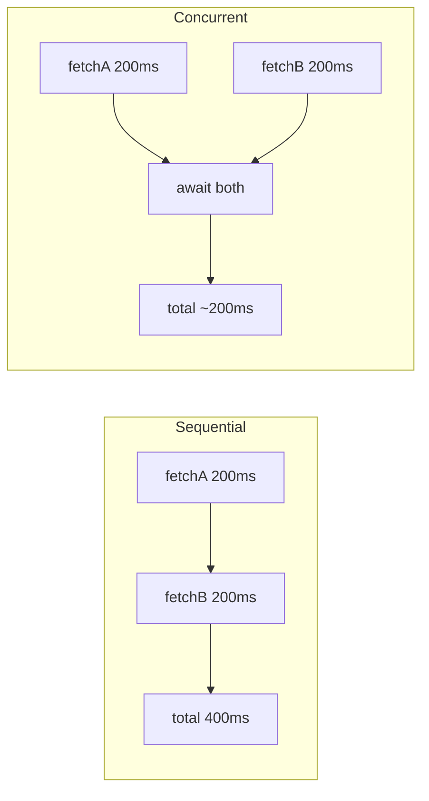
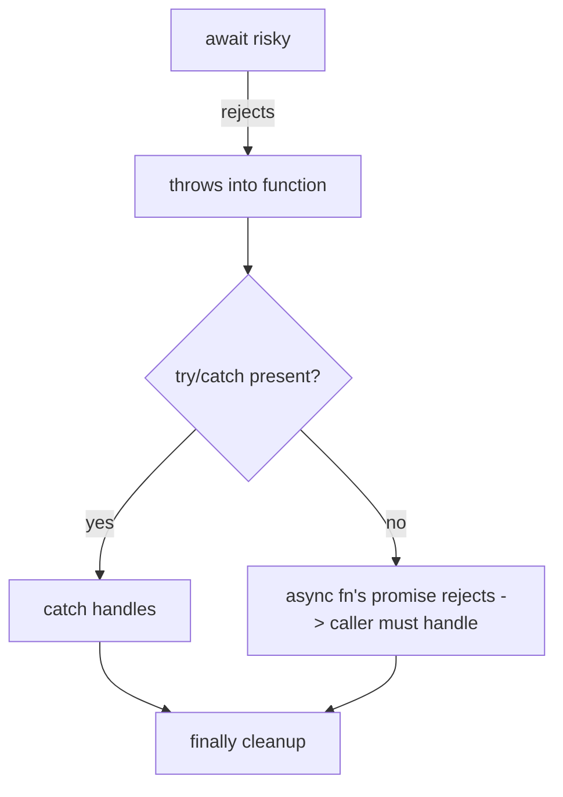

# Async and Await

## Overview

`async`/`await` is **syntax over promises** that lets you write asynchronous code in a straight-line, synchronous-looking style—with normal `try/catch`, loops, and `return`—while the engine handles the callback plumbing. An `async` function **always returns a promise**; `await` **pauses** the function until a promise settles, then resumes with its value (or throws its rejection). Under the hood it is a **coroutine**: the function suspends at each `await` and its continuation is scheduled as a **microtask** when the awaited promise settles.

Crucially, `await` does **not** block the thread or the event loop—it suspends only *that* function; the loop keeps running other tasks. Understanding this—and the difference between **sequential** and **concurrent** awaiting—is the line between correct, fast async code and accidentally serialized, slow code. This note builds on [[02-JavaScript/05-Async-and-Concurrency/Promises Internals|Promises Internals]] and the generator model in [[02-JavaScript/03-Objects-and-Metaprogramming/Iterators and Generators|Iterators and Generators]].

## Learning Objectives

- Explain `async`/`await` as coroutine syntax over promises and the microtask resumption model
- Distinguish sequential vs. concurrent awaiting and avoid accidental serialization
- Handle errors with `try/catch/finally` across `await` boundaries
- Reason about `for await...of`, top-level `await`, and their trade-offs
- Recognize the desugaring to promises/generators for precise mental modeling

## Prerequisites

- [[02-JavaScript/05-Async-and-Concurrency/Promises Internals|Promises Internals]]
- [[02-JavaScript/05-Async-and-Concurrency/Run to Completion and Event Loop|Run to Completion and Event Loop]]
- [[02-JavaScript/03-Objects-and-Metaprogramming/Iterators and Generators|Iterators and Generators]]

## Difficulty

`advanced`

## Estimated Time

- Reading: 2 hours
- Exercises: 3 hours
- Mini project: 4 hours

## History

Coroutine-style async predates JS in C# (`async/await`, 2012) and Python. In JavaScript, generator-based coroutines (`co` library, using `yield` on promises) proved the pattern around 2013–2015. ES2017 standardized `async`/`await` as dedicated syntax—effectively a generator that yields promises with an automatic driver. ES2018 added `for await...of`; ES2022 added **top-level `await`** in modules.

## Problem It Solves

- **Readability**: replaces promise `.then` chains and callback pyramids with linear code.
- **Native error handling**: `try/catch` works across async boundaries; `finally` runs for cleanup.
- **Control flow**: loops, conditionals, and early returns work naturally with async values.

It does **not** add new capability over promises—it's ergonomics and correctness, not power.

## Internal Implementation

### Desugaring to a promise-driven coroutine

An `async` function is roughly a generator whose `yield`s are `await`s, driven by a helper that feeds resolved values back in:

```javascript
// async function f() { const a = await p1; const b = await p2(a); return b; }
// desugars conceptually to:
function f() {
  return spawn(function* () {
    const a = yield p1;
    const b = yield p2(a);
    return b;
  });
}
function spawn(genF) {
  return new Promise((resolve, reject) => {
    const gen = genF();
    function step(next) {
      let res;
      try { res = next(); } catch (e) { return reject(e); }
      if (res.done) return resolve(res.value);
      Promise.resolve(res.value).then(
        (v) => step(() => gen.next(v)),   // resume with value (microtask)
        (e) => step(() => gen.throw(e))   // resume by throwing into the coroutine
      );
    }
    step(() => gen.next());
  });
}
```

### Suspension and resumption

```mermaid
sequenceDiagram
    participant Fn as async function
    participant P as awaited promise
    participant MQ as Microtask Queue
    participant Loop as Event Loop
    Fn->>Fn: run synchronously up to first await
    Fn->>P: await p  (suspend; return pending promise to caller)
    Note over Loop: loop runs other tasks while suspended
    P->>MQ: settles -> enqueue continuation (microtask)
    MQ->>Fn: resume with value (or throw reason)
    Fn->>Fn: continue to next await / return
```

The function body up to the **first `await` runs synchronously**; everything after each `await` runs later as a **microtask**. So an `async` function is not "fully async from the start."

### Sequential vs. concurrent — the #1 performance trap

```javascript
// SEQUENTIAL (slow): each await waits for the previous. Total = sum of latencies.
async function slow(a, b) {
  const x = await fetchA(a); // wait...
  const y = await fetchB(b); // ...then wait again
  return [x, y];
}

// CONCURRENT (fast): start both, then await. Total = max of latencies.
async function fast(a, b) {
  const px = fetchA(a);      // start now (no await yet)
  const py = fetchB(b);      // start now
  return [await px, await py]; // or: await Promise.all([px, py])
}
```

Await **only when you need the value**. Independent operations should be started before any `await`.

### `await` accepts any value

`await 5` works (wraps in `Promise.resolve`), and `await thenable` assimilates it. `await` on a non-promise still defers continuation to a microtask.

## Mermaid Diagrams

### Sequential vs concurrent latency



### Error flow across await



## Examples

### Minimal Example — ordering with sync prefix

```javascript
async function demo() {
  console.log("1"); // sync, runs immediately
  await null;       // suspend; continuation is a microtask
  console.log("3"); // runs after current turn's sync code
}
console.log("0");
demo();
console.log("2");
// Output: 0, 1, 2, 3
```

### Production-Shaped Example — concurrent with limits, retries, and cleanup

```javascript
async function loadDashboard(userId, { signal } = {}) {
  // Start independent requests concurrently.
  const userP = getUser(userId, { signal });
  const statsP = getStats(userId, { signal });

  try {
    // Await together; fail fast if either rejects.
    const [user, stats] = await Promise.all([userP, statsP]);

    // Dependent step must be sequential (needs user.teamId).
    const team = await getTeam(user.teamId, { signal });

    return { user, stats, team };
  } catch (err) {
    // Normalize + rethrow; see Errors Across Async Boundaries.
    throw new Error(`dashboard load failed: ${err.message}`, { cause: err });
  } finally {
    releaseTempResources(); // always runs, even on throw/cancel
  }
}
```

Cancellation via `signal` is detailed in [[02-JavaScript/05-Async-and-Concurrency/Cancellation Timeouts and AbortController|Cancellation Timeouts and AbortController]]; bounded concurrency in [[02-JavaScript/05-Async-and-Concurrency/Concurrency Control and Backpressure|Concurrency Control and Backpressure]].

## Trade-offs

| Dimension | Upside | Downside | When it matters |
| --- | --- | --- | --- |
| async/await vs `.then` | Linear, readable, native try/catch | Easy to accidentally serialize | Multi-step flows |
| Sequential await | Simple for dependent steps | Slow if steps are independent | Latency-sensitive |
| `Promise.all` inside async | Concurrency + fail-fast | Loses partial results | All-or-nothing |
| Top-level await | Clean module init | Blocks module graph loading | ESM entry setup |
| `for await...of` | Clean async iteration | Serial by default | Streaming, paging |

### When to Use

- Use `async/await` as the default for readable multi-step async logic.
- Start independent work before awaiting; combine with `Promise.all`/combinators.

### When Not to Use

- Don't `await` inside a loop for independent items (serializes them)—collect promises and `await Promise.all`, or use a concurrency limiter.
- Don't use top-level `await` in hot module paths where it delays the whole graph.

## Exercises

1. Rewrite a `.then` chain as `async/await` and vice versa.
2. Find and fix an accidental serialization (`await` in a loop) in provided code.
3. Show that code before the first `await` runs synchronously.
4. Implement your own `spawn`/`co` driver over generators and run an async flow through it.
5. Use `try/catch/finally` to guarantee cleanup on both success and rejection.

## Mini Project

**Generator-based async runner.** Implement `co`-style `spawn(genFn)` that drives a generator yielding promises (supporting `gen.throw` on rejection), then reimplement a few `async` functions as generators driven by it—demonstrating the desugaring. Store in [[02-JavaScript/code/README|JavaScript code labs]].

## Portfolio Project

Build an **async workflow engine**: define steps with dependencies (a DAG); the engine runs independent steps concurrently and dependent steps sequentially, with per-step timeout, retry, and cancellation. Visualize the execution timeline. Cross-link [[02-JavaScript/05-Async-and-Concurrency/Concurrency Control and Backpressure|Concurrency Control and Backpressure]].

## Interview Questions

1. What does an `async` function return, and when does its body start/suspend?
2. Explain sequential vs. concurrent awaiting with a latency example.
3. How does `await` interact with the microtask queue?
4. How is `async/await` related to generators?
5. Does `await` block the event loop? Explain precisely.

### Stretch / Staff-Level

1. Desugar a two-`await` function into a generator + driver.
2. What are the risks of top-level `await` for module graph loading?

## Common Mistakes

- `await` in a loop over independent items (accidental serialization).
- Forgetting an `async` function always returns a promise (returning a value ≠ sync).
- Assuming the whole async body is deferred (the prefix runs synchronously).
- Missing `try/catch` so rejections become unhandled.
- Overusing top-level `await` and stalling module initialization.

## Best Practices

- Start independent operations before awaiting; use `Promise.all` for concurrency.
- Await only where you need the value; keep dependent steps sequential intentionally.
- Wrap risky awaits in `try/catch`; use `finally` for cleanup.
- Thread an `AbortSignal` through async functions for cancellation.
- Use a concurrency limiter instead of unbounded `Promise.all` over huge inputs.

## Summary

`async`/`await` is coroutine syntax over promises: an `async` function returns a promise, runs synchronously until its first `await`, then suspends and resumes via microtasks as awaited promises settle—never blocking the event loop. It gives linear code with native `try/catch/finally`, but the classic trap is **accidental serialization**: `await`ing independent operations one-by-one. Start independent work first and combine with `Promise.all`. Internally it desugars to a generator yielding promises with an automatic driver—knowing that makes its timing and error behavior fully predictable.

## Further Reading

- [[00-References/JavaScript/README|JavaScript References]]
- MDN — *async function*, *await*, *Top level await*
- V8 blog — *Faster async functions and promises*
- [[02-JavaScript/05-Async-and-Concurrency/Promises Internals|Promises Internals]]

## Related Notes

- [[02-JavaScript/05-Async-and-Concurrency/Promises Internals|Promises Internals]]
- [[02-JavaScript/05-Async-and-Concurrency/Async Iteration and Streams|Async Iteration and Streams]]
- [[02-JavaScript/05-Async-and-Concurrency/Errors Across Async Boundaries|Errors Across Async Boundaries]]
- [[02-JavaScript/05-Async-and-Concurrency/Cancellation Timeouts and AbortController|Cancellation Timeouts and AbortController]]
- [[02-JavaScript/03-Objects-and-Metaprogramming/Iterators and Generators|Iterators and Generators]]

## Progress Checklist

- [ ] Explained from first principles
- [ ] Drew at least one Mermaid diagram
- [ ] Implemented a minimal version
- [ ] Documented trade-offs and non-goals
- [ ] Completed exercises
- [ ] Practiced interview questions aloud
- [ ] Linked prerequisites and dependents
