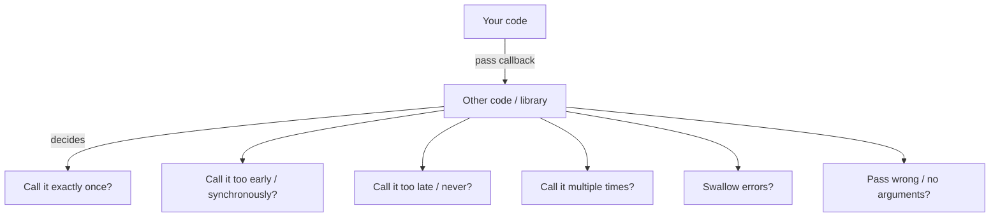
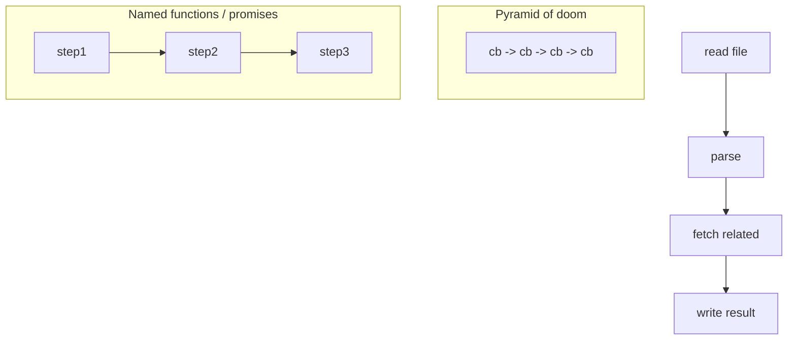
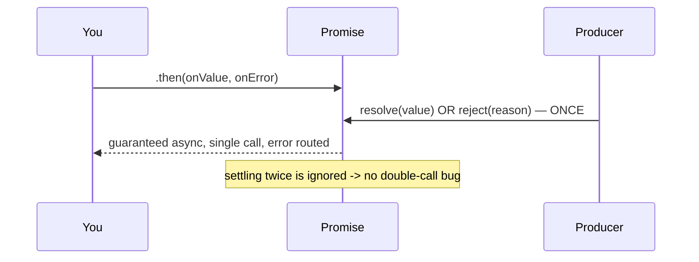

# Callbacks and Inversion of Control

## Overview

A **callback** is simply a function you pass to another function to be called later. Because JavaScript's event loop never blocks, callbacks are the *original* mechanism for asynchrony: "when the file is read / the timer fires / the request returns, call this." They are foundational—promises, `async/await`, streams, and event emitters are all built on top of callback dispatch.

The deep idea worth naming is **Inversion of Control (IoC)**: when you pass a callback, you hand *control of when, whether, and how often your code runs* to some other code you may not trust. That transfer of trust is the real source of "callback problems"—not the nesting syntax. This note treats callbacks rigorously: **continuation-passing style**, the Node **error-first** convention, the specific **trust issues** IoC creates (called too early/late, multiple times, never, swallowed errors), and how promises reclaim that control. It bridges [[02-JavaScript/02-Execution-and-Functions/Functions as Values|Functions as Values]] and [[02-JavaScript/05-Async-and-Concurrency/Promises Internals|Promises Internals]].

## Learning Objectives

- Explain callbacks as continuation-passing style and why the loop needs them
- Articulate Inversion of Control and the concrete trust problems it introduces
- Apply the Node error-first callback convention correctly
- Recognize "callback hell" as a symptom (naming/nesting) vs. IoC as the root problem
- Convert callback APIs to promises safely (`promisify`) and know the pitfalls

## Prerequisites

- [[02-JavaScript/02-Execution-and-Functions/Functions as Values|Functions as Values]]
- [[02-JavaScript/02-Execution-and-Functions/Closures|Closures]]
- [[02-JavaScript/05-Async-and-Concurrency/Run to Completion and Event Loop|Run to Completion and Event Loop]]

## Difficulty

`intermediate`

## Estimated Time

- Reading: 1.5–2 hours
- Exercises: 2–3 hours
- Mini project: 4 hours

## History

Callbacks came with the DOM (`onclick`) and timers in the 1990s. **Node.js** (2009) made the **error-first callback** (`(err, result) => ...`) the dominant server convention, enabling non-blocking I/O everywhere. As applications grew, deeply nested callbacks ("the pyramid of doom") and the trust problems of IoC motivated **Promises/A+** (2012), standardized in ES2015, and then `async/await` (ES2017)—each reclaiming control while keeping the non-blocking core.

## Problem It Solves

- **Non-blocking continuation**: the event loop can't return a not-yet-computed value, so you supply *what to do next*.
- **Composable event handling**: callbacks let libraries invoke your logic on events, I/O completion, and timers without you polling.

But they *create* problems (IoC trust issues) that later abstractions solve—so understanding callbacks explains *why* promises exist.

## Internal Implementation

### Continuation-passing style (CPS)

In direct style, a function returns a value. In **CPS**, it takes a **continuation** (a callback) and calls it with the result instead of returning.

```javascript
// Direct style (sync)
function add(a, b) { return a + b; }

// CPS (works for async because there's nothing to return yet)
function addAsync(a, b, cont) {
  setTimeout(() => cont(null, a + b), 0); // error-first: (err, result)
}
```

### Inversion of Control: who's in charge?

When you call `array.map(fn)`, *you* control `fn`. When you pass `fn` to `thirdPartyDownload(url, fn)`, **the library** controls it. You are trusting that library to:



Each branch is a real bug class. Promises fix most of them structurally: a promise resolves **once**, **asynchronously**, with a value **or** a reason, and propagates errors—removing the trust burden.

### The error-first convention (Node)

```javascript
fs.readFile("config.json", "utf8", (err, data) => {
  if (err) {
    // handle/propagate; DO NOT throw here (nothing catches it)
    return handle(err);
  }
  use(data);
});
```

Rules: **error is the first argument**; on success it's `null`; **always check `err` first**; **return** after handling to avoid running the success path.

### Zalgo: never be sometimes-sync, sometimes-async

A callback API must be **consistently asynchronous**. If it *sometimes* calls back synchronously (cache hit) and *sometimes* async (cache miss), it "releases Zalgo": callers can't reason about ordering. Force async with `queueMicrotask`/`process.nextTick`.

```javascript
function getUser(id, cb) {
  const cached = cache.get(id);
  if (cached) return queueMicrotask(() => cb(null, cached)); // stay async!
  db.find(id, cb);
}
```

## Mermaid Diagrams

### Callback hell → flattening



### Trust reclaimed by promises



## Examples

### Minimal Example — error-first callback and its hazards

```javascript
function divide(a, b, cb) {
  // Report errors through the callback, not by throwing (async boundary).
  if (b === 0) return queueMicrotask(() => cb(new Error("divide by zero")));
  queueMicrotask(() => cb(null, a / b));
}

divide(10, 2, (err, result) => {
  if (err) return console.error("failed:", err.message);
  console.log("result:", result);
});
```

### Production-Shaped Example — safe callback wrapper + promisify

```javascript
// A defensive wrapper that neutralizes IoC trust issues around a foreign callback API.
function once(fn) {
  let called = false;
  return (...args) => {
    if (called) return;      // guard: called multiple times
    called = true;
    fn(...args);
  };
}

function withTimeout(operation, ms, cb) {
  const done = once(cb);                    // guarantee single call
  const timer = setTimeout(() => done(new Error("timeout")), ms); // guard: never called
  operation((err, res) => {
    clearTimeout(timer);
    done(err, res);
  });
}

// Convert an error-first API to a promise (Node has util.promisify).
function promisify(fn) {
  return (...args) =>
    new Promise((resolve, reject) => {
      fn(...args, (err, result) => (err ? reject(err) : resolve(result)));
    });
}

const readFileAsync = promisify(require("fs").readFile);
// readFileAsync("x.txt", "utf8").then(...).catch(...)
```

Promises are the preferred abstraction going forward; see [[02-JavaScript/05-Async-and-Concurrency/Promises Internals|Promises Internals]] and [[02-JavaScript/05-Async-and-Concurrency/Async and Await|Async and Await]].

## Trade-offs

| Dimension | Upside | Downside | When it matters |
| --- | --- | --- | --- |
| Callbacks | Minimal, universal, no allocation | IoC trust issues, nesting | Event handlers, hot paths |
| Error-first convention | Uniform error handling | Easy to forget the `err` check | Node APIs |
| Promises | Reclaim control, composable | Slight overhead, microtask timing | Most async flows |
| CPS by hand | Full control | Verbose, error-prone | Rare; prefer promises |

### When to Use

- Use raw callbacks for **synchronous higher-order functions** (`map`, `sort`) and simple **event listeners**.
- Wrap or promisify callback-based async APIs at the boundary.

### When Not to Use

- Don't build multi-step async flows on raw callbacks—use promises/`async`.
- Don't throw across an async callback boundary; route errors through the callback.

## Exercises

1. Write an error-first callback API and a `promisify` for it; test both success and error.
2. Demonstrate a "called twice" bug and fix it with a `once` guard.
3. Release Zalgo (sometimes sync, sometimes async) and show the resulting ordering bug; fix it.
4. Flatten a 4-level callback pyramid using named functions, then using promises.
5. Add a timeout to a callback operation without leaking the timer.

## Mini Project

**Async control-flow toolkit (callback edition).** Implement `series`, `parallel`, `waterfall`, and `retry` over error-first callbacks (like the classic `async` library), each robust to double-calls and errors. Then provide promise adapters. Store in [[02-JavaScript/code/README|JavaScript code labs]].

## Portfolio Project

Build a **callback-to-promise migration tool**: scan a codebase for error-first callback patterns, suggest `promisify`/`async` refactors, and flag Zalgo-prone functions (conditional sync/async). Include before/after diffs. Cross-link [[02-JavaScript/05-Async-and-Concurrency/Promises Internals|Promises Internals]].

## Interview Questions

1. What is Inversion of Control and how do callbacks cause it?
2. List the trust problems of handing off a callback.
3. Explain the error-first convention and its rules.
4. What is "releasing Zalgo" and how do you prevent it?
5. How do promises structurally fix callback trust issues?

### Stretch / Staff-Level

1. When is a raw callback still the right choice over a promise?
2. How would you make a foreign callback API safe without modifying it?

## Common Mistakes

- Forgetting to check `err` first (or not `return`ing after handling it).
- Throwing inside an async callback (nothing catches it; may crash the process).
- Callback called multiple times corrupting state (no `once` guard).
- Mixing sync and async callback behavior (Zalgo).
- Deep nesting instead of named functions/promises.

## Best Practices

- Follow error-first strictly; check and return early on `err`.
- Keep async callbacks **consistently asynchronous** (defer with `queueMicrotask`/`nextTick`).
- Guard foreign callbacks with `once` and timeouts.
- Promisify callback APIs at the boundary; build flows with promises/`async`.
- Name your continuation functions to flatten and clarify control flow.

## Summary

Callbacks are continuation-passing: you supply "what to do next" because the non-blocking loop can't return a not-yet-ready value. Passing a callback is **Inversion of Control**—you trust foreign code to call it correctly, exactly once, asynchronously, with proper error routing. Those trust failures (double calls, never called, swallowed errors, Zalgo) are the true motivation for promises, which resolve once, always async, with value-or-reason. Use raw callbacks for sync higher-order functions and simple events; promisify everything else and build flows with promises and `async/await`.

## Further Reading

- [[00-References/JavaScript/README|JavaScript References]]
- Kyle Simpson — *You Don't Know JS: Async & Performance* (Inversion of Control, Zalgo)
- Node.js docs — *Asynchronous programming*, `util.promisify`
- [[02-JavaScript/05-Async-and-Concurrency/Promises Internals|Promises Internals]]

## Related Notes

- [[02-JavaScript/02-Execution-and-Functions/Functions as Values|Functions as Values]]
- [[02-JavaScript/05-Async-and-Concurrency/Promises Internals|Promises Internals]]
- [[02-JavaScript/05-Async-and-Concurrency/Async and Await|Async and Await]]
- [[02-JavaScript/05-Async-and-Concurrency/Errors Across Async Boundaries|Errors Across Async Boundaries]]
- [[02-JavaScript/05-Async-and-Concurrency/Run to Completion and Event Loop|Run to Completion and Event Loop]]

## Progress Checklist

- [ ] Explained from first principles
- [ ] Drew at least one Mermaid diagram
- [ ] Implemented a minimal version
- [ ] Documented trade-offs and non-goals
- [ ] Completed exercises
- [ ] Practiced interview questions aloud
- [ ] Linked prerequisites and dependents
