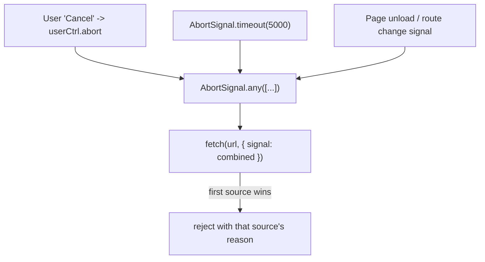
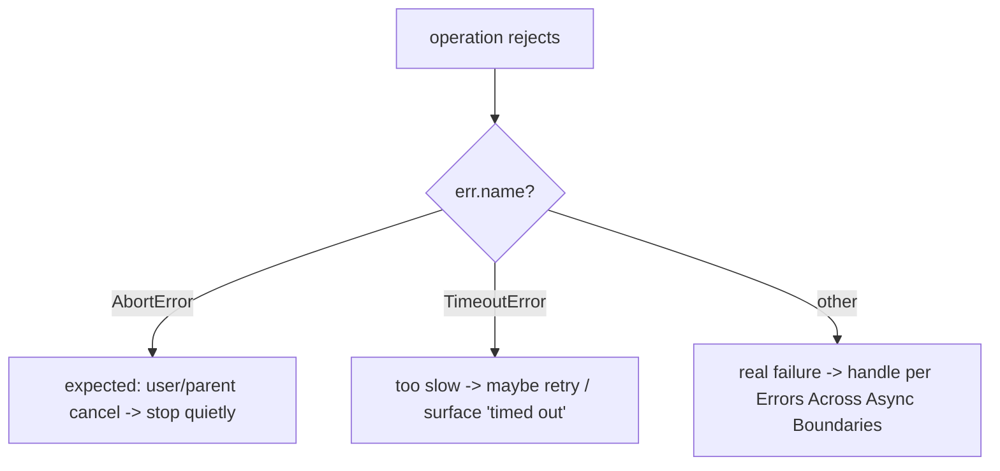

# Cancellation Timeouts and AbortController

## Overview

A promise has no **cancel** button. Once you start `fetch(url)`, the request is in flight; `Promise.race([p, timeout])` may *stop waiting* for `p`, but `p` keeps running—the socket stays open, the CPU keeps churning, the callback still fires. This is the central problem of async control: **giving up on a result is not the same as stopping the work**. Wasted work leaks sockets, file handles, and memory; it corrupts state when a "cancelled" write still lands; and it turns timeouts into lies.

JavaScript's answer is the **`AbortController`/`AbortSignal`** pair: a one-shot, standardized **cancellation token**. A controller owns the trigger (`abort(reason)`); the signal is the read-only, observable side you hand to operations. Abortable APIs (`fetch`, `addEventListener`, timers via `AbortSignal.timeout`, streams, `Request`) watch the signal and tear down real work when it fires. This note builds cancellation from first principles: the **token pattern**, **signal composition** (`AbortSignal.any`), **timeout patterns** (`AbortSignal.timeout` and manual timers), **cooperative cancellation** in your own async functions, and the resource-cleanup discipline that makes it correct. It builds directly on [[02-JavaScript/05-Async-and-Concurrency/Promises Internals|Promises Internals]] and the timeout sketch in [[02-JavaScript/05-Async-and-Concurrency/Errors Across Async Boundaries|Errors Across Async Boundaries]].

## Learning Objectives

- Explain why promises are not cancellable and what `AbortController` actually cancels
- Wire `AbortSignal` into `fetch`, event listeners, and timers correctly
- Compose signals (parent + timeout + user action) with `AbortSignal.any`
- Implement **cooperative cancellation** in your own long-running async code
- Distinguish `TimeoutError` from `AbortError` and handle each without swallowing bugs
- Guarantee resource cleanup (timers, listeners) on every exit path

## Prerequisites

- [[02-JavaScript/05-Async-and-Concurrency/Promises Internals|Promises Internals]]
- [[02-JavaScript/05-Async-and-Concurrency/Async and Await|Async and Await]]
- [[02-JavaScript/05-Async-and-Concurrency/Errors Across Async Boundaries|Errors Across Async Boundaries]]

## Difficulty

`advanced`

## Estimated Time

- Reading: 2 hours
- Exercises: 2–3 hours
- Mini project: 5 hours

## History

Early cancellation was ad hoc: libraries invented **cancellable promise** subclasses (Bluebird's `.cancel()`), `XMLHttpRequest.abort()`, or boolean `isCancelled` flags threaded by hand. A TC39 **cancellable promises** proposal (2016) was withdrawn—cancellation as a promise feature proved semantically messy (who owns the right to cancel a *shared* value?). The community instead standardized cancellation as a **separate token object** in the DOM: `AbortController`/`AbortSignal` (2017), first adopted by `fetch`. It has since spread to `addEventListener`, Node streams, `EventTarget`, `setTimeout` (via `AbortSignal.timeout`, 2022), and combinators (`AbortSignal.any`, 2024). Node.js exposes the same primitives so server code shares the browser model.

## Problem It Solves

- **Wasted work**: stops in-flight I/O and CPU instead of merely ignoring its result.
- **Resource leaks**: lets APIs release sockets, listeners, and timers deterministically.
- **Responsiveness**: user navigations, re-typed searches, and shutdowns can abort stale requests.
- **Correct timeouts**: an operation that exceeds a deadline is *stopped*, not just abandoned.

## Internal Implementation

### The token pattern: separating trigger from observation

`AbortController` is a tiny state machine wrapping an `EventTarget`. The **controller** holds the authority to abort; the **signal** is the read-only view you pass around. This split is deliberate—the caller who *starts* work should decide when to cancel it, while the callee only *observes*.

```mermaid
stateDiagram-v2
    [*] --> NotAborted
    NotAborted --> Aborted: controller.abort(reason)
    Aborted --> Aborted: further abort() ignored
    note right of NotAborted: signal.aborted === false
    note right of Aborted: signal.aborted === true; signal.reason set; 'abort' fired once
```



The signal exposes `aborted` (boolean), `reason` (whatever you passed to `abort`, default a `DOMException` named `AbortError`), `throwIfAborted()`, and an `'abort'` event that fires **at most once**. Abort is **irreversible and idempotent**—like a promise settling, a second `abort()` is a no-op. Reactions to `'abort'` are microtask-timed relative to the trigger, consistent with the event loop model in [[02-JavaScript/05-Async-and-Concurrency/Tasks Microtasks and Rendering|Tasks Microtasks and Rendering]].

### How an abortable API consumes a signal

```mermaid
sequenceDiagram
    participant Caller
    participant Ctrl as AbortController
    participant Sig as AbortSignal
    participant Op as fetch / operation
    Caller->>Ctrl: new AbortController()
    Caller->>Op: fetch(url, { signal: Ctrl.signal })
    Op->>Sig: if aborted -> reject now; else addEventListener('abort')
    Caller->>Ctrl: abort(reason)  %% user cancels / timeout
    Ctrl->>Sig: set aborted, reason; dispatch 'abort'
    Sig->>Op: teardown socket; reject with reason
    Op-->>Caller: promise rejects (AbortError / TimeoutError)
```

Two invariants every abort-aware operation must honor:

1. **Check first.** If `signal.aborted` is already true when work starts, fail immediately (don't do the work). `signal.throwIfAborted()` is the one-liner.
2. **Subscribe with `{ once: true }` and clean up.** Register the `'abort'` listener once and remove it (or let `{ once: true }` do so) when the operation settles, so the signal doesn't retain your callback.

### Cooperative cancellation in your own code

Nothing forces work to stop—cancellation is **cooperative**. A tight CPU loop that never checks the signal cannot be aborted (short of a Worker you can terminate; see [[02-JavaScript/05-Async-and-Concurrency/Web Workers Shared Memory and Atomics|Web Workers Shared Memory and Atomics]]). Your async functions must **poll or subscribe**:

```javascript
async function processChunks(chunks, { signal } = {}) {
  for (const chunk of chunks) {
    signal?.throwIfAborted();        // poll at a safe checkpoint
    await handle(chunk);             // between awaits is a natural yield point
  }
}
```

For a single awaited primitive that has no native signal support, adapt the `'abort'` event into a rejecting promise:

```javascript
function abortable(signal) {
  return new Promise((_, reject) => {
    if (signal.aborted) return reject(signal.reason);
    signal.addEventListener("abort", () => reject(signal.reason), { once: true });
  });
}
// race your work against it; then CLEAN UP (see resource discipline below)
```

### Timeouts as a special case of cancellation

A timeout is just a cancellation triggered by a clock. The modern primitive is `AbortSignal.timeout(ms)`, which returns a signal that auto-aborts with a **`TimeoutError`** `DOMException`—distinct from a user `AbortError`, so you can tell "too slow" apart from "user cancelled".

### Signal composition

Real requests have **several** cancellation sources at once: a per-request timeout, a page-level "cancel all", and the user navigating away. `AbortSignal.any([...signals])` yields a signal that aborts when **any** input aborts, adopting that input's `reason`. This is the composition backbone.

## Mermaid Diagrams

### Composing timeout + parent + user signals



### Deciding how to react to an abort



## Examples

### Minimal Example — abortable fetch with a timeout

```javascript
// AbortSignal.timeout gives a self-aborting signal (TimeoutError after ms).
async function getJSON(url, ms = 5000) {
  try {
    const res = await fetch(url, { signal: AbortSignal.timeout(ms) });
    if (!res.ok) throw new Error(`HTTP ${res.status}`);
    return await res.json();
  } catch (err) {
    if (err.name === "TimeoutError") throw new Error(`'${url}' timed out after ${ms}ms`, { cause: err });
    throw err; // AbortError (caller cancelled) or a real network error
  }
}
```

### Composition Example — user cancel + timeout + parent scope

```javascript
// One request, three ways to cancel. Whichever fires first wins.
function search(query, { parentSignal } = {}) {
  const userCtrl = new AbortController();
  const signal = AbortSignal.any([
    userCtrl.signal,                 // this specific search
    AbortSignal.timeout(8000),       // deadline
    ...(parentSignal ? [parentSignal] : []), // page/route scope
  ]);

  const promise = fetch(`/api/search?q=${encodeURIComponent(query)}`, { signal })
    .then((r) => r.json());

  // Return a handle so the caller can cancel just this search.
  return { promise, cancel: (reason) => userCtrl.abort(reason ?? new DOMException("Superseded", "AbortError")) };
}

// Typeahead: cancel the previous request when a new keystroke arrives.
let current = null;
input.addEventListener("input", (e) => {
  current?.cancel();
  current = search(e.target.value);
  current.promise.then(render).catch((err) => {
    if (err.name !== "AbortError") showError(err); // ignore intentional cancels
  });
});
```

### Production-Shaped Example — manual timeout with guaranteed cleanup

This mirrors `withTimeout` in [[02-JavaScript/code/README|JavaScript code labs]] (`code/src/concurrency.ts`): it forwards a **parent** abort into a child controller, adds a timeout, and cleans up the timer and listener on **every** exit path via `finally`.

```javascript
function withTimeout(operation, timeoutMs, parentSignal) {
  const controller = new AbortController();
  const onParentAbort = () => controller.abort(parentSignal?.reason);
  parentSignal?.addEventListener("abort", onParentAbort, { once: true });

  const timer = setTimeout(
    () => controller.abort(new DOMException("Operation timed out", "TimeoutError")),
    timeoutMs,
  );

  // operation must accept and honor controller.signal (cooperative cancellation).
  return operation(controller.signal).finally(() => {
    clearTimeout(timer);                                    // no dangling timer
    parentSignal?.removeEventListener("abort", onParentAbort); // no leaked listener
  });
}
```

The `finally` is not optional: forgetting `clearTimeout` keeps the event loop alive (and, in Node, prevents clean exit); forgetting `removeEventListener` leaks your closure into the parent signal for the parent's whole lifetime.

## Trade-offs

| Dimension | Upside | Downside | When it matters |
| --- | --- | --- | --- |
| `AbortController` token | Standard, composable, real teardown | Cancellation is cooperative—callee must honor it | Any I/O-bound work |
| `AbortSignal.timeout` | Terse, distinct `TimeoutError` | No handle to cancel early for other reasons | Pure deadlines |
| Manual timer + controller | Full control, forward parent signal | Must clean up timer + listener yourself | Composed/nested ops |
| `AbortSignal.any` | Unifies many cancel sources | Newer API; polyfill for old runtimes | Multi-source cancel |
| `Promise.race` timeout | No API needed | Loser keeps running (leaks) | Avoid for real cancel |

### When to Use

- Any network/file/stream operation that can outlive the caller's interest in it.
- Typeahead/search, tab switches, route changes, and graceful shutdown.
- Deadlines where the slow operation should actually **stop**, not just be ignored.

### When Not to Use

- Purely synchronous or already-instant work—nothing to cancel.
- CPU-bound loops that never yield: move them to a Worker you can terminate ([[02-JavaScript/05-Async-and-Concurrency/Web Workers Shared Memory and Atomics|Web Workers Shared Memory and Atomics]]).
- As a replacement for backpressure; to *limit* concurrent work, see [[02-JavaScript/05-Async-and-Concurrency/Concurrency Control and Backpressure|Concurrency Control and Backpressure]].

## Exercises

1. Show that `Promise.race([fetch(url), timeout])` leaves the request running; rewrite it with `AbortSignal.timeout` and prove the socket is torn down.
2. Build a typeahead that cancels the previous request on each keystroke and ignores `AbortError` while surfacing real errors.
3. Compose a per-request timeout, a user cancel, and a page-unload signal with `AbortSignal.any`; log which `reason` won.
4. Add cooperative cancellation to a chunk processor so it stops between chunks; measure how much work it saves.
5. Write `withTimeout` and prove with a test that the timer and listener are always cleaned up (fulfilled, rejected, and aborted paths).

## Mini Project

**Cancellation toolkit.** Implement `withTimeout(op, ms, parentSignal)`, `abortable(signal)` (event→rejecting promise), `combineSignals(...signals)` (polyfill of `AbortSignal.any`), and `sleep(ms, signal)` (an abortable delay). Cover fulfilled/rejected/aborted paths and assert no leaked timers/listeners. Store alongside `code/src/concurrency.ts` in [[02-JavaScript/code/README|JavaScript code labs]].

## Portfolio Project

Build a **resilient HTTP client** on `fetch`: per-request deadlines, caller-supplied signals, retry-with-backoff that is **cancellation-aware** (a retry loop must stop the instant the signal aborts), and metrics distinguishing `TimeoutError` from `AbortError`. Wire it into a demo UI with a global "cancel all in-flight requests" button. Cross-link [[02-JavaScript/05-Async-and-Concurrency/Errors Across Async Boundaries|Errors Across Async Boundaries]] and [[02-JavaScript/05-Async-and-Concurrency/Concurrency Control and Backpressure|Concurrency Control and Backpressure]].

## Interview Questions

1. Why can't you cancel a promise, and what does `AbortController` actually cancel?
2. What is the difference between the controller and the signal, and why are they separate objects?
3. How does `AbortSignal.timeout` differ from a `Promise.race` timeout in resource terms?
4. What does "cooperative cancellation" mean and how do you implement it in your own async function?
5. How do you distinguish a user cancellation from a timeout, and why does it matter?

### Stretch / Staff-Level

1. Implement `AbortSignal.any` from scratch, including correct `reason` propagation and listener cleanup.
2. Design cancellation for a request that fans out to three backends; a client abort must tear down all three without leaking listeners.

## Common Mistakes

- Using `Promise.race` for "cancellation"—the losing operation keeps running and leaks.
- Forgetting `clearTimeout`/`removeEventListener`, leaking timers and closures.
- Swallowing all errors after abort instead of only `AbortError` (hiding real bugs).
- Passing a signal but never checking it in your own loops (non-cooperative code).
- Reusing one `AbortController` for many independent operations, so one cancel kills all.

## Best Practices

- Thread an optional `signal` through every async API you write; check it with `throwIfAborted()` at safe checkpoints.
- Prefer `AbortSignal.timeout(ms)` for pure deadlines; compose sources with `AbortSignal.any`.
- Always clean up timers and `'abort'` listeners in `finally`; register listeners with `{ once: true }`.
- Treat `AbortError` as expected (don't alert the user); treat `TimeoutError` and others as real signals.
- Make retries and long loops cancellation-aware so aborting stops work immediately.

## Summary

Promises cannot be cancelled—abandoning a result is not stopping the work. `AbortController`/`AbortSignal` provide a standard, one-shot cancellation token: the controller triggers `abort(reason)`, and the read-only signal lets abortable APIs (`fetch`, listeners, timers) tear down real work. Cancellation is **cooperative**, so your own code must poll `throwIfAborted()` or subscribe to `'abort'` and clean up. Timeouts are cancellation on a clock (`AbortSignal.timeout` → `TimeoutError`), and `AbortSignal.any` composes timeouts, user actions, and parent scopes into one signal. Get the cleanup discipline right—clear timers, remove listeners on every path—and cancellation becomes correct, leak-free, and composable.

## Further Reading

- [[00-References/JavaScript/README|JavaScript References]]
- MDN — *AbortController*, *AbortSignal*, *AbortSignal.timeout()*, *AbortSignal.any()*
- Node.js docs — *AbortController and AbortSignal*, *events.addAbortListener*
- [[02-JavaScript/04-Engines-and-Memory/Host Environments and Web APIs|Host Environments and Web APIs]]

## Related Notes

- [[02-JavaScript/05-Async-and-Concurrency/Promises Internals|Promises Internals]]
- [[02-JavaScript/05-Async-and-Concurrency/Async and Await|Async and Await]]
- [[02-JavaScript/05-Async-and-Concurrency/Errors Across Async Boundaries|Errors Across Async Boundaries]]
- [[02-JavaScript/05-Async-and-Concurrency/Concurrency Control and Backpressure|Concurrency Control and Backpressure]]
- [[02-JavaScript/05-Async-and-Concurrency/Web Workers Shared Memory and Atomics|Web Workers Shared Memory and Atomics]]
- [[01-Computer-Science/05-Concurrency-Fundamentals/Asynchronous Event-Driven Models|Asynchronous Event-Driven Models]]

## Progress Checklist

- [ ] Explained from first principles
- [ ] Drew at least one Mermaid diagram
- [ ] Implemented a minimal version
- [ ] Documented trade-offs and non-goals
- [ ] Completed exercises
- [ ] Practiced interview questions aloud
- [ ] Linked prerequisites and dependents
