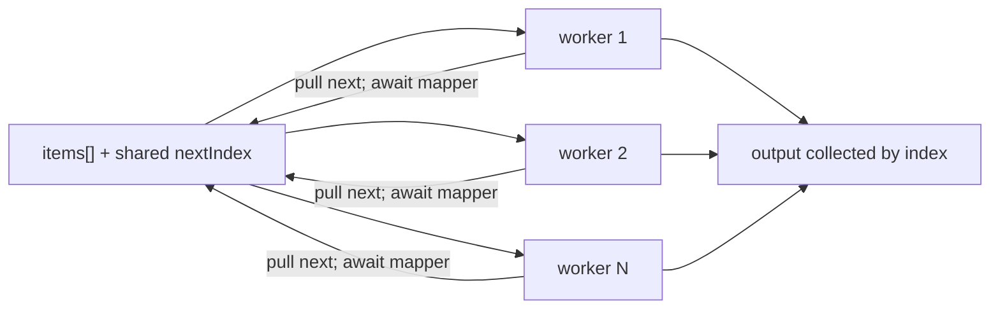
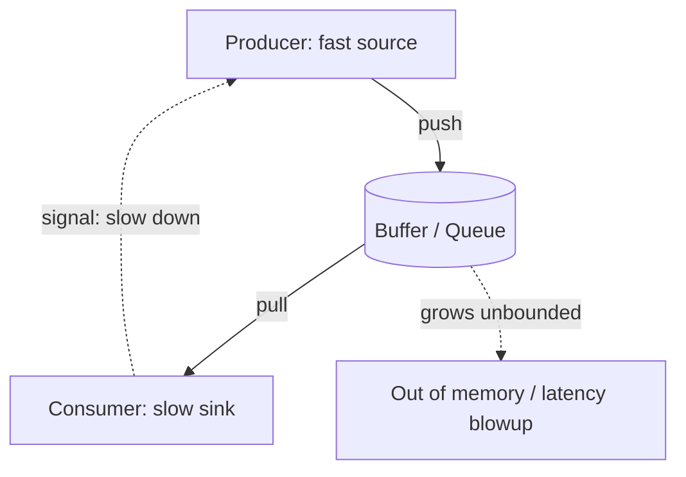
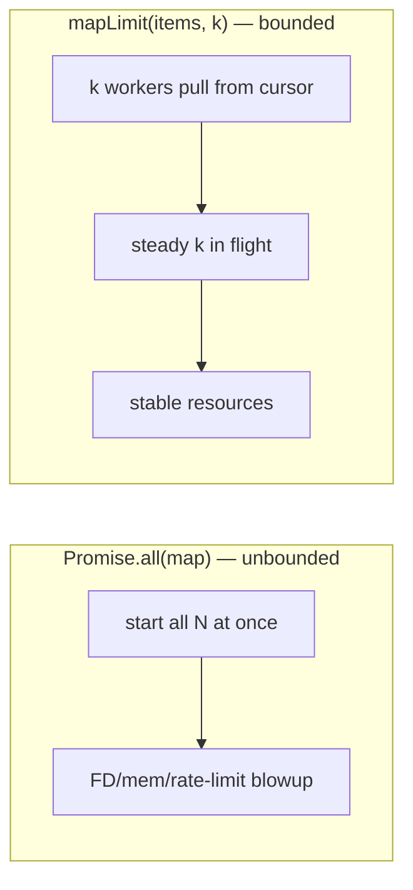
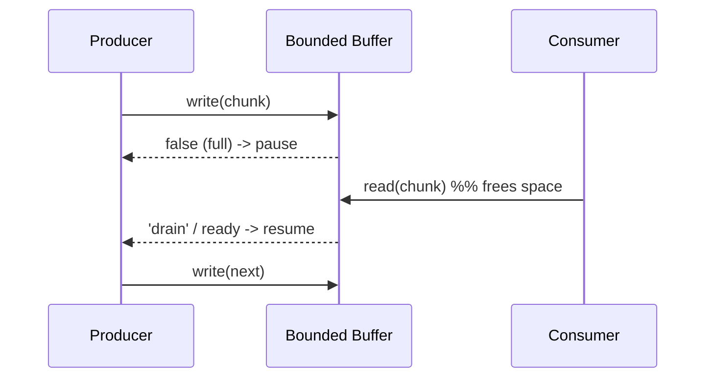

# Concurrency Control and Backpressure

## Overview

`await Promise.all(urls.map(fetch))` looks innocent and is a production incident waiting to happen. With ten URLs it is fine; with ten thousand it opens ten thousand sockets at once, exhausts file descriptors, trips the server's rate limiter, blows past memory as every response buffers simultaneously, and—because `Promise.all` is fail-fast—throws away all partial progress on the first error. The problem is **unbounded concurrency**: JavaScript makes starting async work trivial, so it is easy to start *more work than the system can sustain*.

**Concurrency control** caps how much work runs at once (a **semaphore** of size `N`, realized as `mapLimit`/a worker pool). **Backpressure** is the complementary idea from the producer/consumer world: when a consumer can't keep up, the system must **slow the producer** instead of letting an unbounded queue grow until memory dies. Together they convert "fire everything and hope" into a stable pipeline with predictable throughput, latency, and memory. This note derives both from first principles, connects them to the OS-level concepts in [[01-Computer-Science/05-Concurrency-Fundamentals/Semaphores and Condition Variables|Semaphores and Condition Variables]] and [[01-Computer-Science/05-Concurrency-Fundamentals/Backpressure and Resource Contention|Backpressure and Resource Contention]], and grounds the code in `code/src/concurrency.ts` from [[02-JavaScript/code/README|JavaScript code labs]].

## Learning Objectives

- Explain why unbounded `Promise.all` fanout is dangerous (FDs, memory, rate limits, fail-fast)
- Implement `mapLimit`/a semaphore that keeps exactly `N` operations in flight
- Define backpressure and recognize where an unbounded queue hides in async code
- Apply backpressure with async iterators, streams, and pull-based pipelines
- Choose a concurrency limit from measured constraints (Little's Law, resource caps)
- Combine limits with cancellation and partial-failure tolerance

## Prerequisites

- [[02-JavaScript/05-Async-and-Concurrency/Promises Internals|Promises Internals]]
- [[02-JavaScript/05-Async-and-Concurrency/Async and Await|Async and Await]]
- [[02-JavaScript/05-Async-and-Concurrency/Async Iteration and Streams|Async Iteration and Streams]]
- [[02-JavaScript/05-Async-and-Concurrency/Cancellation Timeouts and AbortController|Cancellation Timeouts and AbortController]]

## Difficulty

`advanced`

## Estimated Time

- Reading: 2 hours
- Exercises: 3 hours
- Mini project: 6 hours

## History

Bounded concurrency is ancient in systems programming—**semaphores** (Dijkstra, 1965) and **thread pools** cap parallelism against finite CPUs and connections. JavaScript inherited none of that: the single-threaded event loop made it *feel* like you could start unlimited async work. Libraries filled the gap—`async.eachLimit`/`mapLimit` (2011), then `p-limit`, `p-queue`, and `p-map`—all implementing a semaphore over promises. Backpressure entered the platform with **Node streams** (the `.pipe()` / `highWaterMark` model) and, later, the **WHATWG Streams** standard with its explicit `desiredSize`/`ReadableStreamDefaultController` signaling. Async iterators (ES2018) made **pull-based** backpressure natural: the consumer's `await next()` inherently paces the producer.

## Problem It Solves

- **Resource exhaustion**: bounds sockets, file descriptors, DB connections, and memory.
- **Rate-limit compliance**: keeps outbound request rate under a provider's cap.
- **Stable latency/throughput**: prevents the collapse that comes from oversubscription.
- **Memory safety under load**: backpressure stops unbounded queues from OOM-ing the process.

## Internal Implementation

### The failure mode: unbounded fanout

```javascript
// DANGER: starts ALL of them at once.
const results = await Promise.all(urls.map((u) => fetch(u)));
```

`map` is synchronous; every `fetch` starts *before* the first resolves. There is no valve. Beyond resource limits, `Promise.all` is **fail-fast**: one rejection rejects the whole thing while the rest keep running uncancelled (see [[02-JavaScript/05-Async-and-Concurrency/Promises Internals|Promises Internals]]).

### A semaphore over promises

A **counting semaphore** permits at most `N` holders. In async JS we model it as `N` **workers** pulling from a shared cursor: the number of concurrently pending `await`s never exceeds `N`.



This is exactly the shape of `mapLimit` in `code/src/concurrency.ts`:

```typescript
export async function mapLimit<T, R>(
  items: readonly T[],
  concurrency: number,
  mapper: (item: T, index: number, signal?: AbortSignal) => Promise<R>,
  options: LimitOptions = {},
): Promise<R[]> {
  if (!Number.isInteger(concurrency) || concurrency < 1) {
    throw new RangeError("concurrency must be a positive integer");
  }
  if (options.signal?.aborted) throw options.signal.reason;

  const output = new Array<R>(items.length);
  let nextIndex = 0;

  async function worker(): Promise<void> {
    for (;;) {
      if (options.signal?.aborted) throw options.signal.reason; // cooperative cancel
      const index = nextIndex++;                                // atomic on single thread
      if (index >= items.length) return;                        // drain then stop
      output[index] = await mapper(items[index]!, index, options.signal);
    }
  }

  const workerCount = Math.min(concurrency, items.length);
  await Promise.all(Array.from({ length: workerCount }, () => worker()));
  return output;
}
```

Two subtleties matter. First, `nextIndex++` is safe **only because JavaScript is single-threaded**—run-to-completion means no two workers interleave the read-increment (contrast the atomicity fights in [[01-Computer-Science/05-Concurrency-Fundamentals/Race Conditions|Race Conditions]]). Second, results are written **by index**, so output order is preserved even though completion order is not.

### Backpressure: the missing valve for streams

A concurrency limit bounds a **finite, known** list. Backpressure bounds an **open-ended stream** whose producer is independent of the consumer. Without it, a fast producer and a slow consumer create an unbounded buffer.



The fix is a feedback signal from consumer to producer. Two mechanisms dominate in JS:

- **Pull-based (async iterators):** the consumer drives with `for await ... of`. The producer's `next()` isn't called until the consumer is ready, so pacing is automatic—no explicit signal needed. This is the cleanest backpressure; see [[02-JavaScript/05-Async-and-Concurrency/Async Iteration and Streams|Async Iteration and Streams]].
- **Buffered with a high-water mark (streams):** Node/WHATWG streams keep a bounded buffer; `writable.write()` returns `false` (or `writer.ready` stays unresolved) when full, and the producer must **pause** until `'drain'`/`ready`. `pipe`/`pipeTo` wires this automatically.

### Little's Law: choosing N

Concurrency isn't a guess. **Little's Law** says `L = λ · W`: the average number in the system (`L`, your concurrency) equals arrival rate (`λ`) times time in system (`W`, per-op latency). To hit a target throughput of `λ` operations/second when each takes `W` seconds, you need about `N = λ · W` in flight. Then clamp `N` to the tightest resource cap (connection pool size, provider rate limit, memory per in-flight response). Measure `W` under load—latency rises with concurrency, so iterate.

## Mermaid Diagrams

### Unbounded vs. bounded fanout



### Backpressure feedback loop



## Examples

### Minimal Example — bounded map from scratch

```javascript
async function mapLimit(items, limit, mapper) {
  const out = new Array(items.length);
  let i = 0;
  async function worker() {
    while (i < items.length) {
      const idx = i++;               // safe: single-threaded, run-to-completion
      out[idx] = await mapper(items[idx], idx);
    }
  }
  await Promise.all(Array.from({ length: Math.min(limit, items.length) }, worker));
  return out;
}

// Crawl 10k URLs but never more than 20 in flight.
const pages = await mapLimit(urls, 20, (u) => fetch(u).then((r) => r.text()));
```

### Semaphore Example — a reusable permit gate

```javascript
class Semaphore {
  #permits; #waiters = [];
  constructor(permits) { this.#permits = permits; }
  async acquire() {
    if (this.#permits > 0) { this.#permits--; return; }
    await new Promise((resolve) => this.#waiters.push(resolve)); // block until a permit frees
  }
  release() {
    const next = this.#waiters.shift();
    if (next) next(); else this.#permits++;
  }
  async run(fn) { await this.acquire(); try { return await fn(); } finally { this.release(); } }
}

// Cap DB writes at 5 concurrent regardless of caller structure.
const dbGate = new Semaphore(5);
await Promise.all(records.map((r) => dbGate.run(() => db.insert(r))));
```

### Production-Shaped Example — pull-based backpressure + partial tolerance + cancel

```javascript
// Process an async source with bounded concurrency, tolerating failures and honoring a signal.
async function pipeline(source /* async iterable */, { limit = 8, signal } = {}) {
  const inFlight = new Set();
  const results = [];
  for await (const item of source) {              // pull pacing = natural backpressure
    signal?.throwIfAborted();
    const task = (async () => {
      try { return { ok: true, value: await handle(item, signal) }; }
      catch (err) { return { ok: false, error: err }; } // don't fail-fast; keep going
    })();
    inFlight.add(task);
    task.finally(() => inFlight.delete(task));
    if (inFlight.size >= limit) results.push(await Promise.race(inFlight)); // wait before pulling more
  }
  results.push(...await Promise.all(inFlight));
  return results;
}
```

Because we only pull the next `item` after a slot frees, the producer is paced by the slowest of `limit` consumers—backpressure without an explicit buffer. Cancellation is cooperative via the `signal` (see [[02-JavaScript/05-Async-and-Concurrency/Cancellation Timeouts and AbortController|Cancellation Timeouts and AbortController]]); collecting `{ok, error}` instead of throwing avoids the fail-fast trap of `Promise.all`.

## Trade-offs

| Dimension | Upside | Downside | When it matters |
| --- | --- | --- | --- |
| Unbounded `Promise.all` | Simplest code | FD/memory/rate blowup; fail-fast | Only for tiny, trusted lists |
| `mapLimit`/semaphore | Bounded resources, ordered output | Must pick N; extra code | Bulk I/O, crawlers, batch jobs |
| Higher N | More throughput | More latency, resource pressure | Under a rate/pool cap |
| Pull backpressure (async iter) | Automatic pacing, low memory | Serial unless you add limit | Open-ended streams |
| Buffered backpressure (streams) | Smooths bursts | Tuning `highWaterMark`; complexity | Byte/object pipelines |

### When to Use

- Any time the number of async operations is large, unknown, or attacker-influenced.
- Calling rate-limited or connection-limited backends (APIs, databases).
- Streaming/ETL pipelines where a fast source feeds a slower sink.

### When Not to Use

- A handful of known operations with ample headroom—plain `Promise.all` is clearer.
- CPU-bound work: a concurrency limit won't create parallelism on one thread; use Workers ([[02-JavaScript/05-Async-and-Concurrency/Web Workers Shared Memory and Atomics|Web Workers Shared Memory and Atomics]]).
- When you actually need *ordering guarantees per key*—add per-key queues, not just a global limit.

## Exercises

1. Reproduce FD/memory pressure with unbounded `Promise.all` over a large list, then fix it with `mapLimit` and compare peak memory.
2. Implement a counting `Semaphore` and prove at most `N` operations are ever pending simultaneously (instrument a counter).
3. Modify `mapLimit` to tolerate partial failure (return `allSettled`-style results) instead of failing fast.
4. Build a producer that outruns its consumer; add pull-based backpressure with an async iterator and show the buffer stays bounded.
5. Use Little's Law to pick `N` for a target throughput given measured per-op latency; validate empirically.

## Mini Project

**Bounded task runner.** Extend `code/src/concurrency.ts`: add `mapLimitSettled` (partial-failure tolerant), a reusable `Semaphore`, and a `Queue` with a max size that applies backpressure (its `push` awaits when full). Include tests asserting the in-flight count never exceeds the limit and that abort stops work promptly. Store in [[02-JavaScript/code/README|JavaScript code labs]].

## Portfolio Project

Build a **rate-limited bulk downloader / ETL tool**: read an unbounded source (paginated API or file stream), transform with bounded concurrency, respect provider rate limits (token bucket) and `Retry-After`, apply backpressure to a bounded output writer, expose live metrics (in-flight, throughput, queue depth), and support graceful cancellation. Cross-link [[01-Computer-Science/05-Concurrency-Fundamentals/Backpressure and Resource Contention|Backpressure and Resource Contention]] and [[02-JavaScript/05-Async-and-Concurrency/Async Iteration and Streams|Async Iteration and Streams]].

## Interview Questions

1. Why is `await Promise.all(urls.map(fetch))` dangerous at scale, and how do you bound it?
2. Implement a concurrency limiter (`mapLimit` or a semaphore). Why is the shared cursor safe without locks in JS?
3. What is backpressure, and where does an unbounded queue hide in typical async code?
4. Compare pull-based (async iterator) and buffered (high-water-mark) backpressure.
5. How would you choose a concurrency limit `N` for a target throughput?

### Stretch / Staff-Level

1. Design a scheduler with per-key ordering plus a global concurrency cap and fairness across keys.
2. Combine a token-bucket rate limiter with a concurrency limiter—why do you often need both, and how do they interact?

## Common Mistakes

- Treating `Promise.all(map(...))` as safe for large or untrusted inputs.
- Confusing concurrency (how many at once) with parallelism (simultaneous CPU execution).
- Ignoring `write()` returning `false` / `writer.ready` and drowning a slow sink.
- Fail-fast aggregation that discards partial progress when partial tolerance was wanted.
- Picking `N` by guesswork instead of measured latency and resource caps.

## Best Practices

- Default to a bounded limiter for any non-trivial fanout; expose the limit as a parameter.
- Prefer pull-based backpressure (async iterators / `pipeTo`) so consumers pace producers.
- Preserve output order by index; choose `all` vs `allSettled` by failure semantics.
- Make limiters cancellation-aware and clean up on abort.
- Derive `N` from Little's Law and the tightest resource/rate cap; re-measure under load.

## Summary

JavaScript makes it trivial to start async work and dangerous to start too much. Unbounded `Promise.all` fanout exhausts sockets, memory, and rate limits and discards partial progress on the first failure. **Concurrency control**—a semaphore realized as `mapLimit`/a worker pool—keeps exactly `N` operations in flight, safely using JS's single-threaded run-to-completion for the shared cursor and preserving order by index. **Backpressure** solves the open-ended case: when a producer outruns a consumer, pace it—pull-based async iterators do this automatically, while buffered streams signal via high-water marks. Choose `N` from Little's Law and real resource caps, combine limits with cancellation and partial-failure tolerance, and your pipelines stay stable under load.

## Further Reading

- [[00-References/JavaScript/README|JavaScript References]]
- MDN — *Streams API*, *ReadableStream*, *WritableStreamDefaultWriter.ready*
- Node.js docs — *Stream backpressuring in Streams*, `stream.pipeline`
- `p-limit`, `p-queue`, `p-map` (reference implementations of async semaphores)

## Related Notes

- [[02-JavaScript/05-Async-and-Concurrency/Promises Internals|Promises Internals]]
- [[02-JavaScript/05-Async-and-Concurrency/Async Iteration and Streams|Async Iteration and Streams]]
- [[02-JavaScript/05-Async-and-Concurrency/Cancellation Timeouts and AbortController|Cancellation Timeouts and AbortController]]
- [[02-JavaScript/05-Async-and-Concurrency/Web Workers Shared Memory and Atomics|Web Workers Shared Memory and Atomics]]
- [[01-Computer-Science/05-Concurrency-Fundamentals/Semaphores and Condition Variables|Semaphores and Condition Variables]]
- [[01-Computer-Science/05-Concurrency-Fundamentals/Backpressure and Resource Contention|Backpressure and Resource Contention]]

## Progress Checklist

- [ ] Explained from first principles
- [ ] Drew at least one Mermaid diagram
- [ ] Implemented a minimal version
- [ ] Documented trade-offs and non-goals
- [ ] Completed exercises
- [ ] Practiced interview questions aloud
- [ ] Linked prerequisites and dependents
