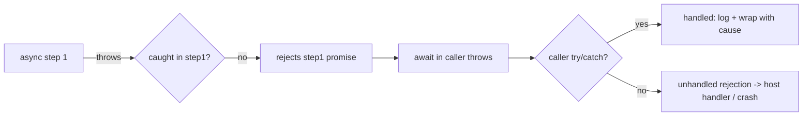
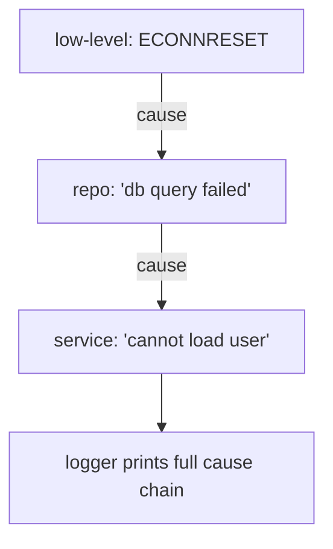

# Errors Across Async Boundaries

## Overview

Error handling is where async JavaScript most often goes wrong. A `try/catch` around a `setTimeout` catches nothing. A rejected promise with no `.catch` becomes an **unhandled rejection** that can crash a Node process. A `forEach(async …)` swallows every failure silently. The root cause is that **the stack that threw is not the stack that will handle**: when work resumes later on the event loop, the original `try` block is long gone. Errors must be **explicitly propagated** across each async boundary.

This note builds a rigorous model of async error flow: how errors travel (or vanish) through **callbacks, promises, and `async/await`**; why `throw` inside a `setTimeout`/event handler is unrecoverable by surrounding code; how **unhandled rejections** are detected; how to preserve context with **`Error.cause`** and readable **async stack traces**; and production patterns for resilient error handling. It ties together [[02-JavaScript/05-Async-and-Concurrency/Promises Internals|Promises Internals]], [[02-JavaScript/05-Async-and-Concurrency/Async and Await|Async and Await]], and [[02-JavaScript/07-Production-JavaScript/Error Design and Exception Safety|Error Design and Exception Safety]].

## Learning Objectives

- Explain why synchronous `try/catch` cannot catch errors from a later turn
- Trace error propagation through callbacks, promise chains, and `await`
- Detect and handle **unhandled rejections** and **uncaught exceptions** per host
- Preserve causal context with `Error.cause` and understand async stack traces
- Apply resilient patterns: normalize, wrap, retry, and fail safely

## Prerequisites

- [[02-JavaScript/05-Async-and-Concurrency/Promises Internals|Promises Internals]]
- [[02-JavaScript/05-Async-and-Concurrency/Async and Await|Async and Await]]
- [[02-JavaScript/05-Async-and-Concurrency/Callbacks and Inversion of Control|Callbacks and Inversion of Control]]

## Difficulty

`advanced`

## Estimated Time

- Reading: 2 hours
- Exercises: 2–3 hours
- Mini project: 4 hours

## History

Early async code lost errors constantly—callbacks that threw crashed or vanished. The **error-first callback** convention gave errors a channel. Promises made errors **first-class**, flowing to `.catch`, and introduced **unhandled rejection** detection (`unhandledrejection` event / `process.on('unhandledRejection')`). `async/await` (ES2017) restored `try/catch`. ES2022 added **`Error.cause`** for error chaining, and engines added **zero-cost async stack traces** so `await` chains show useful stacks.

## Problem It Solves

- **Lost errors**: prevents failures from silently disappearing across turns.
- **Crashes**: unhandled rejections can terminate Node processes; understanding them keeps services alive.
- **Debuggability**: causal chains and async stacks turn "something failed somewhere" into a precise diagnosis.

## Internal Implementation

### Why sync try/catch fails across a boundary

```javascript
try {
  setTimeout(() => {
    throw new Error("boom"); // runs in a LATER task; this try is gone
  }, 0);
} catch (e) {
  // NEVER reached — the throw happens on a different turn/stack
}
```

The `try` block completes synchronously; the callback runs later with an empty surrounding stack. The throw propagates to the **host's** uncaught-exception handler, not your `catch`.

```mermaid
sequenceDiagram
    participant Turn1 as Turn 1 (try block)
    participant Loop as Event Loop
    participant Turn2 as Turn 2 (timer callback)
    Turn1->>Loop: schedule callback; try block ends
    Note over Turn1: catch is no longer on the stack
    Loop->>Turn2: run callback -> throw
    Turn2->>Host: uncaught exception (not your catch)
```

### Error channels by paradigm

```mermaid
flowchart TD
    subgraph Callbacks
    CB[error-first: cb(err, res)] --> CBH[check err manually]
    end
    subgraph Promises
    PR[reject / throw in handler] --> PRC[.catch downstream]
    end
    subgraph AsyncAwait
    AW[await rejects -> throws] --> AWC[try/catch]
    end
```

- **Callbacks**: errors travel as the first argument; a `throw` inside is *not* caught by the caller.
- **Promises**: `reject(e)` or a `throw` in a handler rejects the returned promise; a downstream `.catch` handles it. A missing `.catch` → unhandled rejection.
- **`async/await`**: an awaited rejection throws at the `await`, caught by an enclosing `try/catch`; an uncaught one rejects the async function's promise.

### Unhandled rejections and uncaught exceptions

- **Browser**: `window.addEventListener('unhandledrejection', ...)` and `'error'`.
- **Node**: `process.on('unhandledRejection', ...)` and `process.on('uncaughtException', ...)`. Modern Node **crashes on unhandled rejections by default**—so every promise needs handling.

Use these as **last-resort telemetry + graceful shutdown**, not as normal control flow.

### `Error.cause` and async stack traces

```javascript
try {
  await saveOrder(order);
} catch (err) {
  // Wrap with context WITHOUT losing the original.
  throw new Error(`failed to save order ${order.id}`, { cause: err });
}
```

`err.cause` preserves the chain; loggers should print `cause` recursively. Modern V8 stitches **async stack traces** so the stack spans `await` boundaries—but only if you don't discard the original error (avoid `throw new Error(String(err))`).

### The `forEach(async)` trap

```javascript
// BROKEN: forEach ignores returned promises -> rejections are unhandled & unordered.
items.forEach(async (i) => { await risky(i); });

// FIXED: use for...of + await (sequential) or Promise.all(map) (concurrent).
for (const i of items) await risky(i);
await Promise.all(items.map((i) => risky(i)));
```

## Mermaid Diagrams

### Propagation through a chain



### Wrap-and-rethrow with cause



## Examples

### Minimal Example — the three fixes

```javascript
// 1. Timer/event: handle INSIDE the callback (surrounding try can't).
setTimeout(() => {
  try { mightThrow(); } catch (e) { report(e); }
}, 0);

// 2. Promise chain: terminate with .catch.
doThing().then(process).catch((e) => report(e));

// 3. async/await: wrap awaits.
async function run() {
  try { await doThing(); }
  catch (e) { report(e); throw new Error("run failed", { cause: e }); }
}
```

### Production-Shaped Example — resilient boundary with retry, wrap, and global net

```javascript
async function withRetry(fn, { attempts = 3, baseMs = 100, signal } = {}) {
  let lastErr;
  for (let i = 0; i < attempts; i++) {
    try {
      return await fn();
    } catch (err) {
      lastErr = err;
      if (signal?.aborted || !isRetryable(err) || i === attempts - 1) break;
      const delay = baseMs * 2 ** i + Math.random() * baseMs; // jittered backoff
      await new Promise((r) => setTimeout(r, delay));
    }
  }
  throw new Error(`operation failed after ${attempts} attempts`, { cause: lastErr });
}

// Last-resort safety net (Node): log, flush telemetry, then exit for uncaught cases.
process.on("unhandledRejection", (reason) => {
  logger.error("unhandledRejection", { reason });
  // Optionally: begin graceful shutdown for uncaughtException.
});
```

Retryability classification and error taxonomy are expanded in [[02-JavaScript/07-Production-JavaScript/Error Design and Exception Safety|Error Design and Exception Safety]]; cancellation-aware retries use [[02-JavaScript/05-Async-and-Concurrency/Cancellation Timeouts and AbortController|Cancellation Timeouts and AbortController]].

## Trade-offs

| Dimension | Upside | Downside | When it matters |
| --- | --- | --- | --- |
| try/catch around await | Familiar, local | Only within async fn | Most flows |
| .catch on chains | Explicit termination | Easy to forget | Non-await chains |
| Wrap with `cause` | Preserves context | Slightly more code | Layered systems |
| Global handlers | Catches escapes | Not for normal flow | Telemetry, shutdown |
| Crash on unhandled | Fails loudly, no zombie state | Needs supervisor/restart | Node services |

### When to Use

- Handle errors at the **boundary that has context**; wrap with `cause` as they cross layers.
- Use global handlers only for **telemetry and graceful shutdown**.

### When Not to Use

- Don't rely on global handlers for routine recovery.
- Don't swallow errors (empty `catch`) or stringify away the original (`throw new Error(String(err))`).

## Exercises

1. Show that a `throw` in `setTimeout` escapes a surrounding `try/catch`; fix it.
2. Create an unhandled rejection and catch it with the host's global handler.
3. Convert a `forEach(async …)` bug to correct sequential and concurrent versions.
4. Chain three layers of errors with `Error.cause` and print the full chain.
5. Demonstrate an async stack trace spanning multiple `await`s.

## Mini Project

**Async error toolkit.** Build `wrap(fn, message)` (adds context+cause), `withRetry`, `guard` (never-throw wrapper returning `[err, value]`), and a `causeChain(err)` formatter. Include tests covering timer, promise, and await boundaries. Store in [[02-JavaScript/code/README|JavaScript code labs]].

## Portfolio Project

Build an **error observability layer** for a service: structured error classes with codes, automatic `cause` chaining, redaction of sensitive fields, correlation IDs threaded through async calls, and integration with a global handler that reports and gracefully shuts down. Cross-link [[02-JavaScript/07-Production-JavaScript/Observability and Operational Readiness|Observability and Operational Readiness]].

## Interview Questions

1. Why can't a synchronous `try/catch` catch a throw inside `setTimeout`?
2. How do errors propagate through a promise chain vs. `async/await`?
3. What is an unhandled rejection and what happens in modern Node?
4. What problem does `Error.cause` solve?
5. Why is `array.forEach(async …)` an error-handling hazard?

### Stretch / Staff-Level

1. How do zero-cost async stack traces work and what defeats them?
2. Design an error-handling strategy for a request handler spanning DB, cache, and external APIs.

## Common Mistakes

- Wrapping `setTimeout`/event code in an outer `try/catch` expecting it to catch.
- Forgetting `.catch` (unhandled rejection → possible crash).
- `forEach(async)` losing/ignoring rejections.
- Empty catch blocks or discarding the original error.
- Using global handlers as normal control flow.

## Best Practices

- Handle where you have context; wrap-and-rethrow with `Error.cause` across layers.
- Terminate every promise chain with `.catch`; wrap awaits in `try/catch`.
- Never swallow errors; preserve the original for stacks and cause chains.
- Register global `unhandledRejection`/`uncaughtException` handlers for telemetry + graceful shutdown.
- Classify errors (retryable vs. fatal) and make retries cancellation-aware.

## Summary

Async errors are hard because the throwing stack and the handling stack are different turns of the event loop. Synchronous `try/catch` can't catch a later callback's throw—you must propagate errors through each paradigm's channel: the error-first argument (callbacks), rejection to `.catch` (promises), or a throw at `await` caught by `try/catch` (`async/await`). Unhandled rejections can crash Node, so terminate every chain. Preserve context with `Error.cause`, keep async stack traces intact, avoid `forEach(async)`, and reserve global handlers for telemetry and graceful shutdown.

## Further Reading

- [[00-References/JavaScript/README|JavaScript References]]
- MDN — *Error.prototype.cause*, *unhandledrejection*
- Node.js docs — *process 'unhandledRejection'/'uncaughtException'*
- [[02-JavaScript/07-Production-JavaScript/Error Design and Exception Safety|Error Design and Exception Safety]]

## Related Notes

- [[02-JavaScript/05-Async-and-Concurrency/Promises Internals|Promises Internals]]
- [[02-JavaScript/05-Async-and-Concurrency/Async and Await|Async and Await]]
- [[02-JavaScript/05-Async-and-Concurrency/Callbacks and Inversion of Control|Callbacks and Inversion of Control]]
- [[02-JavaScript/05-Async-and-Concurrency/Cancellation Timeouts and AbortController|Cancellation Timeouts and AbortController]]
- [[02-JavaScript/07-Production-JavaScript/Error Design and Exception Safety|Error Design and Exception Safety]]

## Progress Checklist

- [ ] Explained from first principles
- [ ] Drew at least one Mermaid diagram
- [ ] Implemented a minimal version
- [ ] Documented trade-offs and non-goals
- [ ] Completed exercises
- [ ] Practiced interview questions aloud
- [ ] Linked prerequisites and dependents
