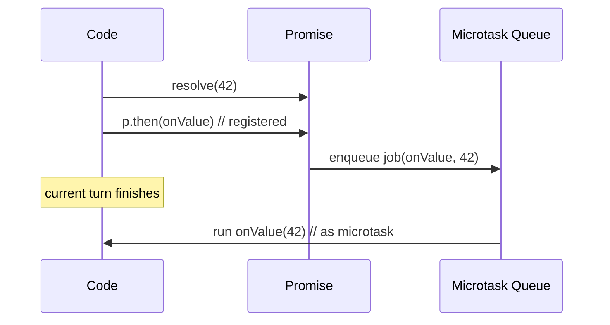
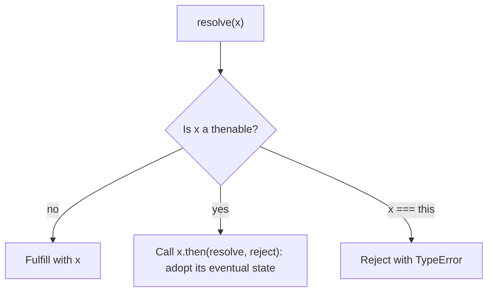
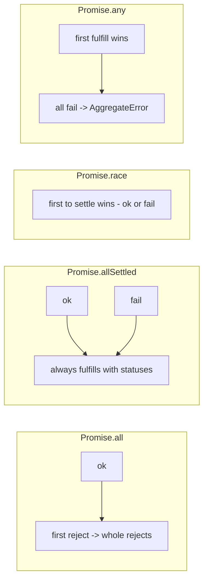
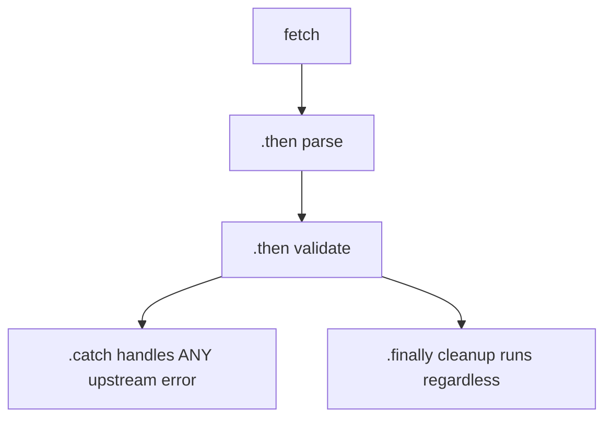

# Promises Internals

## Overview

A **Promise** is a first-class object representing the eventual result of an asynchronous operation—a value that is not yet available but will be, or a reason it failed. Its genius is turning asynchrony into **composable values**: you can pass a promise around, chain transformations, combine several, and route errors, all while the underlying work runs on the event loop. Promises reclaim the control that raw callbacks surrender (see [[02-JavaScript/05-Async-and-Concurrency/Callbacks and Inversion of Control|Callbacks and Inversion of Control]]): they settle **exactly once**, **always asynchronously** (reactions run as microtasks), and propagate errors down the chain.

This note goes under the hood: the **three-state machine** (pending → fulfilled/rejected), the **Promises/A+** resolution procedure (including **thenable assimilation**), why reactions are **microtasks**, and how the **combinators** (`all`, `allSettled`, `race`, `any`) behave. We'll build a spec-shaped promise to make the mechanics concrete. It underpins [[02-JavaScript/05-Async-and-Concurrency/Async and Await|Async and Await]].

## Learning Objectives

- Describe the promise state machine and the once-only settle guarantee
- Explain the resolution procedure and thenable assimilation (`Promise.resolve` semantics)
- Justify why `.then` callbacks run as microtasks and the ordering consequences
- Correctly use `all`, `allSettled`, `race`, `any`, `finally` and know their failure modes
- Implement a minimal Promises/A+-compliant promise

## Prerequisites

- [[02-JavaScript/05-Async-and-Concurrency/Callbacks and Inversion of Control|Callbacks and Inversion of Control]]
- [[02-JavaScript/05-Async-and-Concurrency/Run to Completion and Event Loop|Run to Completion and Event Loop]]
- [[02-JavaScript/05-Async-and-Concurrency/Tasks Microtasks and Rendering|Tasks Microtasks and Rendering]]

## Difficulty

`advanced`

## Estimated Time

- Reading: 2–3 hours
- Exercises: 3 hours
- Mini project: 6 hours

## History

Promises appeared in E and Python (Twisted `Deferred`) and in JS libraries (Q, when.js, jQuery's flawed `Deferred`). The community **Promises/A+** spec (2012) fixed jQuery's problems by mandating asynchronous, once-only resolution and a precise thenable procedure. ES2015 standardized `Promise`, and ES2017–2021 added `finally`, `allSettled`, and `any`. `async/await` (ES2017) is syntax over this machine.

## Problem It Solves

- **Composability**: async results become values you can transform and combine.
- **Trust**: structural guarantees eliminate callback IoC bugs (double-call, sync/async ambiguity, error swallowing).
- **Error propagation**: a single `.catch` can handle failures anywhere upstream in a chain.

## Internal Implementation

### The state machine

```mermaid
stateDiagram-v2
    [*] --> Pending
    Pending --> Fulfilled: resolve(value)
    Pending --> Rejected: reject(reason)
    Fulfilled --> [*]
    Rejected --> [*]
    note right of Fulfilled: settled; immutable thereafter
    note right of Rejected: further resolve/reject ignored
```



A promise is **pending** until it **settles** (fulfilled or rejected). Settling is **irreversible and once-only**: a second `resolve`/`reject` is a no-op. This single guarantee kills the "callback called twice" bug.

### Reactions as microtasks

Each `.then(onFulfilled, onRejected)` registers **reactions**. When the promise settles, the appropriate reaction is scheduled as a **microtask** (an ECMAScript **job**)—never called synchronously, even if the promise is already settled. This guarantees consistent ordering (no Zalgo) and is why `.then` runs before `setTimeout`.



### The resolution procedure and thenable assimilation

`resolve(x)` is not "store x." If `x` is a **thenable** (any object with a callable `.then`), the promise **adopts** its state by calling `x.then(resolve, reject)`. This is how `Promise.resolve(otherPromise)` returns something tracking `otherPromise`, and how foreign promise libraries interoperate. If `x` is a plain value, the promise fulfills with it. Resolving a promise **with itself** must reject with a `TypeError` (cycle detection).



### Chaining creates new promises

`.then` returns a **new** promise. The return value of a handler resolves that new promise (and if it returns a thenable, it's assimilated). A thrown error inside a handler **rejects** the returned promise, which is how errors flow to a later `.catch`.

### Combinators

- **`Promise.all(iter)`**: fulfills with an array of all values; **rejects on the first rejection** (fail-fast). Other operations keep running but their results are ignored.
- **`Promise.allSettled(iter)`**: never rejects; fulfills with `{status, value|reason}` for each—use when you want *all* outcomes.
- **`Promise.race(iter)`**: settles as soon as the **first** input settles (fulfill *or* reject).
- **`Promise.any(iter)`**: fulfills with the first **fulfillment**; rejects with an `AggregateError` only if **all** reject.

## Mermaid Diagrams

### Combinator behavior



### Chain error routing



## Examples

### Minimal Example — ordering and chaining

```javascript
console.log("start");
Promise.resolve(1)
  .then((n) => { console.log("then", n); return n + 1; })
  .then((n) => { console.log("then", n); throw new Error("boom"); })
  .catch((e) => console.log("catch", e.message))
  .finally(() => console.log("finally"));
console.log("end");
// start, end, then 1, then 2, catch boom, finally
```

### Production-Shaped Example — resilient parallel fetch

```javascript
// Fetch many resources; tolerate partial failure and cap total time.
async function fetchAllResilient(urls, { timeoutMs = 5000 } = {}) {
  const withTimeout = (p) =>
    Promise.race([
      p,
      new Promise((_, reject) =>
        setTimeout(() => reject(new Error("timeout")), timeoutMs)
      ),
    ]);

  const results = await Promise.allSettled(
    urls.map((url) => withTimeout(fetch(url).then((r) => r.json())))
  );

  const ok = [];
  const failed = [];
  for (let i = 0; i < results.length; i++) {
    const r = results[i];
    if (r.status === "fulfilled") ok.push({ url: urls[i], data: r.value });
    else failed.push({ url: urls[i], error: String(r.reason) });
  }
  return { ok, failed };
}
```

`allSettled` avoids the fail-fast trap of `all`; the `race`-with-timeout pattern is refined in [[02-JavaScript/05-Async-and-Concurrency/Cancellation Timeouts and AbortController|Cancellation Timeouts and AbortController]].

### Building a minimal promise (excerpt)

```javascript
function MyPromise(executor) {
  let state = "pending", value, cbs = [];
  const settle = (s, v) => {
    if (state !== "pending") return;      // once-only
    state = s; value = v;
    cbs.forEach(schedule);                // run reactions as microtasks
    cbs = [];
  };
  const resolve = (v) => {
    if (v && typeof v.then === "function") return v.then(resolve, reject); // assimilate
    settle("fulfilled", v);
  };
  const reject = (e) => settle("rejected", e);
  const schedule = ({ onF, onR, res, rej }) =>
    queueMicrotask(() => {
      try {
        const h = state === "fulfilled" ? onF : onR;
        if (typeof h !== "function") return (state === "fulfilled" ? res : rej)(value);
        res(h(value));                    // handler return resolves next promise
      } catch (err) { rej(err); }
    });
  this.then = (onF, onR) =>
    new MyPromise((res, rej) => {
      const reaction = { onF, onR, res, rej };
      state === "pending" ? cbs.push(reaction) : schedule(reaction);
    });
  try { executor(resolve, reject); } catch (e) { reject(e); }
}
```

Run it against the Promises/A+ test suite in [[02-JavaScript/code/README|JavaScript code labs]].

## Trade-offs

| Dimension | Upside | Downside | When it matters |
| --- | --- | --- | --- |
| Promises vs callbacks | Composable, trustworthy | Microtask overhead | Multi-step async |
| `all` (fail-fast) | Fast, simple | Loses partial results | All-or-nothing |
| `allSettled` | All outcomes | Must inspect each status | Partial tolerance |
| `race`/`any` | Timeouts, fastest-wins | Losers keep running (no cancel) | Latency, fallbacks |
| Thenable assimilation | Interop across libs | Subtle bugs with fake thenables | Mixed ecosystems |

### When to Use

- Use promises for any multi-step or combinable async flow.
- Pick the combinator by failure semantics: `all` (all needed), `allSettled` (tolerate failures), `race`/`any` (timeouts, fallbacks).

### When Not to Use

- Don't use promises for synchronous logic or repeated events (use plain values / event emitters / async iterables).
- Don't rely on `race` for cancellation—it doesn't stop the losers; use `AbortController`.

## Exercises

1. Predict the exact log order of a `then/catch/finally` chain mixed with `setTimeout`.
2. Implement `Promise.all` and `allSettled` yourself from `then`.
3. Show that `.then` on an already-settled promise still runs asynchronously.
4. Create a fake thenable and observe assimilation via `Promise.resolve`.
5. Demonstrate that `all` loses partial results and rewrite with `allSettled`.

## Mini Project

**Promises/A+ compliant implementation.** Complete the `MyPromise` above with proper thenable handling and cycle detection, add `catch`, `finally`, and static `resolve/reject/all/allSettled/race/any`, and pass the official `promises-aplus-tests`. This is a repository staple ([[02-JavaScript/README|track checklist]]). Store in [[02-JavaScript/code/README|JavaScript code labs]].

## Portfolio Project

Build a **request orchestration library**: retries with backoff, per-request timeouts, concurrency limits, and `allSettled`-based aggregation with typed results—on top of your promise knowledge. Cross-link [[02-JavaScript/05-Async-and-Concurrency/Concurrency Control and Backpressure|Concurrency Control and Backpressure]].

## Interview Questions

1. Describe the promise state machine and the once-only guarantee.
2. Why do `.then` callbacks always run asynchronously (as microtasks)?
3. What is thenable assimilation and where does it matter?
4. Compare `all`, `allSettled`, `race`, and `any` including failure modes.
5. Does `Promise.race` cancel the losing operations? Explain.

### Stretch / Staff-Level

1. Walk through the Promises/A+ resolution procedure including cycle detection.
2. How does an unhandled rejection get detected, and what are its consequences?

## Common Mistakes

- Forgetting `.then` handlers run async even for settled promises.
- Using `all` when partial failure should be tolerated (`allSettled`).
- Not returning promises inside `.then` (breaking the chain / errors escape).
- Assuming `race`/`any` cancel losers.
- Creating unhandled rejections by not attaching a `.catch`/`try-catch`.

## Best Practices

- Always terminate chains with `.catch` (or `try/catch` under `await`).
- Choose combinators by failure semantics; prefer `allSettled` for resilience.
- Return values/promises from handlers to keep the chain intact.
- Pair `race`-timeouts with real cancellation (`AbortController`) to avoid wasted work.
- Treat unhandled rejections as errors (fail CI; log/alert in production).

## Summary

A promise is a once-settled, three-state value machine whose reactions always run asynchronously as microtasks, giving composable, trustworthy asynchrony that fixes callback IoC problems. The resolution procedure assimilates thenables so promises interoperate; chaining creates new promises and routes thrown errors to `.catch`. Combinators encode failure semantics: `all` fails fast, `allSettled` reports everything, `race` takes the first settle, `any` the first success. Master the state machine and the microtask timing, and `async/await` becomes obvious syntax over it.

## Further Reading

- [[00-References/JavaScript/README|JavaScript References]]
- Promises/A+ specification and `promises-aplus-tests`
- MDN — *Using Promises*, *Promise* reference
- [[02-JavaScript/05-Async-and-Concurrency/Async and Await|Async and Await]]

## Related Notes

- [[02-JavaScript/05-Async-and-Concurrency/Callbacks and Inversion of Control|Callbacks and Inversion of Control]]
- [[02-JavaScript/05-Async-and-Concurrency/Async and Await|Async and Await]]
- [[02-JavaScript/05-Async-and-Concurrency/Errors Across Async Boundaries|Errors Across Async Boundaries]]
- [[02-JavaScript/05-Async-and-Concurrency/Tasks Microtasks and Rendering|Tasks Microtasks and Rendering]]
- [[02-JavaScript/05-Async-and-Concurrency/Cancellation Timeouts and AbortController|Cancellation Timeouts and AbortController]]

## Progress Checklist

- [ ] Explained from first principles
- [ ] Drew at least one Mermaid diagram
- [ ] Implemented a minimal version
- [ ] Documented trade-offs and non-goals
- [ ] Completed exercises
- [ ] Practiced interview questions aloud
- [ ] Linked prerequisites and dependents
