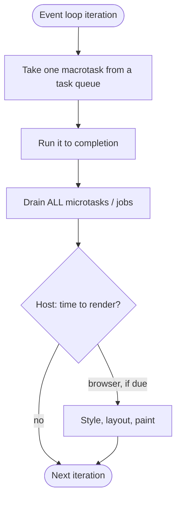
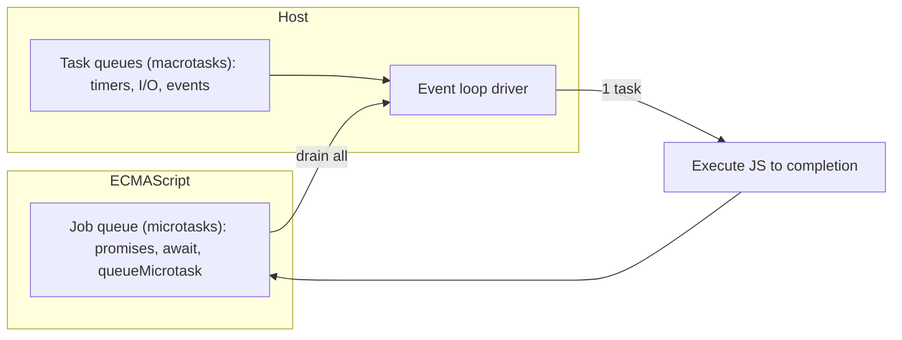
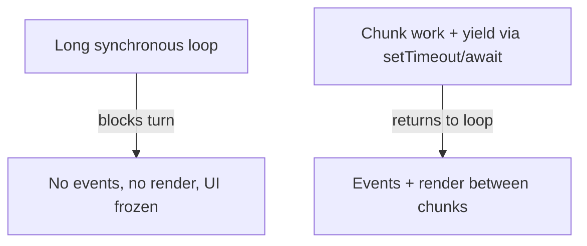

# Run to Completion and Event Loop

## Overview

JavaScript executes on a **single thread** with a deceptively powerful concurrency model built on two rules. First, **run-to-completion**: once a function (a "turn") starts running, it runs to the end without being preempted—no other JavaScript can interleave with it. Second, an **event loop** repeatedly pulls the next unit of work from queues and runs it to completion. Concurrency comes not from threads sharing memory but from **interleaving whole turns** driven by asynchronous events.

This is the mental model that explains *everything* about async JavaScript: why a long synchronous loop freezes the UI, why `setTimeout(fn, 0)` doesn't run immediately, why promise callbacks run *before* timers, and why you never get data races on ordinary variables. Crucially, the ECMAScript spec defines only **jobs** and a **job queue** (the microtask mechanism); the **event loop itself is a host concept** (HTML spec for browsers, libuv for Node). This note nails that distinction and sets up [[02-JavaScript/05-Async-and-Concurrency/Tasks Microtasks and Rendering|Tasks Microtasks and Rendering]].

## Learning Objectives

- State the run-to-completion guarantee and its consequences for correctness and latency
- Distinguish **ECMAScript jobs (microtasks)** from **host tasks (macrotasks)** precisely
- Explain why the event loop is host-defined, and how browser vs. Node differ at a high level
- Predict execution order of synchronous code, microtasks, and timers
- Recognize when to break up long turns to keep an app responsive

## Prerequisites

- [[02-JavaScript/04-Engines-and-Memory/Host Environments and Web APIs|Host Environments and Web APIs]]
- [[01-Computer-Science/05-Concurrency-Fundamentals/Asynchronous Event-Driven Models|Asynchronous Event-Driven Models]]
- [[01-Computer-Science/05-Concurrency-Fundamentals/Concurrency vs Parallelism|Concurrency vs Parallelism]]

## Difficulty

`intermediate`

## Estimated Time

- Reading: 2 hours
- Exercises: 2–3 hours
- Mini project: 4 hours

## History

Browser JavaScript was single-threaded from the start so scripts could safely touch the DOM without locking. Timers (`setTimeout`) and event handlers gave cooperative concurrency. **Node.js** (2009) took the same single-threaded, event-driven model and applied it to servers via **libuv**, arguing that non-blocking I/O on one thread scales better than thread-per-connection for I/O-bound workloads. ES2015 formalized the **job queue** for promises so microtask ordering is specified by the language, while the surrounding loop stays a host responsibility.

## Problem It Solves

- **DOM safety without locks**: a single thread means no data races on shared UI state (see [[01-Computer-Science/05-Concurrency-Fundamentals/Race Conditions|Race Conditions]]).
- **I/O concurrency without thread-per-connection**: one thread juggles thousands of sockets by never blocking on I/O (see [[01-Computer-Science/05-Concurrency-Fundamentals/Asynchronous Event-Driven Models|Asynchronous Event-Driven Models]]).
- **Predictable ordering**: run-to-completion makes reasoning tractable—no instruction-level interleaving.

## Internal Implementation

### The loop, at a glance



Key invariant: **one macrotask, then the microtask queue is drained completely** (including microtasks scheduled by other microtasks), *then* the loop may render and pick the next macrotask.

### ECMAScript jobs vs. host tasks — the precise split

- **Jobs / microtasks (ECMAScript-defined)**: promise reactions (`.then`/`catch`/`finally`), `await` continuations, `queueMicrotask`, and (Node) `process.nextTick` (Node's own even-higher-priority variant). The spec calls these **jobs** run from the **job queue**; hosts implement them as the **microtask queue** drained to empty after each task.
- **Tasks / macrotasks (host-defined)**: `setTimeout`/`setInterval` callbacks, DOM events, `MessageChannel`, I/O completions, `setImmediate` (Node). These are placed in host **task queues**; the loop takes **one per iteration**.



### Browser vs. Node (high level; internals handed to Node track)

- **Browser**: one conceptual loop per agent; between tasks it may run `requestAnimationFrame` callbacks and rendering. Detailed in [[02-JavaScript/05-Async-and-Concurrency/Tasks Microtasks and Rendering|Tasks Microtasks and Rendering]].
- **Node**: libuv runs distinct **phases** (timers → pending → poll → check → close), draining microtasks (with `process.nextTick` before other microtasks) between callbacks. The phase machinery, thread pool, and I/O specifics belong to [[06-NodeJS/README|Node.js]]; here we only need "one task, then drain jobs."

### Why `setTimeout(fn, 0)` isn't immediate

`setTimeout` schedules a **macrotask** with a *minimum* delay (browsers clamp nested timeouts to ~4ms). It cannot run until the current turn finishes **and** all microtasks drain **and** the loop reaches the timer phase. A `Promise.resolve().then(fn)` (microtask) will always run before it.

## Mermaid Diagrams

### Ordering example lifecycle

```mermaid
sequenceDiagram
    participant Sync as Current Turn (sync)
    participant MQ as Microtask Queue
    participant TQ as Task Queue (timers)
    Sync->>Sync: console.log('A')
    Sync->>TQ: setTimeout(log 'D', 0)
    Sync->>MQ: Promise.then(log 'C')
    Sync->>Sync: console.log('B'); turn ends
    MQ->>MQ: run 'C' (drain jobs)
    TQ->>TQ: run 'D' (next iteration)
    Note over Sync,TQ: Output: A, B, C, D
```

### Blocking vs. yielding



## Examples

### Minimal Example — ordering

```javascript
console.log("A");                       // 1: sync
setTimeout(() => console.log("D"), 0);  // 4: macrotask
Promise.resolve().then(() => console.log("C")); // 3: microtask
console.log("B");                       // 2: sync
// Output: A B C D
```

### Production-Shaped Example — keep the turn short

```javascript
// BAD: one giant turn blocks the loop -> UI freeze / missed I/O.
function processAllSync(items) {
  for (const item of items) heavyWork(item); // blocks until done
}

// GOOD: yield to the event loop between chunks so events/render/I/O proceed.
async function processInChunks(items, chunkSize = 500) {
  for (let i = 0; i < items.length; i += chunkSize) {
    const end = Math.min(i + chunkSize, items.length);
    for (let j = i; j < end; j++) heavyWork(items[j]);
    // Yield a macrotask so the loop can breathe (render, handle input, I/O).
    await new Promise((resolve) => setTimeout(resolve, 0));
  }
}
```

For truly CPU-bound work, move it off-thread with a Worker instead of chunking; see [[02-JavaScript/05-Async-and-Concurrency/Web Workers Shared Memory and Atomics|Web Workers Shared Memory and Atomics]].

## Trade-offs

| Dimension | Upside | Downside | When it matters |
| --- | --- | --- | --- |
| Single thread | No data races on JS state | One CPU core for JS | UI safety, simplicity |
| Run-to-completion | Predictable, no preemption | A long turn blocks everything | Latency-sensitive apps |
| Microtask priority | Fast promise chaining | Microtask starvation possible | Ordering correctness |
| Event-driven I/O | Massive I/O concurrency | Bad for CPU-bound work | Servers, network apps |

### When to Use

- Embrace the model for **I/O-bound** concurrency (network, disk, user events).
- Break long computations into chunks (yielding) or offload to workers to preserve responsiveness.

### When Not to Use

- Don't run heavy CPU work on the main thread—use Workers/child processes.
- Don't rely on `setTimeout(0)` for precise timing; it's a scheduling hint, not a clock.

## Exercises

1. Predict and then verify the output ordering of a mix of sync, `Promise.then`, and `setTimeout`.
2. Freeze a page with a long `for` loop, then fix it with chunked yielding.
3. Show that microtasks scheduled inside a microtask still run before the next macrotask.
4. Compare `queueMicrotask(fn)` vs. `setTimeout(fn, 0)` ordering.
5. Explain why the event loop is a host concept, citing the spec's "jobs" terminology.

## Mini Project

**Toy event loop.** Implement a single-threaded scheduler in JavaScript with a task queue and a microtask queue: `enqueueTask`, `enqueueMicrotask`, and a `run()` that processes one task then drains microtasks, logging order. Reproduce the browser ordering rules. Store in [[02-JavaScript/code/README|JavaScript code labs]].

## Portfolio Project

Build an **event-loop visualizer**: paste code using `setTimeout`, `queueMicrotask`, and promises; instrument it to record when each callback runs and render an animated timeline of task vs. microtask phases. Cross-link [[02-JavaScript/05-Async-and-Concurrency/Tasks Microtasks and Rendering|Tasks Microtasks and Rendering]].

## Interview Questions

1. What does "run-to-completion" guarantee, and why does it matter?
2. Differentiate ECMAScript jobs (microtasks) from host tasks (macrotasks).
3. Why does `Promise.then` run before `setTimeout(0)`?
4. Is the event loop part of the JavaScript language? Explain.
5. Why does a long synchronous loop freeze the browser?

### Stretch / Staff-Level

1. How can microtask floods starve the task queue and rendering?
2. Sketch how Node's loop phases differ from the browser's single conceptual loop (defer details to Node track).

## Common Mistakes

- Thinking `setTimeout(0)` runs "immediately" or before microtasks.
- Assuming JavaScript is multithreaded and worrying about data races on plain variables.
- Blocking the main thread with CPU-heavy synchronous work.
- Confusing the (host) event loop with the (language) job queue.
- Expecting timers to be precise clocks.

## Best Practices

- Keep turns short; chunk long work or offload CPU-bound tasks to Workers.
- Use `queueMicrotask` for "run right after current turn" semantics; timers for deferral.
- Reason about ordering with the "one task → drain all microtasks" rule.
- Avoid microtask loops that never yield to tasks (starvation).
- Treat timer delays as minimums, not guarantees.

## Summary

JavaScript concurrency rests on run-to-completion plus an event loop: each turn runs uninterrupted, then the loop drains all microtasks (ECMAScript jobs: promises, `await`, `queueMicrotask`) before taking the next host task (macrotasks: timers, I/O, events). The **job queue is language-defined; the event loop is host-defined**, so browser and Node differ in the surrounding machinery even though the microtask rule is shared. Keep turns short—chunk or offload heavy work—to stay responsive, and reason about ordering with the microtask-drain invariant.

## Further Reading

- [[00-References/JavaScript/README|JavaScript References]]
- WHATWG HTML — *Event loops* section; Jake Archibald — *Tasks, microtasks, queues and schedules*
- ECMAScript spec — *Jobs and Host Operations*
- [[01-Computer-Science/05-Concurrency-Fundamentals/Asynchronous Event-Driven Models|Asynchronous Event-Driven Models]]

## Related Notes

- [[02-JavaScript/05-Async-and-Concurrency/Tasks Microtasks and Rendering|Tasks Microtasks and Rendering]]
- [[02-JavaScript/05-Async-and-Concurrency/Promises Internals|Promises Internals]]
- [[02-JavaScript/05-Async-and-Concurrency/Async and Await|Async and Await]]
- [[02-JavaScript/04-Engines-and-Memory/Host Environments and Web APIs|Host Environments and Web APIs]]
- [[06-NodeJS/README|Node.js]] for libuv loop phases

## Progress Checklist

- [ ] Explained from first principles
- [ ] Drew at least one Mermaid diagram
- [ ] Implemented a minimal version
- [ ] Documented trade-offs and non-goals
- [ ] Completed exercises
- [ ] Practiced interview questions aloud
- [ ] Linked prerequisites and dependents
