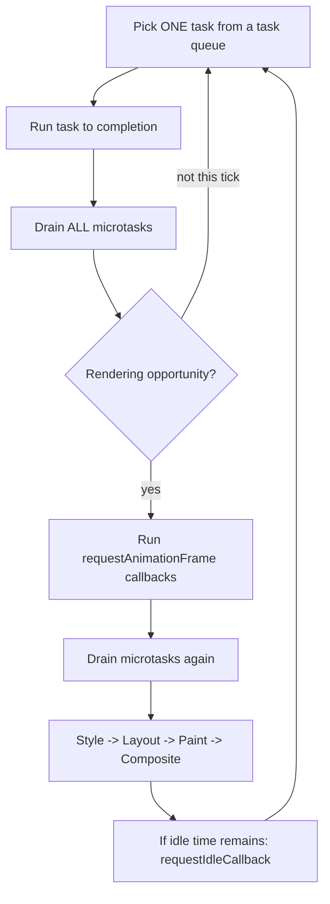
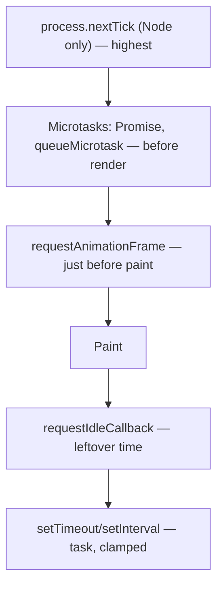
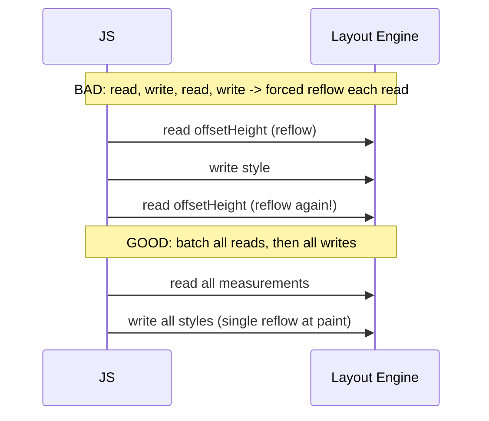

# Tasks Microtasks and Rendering

## Overview

The event loop has more structure than "run callbacks." Work is split into **tasks (macrotasks)**—timers, events, I/O, each taken **one at a time**—and **microtasks (ECMAScript jobs)**—promise reactions and `queueMicrotask`, which are **drained completely** after every task and after certain host checkpoints. In the browser, wedged between these is the **rendering pipeline**: style, layout, paint, and composite, ideally hitting ~60fps (a **~16.6ms frame budget**) via **`requestAnimationFrame`**.

Understanding the exact ordering—task → drain microtasks → (maybe) rAF callbacks → style/layout/paint → next task—is what separates smooth UIs from janky ones, and correct code from subtle ordering bugs. This note deepens [[02-JavaScript/05-Async-and-Concurrency/Run to Completion and Event Loop|Run to Completion and Event Loop]] with the **browser** rendering perspective and precisely places `requestAnimationFrame`, `requestIdleCallback`, and microtask starvation. Node has no rendering step; its phase model is handed to [[06-NodeJS/02-Event-Loop-and-libuv/Event Loop Phases|Event Loop Phases]].

## Learning Objectives

- Order sync code, microtasks, tasks, rAF, and rendering with confidence
- Explain the browser frame budget and where JavaScript fits in a frame
- Use `requestAnimationFrame` for visual updates and `requestIdleCallback` for slack work
- Diagnose and avoid **microtask starvation** and **layout thrashing**
- Choose the right scheduling primitive for a given job

## Prerequisites

- [[02-JavaScript/05-Async-and-Concurrency/Run to Completion and Event Loop|Run to Completion and Event Loop]]
- [[02-JavaScript/04-Engines-and-Memory/Host Environments and Web APIs|Host Environments and Web APIs]]

## Difficulty

`advanced`

## Estimated Time

- Reading: 2 hours
- Exercises: 3 hours
- Mini project: 4 hours

## History

Original browsers repainted on an ad-hoc basis; `setTimeout`-driven animation caused tearing and wasted work on hidden tabs. **`requestAnimationFrame`** (2011) synchronized JavaScript visual updates with the display refresh and paused in background tabs. ES2015 promises introduced the **microtask** tier with strict "drain to empty" semantics. **`requestIdleCallback`** (2015) let non-urgent work run in leftover frame time. The **Prioritized Task Scheduling API** (`scheduler.postTask`, `scheduler.yield`) is the modern evolution for explicit priorities.

## Problem It Solves

- **Smoothness**: aligning JS with the refresh rate avoids dropped frames and tearing.
- **Correct ordering**: promise-based code must resolve deterministically relative to events and rendering.
- **Fairness**: draining microtasks after each task keeps promise chains prompt without starving the UI—*if* you don't abuse them.

## Internal Implementation

### The full per-iteration order (browser)



- **One task per iteration**; microtasks are drained to empty after it.
- Rendering does **not** happen after every task—the browser renders roughly once per display refresh, coalescing work.
- **rAF callbacks run right before layout/paint**, so DOM reads/writes there are cheapest and tear-free.
- **Microtasks are drained again** after rAF callbacks (they're checkpoints).

### Microtask starvation

Because microtasks are drained **to empty**, a microtask that schedules another microtask that schedules another… can **prevent the loop from ever reaching rendering or the next task**. This freezes the UI even though you "only used promises."


### Layout thrashing

Reading a layout property (`offsetHeight`, `getBoundingClientRect`) after a write forces a **synchronous reflow**. Interleaving reads and writes in a loop causes repeated forced reflows—**layout thrashing**. Batch reads, then writes (or use rAF).

### The frame budget

At 60Hz you have **~16.6ms** per frame for script + style + layout + paint + composite. Long tasks (>50ms) block input and cause jank; the **Long Tasks API** and INP metric measure this.

## Mermaid Diagrams

### Scheduling primitives by priority



### DOM read/write batching



## Examples

### Minimal Example — full ordering

```javascript
console.log("script start");
setTimeout(() => console.log("timeout"), 0);        // task
requestAnimationFrame(() => console.log("raf"));    // before next paint
Promise.resolve().then(() => console.log("promise")); // microtask
console.log("script end");
// Typical browser output:
// script start, script end, promise, raf, timeout
// (raf runs before the paint that follows this task; timeout is a later task)
```

### Production-Shaped Example — smooth updates without thrash

```javascript
// Coalesce many state changes into ONE visual update per frame.
function createFrameScheduler(render) {
  let scheduled = false;
  let pendingState = null;
  return function schedule(state) {
    pendingState = state;
    if (scheduled) return;
    scheduled = true;
    requestAnimationFrame(() => {
      scheduled = false;
      render(pendingState); // one DOM write pass, aligned to paint
    });
  };
}

// Batch reads then writes to avoid layout thrashing.
function resizeAll(elements) {
  const heights = elements.map((el) => el.offsetHeight); // READ phase
  elements.forEach((el, i) => {                          // WRITE phase
    el.style.height = heights[i] * 1.1 + "px";
  });
}

// Non-urgent work in idle time; fall back to a timer if unsupported.
const idle = window.requestIdleCallback ?? ((cb) => setTimeout(() => cb({ timeRemaining: () => 5 }), 1));
idle(() => prefetchOffscreenData());
```

For breaking up long tasks with yields, prefer `scheduler.yield()` where available; see [[02-JavaScript/07-Production-JavaScript/Measuring and Optimizing Performance|Measuring and Optimizing Performance]].

## Trade-offs

| Dimension | Upside | Downside | When it matters |
| --- | --- | --- | --- |
| Microtasks | Run promptly before render | Can starve rendering/tasks | Promise-heavy code |
| `requestAnimationFrame` | Tear-free, refresh-synced, tab-aware | Only for visual work | Animations, DOM writes |
| `requestIdleCallback` | Uses slack time | May never run under load | Prefetch, analytics |
| `setTimeout` | Simple deferral | Clamped, imprecise, not paint-aligned | Coarse scheduling |
| `scheduler.postTask` | Explicit priorities | Newer, needs fallback | Complex apps |

### When to Use

- Use **rAF** for anything visual; batch DOM reads then writes.
- Use **microtasks** for "immediately after this turn" logic; **idle callbacks** for non-urgent work.

### When Not to Use

- Don't do heavy computation in rAF or microtasks—you'll blow the frame budget.
- Don't chain unbounded microtasks; you'll starve rendering.

## Exercises

1. Predict output for a mix of `setTimeout`, `Promise.then`, and `requestAnimationFrame`.
2. Cause microtask starvation with a self-scheduling `queueMicrotask` and observe UI freeze.
3. Create layout thrashing, measure forced reflows in DevTools, then fix with read/write batching.
4. Coalesce 1,000 rapid state updates into one rAF render.
5. Compare `requestIdleCallback` behavior under idle vs. heavy load.

## Mini Project

**Frame-budget profiler.** Build a small harness that runs a workload and logs, per frame, time spent in tasks vs. microtasks vs. rendering, flagging frames over 16.6ms and long tasks over 50ms. Visualize as a timeline. Store in [[02-JavaScript/code/README|JavaScript code labs]].

## Portfolio Project

Build a **virtualized list** (render only visible rows) that stays at 60fps while scrolling 100k rows: rAF-batched rendering, read/write separation, and idle-time prefetch. Include a jank meter. Cross-link [[02-JavaScript/05-Async-and-Concurrency/Concurrency Control and Backpressure|Concurrency Control and Backpressure]].

## Interview Questions

1. Give the full ordering: sync, microtask, rAF, task, rendering.
2. Why does the browser not render after every task?
3. What is microtask starvation and how do you avoid it?
4. What is layout thrashing and how do you fix it?
5. When would you choose `requestIdleCallback` over `setTimeout`?

### Stretch / Staff-Level

1. How does `scheduler.postTask`/`scheduler.yield` improve on `setTimeout(0)` yielding?
2. Explain how INP relates to long tasks and input responsiveness.

## Common Mistakes

- Assuming rendering happens after each task/microtask.
- Using `setTimeout` for animation instead of `requestAnimationFrame`.
- Interleaving DOM reads and writes (forced reflows).
- Creating unbounded microtask chains that freeze the UI.
- Doing heavy CPU work inside rAF, blowing the frame budget.

## Best Practices

- Do visual updates in `requestAnimationFrame`; coalesce multiple updates per frame.
- Batch DOM reads, then writes; avoid reading layout after writing.
- Keep tasks under ~50ms; break long work with `scheduler.yield()`/chunking or offload to Workers.
- Reserve microtasks for short, bounded follow-up work.
- Measure with DevTools Performance panel, Long Tasks API, and INP.

## Summary

The browser event loop runs one task, drains all microtasks, and periodically renders: rAF callbacks fire just before style/layout/paint, with another microtask drain around the checkpoints, and idle callbacks use leftover time. Microtasks are prompt but can **starve** rendering if chained unbounded; interleaving DOM reads/writes causes **layout thrashing**. Pick the right primitive—rAF for visuals, microtasks for immediate follow-up, idle for slack—and respect the ~16.6ms frame budget to keep UIs smooth. Node has no rendering phase; its loop details belong to the Node track.

## Further Reading

- [[00-References/JavaScript/README|JavaScript References]]
- Jake Archibald — *Tasks, microtasks, queues and schedules*
- web.dev — *Optimize long tasks*, *INP*, *requestIdleCallback*
- [[02-JavaScript/05-Async-and-Concurrency/Run to Completion and Event Loop|Run to Completion and Event Loop]]

## Related Notes

- [[02-JavaScript/05-Async-and-Concurrency/Run to Completion and Event Loop|Run to Completion and Event Loop]]
- [[02-JavaScript/05-Async-and-Concurrency/Promises Internals|Promises Internals]]
- [[02-JavaScript/05-Async-and-Concurrency/Async and Await|Async and Await]]
- [[02-JavaScript/07-Production-JavaScript/Measuring and Optimizing Performance|Measuring and Optimizing Performance]]
- [[06-NodeJS/02-Event-Loop-and-libuv/Event Loop Phases|Event Loop Phases]] · [[06-NodeJS/README|Node.js]]

## Progress Checklist

- [ ] Explained from first principles
- [ ] Drew at least one Mermaid diagram
- [ ] Implemented a minimal version
- [ ] Documented trade-offs and non-goals
- [ ] Completed exercises
- [ ] Practiced interview questions aloud
- [ ] Linked prerequisites and dependents
