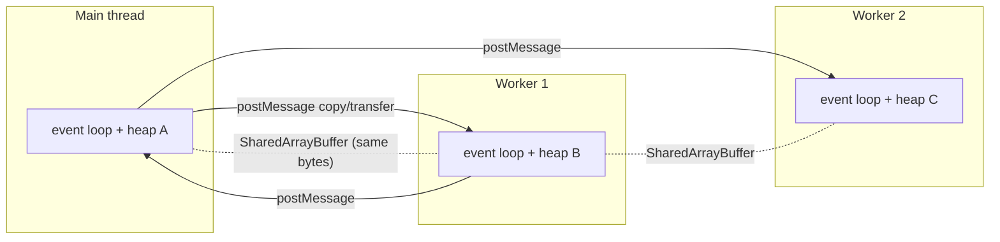
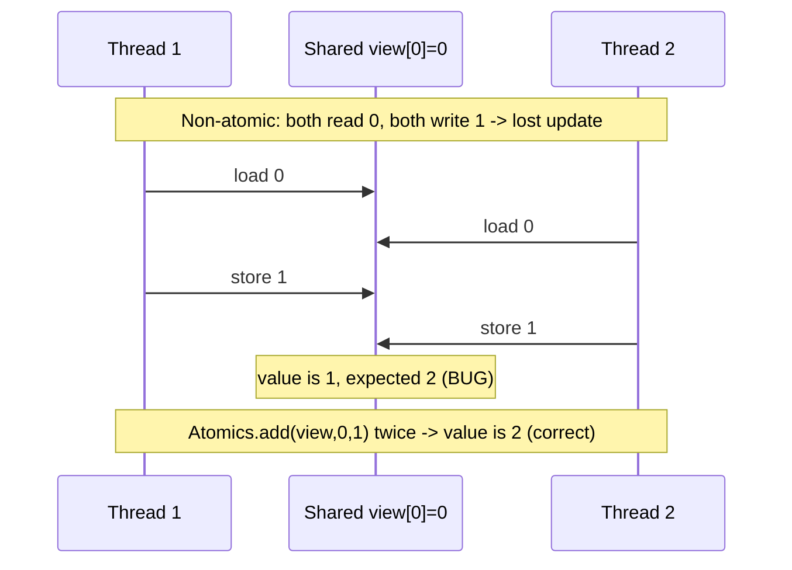
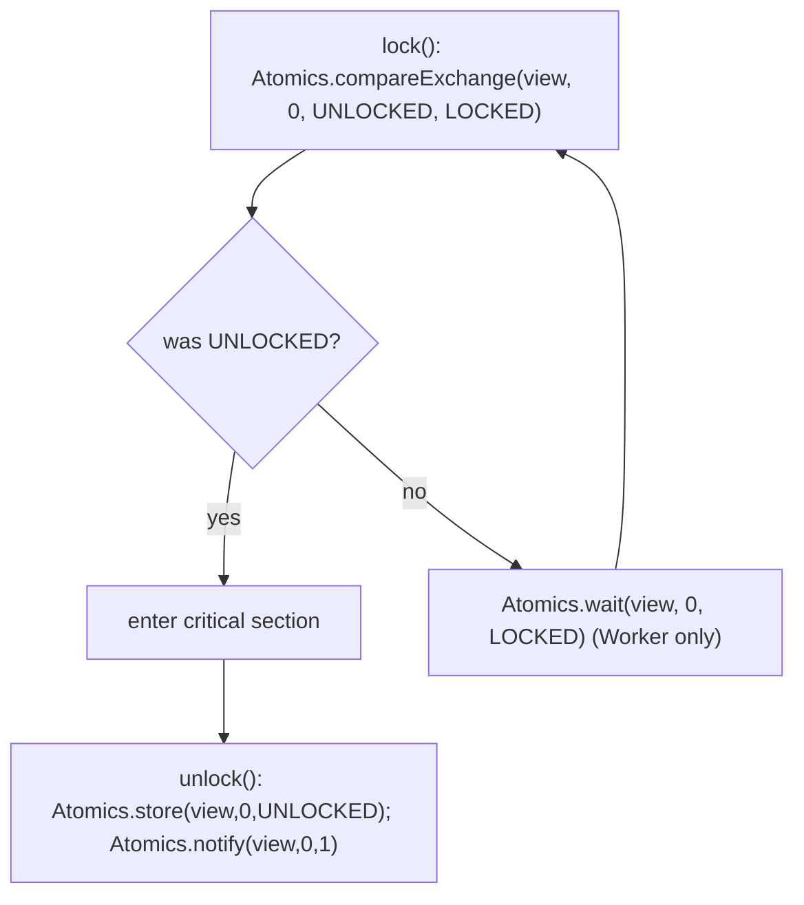

# Web Workers Shared Memory and Atomics

## Overview

JavaScript's event loop gives you **concurrency** (many things in progress) but not **parallelism** (many things executing at the same instant). A single thread runs your code, so a CPU-bound task—image filtering, parsing a huge file, cryptographic hashing—**blocks everything**, freezing the UI or stalling the server, no matter how many `await`s you sprinkle in (see [[01-Computer-Science/05-Concurrency-Fundamentals/Concurrency vs Parallelism|Concurrency vs Parallelism]]). **Workers** are the escape hatch: real OS-backed threads (`Worker` in browsers, `worker_threads` in Node) that run JS in parallel on separate cores, each with its **own** event loop and heap.

Workers deliberately **do not share memory** by default. They communicate by **message passing** with structured-clone copies (or zero-copy `Transferable` handoffs), which sidesteps data races entirely. When copies are too expensive, `SharedArrayBuffer` (SAB) lets multiple threads see the **same bytes**—and instantly reintroduces every hazard of shared-memory concurrency: torn reads, lost updates, and reordering. `Atomics` is the toolbox that makes shared access correct: indivisible read-modify-write operations, a defined memory-ordering model, and a `wait`/`notify` primitive for blocking coordination. This note explains the model, the mechanics, and—critically—**when not to reach for shared memory at all**. It builds on the runtime model of [[02-JavaScript/05-Async-and-Concurrency/Run to Completion and Event Loop|Run to Completion and Event Loop]] and connects to [[01-Computer-Science/05-Concurrency-Fundamentals/Atomics and Memory Ordering|Atomics and Memory Ordering]].

## Learning Objectives

- Distinguish concurrency from parallelism and identify when only a Worker helps
- Create and communicate with Workers via `postMessage`, structured clone, and `Transferable`
- Explain the message-passing (no shared state) model and its data-race immunity
- Use `SharedArrayBuffer` + typed arrays to share memory across threads
- Apply `Atomics` for indivisible operations and `Atomics.wait`/`notify` for coordination
- Reason about the JS memory model (why non-atomic access can tear/reorder)
- Decide when shared memory is justified vs. when message passing is the right default

## Prerequisites

- [[02-JavaScript/05-Async-and-Concurrency/Run to Completion and Event Loop|Run to Completion and Event Loop]]
- [[02-JavaScript/05-Async-and-Concurrency/Tasks Microtasks and Rendering|Tasks Microtasks and Rendering]]
- [[02-JavaScript/03-Objects-and-Metaprogramming/JSON Structured Clone and Serialization|JSON Structured Clone and Serialization]]
- [[02-JavaScript/04-Engines-and-Memory/JavaScript Memory Model|JavaScript Memory Model]]

## Difficulty

`expert`

## Estimated Time

- Reading: 3 hours
- Exercises: 3–4 hours
- Mini project: 8 hours

## History

The browser was single-threaded by design; a runaway script froze the tab. **Web Workers** (2009, HTML5) added background threads that share nothing and talk via `postMessage`—safe parallelism without locks. **`SharedArrayBuffer`** and **`Atomics`** shipped in 2017 to enable true shared-memory parallelism (notably as the compilation target for pthreads via WebAssembly/Emscripten). In January 2018, **Spectre** made timing side channels practical; browsers **disabled `SharedArrayBuffer`** because high-resolution shared clocks amplified the attack. It returned gated behind **cross-origin isolation**: a document must send `Cross-Origin-Opener-Policy: same-origin` and `Cross-Origin-Embedder-Policy: require-corp`. Node.js added **`worker_threads`** (2018) with the same `SharedArrayBuffer`/`Atomics` primitives, no isolation headers required.

## Problem It Solves

- **UI/main-thread jank**: moves CPU-heavy work off the thread that renders or serves requests.
- **True parallelism**: uses multiple cores for embarrassingly parallel workloads.
- **Zero-copy data**: `Transferable`/SAB avoid duplicating large buffers between threads.
- **Low-latency coordination**: `Atomics.wait/notify` enable lock-like blocking without busy spinning.

## Internal Implementation

### Threads with isolated heaps

Each Worker is a full JS realm: its own global scope, event loop, and **heap**. Objects are **not** shared; they cross the boundary only by copy or transfer. This is the source of Workers' safety—no shared mutable object means no data race on ordinary values.



### Message passing: structured clone vs. transfer

`postMessage(value)` serializes `value` with the **structured clone algorithm** (deep copy that handles `Map`, `Set`, `Date`, typed arrays, cycles—but not functions/DOM nodes; see [[02-JavaScript/03-Objects-and-Metaprogramming/JSON Structured Clone and Serialization|JSON Structured Clone and Serialization]]). For large binary payloads, **transfer** moves ownership with no copy—the sender's buffer becomes **detached** (unusable):

```javascript
// Copy: 'buf' is still usable on the sender after this.
worker.postMessage({ buf });
// Transfer: zero-copy; 'buf' is DETACHED on the sender afterward.
worker.postMessage({ buf }, [buf]); // buf.byteLength === 0 here
```

### Shared memory: same bytes, real races

A `SharedArrayBuffer` is *not* transferred or copied—both threads reference the **same physical memory**. You view it through typed arrays (`Int32Array`, `Float64Array`, …). Now two threads can write the same index concurrently. Non-atomic access is unsafe:

```javascript
// UNSAFE across threads: read-modify-write is three steps; updates get lost.
view[0] = view[0] + 1;      // load, add, store — interleavable -> lost update
```

The engine (and CPU) may also **reorder** independent reads/writes and cache values in registers, so one thread may never observe another's plain writes, or observe them out of order. This is the JS **memory model**, mirroring hardware weak memory (see [[01-Computer-Science/05-Concurrency-Fundamentals/Atomics and Memory Ordering|Atomics and Memory Ordering]] and [[01-Computer-Science/05-Concurrency-Fundamentals/Race Conditions|Race Conditions]]).

### Atomics: indivisible ops + ordering + blocking

`Atomics` provides operations on **integer** shared views that are **indivisible** and establish **happens-before** ordering (sequential consistency for atomic accesses):

- Read-modify-write: `Atomics.add`, `sub`, `and`, `or`, `xor`, `exchange`, `compareExchange`.
- Ordered access: `Atomics.load`, `Atomics.store` (won't tear or reorder past other atomics).
- Blocking coordination: `Atomics.wait(view, index, expected)` blocks the calling thread until another calls `Atomics.notify(view, index, count)`—the building block for locks and condition variables ([[01-Computer-Science/05-Concurrency-Fundamentals/Semaphores and Condition Variables|Semaphores and Condition Variables]]).

Crucial constraint: **`Atomics.wait` may not run on the main browser thread** (it would freeze the page). Use it in Workers; on the main thread use `Atomics.waitAsync` (returns a promise) or message passing.

## Mermaid Diagrams

### Lost update without atomics vs. correct with `Atomics.add`



### Spinlock built on compareExchange



## Examples

### Minimal Example — offload CPU work to a Worker

```javascript
// main.js — keep the UI responsive during a heavy computation.
const worker = new Worker(new URL("./hash-worker.js", import.meta.url), { type: "module" });
worker.postMessage({ data: bigArrayBuffer }, [bigArrayBuffer]); // transfer: zero-copy
worker.onmessage = (e) => console.log("digest:", e.data.digest);
worker.onerror = (e) => console.error("worker failed:", e.message);

// hash-worker.js
self.onmessage = async ({ data }) => {
  const digest = await crypto.subtle.digest("SHA-256", data.data); // runs off main thread
  self.postMessage({ digest }, [digest]); // transfer result back
};
```

### Shared-Memory Example — atomic counter across Workers

```javascript
// main.js — one SAB shared by N workers; Atomics make the increment safe.
const sab = new SharedArrayBuffer(4);          // one Int32
const counter = new Int32Array(sab);
for (let i = 0; i < 4; i++) {
  const w = new Worker(new URL("./inc-worker.js", import.meta.url), { type: "module" });
  w.postMessage(sab);                          // SAB is shared, not copied
}

// inc-worker.js
self.onmessage = ({ data: sab }) => {
  const counter = new Int32Array(sab);
  for (let i = 0; i < 100_000; i++) {
    Atomics.add(counter, 0, 1);                // indivisible read-modify-write -> no lost updates
  }
};
// Final value converges to 4 * 100_000. Using counter[0]++ instead would under-count.
```

### Production-Shaped Example — a mutex + a bounded worker pool

```javascript
// A tiny mutex over a shared Int32Array slot (index 0). Worker threads only (wait blocks).
const UNLOCKED = 0, LOCKED = 1;
function lock(view) {
  while (Atomics.compareExchange(view, 0, UNLOCKED, LOCKED) !== UNLOCKED) {
    Atomics.wait(view, 0, LOCKED);             // sleep until unlock notifies (no busy spin)
  }
}
function unlock(view) {
  Atomics.store(view, 0, UNLOCKED);
  Atomics.notify(view, 0, 1);                  // wake one waiter
}

// Pool pattern: N persistent workers pull tasks via postMessage; only share memory for
// the hot numeric buffers (e.g. image pixels), keep control/coordination in messages.
class WorkerPool {
  #idle = []; #queue = [];
  constructor(url, size) {
    for (let i = 0; i < size; i++) {
      const w = new Worker(url, { type: "module" });
      w.onmessage = (e) => { this.#idle.push(w); this.#pump(); w._resolve?.(e.data); };
      this.#idle.push(w);
    }
  }
  run(task) {
    return new Promise((resolve) => { this.#queue.push({ task, resolve }); this.#pump(); });
  }
  #pump() {
    if (!this.#queue.length || !this.#idle.length) return;
    const w = this.#idle.pop(); const { task, resolve } = this.#queue.shift();
    w._resolve = resolve; w.postMessage(task);
  }
}
```

The pool bounds parallelism the way [[02-JavaScript/05-Async-and-Concurrency/Concurrency Control and Backpressure|Concurrency Control and Backpressure]] bounds async I/O—here the limit is roughly `navigator.hardwareConcurrency`. Prefer messages for coordination; reserve SAB for the numeric hot path.

## Trade-offs

| Dimension | Upside | Downside | When it matters |
| --- | --- | --- | --- |
| Message passing (default) | No data races; simple mental model | Copy cost; async only | Most Worker use cases |
| `Transferable` | Zero-copy handoff | Sender loses the buffer (detached) | Large binary payloads |
| `SharedArrayBuffer` | Zero-copy, truly shared, low latency | Full data-race hazard; setup headers | Tight numeric/WASM loops |
| `Atomics` | Correct shared access + coordination | Integers only; hard to reason about | Counters, locks, queues |
| `Atomics.wait` | Efficient blocking, no spin | Main-thread forbidden; deadlock risk | Worker-side sync |

### When to Use

- **Workers**: any CPU-bound task that must not block the UI/server (parsing, crypto, image/video, ML inference, compression).
- **Transferable**: shipping large `ArrayBuffer`s you no longer need on the sender.
- **SharedArrayBuffer + Atomics**: hot numeric kernels, WASM threads, or high-frequency producer/consumer buffers where copy cost dominates.

### When Not to Use

- **Don't reach for shared memory by default.** If message passing is fast enough, use it—you get race immunity for free. Shared memory buys throughput at the cost of correctness burden.
- Avoid SAB for ordinary app state, object graphs, or infrequent updates—clone/transfer is simpler and safe.
- Don't use Workers for I/O-bound work; the event loop already handles that (use [[02-JavaScript/05-Async-and-Concurrency/Concurrency Control and Backpressure|Concurrency Control and Backpressure]]).
- Never call `Atomics.wait` on the main thread; never hand-roll locks unless you truly need them (deadlocks: [[01-Computer-Science/05-Concurrency-Fundamentals/Deadlocks Livelocks and Starvation|Deadlocks Livelocks and Starvation]]).
- Skip SAB if you can't ship cross-origin isolation headers in the browser.

## Exercises

1. Move a blocking computation (e.g. summing a 50M-element array) into a Worker; measure main-thread responsiveness before and after.
2. Show that `counter[0]++` from multiple Workers under-counts, then fix it with `Atomics.add` and confirm the exact total.
3. Transfer a large `ArrayBuffer` to a Worker and prove it is detached on the sender (`byteLength === 0`).
4. Implement a spinlock with `compareExchange`, then improve it with `Atomics.wait`/`notify`; explain the difference.
5. Build a single-producer/single-consumer ring buffer over a `SharedArrayBuffer` using `Atomics` for head/tail indices.

## Mini Project

**Parallel image processor.** Split an image into tiles, distribute them across a `WorkerPool` sized to `hardwareConcurrency`, apply a convolution filter per tile (pixels shared via `SharedArrayBuffer` where beneficial, control via messages), and reassemble. Benchmark against the single-threaded version and against a message-only implementation to quantify when SAB actually pays off. Store the harness in [[02-JavaScript/code/README|JavaScript code labs]].

## Portfolio Project

Build a **parallel compute library** with two backends—message-passing (safe default) and `SharedArrayBuffer`+`Atomics` (opt-in)—exposing `map`/`reduce` over large typed arrays. Include a lock-free work-stealing queue, cross-origin-isolation setup docs for the browser plus a `worker_threads` path for Node, and a benchmark suite that reports speedup vs. core count and copy-vs-share crossover. Cross-link [[01-Computer-Science/05-Concurrency-Fundamentals/Atomics and Memory Ordering|Atomics and Memory Ordering]] and [[01-Computer-Science/05-Concurrency-Fundamentals/Locks and Critical Sections|Locks and Critical Sections]].

## Interview Questions

1. What is the difference between concurrency and parallelism in JavaScript, and which one do Workers provide?
2. How do Workers communicate, and what is the difference between structured clone and `Transferable`?
3. Why is `SharedArrayBuffer` needed, and what new class of bugs does it introduce?
4. What guarantees does `Atomics` give that plain typed-array access does not?
5. Why can't you call `Atomics.wait` on the main thread, and what do you use instead?

### Stretch / Staff-Level

1. Explain the JS memory model: why can non-atomic writes tear or be reordered, and how do atomics establish happens-before?
2. Why was `SharedArrayBuffer` disabled after Spectre, and what does cross-origin isolation change?

## Common Mistakes

- Using a Worker for I/O-bound work that the event loop already parallelizes.
- Reaching for `SharedArrayBuffer` when message passing would be simpler and safe.
- Non-atomic read-modify-write (`view[i]++`) on shared memory → lost updates.
- Forgetting a buffer is **detached** after transfer and using it on the sender.
- Calling `Atomics.wait` on the main thread (freezes the page) or building lock cycles that deadlock.
- Shipping SAB code without the COOP/COEP isolation headers, so it silently isn't shared.

## Best Practices

- Default to **message passing**; adopt shared memory only when profiling proves copy cost dominates.
- Keep coordination in messages; reserve `SharedArrayBuffer` for hot numeric buffers.
- Use `Atomics` for every shared read-modify-write; treat plain access to shared memory as a bug.
- Size worker pools to `hardwareConcurrency`; persist workers instead of spawning per task.
- Use `Transferable` for big buffers; document detachment. Confine `Atomics.wait` to Workers.
- Gate browser SAB behind cross-origin isolation; provide a message-passing fallback.

## Summary

JavaScript is concurrent but single-threaded, so CPU-bound work blocks everything. **Workers** add real parallelism with isolated heaps that communicate by **message passing**—structured-clone copies or zero-copy `Transferable` handoffs—which is race-free and should be your default. When copy cost dominates, **`SharedArrayBuffer`** exposes the same bytes to multiple threads and reintroduces the full weight of shared-memory concurrency: torn reads, lost updates, and reordering under the JS memory model. **`Atomics`** makes shared access correct with indivisible operations, defined ordering, and `wait`/`notify` for blocking coordination (Workers only). The engineering judgment that matters most is knowing **when not to share memory**: prefer messages for safety, and reach for SAB + Atomics only for measured, hot, numeric paths.

## Further Reading

- [[00-References/JavaScript/README|JavaScript References]]
- MDN — *Web Workers API*, *SharedArrayBuffer*, *Atomics*, *Transferable objects*, *Cross-origin isolation (COOP/COEP)*
- Node.js docs — *worker_threads*, *Atomics*
- ECMAScript spec — *Memory Model* (agents, agent clusters, candidate executions)

## Related Notes

- [[02-JavaScript/05-Async-and-Concurrency/Run to Completion and Event Loop|Run to Completion and Event Loop]]
- [[02-JavaScript/05-Async-and-Concurrency/Tasks Microtasks and Rendering|Tasks Microtasks and Rendering]]
- [[02-JavaScript/05-Async-and-Concurrency/Concurrency Control and Backpressure|Concurrency Control and Backpressure]]
- [[02-JavaScript/03-Objects-and-Metaprogramming/JSON Structured Clone and Serialization|JSON Structured Clone and Serialization]]
- [[01-Computer-Science/05-Concurrency-Fundamentals/Concurrency vs Parallelism|Concurrency vs Parallelism]]
- [[01-Computer-Science/05-Concurrency-Fundamentals/Atomics and Memory Ordering|Atomics and Memory Ordering]]
- [[01-Computer-Science/05-Concurrency-Fundamentals/Race Conditions|Race Conditions]]

## Progress Checklist

- [ ] Explained from first principles
- [ ] Drew at least one Mermaid diagram
- [ ] Implemented a minimal version
- [ ] Documented trade-offs and non-goals
- [ ] Completed exercises
- [ ] Practiced interview questions aloud
- [ ] Linked prerequisites and dependents
