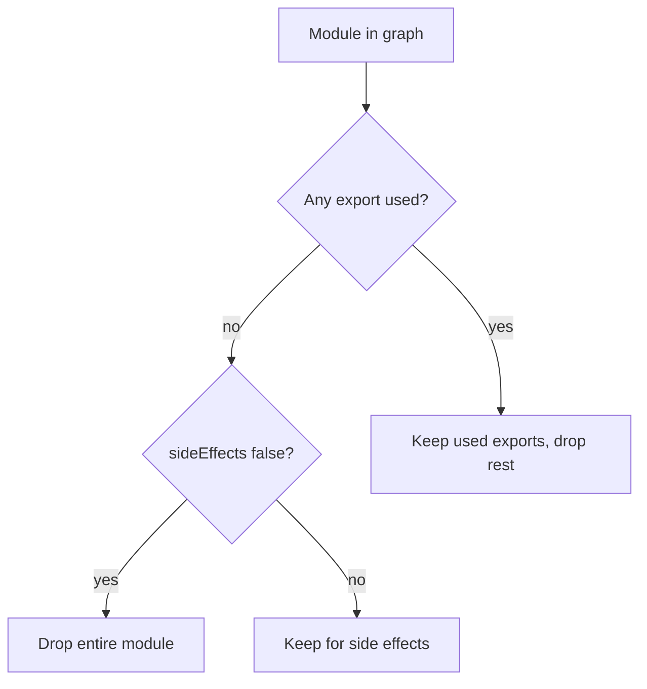
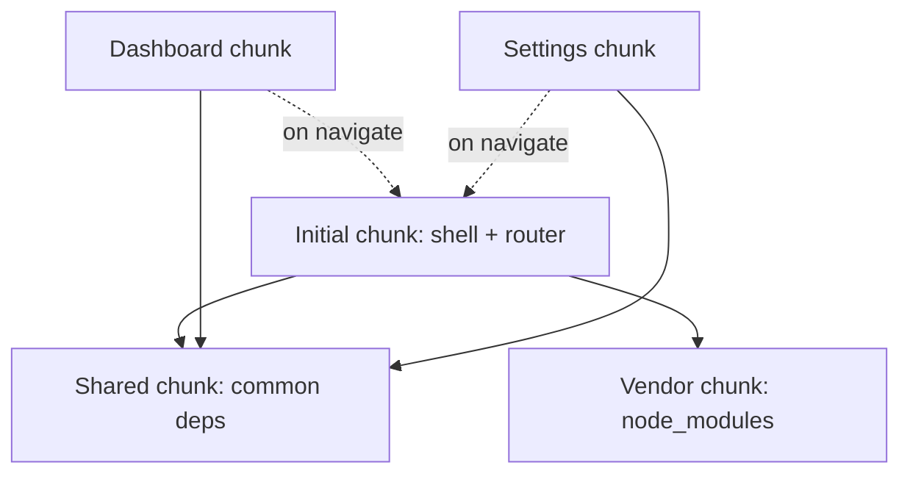
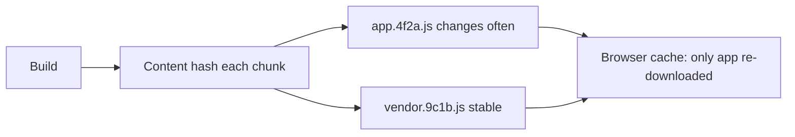
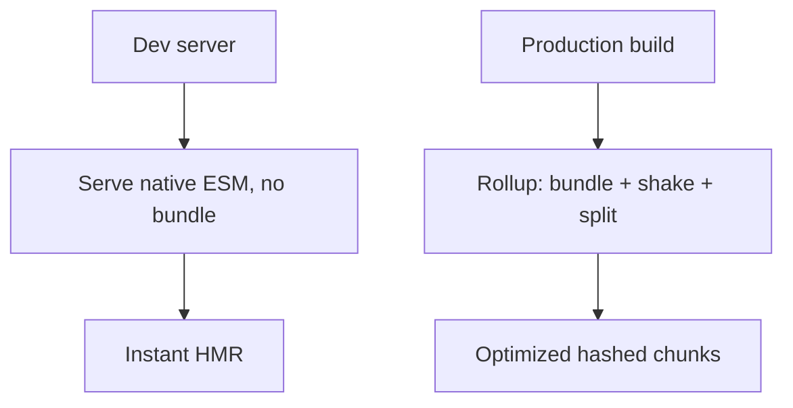

# Bundling Tree Shaking and Code Splitting

## Overview

A **bundler** takes a module graph—hundreds or thousands of files linked by `import`—and produces a smaller number of optimized output files ("chunks") suited to a delivery target. **Tree shaking** is dead-code elimination across that graph: statically proving which exports are never used and dropping them. **Code splitting** is the inverse concern: deliberately *breaking* the graph into multiple chunks so the runtime loads only what a given route or interaction needs, when it needs it.

These three ideas answer the central production question: *how do we ship the least code necessary, as late as responsibly possible, without breaking correctness?* They are made possible by the **static structure of [[02-JavaScript/06-Modules-and-Tooling/ES Modules|ES Modules]]**—you cannot reliably tree-shake `require`. This note is about the *build-time transformation of the module graph*; it depends on resolution ([[02-JavaScript/06-Modules-and-Tooling/Module Resolution and Package Exports|Package Exports]]), often follows [[02-JavaScript/06-Modules-and-Tooling/Transpilation and Polyfills|Transpilation]], and emits [[02-JavaScript/06-Modules-and-Tooling/Source Maps and Debug Builds|Source Maps]]. Runtime delivery (HTTP/2, CDNs) and server frameworks are handled in [[07-Backend/README|Backend]] and [[16-DevOps/README|DevOps]].

## Learning Objectives

- Explain why bundling exists and when it stops being necessary
- Describe tree shaking, its reliance on ESM and `sideEffects`
- Implement route- and component-level code splitting with `import()`
- Reason about chunking strategies, vendor splitting, and caching
- Diagnose why "dead" code survives tree shaking
- Separate build-time graph optimization from runtime delivery

## Prerequisites

- [[02-JavaScript/06-Modules-and-Tooling/ES Modules|ES Modules]]
- [[02-JavaScript/06-Modules-and-Tooling/Module Resolution and Package Exports|Module Resolution and Package Exports]]
- [[02-JavaScript/06-Modules-and-Tooling/Package JSON and Semantic Versioning|Package JSON and Semantic Versioning]]

## Difficulty

`advanced`

## Estimated Time

- Reading: 3 hours
- Exercises: 3–4 hours
- Mini project: 6 hours

## History

Early web pages loaded many `<script>` tags; under HTTP/1.1's limited parallel connections and per-request overhead, this was slow. **Browserify** (2011) let developers use Node-style modules in the browser by bundling them into one file. **webpack** (2014) generalized this with loaders, code splitting, and a rich plugin system, becoming dominant. **Rollup** pioneered ESM-first **tree shaking** and clean library output. **esbuild** (Go) and **SWC** (Rust) delivered order-of-magnitude speedups. **Vite** combined native-ESM dev servers (no bundling in dev) with Rollup production builds. HTTP/2 multiplexing reduced the *per-file* penalty, shifting bundling's justification from "fewer requests" toward "optimization, minification, and tree shaking."

## Problem It Solves

- **Request overhead**: shipping thousands of tiny files is slow; bundling reduces count and enables compression.
- **Dead code**: libraries export far more than any app uses; tree shaking removes the unused.
- **Over-fetching**: users download code for features they never visit; code splitting defers it.
- **Cache invalidation**: naive single bundles bust cache on any change; content-hashed chunks preserve caching.
- **Non-web targets**: libraries and Node apps still benefit from optimized, format-correct output.

## Internal Implementation

### The bundling pipeline


The bundler resolves every import into a graph, determines which bindings are **live** (reachable from an entry and actually referenced), splits the graph at dynamic-import boundaries, then minifies and emits content-hashed files plus a manifest mapping logical chunks to filenames.

### Tree shaking mechanics

Tree shaking requires **static** imports and **no observable side effects** in unused modules. The bundler builds a reachability graph of exports; anything unreferenced is pruned.

```javascript
// utils.js
export function used() { return 1; }
export function unused() { return 2; } // pruned if never imported

// app.js
import { used } from "./utils.js";
console.log(used());
```

The critical caveat is **side effects**. If a module runs code merely by being imported (registering globals, patching prototypes, CSS imports), the bundler must conservatively keep it—unless told otherwise via `"sideEffects": false` in [[02-JavaScript/06-Modules-and-Tooling/Package JSON and Semantic Versioning|package.json]], or a granular allowlist (`"sideEffects": ["*.css"]`).



Common tree-shaking defeaters: re-exporting entire namespaces (`export * from`), importing a whole library instead of a subpath, CJS dependencies (dynamic, unanalyzable), and mutating exported objects.

### Code splitting

Every dynamic `import()` is a **split point**. The bundler emits the imported subgraph as a separate chunk loaded on demand:

```javascript
// Route-level split: dashboard code isn't in the initial bundle
const routes = {
  "/dashboard": () => import("./pages/Dashboard.js"),
  "/settings": () => import("./pages/Settings.js"),
};
```

**Shared chunks** hold code common to multiple split points, avoiding duplication. **Vendor splitting** separates rarely-changing `node_modules` from frequently-changing app code so a code change doesn't invalidate the cached vendor chunk.



## Mermaid Diagrams

### Caching via content hashes



### Dev vs production (Vite model)



## Examples

### Minimal Example

```javascript
// Static import: eligible for tree shaking
import { debounce } from "lodash-es"; // subpath/ESM build shakes well

// Dynamic import: creates a code-split chunk
button.addEventListener("click", async () => {
  const { openEditor } = await import("./editor.js");
  openEditor();
});
```

### Production-Shaped Example

Manual chunking and a size budget enforced in CI—preventing silent bundle bloat that degrades load time:

```javascript
// rollup/vite build config (conceptual)
export default {
  build: {
    sourcemap: true,
    rollupOptions: {
      output: {
        manualChunks(id) {
          if (id.includes("node_modules")) {
            if (id.includes("react")) return "react-vendor";
            return "vendor";
          }
        },
      },
    },
    chunkSizeWarningLimit: 250, // KB; CI fails on regressions
  },
};
```

Operationally: preload critical chunks (`<link rel="modulepreload">`), lazy-load below-the-fold and rarely-used features, split by route, and monitor bundle size as a tracked metric (e.g., `size-limit` in CI, `rollup-plugin-visualizer` for treemaps). A regression in initial-chunk size is a performance incident, not a cosmetic detail—tie it to the metrics in [[02-JavaScript/07-Production-JavaScript/Measuring and Optimizing Performance|Measuring and Optimizing Performance]].

## Trade-offs

| Dimension | Upside | Downside | When it matters |
| --- | --- | --- | --- |
| Aggressive bundling | Fewer requests, better minify | Large initial payload | HTTP/1.1, big apps |
| Fine code splitting | Smaller initial load | Request waterfalls, complexity | Route-heavy SPAs |
| Tree shaking | Removes dead code | Fragile with side effects/CJS | Library-heavy apps |
| Vendor splitting | Long-lived cache | More chunks to manage | Frequent deploys |
| No bundling (dev) | Instant startup/HMR | Not production-optimized | Dev experience |

### When to Use

- Browser applications shipping meaningful amounts of JavaScript.
- Libraries wanting tree-shakable, format-correct output.
- Any app where initial load time is a tracked business metric.

### When Not to Use

- Tiny scripts or a few small modules on HTTP/2 may not need bundling.
- Over-splitting a small app adds request waterfalls without payoff.
- Node server code often needs no bundling (though it can help cold starts).

## Exercises

1. Add an unused export and confirm the bundler removes it; then add a side effect and watch it survive.
2. Set `"sideEffects": false` and measure the bundle-size reduction.
3. Convert a synchronous route import to `import()` and inspect the emitted chunk.
4. Configure vendor splitting; change app code and verify the vendor chunk's hash is stable.
5. Use a bundle visualizer to find the three largest dependencies and propose reductions.

## Mini Project

**Mini Bundler**: Build a bundler that resolves a graph from an entry, performs basic tree shaking on ESM named exports (mark-and-sweep on the export graph), splits at dynamic `import()`, and emits chunks + a manifest. Compare output against esbuild for the same input. Extends [[02-JavaScript/projects/Module Loader Lab/README|Module Loader Lab]].

## Portfolio Project

Add a **bundle-budget CI gate** to the [[02-JavaScript/projects/JavaScript Runtime Toolkit/README|JavaScript Runtime Toolkit]]: parse build output, enforce per-chunk size budgets, render a treemap, and fail builds on regressions with a diff of what grew.

## Interview Questions

1. Why does tree shaking require ES Modules and fail with CommonJS?
2. What is the `sideEffects` field and why does it matter?
3. How does dynamic `import()` create a code-split chunk?
4. Why split vendor code into its own chunk?
5. Given HTTP/2, is bundling still worthwhile? Justify.

### Stretch / Staff-Level

1. Design a chunking strategy for a large SPA balancing initial load, cache stability, and request waterfalls.
2. Explain how a bundler proves an export is unused and where that analysis becomes unsound.

## Common Mistakes

- Expecting tree shaking to remove code from CJS dependencies.
- Importing an entire library (`import _ from "lodash"`) instead of subpaths/ESM builds.
- Omitting `sideEffects` metadata, so nothing gets shaken.
- Over-splitting into many tiny chunks, creating request waterfalls.
- Not tracking bundle size, letting it regress silently.

## Best Practices

- Prefer ESM/tree-shakable dependencies; import specific members.
- Declare `sideEffects` accurately in library `package.json`.
- Split by route and lazy-load rare features; preload critical chunks.
- Keep vendor code in stable, separately-hashed chunks for caching.
- Enforce bundle-size budgets in CI and always emit source maps.

## Summary

Bundling reshapes the module graph for delivery; tree shaking removes provably-unused exports; code splitting defers loading of what isn't needed yet. All three lean on the static analyzability of ES Modules and correct `sideEffects`/`exports` metadata. The engineering goal is to ship the minimum code, cached effectively, loaded as late as responsibly possible—without breaking side-effectful modules or creating request waterfalls. Treat bundle size as a first-class, budgeted metric, and keep build-time graph optimization conceptually separate from runtime delivery concerns.

## Further Reading

- [[02-JavaScript/06-Modules-and-Tooling/Transpilation and Polyfills|Transpilation and Polyfills]]
- [[02-JavaScript/06-Modules-and-Tooling/Source Maps and Debug Builds|Source Maps and Debug Builds]]
- [[02-JavaScript/07-Production-JavaScript/Measuring and Optimizing Performance|Measuring and Optimizing Performance]]
- [[00-References/JavaScript/README|JavaScript References]]
- webpack, Rollup, esbuild, and Vite documentation

## Related Notes

- [[02-JavaScript/06-Modules-and-Tooling/ES Modules|ES Modules]]
- [[02-JavaScript/06-Modules-and-Tooling/Module Resolution and Package Exports|Module Resolution and Package Exports]]
- [[02-JavaScript/code/README|JavaScript code labs]]
- [[06-NodeJS/README|Node.js]] · [[07-Backend/README|Backend]] · [[16-DevOps/README|DevOps]]
- [[02-JavaScript/README|JavaScript Track]]

## Progress Checklist

- [ ] Explained from first principles
- [ ] Drew at least one Mermaid diagram
- [ ] Implemented a minimal version
- [ ] Documented trade-offs and non-goals
- [ ] Completed exercises
- [ ] Practiced interview questions aloud
- [ ] Linked prerequisites and dependents
