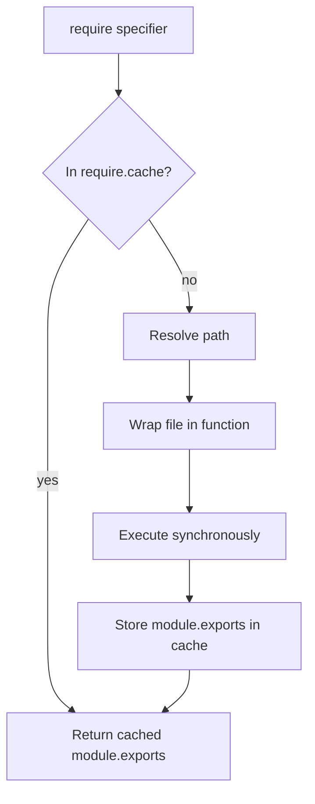
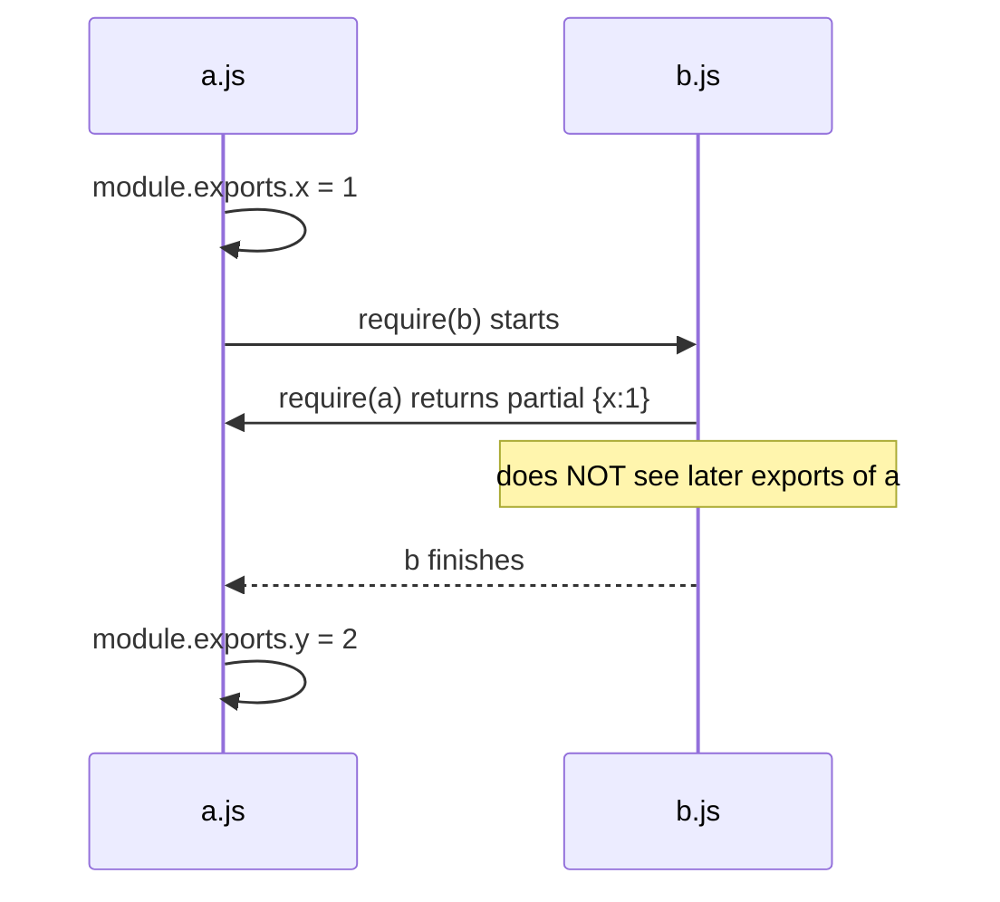
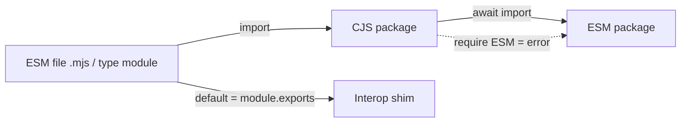
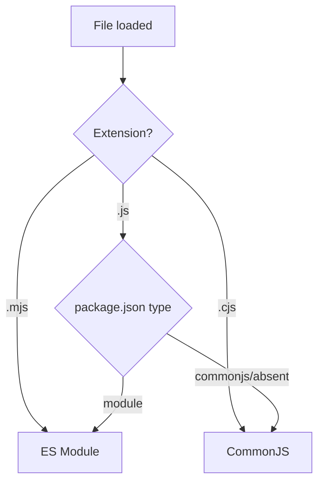
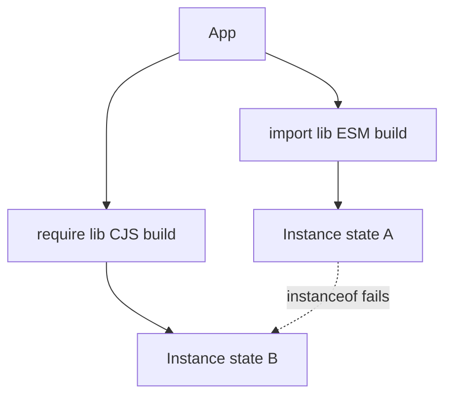

# CommonJS and Interoperability

## Overview

**CommonJS (CJS)** is the module system Node.js shipped in 2009, built from a runtime function `require()` and a mutable `module.exports` object. Unlike [[02-JavaScript/06-Modules-and-Tooling/ES Modules|ES Modules]], CommonJS is **not part of the ECMAScript language**—it is a *runtime convention* implemented by wrapping each file in a function and injecting `require`, `module`, `exports`, `__filename`, and `__dirname`. Because `require` is an ordinary synchronous function call, module loading in CJS is **imperative and dynamic**: you can `require` conditionally, compute specifiers at runtime, and mutate exports after the fact.

For a decade CJS *was* the JavaScript module ecosystem, and npm is saturated with CJS packages. The central production challenge today is **interoperability**: making CJS and ESM coexist in one codebase without duplicate instances, broken default imports, or `ERR_REQUIRE_ESM` errors. This note explains the CJS model from first principles and then the precise rules and pitfalls of ESM↔CJS interop. How Node locates these files is [[02-JavaScript/06-Modules-and-Tooling/Module Resolution and Package Exports|Module Resolution]]; runtime specifics belong to [[06-NodeJS/README|Node.js]].

## Learning Objectives

- Explain the module wrapper, `require`, `module.exports`, and the require cache
- Contrast synchronous CJS loading with the ESM three-phase model
- Predict cycle behavior and partial-export hazards in CJS
- Import CJS from ESM and (carefully) ESM from CJS
- Diagnose dual-package hazards and `default` interop quirks
- Choose a migration strategy from CJS to ESM

## Prerequisites

- [[02-JavaScript/06-Modules-and-Tooling/ES Modules|ES Modules]]
- [[02-JavaScript/02-Execution-and-Functions/Closures|Closures]]
- [[02-JavaScript/02-Execution-and-Functions/Execution Contexts and Call Stack|Execution Contexts and Call Stack]]

## Difficulty

`intermediate`

## Estimated Time

- Reading: 2–3 hours
- Exercises: 3 hours
- Mini project: 4 hours

## History

When Node.js launched, ECMAScript had no modules. Ryan Dahl adopted the **CommonJS** specification (originally "ServerJS") because it offered synchronous, filesystem-friendly loading suited to a server. `require` returns a fully evaluated exports object, which is natural when files are local and reads are cheap. Browsers could not adopt CJS directly (synchronous network loading is unacceptable), which spawned AMD and later bundlers that *simulate* `require` in the browser.

When ESM standardized in ES2015 and Node implemented it (stable ~2019), the ecosystem faced a bifurcation. Node's solution: file extension and `package.json` `"type"` field decide the module system, plus conditional `"exports"` for dual packages. That machinery is the source of most interop pain.

## Problem It Solves

CommonJS solved the immediate 2009 problem: **give server-side JavaScript a module system now**, using synchronous semantics that match local file access and a mutable exports object that is trivial to reason about. Its dynamic nature enables lazy loading, plugin systems, and monkey-patching. The cost—no static analyzability—is exactly what ESM later fixed, which is why interop matters.

## Internal Implementation

### The module wrapper

Node wraps every CJS file in a function before executing it:

```javascript
(function (exports, require, module, __filename, __dirname) {
  // your module code runs here
});
```

This is why `exports` and `module` are not globals: they are **parameters**. `exports` starts as a reference to `module.exports`. Returning a value means assigning to `module.exports`; reassigning the local `exports` variable breaks the link.

```javascript
// Works: mutating the shared object
exports.add = (a, b) => a + b;

// Works: replacing the exports object
module.exports = function main() {};

// BUG: reassigning the local parameter has no effect on the module
exports = function main() {}; // consumers get {}
```

### require and the cache

`require(specifier)` resolves the path, checks `require.cache` keyed by absolute filename, and if absent, wraps + executes the file, then stores `module.exports`. Subsequent requires return the **cached object**—the CJS singleton guarantee.



### Value copies, not live bindings

`require` returns the exports object **as it exists at that moment**. Destructuring a primitive captures a snapshot:

```javascript
// counter.js
let count = 0;
module.exports = { count, increment: () => { count++; } };

// main.js
const { count, increment } = require("./counter");
increment();
console.log(count); // still 0 — snapshot copy
```

Contrast this with ESM live bindings. This difference is the root cause of many interop surprises.

### Cycles in CJS

CJS resolves cycles by returning a **partially populated** exports object. If `a` requires `b` while `b` requires `a`, `b` receives whatever `a` exported *before* the require line ran. Exports added later are invisible to `b`. This silent partial-export bug is harder to detect than ESM's explicit TDZ `ReferenceError`.



## Mermaid Diagrams

### Interop directions



### Decision: which system runs?



## Examples

### Minimal Example

```javascript
// logger.cjs (CommonJS)
function log(msg) { console.log(`[app] ${msg}`); }
module.exports = { log };

// consumer.cjs
const { log } = require("./logger.cjs");
log("hello");
```

### Production-Shaped Example

Importing a CJS package from ESM. Node exposes `module.exports` as the ESM **default** export and attempts to expose named exports via static analysis (`cjs-module-lexer`), which can miss dynamically-added properties:

```javascript
// esm-consumer.mjs
import pkg from "lodash";           // default = the whole module.exports
const { debounce } = pkg;           // safe: destructure from default

// Named import MIGHT work if the lexer detected it, but is fragile:
// import { debounce } from "lodash"; // can throw for some CJS packages
```

Requiring ESM from CJS is **not** allowed synchronously; you must use dynamic import:

```javascript
// cjs-consumer.cjs
async function main() {
  const { default: chalk } = await import("chalk"); // chalk v5 is ESM-only
  console.log(chalk.green("loaded ESM from CJS"));
}
main();
```

**Dual-package hazard**: if a library ships both a CJS and ESM build, a dependency graph can load *both*, creating two independent instances with separate module-level state (caches, singletons, `instanceof` checks fail). Mitigate with a single implementation re-exported from both entry points, or a stateless design.



## Trade-offs

| Dimension | Upside | Downside | When it matters |
| --- | --- | --- | --- |
| Synchronous require | Simple mental model, dynamic | Blocks, no async loading | Server startup, plugins |
| Value copies | Predictable snapshot | No live updates | Shared counters/state |
| Dynamic specifiers | Runtime plugin systems | No tree shaking/static analysis | Bundling |
| Dual packages | Broad compatibility | Duplicate-instance hazard | Libraries with state |
| Ubiquity | Works with all legacy npm | Legacy semantics linger | Migration planning |

### When to Use

- Maintaining or extending existing CJS codebases and tooling
- Plugin architectures that require runtime-computed module paths
- Environments without a build step tied to CJS-only tools

### When Not to Use

- New libraries meant to be tree-shakable (prefer ESM)
- Browser code (needs bundling to simulate `require`)
- Anything relying on static analysis or top-level await

## Exercises

1. Reproduce the `exports = ...` vs `module.exports = ...` bug and explain why one works.
2. Build a two-file CJS cycle and show a missing export due to partial evaluation.
3. Import a CJS package from an ESM file using the default export, then attempt a named import and observe behavior.
4. From a CJS file, load an ESM-only package using dynamic `import()`.
5. Inspect `require.cache`, delete an entry, re-require, and observe re-execution.

## Mini Project

**Interop Doctor CLI**: Scan a project, classify each file as CJS or ESM (extension + nearest `package.json` `type`), flag risky patterns (`require` of ESM-only packages, named imports of CJS, packages appearing in both build formats), and print a remediation report. Cross-link results into [[02-JavaScript/projects/Module Loader Lab/README|Module Loader Lab]].

## Portfolio Project

Extend the [[02-JavaScript/projects/JavaScript Runtime Toolkit/README|JavaScript Runtime Toolkit]] with a dual-package-hazard detector that traces the resolved module graph and reports any package loaded in two formats.

## Interview Questions

1. What are `module`, `exports`, `require`, `__dirname`, and `__filename`, and where do they come from?
2. Why does reassigning `exports` (not `module.exports`) fail to export?
3. How do CJS cycles differ from ESM cycles?
4. Why can't you `require()` an ESM module synchronously in Node?
5. What is the dual-package hazard and how do you avoid it?

### Stretch / Staff-Level

1. Design a library that ships to both CJS and ESM consumers with zero duplicate-state risk.
2. Explain how `cjs-module-lexer` enables named imports from CJS and when it fails.

## Common Mistakes

- Reassigning `exports` instead of `module.exports`.
- Assuming named imports from CJS packages always work under ESM.
- Trying to `require()` an ESM-only dependency and hitting `ERR_REQUIRE_ESM`.
- Shipping stateful singletons in dual (CJS+ESM) builds.
- Deleting `require.cache` entries in production to "reload" modules, causing subtle state divergence.

## Best Practices

- New code: author in ESM; provide a CJS build only if consumers demand it.
- Import CJS from ESM via the **default** export, then destructure.
- Keep dual-published packages **stateless**, or route both entry points to one implementation.
- Set `"type"` explicitly in [[02-JavaScript/06-Modules-and-Tooling/Package JSON and Semantic Versioning|package.json]]; never rely on the default.
- Use `.cjs`/`.mjs` extensions to make intent unambiguous during migration.

## Summary

CommonJS is a runtime module convention—`require` plus a mutable `module.exports`, delivered through a function wrapper and a require cache. It is synchronous, dynamic, and returns value copies, which made it ideal for 2009-era servers but incompatible with static tooling and browsers. ESM is now the standard, so the practical skill is **interoperability**: import CJS via default exports, load ESM from CJS with dynamic `import()`, and avoid dual-package duplicate-instance hazards. Knowing *why* each system behaves as it does—wrapper, cache, snapshot semantics—turns cryptic interop errors into predictable ones.

## Further Reading

- [[02-JavaScript/06-Modules-and-Tooling/ES Modules|ES Modules]]
- [[02-JavaScript/06-Modules-and-Tooling/Module Resolution and Package Exports|Module Resolution and Package Exports]]
- [[00-References/JavaScript/README|JavaScript References]]
- Node.js docs — *Modules: CommonJS* and *Modules: ECMAScript modules* (interop section)

## Related Notes

- [[02-JavaScript/06-Modules-and-Tooling/ES Modules|ES Modules]]
- [[02-JavaScript/06-Modules-and-Tooling/Package JSON and Semantic Versioning|Package JSON and Semantic Versioning]]
- [[02-JavaScript/code/README|JavaScript code labs]]
- [[06-NodeJS/README|Node.js]]
- [[02-JavaScript/README|JavaScript Track]]

## Progress Checklist

- [ ] Explained from first principles
- [ ] Drew at least one Mermaid diagram
- [ ] Implemented a minimal version
- [ ] Documented trade-offs and non-goals
- [ ] Completed exercises
- [ ] Practiced interview questions aloud
- [ ] Linked prerequisites and dependents
