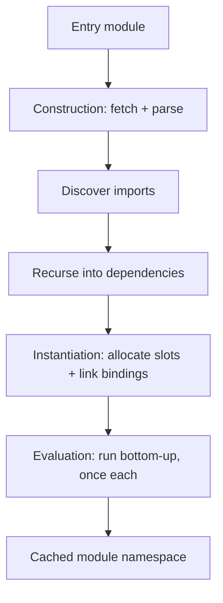
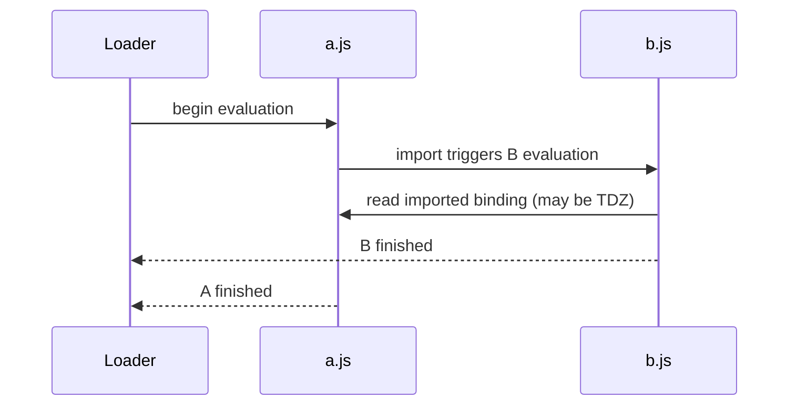
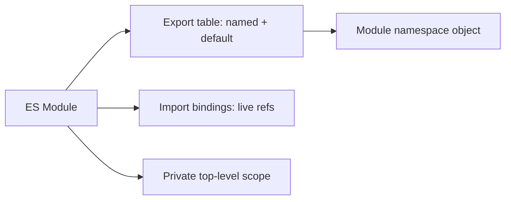
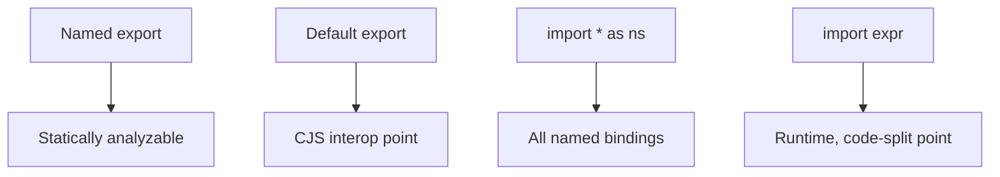

# ES Modules

## Overview

**ECMAScript Modules (ESM)** are the standardized module system built into the language specification (ES2015+). A module is a source file with its own **top-level scope** whose bindings are private unless explicitly `export`ed, and which pulls in other modules' bindings via `import`. Unlike ad-hoc `<script>` globals or the runtime-defined [[02-JavaScript/06-Modules-and-Tooling/CommonJS and Interoperability|CommonJS]] `require`, ESM is a **language-level construct** with static structure: imports and exports are analyzable *before any code runs*.

This static shape is the whole point. Because the module graph is knowable at parse time, engines and tools can build a dependency graph, detect cycles, deduplicate instances, enable [[02-JavaScript/06-Modules-and-Tooling/Bundling Tree Shaking and Code Splitting|tree shaking]], and support asynchronous loading in browsers—all without executing user code. ESM is the *contract* between a source file and the world; how that contract is located on disk is [[02-JavaScript/06-Modules-and-Tooling/Module Resolution and Package Exports|Module Resolution]], and how a runtime like Node executes it is a host concern covered in [[06-NodeJS/README|Node.js]].

## Learning Objectives

- Explain the three phases of ESM evaluation: construction, instantiation, evaluation
- Distinguish **live bindings** from CommonJS value copies
- Use named, default, namespace, and dynamic imports correctly
- Reason about module singletons, cycles, and top-level `await`
- Predict hoisting and temporal-dead-zone behavior across module boundaries
- Separate language semantics from host resolution and bundler behavior

## Prerequisites

- [[02-JavaScript/02-Execution-and-Functions/Lexical Scope and Environment Records|Lexical Scope and Environment Records]]
- [[02-JavaScript/02-Execution-and-Functions/Declarations Hoisting and Temporal Dead Zone|Declarations Hoisting and Temporal Dead Zone]]
- [[02-JavaScript/00-Orientation/JavaScript Program Lifecycle|JavaScript Program Lifecycle]]

## Difficulty

`intermediate`

## Estimated Time

- Reading: 2–3 hours
- Exercises: 3 hours
- Mini project: 5 hours

## History

Before ESM, JavaScript had *no* module system. Browsers concatenated `<script>` tags into one shared global scope, forcing patterns like the **IIFE** and the **Revealing Module Pattern** to fake privacy. Server-side, **CommonJS** (2009, Node.js) introduced synchronous `require`, and **AMD** (RequireJS) introduced asynchronous `define` for browsers. **UMD** glued them together for libraries shipping to both.

These were *library conventions*, not language features. TC39 standardized ESM in **ES2015** with static `import`/`export`. Browsers shipped `<script type="module">` around 2017; Node added experimental support in v8.5 (2017) and stable support in v12–v14 (2019–2020). **Dynamic `import()`** (ES2020) and **top-level `await`** (ES2022) filled the remaining gaps.

## Problem It Solves

- **Global namespace pollution**: implicit globals cause collisions and load-order bugs.
- **Undeclared dependencies**: script tags hide the true dependency graph; ESM makes it explicit and static.
- **No dead-code elimination**: dynamic `require` cannot be statically pruned; static `import` enables tree shaking.
- **Load-order fragility**: ESM formalizes evaluation order and cycle handling instead of relying on manual `<script>` ordering.

## Internal Implementation

ESM loading is specified as a **three-phase** process. Understanding these phases explains almost every surprising behavior (hoisting, cycles, live bindings).

### Phase 1 — Construction (parse & fetch)

The host resolves each specifier to a **Module Record**, fetches the source, and parses it. Parsing extracts the `import`/`export` entries *without running code*. This is why `import` statements are **hoisted** and cannot be conditional or nested in blocks.

### Phase 2 — Instantiation (linking)

The engine walks the graph depth-first and allocates a **Module Environment Record** for each module. Every exported name gets a memory slot, and every `import` is wired to point *directly at the exporter's slot*. This wiring is why ESM imports are **live bindings**: the importer reads the exporter's current value, not a snapshot.

### Phase 3 — Evaluation

Modules execute bottom-up in the dependency order computed during instantiation. Each module runs **exactly once**; the resulting namespace is cached and reused (the **module singleton** guarantee).



### Live bindings vs value copies

```javascript
// counter.js
export let count = 0;
export function increment() { count++; }

// main.js
import { count, increment } from "./counter.js";
console.log(count); // 0
increment();
console.log(count); // 1  <-- reflects exporter's current value
```

In CommonJS the equivalent `const { count } = require("./counter")` would print `0` twice, because `require` copies the value at import time. This difference is the single most important semantic distinction between the two systems.

### Cycles

ESM handles cycles by exposing *uninitialized* bindings during evaluation. If module `A` imports from `B` while `B` imports from `A`, whichever runs first may observe the other's bindings in the **temporal dead zone**. Function declarations survive cycles (they are hoisted); accessing a `let`/`const` before its module finished evaluating throws `ReferenceError`.



## Mermaid Diagrams

### Structure



### Export/import kinds



## Examples

### Minimal Example

```javascript
// math.js
export const PI = 3.14159;
export function area(r) { return PI * r * r; }
export default function circumference(r) { return 2 * PI * r; }

// app.js
import circumference, { PI, area } from "./math.js";
import * as math from "./math.js"; // namespace object

console.log(area(2));            // 12.56636
console.log(circumference(2));   // 12.56636
console.log(math.PI);            // 3.14159
```

### Production-Shaped Example

Dynamic import for lazy loading, with error handling, timeout, and a fallback—typical of code-split routes:

```javascript
async function loadReportModule(signal) {
  const timeout = setTimeout(() => controller.abort(), 5000);
  const controller = new AbortController();
  try {
    // Bundlers treat this as a code-split boundary.
    const mod = await import("./reports/heavy-report.js");
    return mod.renderReport;
  } catch (err) {
    // Network failure, chunk 404 after deploy, or syntax error in chunk.
    logger.error("report_module_load_failed", { err: err.message });
    return () => showFallbackUI("Report temporarily unavailable");
  } finally {
    clearTimeout(timeout);
  }
}
```

Top-level `await` lets a module block its consumers until async setup completes—useful but it **serializes** the graph:

```javascript
// config.js
const res = await fetch("/config.json"); // top-level await
export const config = await res.json();
```

Any module importing `config.js` waits for that fetch before evaluating. Use it for genuine initialization, not convenience, because it can create startup latency chains.

## Trade-offs

| Dimension | Upside | Downside | When it matters |
| --- | --- | --- | --- |
| Static structure | Tree shaking, tooling, cycle analysis | No conditional top-level imports | Bundling, library authoring |
| Live bindings | Consumers see current state | Surprising if you expect a copy | Shared counters, singletons |
| Async loading | Non-blocking, code splitting | Requires resolution/network model | Browser apps, large graphs |
| Top-level await | Clean async init | Serializes dependents, deadlock risk | Config/bootstrapping |
| Strict-by-default | Fewer silent bugs | Some old patterns break | Migrating legacy code |

### When to Use

- New code in any modern runtime (browsers, Node ≥ 14, Deno, Bun)
- Libraries that want tree-shakable named exports
- Apps that benefit from lazy route/feature loading via `import()`

### When Not to Use

- Environments locked to legacy CommonJS-only tooling without a build step
- Tiny scripts where a build/resolution pipeline adds no value

## Exercises

1. Write two modules with a cyclic import and predict which binding is in the TDZ; verify by running.
2. Demonstrate live bindings by mutating an exported `let` from within its module and observing the change in an importer.
3. Convert a Revealing Module Pattern IIFE into an ES module with named exports.
4. Use dynamic `import()` to lazily load a module only when a button is clicked.
5. Add a top-level `await` and measure how it delays evaluation of a dependent module.

## Mini Project

**ESM Dependency Grapher**: Given an entry file, statically parse `import`/`export` statements (regex or a real parser like `acorn`), build the dependency graph, detect cycles, and render it as a Mermaid diagram. Compare your discovered graph to the runtime module namespace. Extends [[02-JavaScript/projects/Module Loader Lab/README|Module Loader Lab]].

## Portfolio Project

Add an ESM/CJS interop analyzer to the [[02-JavaScript/projects/JavaScript Runtime Toolkit/README|JavaScript Runtime Toolkit]] that classifies each file's module type, flags live-binding vs copy hazards, and reports unresolved specifiers.

## Interview Questions

1. What are the three phases of ESM loading and what happens in each?
2. Explain live bindings and how they differ from CommonJS value copies.
3. Why can't `import` statements be placed inside an `if` block?
4. How does ESM handle circular dependencies?
5. What does top-level `await` do to modules that import the module using it?

### Stretch / Staff-Level

1. Design a plugin that safely mixes ESM and CJS in one build; what interop edge cases must you handle?
2. How would you detect and prevent accidental duplicate module instances (two copies of the same package) in a large monorepo?

## Common Mistakes

- Assuming imports are value copies (they are live references).
- Expecting side-effectful imports to run in source order rather than dependency order.
- Using default exports for libraries, harming tree shaking and named-import ergonomics.
- Forgetting file extensions where the host requires them (Node ESM).
- Overusing top-level `await`, creating slow startup chains or deadlocks.

## Best Practices

- Prefer **named exports** for libraries; reserve default exports for single-purpose modules.
- Keep modules **side-effect-free** where possible; declare `"sideEffects": false` in [[02-JavaScript/06-Modules-and-Tooling/Package JSON and Semantic Versioning|package.json]] when true.
- Use dynamic `import()` for code splitting, not to fake conditional static imports.
- Avoid deep cyclic graphs; refactor shared state into a third module.
- Treat resolution/extension rules as a host concern and configure them explicitly.

## Summary

ES Modules are the language's native, statically analyzable module system. Their power comes from a three-phase load (construct, instantiate, evaluate) that links imports as **live bindings** and guarantees a single evaluation per module. This static structure enables tooling that CommonJS cannot match—tree shaking, async code splitting, and reliable cycle handling—while shifting the questions of *where* modules live and *how* they are executed to resolution and host runtimes. Master the phase model and the live-binding semantics, and most ESM surprises disappear.

## Further Reading

- [[02-JavaScript/06-Modules-and-Tooling/CommonJS and Interoperability|CommonJS and Interoperability]]
- [[02-JavaScript/06-Modules-and-Tooling/Module Resolution and Package Exports|Module Resolution and Package Exports]]
- [[00-References/JavaScript/README|JavaScript References]]
- MDN — *JavaScript modules*; TC39 — *ECMAScript Language Specification*, Modules section

## Related Notes

- [[02-JavaScript/06-Modules-and-Tooling/CommonJS and Interoperability|CommonJS and Interoperability]]
- [[02-JavaScript/06-Modules-and-Tooling/Bundling Tree Shaking and Code Splitting|Bundling Tree Shaking and Code Splitting]]
- [[02-JavaScript/code/README|JavaScript code labs]]
- [[06-NodeJS/README|Node.js]]
- [[02-JavaScript/README|JavaScript Track]]

## Progress Checklist

- [ ] Explained from first principles
- [ ] Drew at least one Mermaid diagram
- [ ] Implemented a minimal version
- [ ] Documented trade-offs and non-goals
- [ ] Completed exercises
- [ ] Practiced interview questions aloud
- [ ] Linked prerequisites and dependents
