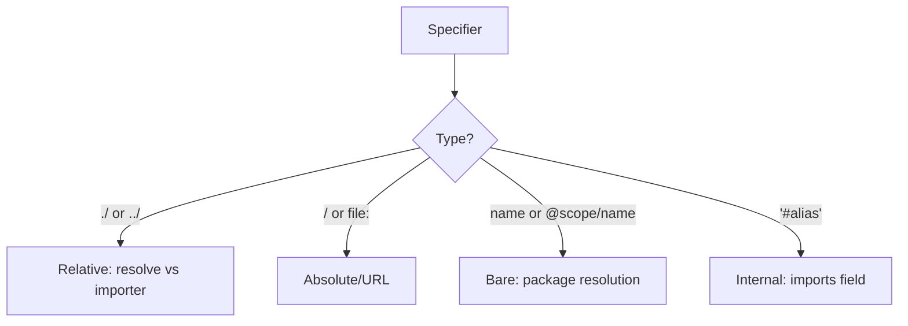
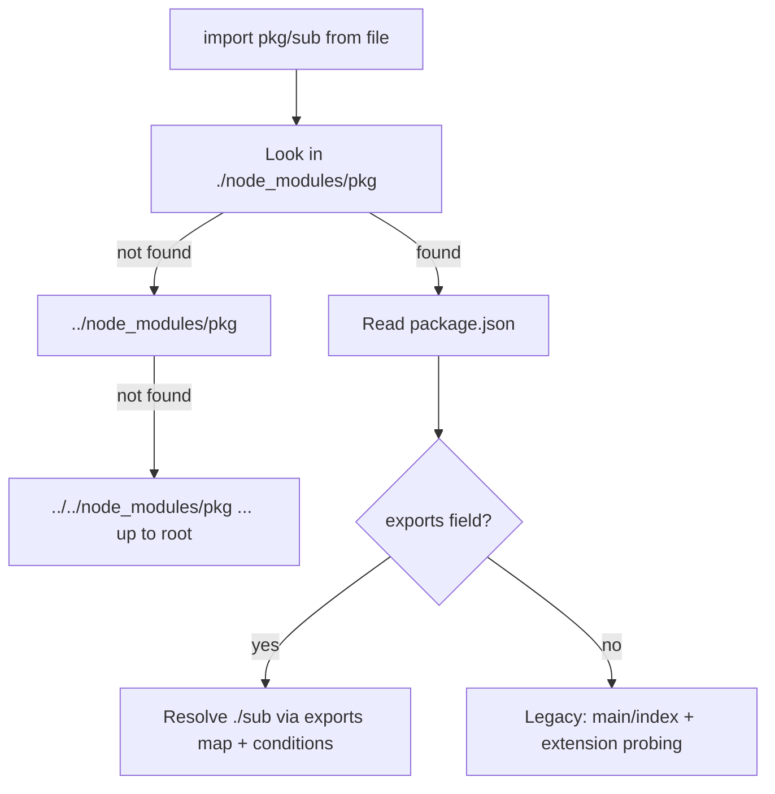
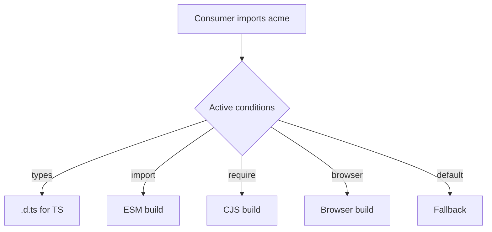
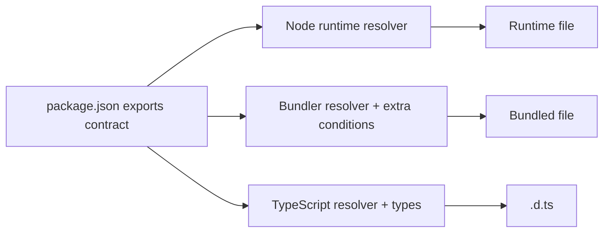

# Module Resolution and Package Exports

## Overview

**Module resolution** is the algorithm that turns a *specifier*—the string in `import x from "specifier"`—into a concrete file on disk (or a URL). The specifier is a **contract**; resolution is the **lookup**. This is one of the least understood yet most consequential parts of the JavaScript ecosystem, because a single package can present entirely different files depending on who is importing it, in which format, on which runtime.

Modern resolution is governed by the package's **`exports` field**, a declarative map that lets a package define its **public entry points** and hide internals, while selecting different files per **condition** (`import` vs `require`, `node` vs `browser`, `development` vs `production`). Understanding resolution is what separates "it works on my machine" from reliably shipping libraries. This note covers the *language/package contract* layer; runtime-specific flags and loader hooks are covered in [[06-NodeJS/03-Modules-and-Loading/Custom Loaders and Module Hooks|Custom Loaders and Module Hooks]] and [[06-NodeJS/03-Modules-and-Loading/node_modules Resolution in Practice|node_modules Resolution in Practice]]; how bundlers reinterpret these fields belongs to [[02-JavaScript/06-Modules-and-Tooling/Bundling Tree Shaking and Code Splitting|Bundling]].

## Learning Objectives

- Classify specifiers: relative, absolute, bare, and subpath imports
- Trace the `node_modules` walk and `exports`/`imports` field resolution
- Use conditional exports (`import`, `require`, `browser`, `types`, `default`)
- Encapsulate package internals and expose stable subpaths
- Diagnose `ERR_PACKAGE_PATH_NOT_EXPORTED` and resolution mismatches
- Distinguish package contracts from bundler and runtime overrides

## Prerequisites

- [[02-JavaScript/06-Modules-and-Tooling/ES Modules|ES Modules]]
- [[02-JavaScript/06-Modules-and-Tooling/CommonJS and Interoperability|CommonJS and Interoperability]]
- [[02-JavaScript/06-Modules-and-Tooling/Package JSON and Semantic Versioning|Package JSON and Semantic Versioning]]

## Difficulty

`advanced`

## Estimated Time

- Reading: 3 hours
- Exercises: 3 hours
- Mini project: 5 hours

## History

Node's original resolution was pragmatic: relative paths resolve against the current file; bare specifiers trigger a walk up parent `node_modules` directories, reading `package.json` `"main"` and trying extensions (`.js`, `.json`, `.node`) and `index` files. This *file-probing* algorithm is flexible but leaks internals—consumers could `require("pkg/lib/secret/util")`.

As packages grew and ESM arrived, this became untenable. Node introduced the **`exports` field** (v12, 2019) to give packages an explicit, encapsulated public API and **conditional exports** to serve different files to different consumers. The `imports` field added **private internal aliases** (`#internal`). Bundlers layered their own conditions (`module`, `browser`) on top, and TypeScript added `types` resolution modes. The result is powerful but intricate.

## Problem It Solves

- **Leaky internals**: without `exports`, any file is importable, so refactors break consumers.
- **Format mismatch**: a package needs to serve ESM to `import` and CJS to `require`.
- **Environment divergence**: browser vs Node builds, dev vs prod builds.
- **Ambiguous entry points**: `"main"` alone cannot express multiple subpaths or conditions.
- **Type resolution**: TypeScript must find `.d.ts` matching the runtime file.

## Internal Implementation

### Specifier classification



### Bare specifier resolution (the node_modules walk)

For `import x from "pkg/sub"`, the resolver splits into **package name** (`pkg`) and **subpath** (`./sub`), then walks upward:



### The exports field

`exports` maps **subpaths** to **targets**, optionally per **condition**. Anything not listed is *not importable*—that is the encapsulation guarantee.

```json
{
  "name": "acme",
  "type": "module",
  "exports": {
    ".": {
      "types": "./dist/index.d.ts",
      "import": "./dist/index.js",
      "require": "./dist/index.cjs",
      "default": "./dist/index.js"
    },
    "./utils": {
      "import": "./dist/utils.js",
      "require": "./dist/utils.cjs"
    },
    "./package.json": "./package.json"
  }
}
```

**Condition matching is order-sensitive and first-match-wins.** Always place `types` first and `default` last. `import`/`require` distinguish the *syntactic form* the consumer used, not merely the file extension—this is how a package serves live-binding ESM to `import` and interop-friendly CJS to `require`.

### The imports field (private internals)

`imports` defines package-internal aliases beginning with `#`, resolvable only *within* the package. Useful for swapping implementations per condition (e.g., a browser vs node polyfill) without exposing them.

```json
{
  "imports": {
    "#crypto": { "node": "./src/crypto-node.js", "browser": "./src/crypto-web.js" }
  }
}
```

### Common failure mode

`ERR_PACKAGE_PATH_NOT_EXPORTED` means a consumer requested a subpath the `exports` map does not list. This is *intended* encapsulation, but it breaks code that reached into internals. The fix is to expose an official subpath or use a supported entry—not to delete `exports`.

## Mermaid Diagrams

### Condition resolution



### Layered override model



## Examples

### Minimal Example

```javascript
// Relative: resolved against importer's directory
import { helper } from "./lib/helper.js";

// Bare: triggers node_modules walk + exports resolution
import express from "express";

// Subpath: must be listed in the package's exports map
import { render } from "acme/utils";
```

### Production-Shaped Example

A dual-format library with browser/node/dev splits and typed entry points:

```json
{
  "name": "metrics-client",
  "version": "2.3.0",
  "type": "module",
  "exports": {
    ".": {
      "types": "./dist/index.d.ts",
      "browser": "./dist/index.browser.js",
      "node": {
        "import": "./dist/index.node.mjs",
        "require": "./dist/index.node.cjs"
      },
      "default": "./dist/index.js"
    },
    "./testing": {
      "types": "./dist/testing.d.ts",
      "import": "./dist/testing.js"
    }
  },
  "sideEffects": false
}
```

Verifying a package's real resolution surface before publishing is essential—tools like `publint` and `arethetypeswrong` catch mismatches where, say, the `require` condition points at ESM or the `types` file does not match the runtime shape. A resolution bug here fails for *consumers*, not you, which makes it expensive to discover late.

## Trade-offs

| Dimension | Upside | Downside | When it matters |
| --- | --- | --- | --- |
| `exports` encapsulation | Refactor internals freely | Breaks deep-import consumers | Library boundaries |
| Conditional exports | One package, many targets | Config complexity, easy to misorder | Dual/isomorphic libs |
| Legacy `main`-only | Simple, permissive | Leaks internals, no ESM/CJS split | Tiny internal packages |
| `imports` (`#`) | Private per-env impls | Extra indirection | Isomorphic code |
| Bundler condition overrides | Optimized output | Diverges from runtime behavior | Frontend builds |

### When to Use

- Any published library: define `exports` to lock down a public API.
- Isomorphic packages needing browser/node or ESM/CJS variants.
- Monorepos exposing curated subpaths between internal packages.

### When Not to Use

- Throwaway scripts or private packages where encapsulation adds no value.
- When you must support very old Node versions that ignore `exports` (plan a fallback).

## Exercises

1. Write a package with `exports` exposing only `.` and `./utils`; verify a deep import throws `ERR_PACKAGE_PATH_NOT_EXPORTED`.
2. Add `import` and `require` conditions and confirm each consumer form gets the right file.
3. Implement a browser vs node split using the `imports` field with `#`-aliases.
4. Intentionally misorder `default` before `types` and observe the TypeScript failure.
5. Trace the `node_modules` walk for a nested workspace by logging resolution at each level.

## Mini Project

**Mini Resolver**: Implement the bare-specifier resolution algorithm—`node_modules` walk, `package.json` reading, `exports` condition matching (first-match, order-sensitive), and subpath encapsulation. Feed it fixtures and compare against Node's actual resolution. Integrates with [[02-JavaScript/projects/Module Loader Lab/README|Module Loader Lab]].

## Portfolio Project

Add a **package linter** to the [[02-JavaScript/projects/JavaScript Runtime Toolkit/README|JavaScript Runtime Toolkit]] that validates `exports`/`imports` maps: condition ordering, existence of target files, ESM/CJS/type consistency, and reports issues like `publint` does.

## Interview Questions

1. Walk through how `import x from "lodash"` is resolved by Node.
2. What does the `exports` field do that `main` cannot?
3. Why is condition order in `exports` significant, and what order do you use for `types`/`default`?
4. What is `ERR_PACKAGE_PATH_NOT_EXPORTED` and how do you fix it correctly?
5. How do bundlers and TypeScript reinterpret the same package fields differently from Node?

### Stretch / Staff-Level

1. Design the `exports` map for an isomorphic library serving browser ESM, node ESM, node CJS, and types, with a testing-only subpath.
2. Explain how you would migrate a widely-used package to `exports` without breaking consumers who deep-import internals.

## Common Mistakes

- Placing `default` or `require` before `types`/`import`, causing wrong resolution.
- Pointing the `require` condition at an ESM file (or vice versa).
- Assuming `exports` still allows deep imports of internals.
- Forgetting to export `./package.json` when tools need to read it.
- Testing only your own runtime, not all consumer conditions.

## Best Practices

- Always define `exports` for published packages; treat unlisted paths as private.
- Order conditions `types` → environment (`browser`/`node`) → `import`/`require` → `default`.
- Validate with `publint` and `arethetypeswrong` in CI before publishing.
- Keep a single source of truth per entry point; avoid divergent duplicate logic.
- Document the supported public subpaths in your README.

## Summary

Module resolution maps a specifier string to a real file, and the `exports`/`imports` fields turn that mapping into a controllable **package contract**. Bare specifiers trigger a `node_modules` walk; `exports` then selects a target by matching **ordered conditions**, encapsulating everything not listed. This lets one package serve ESM, CJS, browser, node, and typed variants without leaking internals—at the cost of intricate configuration that must be validated for *all* consumers, not just your own runtime. Resolution is where language contracts meet runtimes and bundlers; keep those layers distinct and verified.

## Further Reading

- [[02-JavaScript/06-Modules-and-Tooling/Package JSON and Semantic Versioning|Package JSON and Semantic Versioning]]
- [[02-JavaScript/06-Modules-and-Tooling/Bundling Tree Shaking and Code Splitting|Bundling Tree Shaking and Code Splitting]]
- [[00-References/JavaScript/README|JavaScript References]]
- Node.js docs — *Modules: Packages* (`exports`, `imports`, conditions); `publint`, `arethetypeswrong`

## Related Notes

- [[02-JavaScript/06-Modules-and-Tooling/ES Modules|ES Modules]]
- [[02-JavaScript/06-Modules-and-Tooling/CommonJS and Interoperability|CommonJS and Interoperability]]
- [[02-JavaScript/code/README|JavaScript code labs]]
- [[06-NodeJS/03-Modules-and-Loading/package.json type exports and Dual Package Hazard|package.json type exports and Dual Package Hazard]] · [[06-NodeJS/README|Node.js]]
- [[07-Backend/README|Backend]]
- [[02-JavaScript/README|JavaScript Track]]

## Progress Checklist

- [ ] Explained from first principles
- [ ] Drew at least one Mermaid diagram
- [ ] Implemented a minimal version
- [ ] Documented trade-offs and non-goals
- [ ] Completed exercises
- [ ] Practiced interview questions aloud
- [ ] Linked prerequisites and dependents
