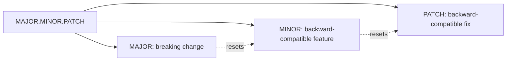
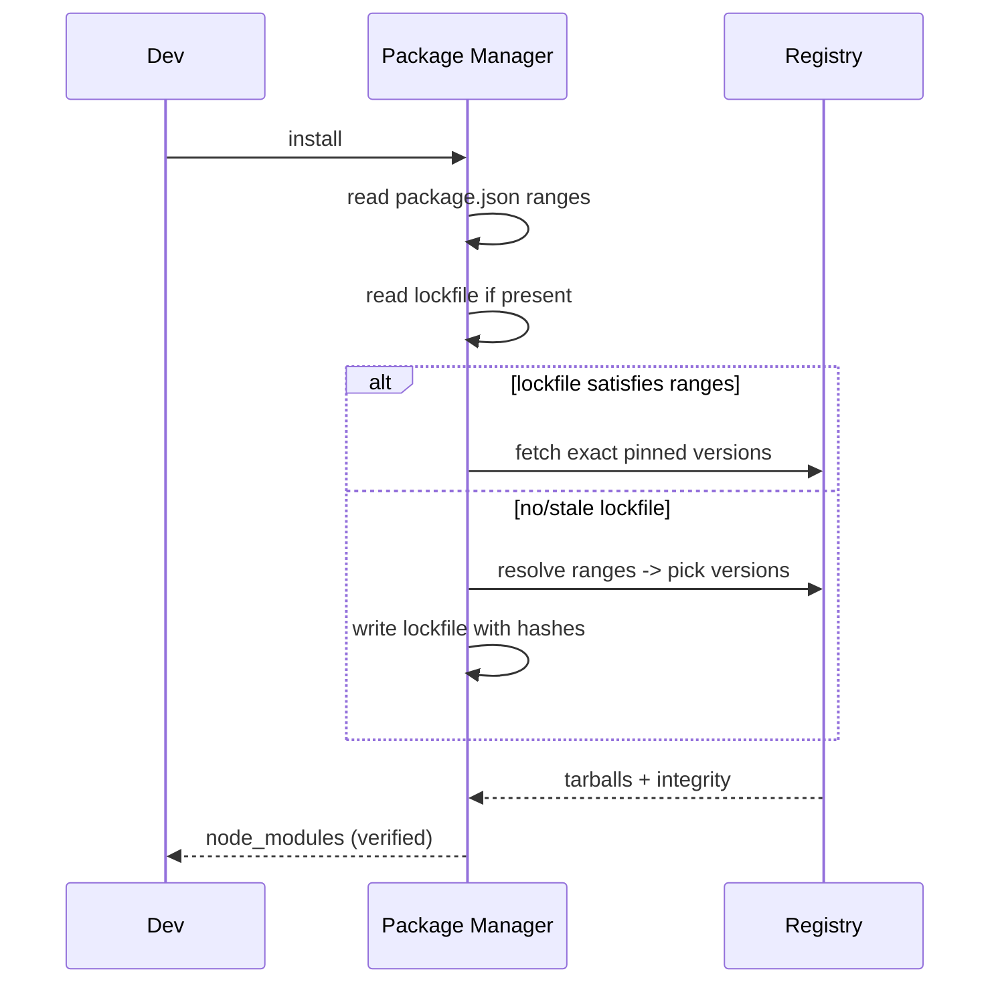
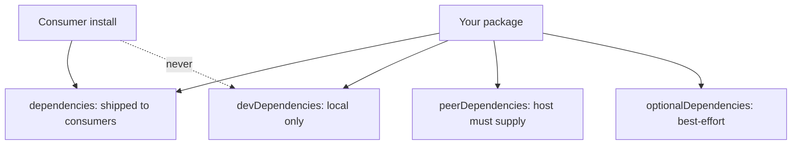
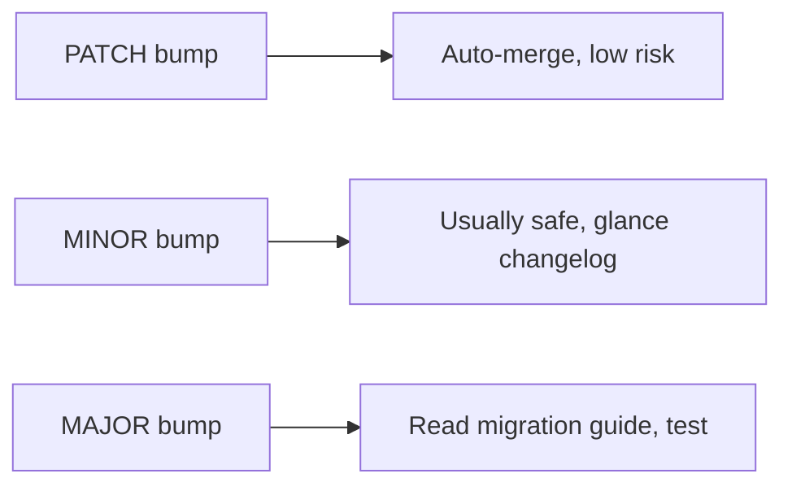

# Package JSON and Semantic Versioning

## Overview

`package.json` is the **manifest** at the root of every JavaScript package: it declares identity (`name`, `version`), the module contract (`type`, `main`, `exports`), dependencies, scripts, and publishing metadata. It is simultaneously the input to the package manager, the output contract for consumers, and the configuration surface for much of the toolchain. **Semantic Versioning (SemVer)** is the numbering discipline—`MAJOR.MINOR.PATCH`—that makes the dependency graph *predictable*: it encodes a promise about backward compatibility so that automated tools can safely upgrade transitive dependencies.

Together these define the **package contract**: what your code promises to consumers and what it depends on. This is distinct from how Node *runs* your code ([[06-NodeJS/03-Modules-and-Loading/node_modules Resolution in Practice|node_modules Resolution in Practice]]) or how a bundler packs it ([[02-JavaScript/06-Modules-and-Tooling/Bundling Tree Shaking and Code Splitting|Bundling]]). Getting version ranges and lockfiles right is the difference between reproducible builds and "works on my machine" supply-chain incidents—closely tied to [[18-Security/README|Security]] and [[16-DevOps/README|DevOps]].

## Learning Objectives

- Read and author every important `package.json` field from first principles
- Interpret SemVer ranges (`^`, `~`, exact, ranges) and their upgrade blast radius
- Explain lockfiles and reproducible installs
- Distinguish dependency types (`dependencies`, `dev`, `peer`, `optional`)
- Reason about version conflicts, hoisting, and phantom dependencies
- Connect versioning to release automation and supply-chain security

## Prerequisites

- [[02-JavaScript/06-Modules-and-Tooling/Module Resolution and Package Exports|Module Resolution and Package Exports]]
- [[02-JavaScript/06-Modules-and-Tooling/CommonJS and Interoperability|CommonJS and Interoperability]]

## Difficulty

`intermediate`

## Estimated Time

- Reading: 2 hours
- Exercises: 2–3 hours
- Mini project: 4 hours

## History

npm launched in 2010 with `package.json` as its manifest, adopting **SemVer** (formalized by Tom Preston-Werner, semver.org) to tame "dependency hell"—the state where transitive version constraints become unsatisfiable. Early npm nested every dependency, causing enormous duplicated trees; npm v3 introduced **hoisting** to flatten `node_modules`, which improved size but created **phantom dependencies** (code importing packages it never declared). Lockfiles (`package-lock.json`, then Yarn's `yarn.lock`, then pnpm's content-addressable store) closed the reproducibility gap. Today pnpm's strict, symlinked layout largely eliminates phantom deps.

## Problem It Solves

- **Dependency hell**: SemVer ranges let many packages share compatible versions instead of pinning incompatibly.
- **Non-reproducible installs**: lockfiles pin the *exact* resolved graph, including transitive deps and integrity hashes.
- **Undeclared contracts**: `exports`, `engines`, and `peerDependencies` make compatibility explicit.
- **Manual release risk**: SemVer + conventional commits enable automated, correct version bumps.

## Internal Implementation

### Anatomy of package.json

```json
{
  "name": "@acme/widget",
  "version": "2.4.1",
  "type": "module",
  "exports": { ".": "./dist/index.js" },
  "engines": { "node": ">=18" },
  "scripts": { "build": "tsup", "test": "vitest" },
  "dependencies": { "nanoid": "^5.0.0" },
  "peerDependencies": { "react": ">=18" },
  "devDependencies": { "vitest": "^2.0.0" },
  "sideEffects": false,
  "files": ["dist"]
}
```

- `dependencies`: needed at runtime by consumers; installed transitively.
- `devDependencies`: build/test-only; **not** installed for consumers of your package.
- `peerDependencies`: "the host must provide this" (e.g., a React plugin needs React) to avoid duplicate instances.
- `optionalDependencies`: install failures are non-fatal (native addons per platform).
- `files` + `.npmignore`: control the published tarball; `sideEffects` informs tree shaking.

### SemVer semantics



The contract: consumers may safely accept MINOR and PATCH upgrades; MAJOR requires review. Ranges encode how much you trust that contract:

| Range | Meaning | Allows |
| --- | --- | --- |
| `1.2.3` | Exact | Only 1.2.3 |
| `~1.2.3` | Patch-level | `>=1.2.3 <1.3.0` |
| `^1.2.3` | Compatible (caret) | `>=1.2.3 <2.0.0` |
| `^0.2.3` | Caret on 0.x | `>=0.2.3 <0.3.0` (0.x treats minor as breaking) |
| `*` / `latest` | Any | Anything (dangerous) |

The **`^0.x` special case** trips people: below 1.0.0, SemVer treats the *minor* as the breaking boundary, so `^0.2.3` does **not** allow `0.3.0`.

### Resolution and lockfiles

The manifest specifies **ranges**; the lockfile records the **exact resolved versions + integrity hashes** for the whole tree. `install` respects the lockfile (reproducible); `update` re-resolves ranges and rewrites it.



### Hoisting and phantom dependencies

Flat `node_modules` (npm/Yarn classic) means a package you didn't declare might be importable because a dependency pulled it in. This "works" until the transitive dep changes and it vanishes. **pnpm** prevents this with a symlinked, isolated layout: you can only import what you declared.

## Mermaid Diagrams

### Dependency type visibility



### Upgrade blast radius



## Examples

### Minimal Example

```json
{
  "name": "hello-cli",
  "version": "1.0.0",
  "type": "module",
  "bin": { "hello": "./bin/hello.js" },
  "dependencies": { "kleur": "^4.1.5" }
}
```

### Production-Shaped Example

A library manifest with strict publishing, engines, and provenance-friendly metadata:

```json
{
  "name": "@acme/rate-limiter",
  "version": "3.1.0",
  "description": "Token-bucket rate limiter",
  "type": "module",
  "exports": {
    ".": { "types": "./dist/index.d.ts", "import": "./dist/index.js" }
  },
  "files": ["dist", "README.md"],
  "engines": { "node": ">=18" },
  "sideEffects": false,
  "publishConfig": { "access": "public", "provenance": true },
  "peerDependencies": { "ioredis": ">=5" },
  "peerDependenciesMeta": { "ioredis": { "optional": true } },
  "scripts": {
    "build": "tsup src/index.ts --format esm --dts",
    "test": "vitest run",
    "prepublishOnly": "npm run build && npm test"
  }
}
```

For production, treat installs as a **supply-chain surface**: commit the lockfile, use `npm ci` (or `pnpm install --frozen-lockfile`) in CI for exact reproducibility, enable `provenance`, and audit dependencies (`npm audit`, Socket, Dependabot/Renovate). See [[18-Security/README|Security]] and [[16-DevOps/README|DevOps]].

## Trade-offs

| Dimension | Upside | Downside | When it matters |
| --- | --- | --- | --- |
| `^` ranges | Auto security/feature updates | Trusts publishers to honor SemVer | Apps wanting freshness |
| Exact pinning | Maximum reproducibility | Manual upgrades, stale deps | Compliance-heavy builds |
| Lockfile committed | Reproducible, auditable | Merge conflicts | All team projects |
| Hoisted node_modules | Smaller trees | Phantom dependencies | Large apps |
| pnpm strict layout | No phantom deps, fast | Occasional peer-dep friction | Monorepos |

### When to Use

- Every JS project needs a manifest; every published package needs disciplined SemVer.
- Use `peerDependencies` for plugins/frameworks to avoid duplicate instances.
- Use exact pinning for reproducible/regulated environments.

### When Not to Use

- Don't use `*`/`latest` in production dependencies.
- Don't rely on hoisting for imports you didn't declare.
- Don't publish `devDependencies` or source-only files (use `files`).

## Exercises

1. For versions `1.4.2`, `1.5.0`, `2.0.0`, decide which satisfy `^1.4.2`, `~1.4.2`, and `^0.4.2`.
2. Create a package with a `peerDependency` and observe the warning when the host omits it.
3. Delete `node_modules`, run `npm ci`, and confirm the lockfile drives an identical tree.
4. Trigger a phantom-dependency bug under npm, then reproduce the failure under pnpm.
5. Write a `prepublishOnly` script that blocks publishing if tests fail.

## Mini Project

**SemVer Range Solver**: Implement a parser/evaluator for SemVer ranges (`^`, `~`, comparators, `||`) and a resolver that, given a set of dependency ranges and available versions, picks a satisfying set or reports a conflict. Compare output against the `semver` npm package.

## Portfolio Project

Add a **dependency health dashboard** to the [[02-JavaScript/projects/JavaScript Runtime Toolkit/README|JavaScript Runtime Toolkit]]: parse the lockfile, flag outdated/duplicated/vulnerable packages, and visualize the dependency tree with upgrade blast-radius annotations.

## Interview Questions

1. What do `^`, `~`, and exact versions each allow? What's special about `^0.x`?
2. Difference between `dependencies`, `devDependencies`, and `peerDependencies`?
3. What does the lockfile guarantee that `package.json` does not?
4. What is a phantom dependency and how does pnpm prevent it?
5. Why use `npm ci` instead of `npm install` in CI?

### Stretch / Staff-Level

1. Design a monorepo versioning strategy (fixed vs independent) and justify it.
2. How would you enforce SemVer correctness automatically to prevent accidental breaking changes in a MINOR release?

## Common Mistakes

- Publishing breaking changes in a MINOR/PATCH bump, violating the SemVer contract.
- Not committing the lockfile, or using `install` instead of `ci` in CI.
- Putting runtime deps in `devDependencies` (breaks consumers) or vice versa.
- Misreading `^0.x` and expecting minor upgrades.
- Depending on hoisted phantom packages.

## Best Practices

- Commit the lockfile; use frozen/`ci` installs in CI for reproducibility.
- Follow SemVer strictly; automate releases with conventional commits + changesets.
- Use `peerDependencies` for frameworks/plugins; mark optional peers explicitly.
- Restrict published contents with `files` and set `engines` for supported runtimes.
- Continuously audit dependencies and enable provenance for supply-chain integrity.

## Summary

`package.json` is the package contract and toolchain configuration hub; SemVer is the compatibility promise that makes automated dependency management possible. Ranges (`^`, `~`, exact) tune how aggressively you accept upstream changes, while the lockfile pins the exact, integrity-verified graph for reproducibility. Mastering dependency types, hoisting/phantom-dependency behavior, and reproducible installs turns dependency management from a source of mysterious breakage into an auditable, automatable pipeline—an essential foundation for secure, operable software.

## Further Reading

- [[02-JavaScript/06-Modules-and-Tooling/Module Resolution and Package Exports|Module Resolution and Package Exports]]
- [[18-Security/README|Security]] · [[16-DevOps/README|DevOps]]
- [[00-References/JavaScript/README|JavaScript References]]
- semver.org; npm docs — *package.json*; pnpm docs — *node_modules layout*

## Related Notes

- [[02-JavaScript/06-Modules-and-Tooling/Module Resolution and Package Exports|Module Resolution and Package Exports]]
- [[02-JavaScript/06-Modules-and-Tooling/Bundling Tree Shaking and Code Splitting|Bundling Tree Shaking and Code Splitting]]
- [[02-JavaScript/code/README|JavaScript code labs]]
- [[06-NodeJS/README|Node.js]]
- [[02-JavaScript/README|JavaScript Track]]

## Progress Checklist

- [ ] Explained from first principles
- [ ] Drew at least one Mermaid diagram
- [ ] Implemented a minimal version
- [ ] Documented trade-offs and non-goals
- [ ] Completed exercises
- [ ] Practiced interview questions aloud
- [ ] Linked prerequisites and dependents
