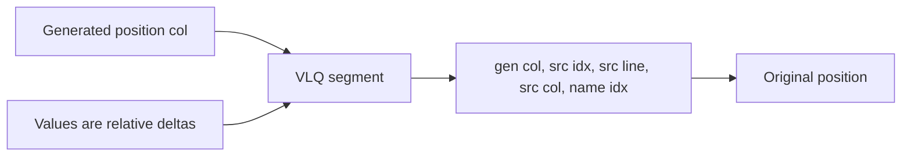
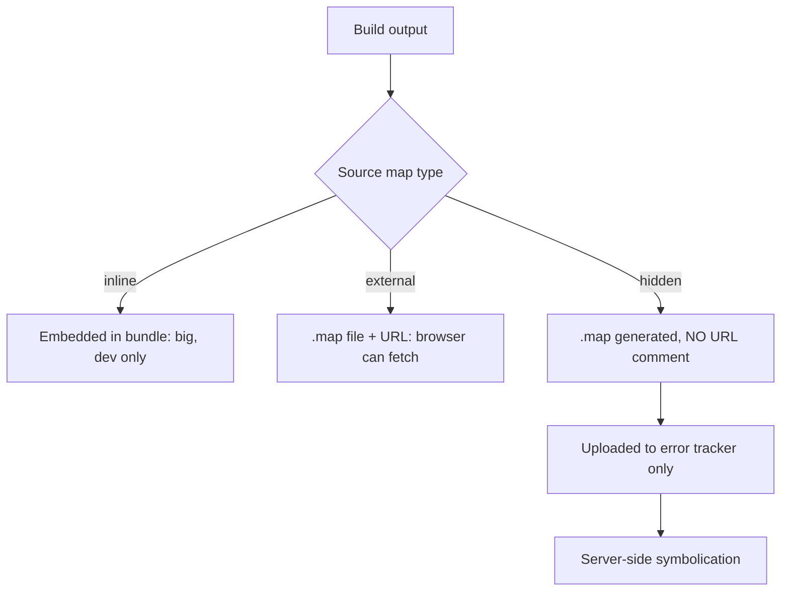
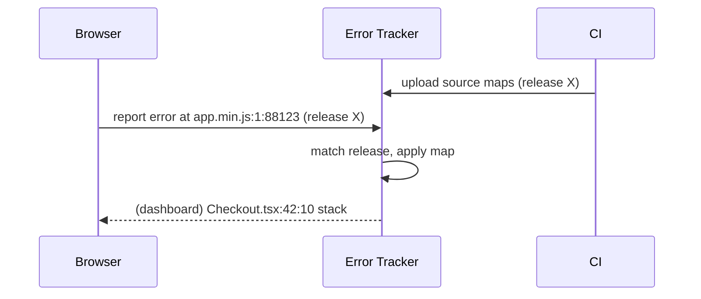
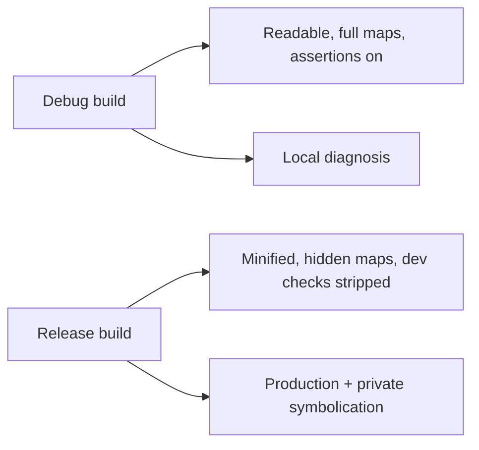

# Source Maps and Debug Builds

## Overview

A **source map** is a JSON file that describes how positions in a *generated* file (minified, bundled, transpiled output) map back to positions in the *original* source. Because production JavaScript is almost never the code you wrote—it has been transpiled ([[02-JavaScript/06-Modules-and-Tooling/Transpilation and Polyfills|Transpilation]]), tree-shaken and merged ([[02-JavaScript/06-Modules-and-Tooling/Bundling Tree Shaking and Code Splitting|Bundling]]), and minified—a stack trace pointing at `app.4f2a.js:1:88123` is useless without a way to translate it back to `Checkout.tsx:42:10`. The source map is that translation layer.

A **debug build** is a build configuration optimized for diagnosability rather than delivery: readable output, full source maps, assertions/dev-only checks enabled, and no aggressive minification. Understanding source maps is essential for [[02-JavaScript/07-Production-JavaScript/Debugging JavaScript|debugging]] and for symbolicating errors in [[02-JavaScript/07-Production-JavaScript/Observability and Operational Readiness|observability]] pipelines. It is also a **security** concern ([[18-Security/README|Security]]): source maps expose your original source, so their exposure must be controlled. Deployment of maps to error-tracking backends is a [[16-DevOps/README|DevOps]] pipeline concern.

## Learning Objectives

- Explain the source map format: `mappings`, VLQ encoding, `sources`, `names`
- Distinguish inline, external, and hidden source maps and when to use each
- Configure debug vs release builds with appropriate map types
- Symbolicate production stack traces safely
- Manage the security exposure of source maps
- Integrate map upload into CI/CD and error tracking

## Prerequisites

- [[02-JavaScript/06-Modules-and-Tooling/Bundling Tree Shaking and Code Splitting|Bundling Tree Shaking and Code Splitting]]
- [[02-JavaScript/06-Modules-and-Tooling/Transpilation and Polyfills|Transpilation and Polyfills]]

## Difficulty

`intermediate`

## Estimated Time

- Reading: 2 hours
- Exercises: 2–3 hours
- Mini project: 4 hours

## History

As minifiers (early: Closure Compiler, UglifyJS) and transpilers spread, debugging minified code became painful. The **Source Map v3** specification (2011, largely driven by Google and Mozilla) standardized a compact JSON format using **Base64 VLQ** (variable-length quantity) encoding to keep the mapping table small. Browser devtools adopted it: load a generated file, follow its `//# sourceMappingURL`, and transparently show original sources. Error-tracking services (Sentry, Bugsnag, Rollbar) built symbolication pipelines around uploaded maps, making source maps core production infrastructure, not just a dev convenience.

## Problem It Solves

- **Unreadable stack traces**: minified line/column numbers can't be reasoned about; maps restore original positions.
- **Opaque transpiled output**: async state machines and downleveled syntax bear no resemblance to source; maps bridge the gap.
- **Aggregated production errors**: without symbolication, thousands of grouped errors point at `chunk.js:1`; maps make them actionable.
- **Debugging in the browser**: devtools set breakpoints in original source thanks to maps.

## Internal Implementation

### Structure of a source map

```json
{
  "version": 3,
  "file": "app.min.js",
  "sourceRoot": "",
  "sources": ["src/checkout.ts", "src/cart.ts"],
  "sourcesContent": ["export function checkout()...", "..."],
  "names": ["checkout", "total", "applyDiscount"],
  "mappings": "AAAA,SAASA,SAAT,GAAqB;AAAE..."
}
```

- `sources`: original file paths.
- `sourcesContent`: optionally embeds the original code so the map is self-contained.
- `names`: original identifiers (restores mangled variable names).
- `mappings`: the heart—a VLQ-encoded table linking generated positions to source positions.

### The mappings field and VLQ

`mappings` is a string of semicolon-separated lines; each line has comma-separated segments. Each segment is **Base64 VLQ**-encoded and holds up to five relative integers: generated column, source index, source line, source column, and (optionally) name index. Values are **relative deltas** to the previous segment, which is why the format is compact.



### Linking a file to its map

The generated file ends with a comment:

```javascript
//# sourceMappingURL=app.min.js.map        // external file
//# sourceMappingURL=data:application/json;base64,eyJ2ZXJ...  // inline
```

Devtools/tools fetch or decode this to reconstruct positions. There is also `//# sourceURL` for naming eval'd/dynamically-generated code.

### Map delivery strategies



- **Inline**: convenient in dev; bloats the bundle—never ship to production.
- **External with URL**: browser can fetch the map; exposes source publicly.
- **Hidden** (`hidden-source-map`): generate the map but omit the `sourceMappingURL` comment, then upload it privately to your error tracker. This is the standard production pattern—full symbolication without leaking source to end users.

## Mermaid Diagrams

### Symbolication flow



### Debug vs release build



## Examples

### Minimal Example

Enable external source maps in a bundler and confirm devtools shows original source:

```javascript
// vite.config.js
export default { build: { sourcemap: true } }; // emits .map + URL comment

// tsconfig.json
{ "compilerOptions": { "sourceMap": true, "inlineSources": true } }
```

### Production-Shaped Example

Hidden maps uploaded to an error tracker, then deleted from the public bundle—full symbolication with zero public source exposure:

```javascript
// vite.config.js
export default {
  build: {
    sourcemap: "hidden", // generate .map but no //# sourceMappingURL comment
  },
};
```

```bash
# CI step: upload maps to the tracker, tagged with the release/commit
sentry-cli sourcemaps upload --release "$GIT_SHA" ./dist
# Then remove maps from the deployed artifact so they aren't public
find ./dist -name "*.map" -delete
```

Programmatic symbolication with the `source-map` library, useful for custom pipelines:

```javascript
import { SourceMapConsumer } from "source-map";

async function originalPosition(rawMap, line, column) {
  return await SourceMapConsumer.with(rawMap, null, (consumer) =>
    consumer.originalPositionFor({ line, column })
  );
}
// -> { source: "src/checkout.ts", line: 42, column: 10, name: "checkout" }
```

Operational rules: tag maps with the **exact release/commit** so errors match the right build; store maps in a private artifact store; and treat symbolication coverage as part of [[02-JavaScript/07-Production-JavaScript/Observability and Operational Readiness|operational readiness]]. A production error you cannot symbolicate is a partial outage of your debuggability.

## Trade-offs

| Dimension | Upside | Downside | When it matters |
| --- | --- | --- | --- |
| Inline maps | Self-contained, easy | Huge bundle, leaks source | Local dev only |
| External + URL | Browser debugging | Public source exposure | Internal tools/dev |
| Hidden maps | Symbolication + privacy | Extra upload step | Production apps |
| No maps | Smallest, most private | Undebuggable prod errors | Rare/security-extreme |
| `sourcesContent` embedded | Portable maps | Larger map files | Offline symbolication |

### When to Use

- Always generate maps for any transpiled/minified production build.
- Use hidden maps + private upload for public-facing apps.
- Use inline/external maps freely in development for fast debugging.

### When Not to Use

- Never ship inline maps to production.
- Avoid public external maps for proprietary source unless intentional.
- Skip maps only in extreme cases where any source disclosure is unacceptable (accept reduced debuggability).

## Exercises

1. Minify a file, open it in devtools, and confirm the map restores original line numbers.
2. Decode a small `mappings` segment by hand to recover a source position.
3. Compare bundle sizes with inline vs external vs hidden maps.
4. Use the `source-map` library to symbolicate a captured minified stack trace.
5. Configure CI to upload maps tagged by commit and then strip them from the artifact.

## Mini Project

**Stack Trace Symbolicator**: Build a CLI that takes a minified stack trace and a `.map` file and prints the original file/line/column for each frame, using the `source-map` library (or your own VLQ decoder). Support source maps with and without `sourcesContent`. Integrates with [[02-JavaScript/07-Production-JavaScript/Debugging JavaScript|Debugging JavaScript]].

## Portfolio Project

Add a **release symbolication service** to the [[02-JavaScript/projects/JavaScript Runtime Toolkit/README|JavaScript Runtime Toolkit]]: accept error reports keyed by release, resolve them against uploaded maps stored privately, and expose a small dashboard of symbolicated errors.

## Interview Questions

1. What problem do source maps solve and what does the `mappings` field contain?
2. Why is VLQ encoding used, and what are the fields of a mapping segment?
3. Difference between inline, external, and hidden source maps?
4. How does an error tracker symbolicate a production stack trace?
5. Why are source maps a security concern and how do you mitigate it?

### Stretch / Staff-Level

1. Design a CI/CD pipeline that guarantees every production release is fully symbolicatable without exposing source publicly.
2. How would you symbolicate errors across multiple chained transforms (TS → Babel → minify) that each emit maps?

## Common Mistakes

- Shipping inline maps (or public external maps) and leaking proprietary source.
- Maps not matching the deployed build (wrong release tag), producing bogus positions.
- Forgetting to generate maps at all, leaving production errors unreadable.
- Uploading maps but never deleting them from the public artifact.
- Ignoring column numbers, which are essential for minified single-line output.

## Best Practices

- Always emit source maps for transpiled/minified builds.
- Use **hidden** maps in production; upload privately to your error tracker, tagged by commit.
- Strip maps from public artifacts after upload.
- Keep debug builds separate: readable output, dev assertions, full maps.
- Verify symbolication end-to-end as part of release readiness.

## Summary

Source maps translate positions in generated code back to original source via a compact VLQ-encoded mapping table, making minified/transpiled production code debuggable. Debug builds trade delivery optimization for diagnosability. The production-correct pattern is **hidden** maps uploaded privately to an error tracker and stripped from public artifacts—preserving full symbolication while avoiding source disclosure. Because a production error you cannot symbolicate is effectively invisible, source-map hygiene is a core part of debugging, observability, and security, not an afterthought.

## Further Reading

- [[02-JavaScript/07-Production-JavaScript/Debugging JavaScript|Debugging JavaScript]]
- [[02-JavaScript/07-Production-JavaScript/Observability and Operational Readiness|Observability and Operational Readiness]]
- [[00-References/JavaScript/README|JavaScript References]]
- Source Map v3 spec; `source-map` npm package; Sentry source maps docs

## Related Notes

- [[02-JavaScript/06-Modules-and-Tooling/Bundling Tree Shaking and Code Splitting|Bundling Tree Shaking and Code Splitting]]
- [[02-JavaScript/06-Modules-and-Tooling/Transpilation and Polyfills|Transpilation and Polyfills]]
- [[02-JavaScript/code/README|JavaScript code labs]]
- [[06-NodeJS/README|Node.js]] · [[18-Security/README|Security]] · [[16-DevOps/README|DevOps]]
- [[02-JavaScript/README|JavaScript Track]]

## Progress Checklist

- [ ] Explained from first principles
- [ ] Drew at least one Mermaid diagram
- [ ] Implemented a minimal version
- [ ] Documented trade-offs and non-goals
- [ ] Completed exercises
- [ ] Practiced interview questions aloud
- [ ] Linked prerequisites and dependents
