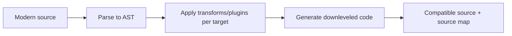
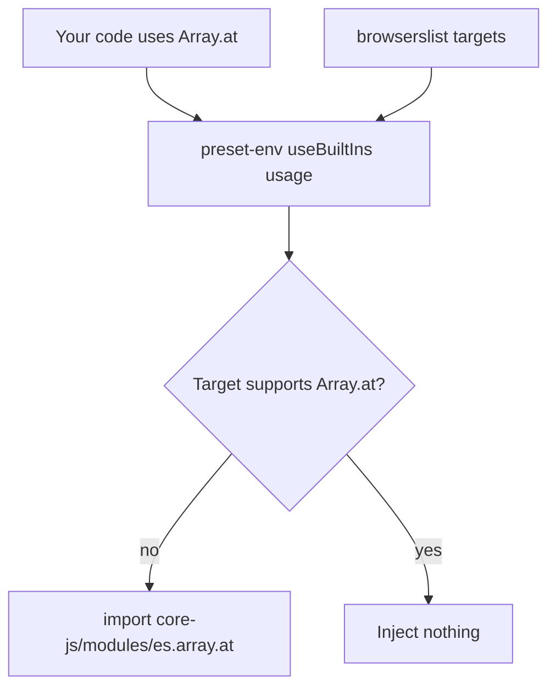
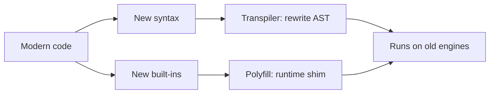
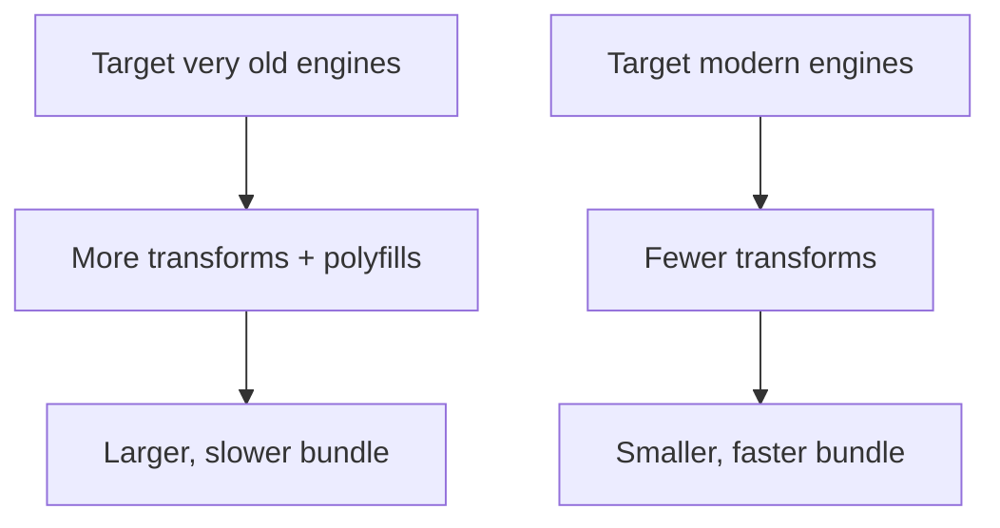

# Transpilation and Polyfills

## Overview

**Transpilation** is source-to-source compilation: transforming JavaScript (or a superset like TypeScript/JSX) written against a newer language level into an equivalent program that older engines can parse and run. A **polyfill** is a runtime shim that *implements a missing API* (e.g., `Array.prototype.flat`, `Promise`, `fetch`) so code can call it as if the engine supported it natively. The two are complementary and often confused: transpilation handles **syntax** (arrow functions, optional chaining, class fields); polyfills handle **APIs/built-ins** (methods, globals). Neither can conjure genuinely new runtime *capabilities* (you cannot polyfill real threads).

This distinction is the core mental model. Transpilation rewrites what the *parser* would reject; polyfilling supplies what the *runtime* lacks. Together they let teams write modern, expressive code while still supporting a defined range of target environments—a range you declare explicitly (via `browserslist` or engine targets) rather than guessing. This is a **build-time language concern**; how the output is packed and shipped is [[02-JavaScript/06-Modules-and-Tooling/Bundling Tree Shaking and Code Splitting|Bundling]], and mapping transformed code back to source is [[02-JavaScript/06-Modules-and-Tooling/Source Maps and Debug Builds|Source Maps]].

## Learning Objectives

- Distinguish transpilation (syntax) from polyfilling (APIs) precisely
- Explain how an AST-based transpiler transforms code
- Configure targets with `browserslist` and understand the size/compat trade-off
- Use `core-js` with `useBuiltIns: "usage"` vs global injection
- Reason about downleveling costs (async/await → state machines, generators)
- Separate build-time transforms from runtime capability limits

## Prerequisites

- [[02-JavaScript/06-Modules-and-Tooling/ES Modules|ES Modules]]
- [[02-JavaScript/04-Engines-and-Memory/Parsing AST and Bytecode|Parsing AST and Bytecode]]

## Difficulty

`intermediate`

## Estimated Time

- Reading: 2 hours
- Exercises: 3 hours
- Mini project: 5 hours

## History

The web's compatibility problem is structural: users run engines the developer cannot upgrade. Around 2011–2014, CoffeeScript popularized compile-to-JS, and **Babel** (originally "6to5", 2014) let developers write ES2015 before browsers shipped it. **core-js** provided the API polyfills. As ES evolved yearly, transpilation became permanent infrastructure. TypeScript's compiler and JSX made transpilation mandatory for typed and React codebases. Performance pressure produced faster native-code transpilers—**SWC** (Rust) and **esbuild** (Go)—that are 10–100× faster than Babel for the common cases, though Babel remains unmatched for plugin flexibility.

## Problem It Solves

- **Syntax rejection**: old engines throw `SyntaxError` on `?.`, `??`, class fields, top-level await—transpilation rewrites these.
- **Missing built-ins**: `Object.hasOwn`, `Array.prototype.at`, `structuredClone` may be absent—polyfills add them.
- **Superset languages**: TypeScript and JSX are not valid JS; a transpile step is required.
- **Feature adoption lag**: teams can use modern language features immediately without waiting for universal engine support.

## Internal Implementation

### The transpiler pipeline

A transpiler is a compiler whose target is JavaScript. It **parses** source into an AST, **transforms** the AST via plugins/visitors, and **generates** new source. Understanding [[02-JavaScript/04-Engines-and-Memory/Parsing AST and Bytecode|parsing]] makes this concrete.



### Syntax downleveling example

An arrow function and optional chaining transformed for an ES5 target:

```javascript
// Input (modern)
const getName = (user) => user?.profile?.name ?? "anon";

// Output (roughly, ES5)
var getName = function (user) {
  var _user, _user$profile;
  return (_user = user) === null || _user === void 0
    ? void 0
    : (_user$profile = _user.profile) === null || _user$profile === void 0
    ? void 0
    : _user$profile.name ?? "anon";
};
```

The verbosity shows a key trade-off: **downleveling inflates code size and can slow execution**. `async`/`await` and generators are the most expensive—they compile into **state machines** with regenerator-runtime helpers when targeting pre-ES2017 engines.

### Polyfilling: syntax vs API

```javascript
// TRANSPILATION handles this syntax:
const doubled = nums.map((n) => n * 2);

// POLYFILL is needed for this API on old engines:
const grouped = Object.groupBy(items, (i) => i.type); // ES2024 built-in
```

If the target lacks `Object.groupBy`, transpilation alone won't help—you must load a polyfill that installs the method.

### Targeted, minimal polyfills with core-js

Blindly importing all of `core-js` bloats bundles. `@babel/preset-env` with `useBuiltIns: "usage"` inspects your code and injects **only the polyfills you actually use**, filtered by your `browserslist` targets.



### What cannot be polyfilled

Polyfills approximate APIs in JS; they cannot add true engine capabilities: real parallel threads (only Workers, a host feature), genuine tail-call optimization, native BigInt performance, or new syntax at runtime. Some APIs are only *partially* fillable (e.g., `Proxy` cannot be fully polyfilled).

## Mermaid Diagrams

### Responsibility split



### Cost of downleveling targets



## Examples

### Minimal Example

`browserslist` in package.json plus a preset drives everything:

```json
{
  "browserslist": ["> 0.5%", "last 2 versions", "not dead"],
  "devDependencies": { "@babel/preset-env": "^7.24.0", "core-js": "^3.37.0" }
}
```

```javascript
// babel.config.js
module.exports = {
  presets: [["@babel/preset-env", { useBuiltIns: "usage", corejs: 3 }]],
};
```

### Production-Shaped Example

Modern differential strategy: ship a lean modern bundle to capable browsers and a transpiled fallback to legacy ones, avoiding penalizing the majority for a shrinking minority:

```javascript
// vite.config.js (conceptual)
import legacy from "@vitejs/plugin-legacy";
export default {
  plugins: [
    legacy({
      targets: ["defaults", "not IE 11"],
      renderModernChunks: true, // modern browsers get untranspiled ESM
      polyfills: true,          // legacy chunk gets core-js polyfills
    }),
  ],
};
```

For Node libraries, target the **minimum supported Node version** from `engines` rather than browsers, and often skip polyfills entirely because you control the runtime. Measure the real cost: transpiling `async`/`await` to ES5 can multiply function size and add regenerator overhead—only pay it if a target actually requires it. Validate with a `browserslist` report in CI so target drift is visible.

## Trade-offs

| Dimension | Upside | Downside | When it matters |
| --- | --- | --- | --- |
| Aggressive downleveling | Broad compatibility | Bigger, slower output | Legacy audiences |
| Modern targets only | Small, fast bundles | Excludes old engines | Modern SPAs, Node libs |
| `useBuiltIns: usage` | Minimal polyfills | Requires accurate analysis | Any polyfilled app |
| Global polyfill inject | Simple | Pollutes globals, bloat | Quick prototypes |
| SWC/esbuild | Very fast builds | Fewer exotic plugins | Large codebases |
| Babel | Max plugin flexibility | Slower | Custom transforms |

### When to Use

- Supporting a defined range of older browsers/engines.
- Compiling TypeScript/JSX (transpilation is mandatory).
- Adopting new language features before universal support.

### When Not to Use

- Targeting only modern, controlled runtimes (skip most transforms/polyfills).
- Node libraries where you can require a minimum version instead of polyfilling.
- When downleveling cost outweighs the shrinking legacy audience.

## Exercises

1. Transpile optional chaining + nullish coalescing to ES5 and inspect the generated helpers.
2. Compare bundle size with `useBuiltIns: "entry"` vs `"usage"` vs none.
3. Write code using `Array.prototype.at`; disable polyfills and run on an old target to see the failure, then re-enable.
4. Transpile an `async` function to ES5 and study the generated state machine.
5. Change `browserslist` from `last 2 versions` to include IE11 and measure the size delta.

## Mini Project

**Tiny Transpiler**: Using `acorn` to parse and `escodegen`/`astring` to generate, write a transform that downlevels arrow functions and template literals to ES5, emitting a source map. Add a report of which transforms fired. Extends [[02-JavaScript/projects/Module Loader Lab/README|Module Loader Lab]].

## Portfolio Project

Add a **compatibility budget analyzer** to the [[02-JavaScript/projects/JavaScript Runtime Toolkit/README|JavaScript Runtime Toolkit]]: given `browserslist` targets and source, report which features require transpilation/polyfills and estimate the size cost of each target choice.

## Interview Questions

1. What is the difference between transpilation and polyfilling? Give an example of each.
2. Why can't you polyfill new *syntax*? Why can't you transpile a missing *API*?
3. What does `useBuiltIns: "usage"` do and why is it preferred?
4. Why is transpiling `async/await` to ES5 expensive?
5. What role does `browserslist` play across the toolchain?

### Stretch / Staff-Level

1. Design a differential-serving strategy (modern vs legacy bundles) and its trade-offs.
2. Which language features are impossible or only partially polyfillable, and why?

## Common Mistakes

- Confusing syntax transforms with API polyfills and mis-diagnosing failures.
- Importing all of `core-js` globally, bloating bundles.
- Targeting ancient engines by default and shipping huge output to everyone.
- Forgetting polyfills for APIs while transpiling syntax (or vice versa).
- Not pinning/reviewing `browserslist`, causing silent target drift.

## Best Practices

- Declare a single source of truth for targets (`browserslist`/`engines`).
- Prefer `useBuiltIns: "usage"` with a pinned `core-js` version.
- Serve modern code to modern engines; reserve heavy transpilation for legacy chunks.
- Always emit and ship [[02-JavaScript/06-Modules-and-Tooling/Source Maps and Debug Builds|source maps]] for transpiled builds.
- Measure the size/perf cost of each target before committing to it.

## Summary

Transpilation rewrites unsupported **syntax** into equivalent older code; polyfills supply missing **APIs** at runtime. The transpiler is a real compiler—parse, transform the AST, regenerate—so downleveling has genuine size and performance costs, worst for `async`/generators. You control the trade-off by declaring targets explicitly and injecting only the polyfills you use. Crucially, some capabilities cannot be polyfilled at all. Treat transpilation/polyfilling as a deliberate compatibility budget, not an always-on default, and you ship modern code without punishing modern users.

## Further Reading

- [[02-JavaScript/06-Modules-and-Tooling/Bundling Tree Shaking and Code Splitting|Bundling Tree Shaking and Code Splitting]]
- [[02-JavaScript/06-Modules-and-Tooling/Source Maps and Debug Builds|Source Maps and Debug Builds]]
- [[00-References/JavaScript/README|JavaScript References]]
- Babel docs — *preset-env*; core-js README; browserslist docs; SWC/esbuild docs

## Related Notes

- [[02-JavaScript/06-Modules-and-Tooling/ES Modules|ES Modules]]
- [[02-JavaScript/04-Engines-and-Memory/Parsing AST and Bytecode|Parsing AST and Bytecode]]
- [[02-JavaScript/code/README|JavaScript code labs]]
- [[06-NodeJS/README|Node.js]]
- [[02-JavaScript/README|JavaScript Track]]

## Progress Checklist

- [ ] Explained from first principles
- [ ] Drew at least one Mermaid diagram
- [ ] Implemented a minimal version
- [ ] Documented trade-offs and non-goals
- [ ] Completed exercises
- [ ] Practiced interview questions aloud
- [ ] Linked prerequisites and dependents
