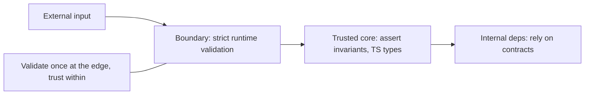
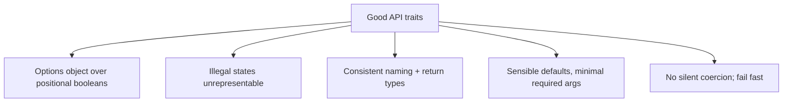
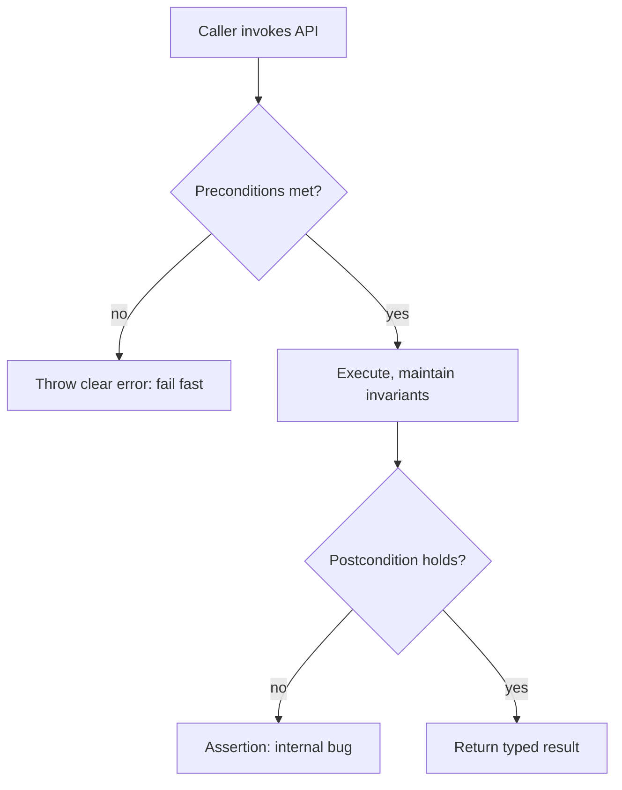
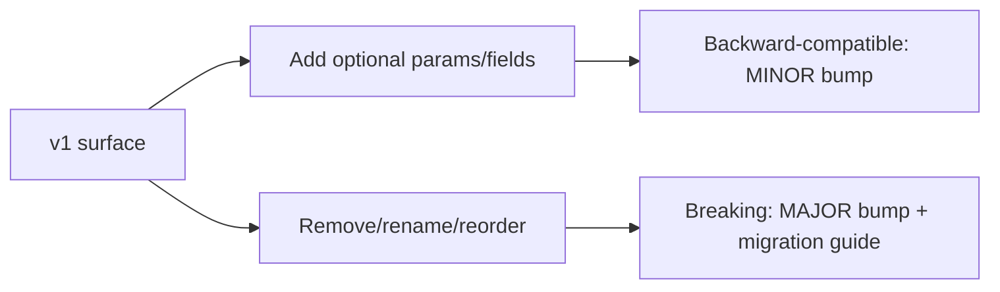

# API Design and Defensive Programming

## Overview

An **API (Application Programming Interface)** is a contract: it defines what a caller may provide, what they will receive, and what guarantees hold in between. In this note "API" means both the **in-process contracts** of a JavaScript function, class, or module and the **package-level surface** a library exposes to its consumers—not primarily HTTP/network API design, which is elaborated in [[07-Backend/README|Backend]]. Good API design minimizes the ways a caller can hold it wrong and makes correct usage the path of least resistance.

**Defensive programming** is the complementary discipline of not trusting callers or data: validating inputs at trust boundaries, enforcing invariants, and failing fast and clearly when contracts are violated. The central tension is *where* to be defensive. Robertson's/Postel's "be liberal in what you accept" is often misapplied; modern practice favors **strict validation at boundaries** and **strict contracts internally**, because permissive parsing hides bugs and creates security holes. This builds on [[02-JavaScript/07-Production-JavaScript/Error Design and Exception Safety|error design]], leans on [[02-JavaScript/07-Production-JavaScript/TypeScript Interoperability|TypeScript + runtime validation]], and connects to [[02-JavaScript/07-Production-JavaScript/Secure JavaScript Practices|security]].

## Learning Objectives

- Design function/module/library APIs that are hard to misuse
- Validate inputs at trust boundaries and enforce invariants internally
- Apply design-by-contract: preconditions, postconditions, invariants
- Design for idempotency, backward compatibility, and evolution
- Choose parameter shapes, defaults, and return types deliberately
- Balance defensiveness against noise and performance

## Prerequisites

- [[02-JavaScript/07-Production-JavaScript/Error Design and Exception Safety|Error Design and Exception Safety]]
- [[02-JavaScript/07-Production-JavaScript/TypeScript Interoperability|TypeScript Interoperability]]
- [[02-JavaScript/07-Production-JavaScript/Secure JavaScript Practices|Secure JavaScript Practices]]

## Difficulty

`advanced`

## Estimated Time

- Reading: 3 hours
- Exercises: 3–4 hours
- Mini project: 5 hours

## History

Design-by-contract was formalized in **Eiffel** (Bertrand Meyer, 1980s): preconditions, postconditions, and invariants as first-class. **Postel's Law** ("be conservative in what you send, liberal in what you accept") shaped early internet protocols but has since been criticized for propagating ambiguity and security issues. Joshua Bloch's *How to Design a Good API and Why It Matters* (2006) codified library-design wisdom: make APIs easy to use correctly and hard to use incorrectly. In JavaScript, the dynamic type system made defensive input handling essential; the rise of TypeScript plus runtime schema validation (`zod`) gave teams practical tools to enforce contracts at both compile and run time.

## Problem It Solves

- **Misuse-prone APIs**: confusing parameters and silent coercion cause caller bugs that surface far away.
- **Invalid state**: unvalidated input propagates deep into the system before failing cryptically.
- **Breaking changes**: poorly-designed surfaces force churn on every consumer when they evolve.
- **Non-idempotent operations**: retries (inevitable in distributed systems) cause duplicate side effects.
- **Security exposure**: permissive parsing enables injection and pollution.

## Internal Implementation

### Design by contract

Every function has an implicit contract. Making it explicit clarifies responsibility:

- **Precondition**: what must be true of inputs (caller's responsibility).
- **Postcondition**: what the function guarantees on return (callee's responsibility).
- **Invariant**: what stays true throughout an object's lifetime.

```javascript
class BankAccount {
  #balance = 0;
  deposit(amount) {
    // Precondition: fail fast on contract violation (programmer error)
    if (!Number.isFinite(amount) || amount <= 0)
      throw new RangeError("deposit amount must be a positive finite number");
    this.#balance += amount;
    // Invariant: balance never negative
    return this.#balance; // postcondition: returns new balance
  }
}
```

### Where to validate: boundaries vs internals



Validate **untrusted** input strictly at the boundary (parse into known-good types). Inside the trusted core, use lightweight **assertions** for invariants (catch programmer errors) rather than re-validating everything—over-validation adds noise and cost. This mirrors the security trust-boundary model.

### Making APIs hard to misuse



```javascript
// Misuse-prone: what do these booleans mean at the call site?
createUser("Ada", true, false, true);

// Hard to misuse: named options, defaults, self-documenting
createUser({ name: "Ada", admin: true, sendEmail: false, verified: true });
```

Prefer making **illegal states unrepresentable**: a discriminated union or separate constructors beats a single object with mutually-exclusive optional fields.

### Idempotency and safe evolution

Retries are unavoidable, so mutating operations should be **idempotent**—applying them twice equals applying them once—via idempotency keys or natural upserts.

```javascript
async function chargeOnce(idempotencyKey, amount) {
  const existing = await charges.findByKey(idempotencyKey);
  if (existing) return existing;                  // safe replay
  return charges.create({ idempotencyKey, amount });
}
```

For **evolution**, add optional parameters (never reorder/remove), widen inputs and narrow outputs cautiously, and version breaking changes per [[02-JavaScript/06-Modules-and-Tooling/Package JSON and Semantic Versioning|SemVer]]. Deprecate with warnings before removal.

## Mermaid Diagrams

### Contract enforcement flow



### API evolution without breakage



## Examples

### Minimal Example

```javascript
// Fail fast, no silent coercion, clear message
function slice(arr, start, end) {
  if (!Array.isArray(arr)) throw new TypeError("arr must be an array");
  if (!Number.isInteger(start) || start < 0)
    throw new RangeError("start must be a non-negative integer");
  return arr.slice(start, end);
}
```

### Production-Shaped Example

A library-facing function with a validated options object, sensible defaults, contract checks, and a typed, stable return—illustrating "hard to misuse" plus boundary validation:

```typescript
import { z } from "zod";

const RetryOptions = z.object({
  retries: z.number().int().min(0).max(10).default(3),
  baseDelayMs: z.number().int().positive().default(100),
  signal: z.instanceof(AbortSignal).optional(),
});
type RetryOptions = z.input<typeof RetryOptions>;

export async function withRetry<T>(
  fn: () => Promise<T>,
  options: RetryOptions = {},
): Promise<T> {
  const { retries, baseDelayMs, signal } = RetryOptions.parse(options); // boundary validation
  let attempt = 0;
  for (;;) {
    try {
      return await fn();
    } catch (err) {
      if (signal?.aborted) throw err;
      if (attempt++ >= retries || !isRetryable(err)) throw err; // clear contract
      const delay = baseDelayMs * 2 ** (attempt - 1) + Math.random() * baseDelayMs;
      await sleep(delay, signal);
    }
  }
}
```

Design guidance: keep the **required** surface minimal, defaults safe, and naming consistent; return **stable shapes** (don't leak internal objects); document preconditions and thrown errors; and enforce idempotency + cancellation for anything doing I/O. Pair compile-time TypeScript contracts with runtime validation at the edge, and cover the contract with [[02-JavaScript/07-Production-JavaScript/Testing JavaScript|tests]] (including misuse cases).

## Trade-offs

| Dimension | Upside | Downside | When it matters |
| --- | --- | --- | --- |
| Strict boundary validation | Catches bad input early | Some latency/boilerplate | Public/edge APIs |
| Internal assertions | Find bugs fast | Runtime cost if excessive | Critical invariants |
| Options object | Extensible, readable | Slightly more verbose | 3+ params, booleans |
| Idempotency | Safe retries | Storage/key management | Distributed writes |
| Fail-fast | No corrupt state | More thrown errors | Contract violations |

### When to Use

- Public library/module surfaces and any code reused by others.
- All boundaries receiving external/untrusted data (strict validation).
- Mutating operations in distributed/retried contexts (idempotency).

### When Not to Use

- Don't re-validate trusted internal calls on every hop (assert instead).
- Don't add excessive defensive checks to hot internal paths without measuring.
- Don't over-generalize APIs speculatively; design for real, known needs.

## Exercises

1. Refactor a positional-boolean API into a validated options object with defaults.
2. Add precondition/postcondition checks to a function and test both violation paths.
3. Make a mutating operation idempotent using an idempotency key.
4. Evolve an API by adding an optional field without breaking existing callers; then attempt a breaking change and version it.
5. Design a type/discriminated union so an illegal combination of fields cannot be constructed.

## Mini Project

**Contract Kit**: Build small helpers for design-by-contract in JS (`precondition`, `postcondition`, `invariant`) plus a boundary-validation wrapper that parses inputs with a schema and emits typed results and structured errors. Cross-link to [[02-JavaScript/07-Production-JavaScript/Error Design and Exception Safety|Error Design and Exception Safety]].

## Portfolio Project

Add an **API surface linter** to the [[02-JavaScript/projects/JavaScript Runtime Toolkit/README|JavaScript Runtime Toolkit]]: detect misuse-prone signatures (boolean params, missing validation at exported boundaries), check backward compatibility against a previous version, and suggest SemVer bumps.

## Interview Questions

1. What are preconditions, postconditions, and invariants?
2. Where should you validate strictly and where should you rely on contracts? Why?
3. Why is Postel's Law dangerous when over-applied?
4. What makes an API hard to misuse? Give concrete techniques.
5. Why does idempotency matter, and how do you implement it?

### Stretch / Staff-Level

1. Design an evolution strategy for a widely-used library API across several MAJOR versions.
2. How do compile-time types and runtime validation together enforce an API contract, and where does each fall short?

## Common Mistakes

- Positional boolean parameters and silent coercion that hide caller errors.
- Validating untrusted input deep in the system instead of at the boundary.
- Over-validating trusted internal calls, adding noise and cost.
- Non-idempotent mutating operations that break under retries.
- Breaking API changes shipped without a MAJOR bump or migration path.

## Best Practices

- Make correct usage easy and illegal states unrepresentable.
- Validate untrusted input strictly at boundaries; assert invariants internally.
- Fail fast with clear, actionable errors; never silently coerce.
- Design mutating operations to be idempotent and cancellable.
- Evolve additively; version breaking changes and document migrations; cover contracts with tests.

## Summary

An API is a contract, and good design makes that contract easy to honor and hard to violate—minimal required inputs, safe defaults, consistent shapes, and illegal states made unrepresentable. Defensive programming enforces the contract by validating untrusted input strictly at boundaries while relying on lightweight assertions internally, failing fast on violations rather than corrupting state. Designing for idempotency and additive evolution keeps systems safe under retries and change. Combined with TypeScript, runtime validation, error design, and tests, these practices produce interfaces that are robust, secure, and durable as they grow.

## Further Reading

- [[07-Backend/README|Backend]] (HTTP/REST API design)
- [[02-JavaScript/07-Production-JavaScript/Secure JavaScript Practices|Secure JavaScript Practices]]
- [[00-References/JavaScript/README|JavaScript References]]
- Joshua Bloch — *How to Design a Good API*; Bertrand Meyer — *Design by Contract*

## Related Notes

- [[02-JavaScript/07-Production-JavaScript/Error Design and Exception Safety|Error Design and Exception Safety]]
- [[02-JavaScript/07-Production-JavaScript/TypeScript Interoperability|TypeScript Interoperability]]
- [[02-JavaScript/code/README|JavaScript code labs]]
- [[06-NodeJS/README|Node.js]] · [[07-Backend/README|Backend]] · [[18-Security/README|Security]]
- [[02-JavaScript/README|JavaScript Track]]

## Progress Checklist

- [ ] Explained from first principles
- [ ] Drew at least one Mermaid diagram
- [ ] Implemented a minimal version
- [ ] Documented trade-offs and non-goals
- [ ] Completed exercises
- [ ] Practiced interview questions aloud
- [ ] Linked prerequisites and dependents
