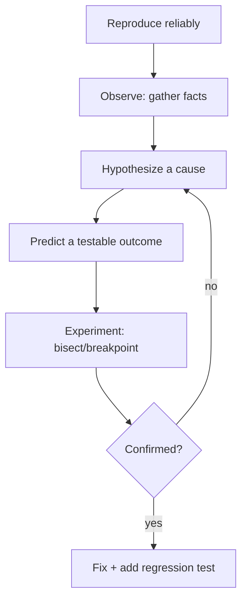
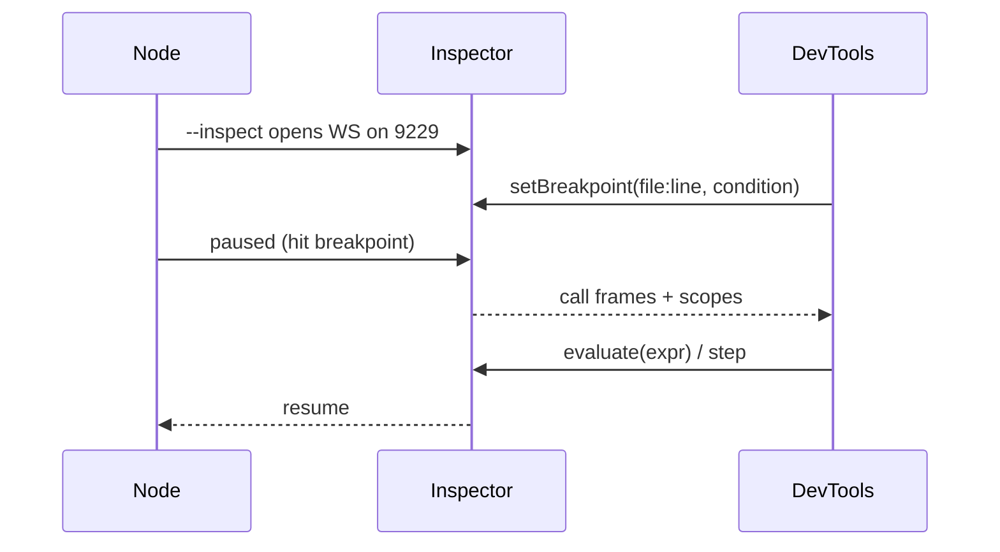
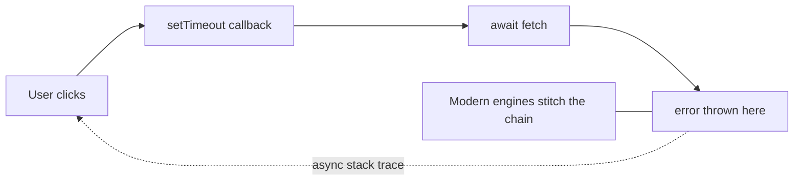
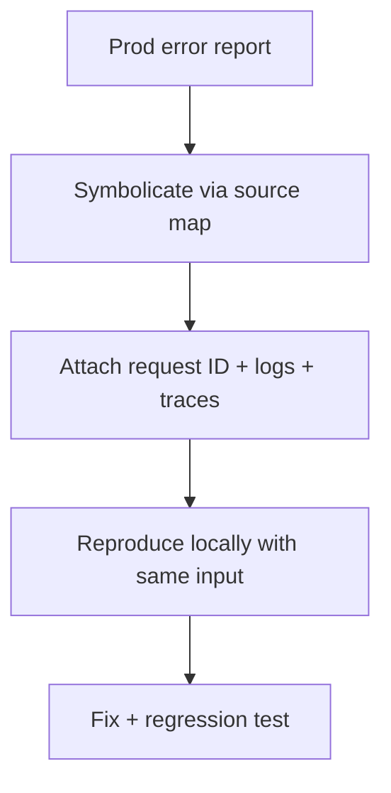

# Debugging JavaScript

## Overview

Debugging is the disciplined process of **reducing the distance between a symptom and its cause**. It is not random `console.log` sprinkling; it is the scientific method applied to software: form a hypothesis about why the observed behavior differs from the expected, design an observation that would confirm or refute it, and narrow the search space until the root cause is isolated. In JavaScript this requires fluency with a specific toolset—the V8 Inspector protocol, breakpoints, the call stack, async stack traces, and heap/CPU profilers—because the language's asynchronous, dynamically-typed, garbage-collected nature makes many bugs non-local in space and time.

Effective debugging depends on **reproducibility** and **observability**: a bug you can reproduce is nearly solved, and production bugs you cannot reproduce require the telemetry from [[02-JavaScript/07-Production-JavaScript/Observability and Operational Readiness|Observability]] and the symbolication from [[02-JavaScript/06-Modules-and-Tooling/Source Maps and Debug Builds|Source Maps]]. This note covers debugging *JavaScript programs*; debugging live server infrastructure extends into [[07-Backend/README|Backend]] and [[16-DevOps/README|DevOps]]. Every non-trivial bug should be captured in a [[00-Templates/Debug Diary Template|Debug Diary]] entry.

## Learning Objectives

- Apply a systematic, hypothesis-driven debugging method
- Use breakpoints (conditional, logpoints, DOM, XHR) instead of ad-hoc logging
- Read call stacks and async stack traces to locate origins
- Diagnose memory leaks with heap snapshots and CPU issues with profiles
- Debug transpiled/minified production code via source maps
- Prevent recurrence by encoding root causes as tests

## Prerequisites

- [[02-JavaScript/07-Production-JavaScript/Error Design and Exception Safety|Error Design and Exception Safety]]
- [[02-JavaScript/06-Modules-and-Tooling/Source Maps and Debug Builds|Source Maps and Debug Builds]]
- [[02-JavaScript/04-Engines-and-Memory/Memory Leaks and Retention|Memory Leaks and Retention]]

## Difficulty

`intermediate`

## Estimated Time

- Reading: 2 hours
- Exercises: 3–4 hours
- Mini project: 4 hours

## History

Early JS debugging meant `alert()`. **Firebug** (2006) introduced an in-browser inspector, console, and debugger, revolutionizing web development. Chrome DevTools and the standardized **Chrome DevTools Protocol (CDP)** followed, and V8 exposed the **Inspector protocol** so the *same* debugger works for Node (`node --inspect`) and browsers. Async debugging long suffered because callbacks lost their originating stack; modern engines added **async stack traces** that stitch the chain together. Heap snapshots and the sampling CPU profiler turned memory/perf debugging from guesswork into measurement.

## Problem It Solves

- **Non-local bugs**: async and event-driven code separates cause from effect in time; stack tools reconnect them.
- **Invisible state**: `console.log` can't inspect live object graphs, closures, or the heap; debuggers can.
- **Minified production errors**: raw stack traces are unreadable without source maps.
- **Resource leaks**: memory growth and CPU spikes need profilers, not intuition.
- **Recurrence**: undocumented fixes get reintroduced; captured root causes prevent regressions.

## Internal Implementation

### The systematic method



The key move is **binary search over the search space**: bisect commits (`git bisect`), bisect data (which input triggers it), bisect code paths (breakpoints halving the region). Each observation should eliminate roughly half the remaining possibilities.

### How debuggers work

`node --inspect` opens a WebSocket speaking the Inspector protocol; DevTools connects and can set breakpoints, pause execution, read scopes, and evaluate expressions in the paused frame. A breakpoint is an instruction to the engine to yield control at a location; because the engine controls execution, the debugger sees real live values—closures, `this`, the full scope chain—not serialized snapshots.



### Breakpoint types (beyond console.log)

- **Conditional breakpoints**: pause only when `user.id === 42`, avoiding thousands of manual continues.
- **Logpoints**: print an expression without editing source—non-invasive logging.
- **DOM/XHR/event breakpoints**: pause when an element mutates or a request fires.
- **`debugger;` statement**: hard breakpoint in code.

Logpoints and conditional breakpoints replace most `console.log` debugging and don't risk being committed.

### Memory and CPU profiling


For leaks, take snapshots before/after a repeated operation and diff to find objects that should have been collected; follow **retainer paths** to the reference keeping them alive (often a forgotten listener, closure, or cache—see [[02-JavaScript/04-Engines-and-Memory/Memory Leaks and Retention|Memory Leaks and Retention]]). For CPU, capture a sampling profile and read the flame graph to find hot functions.

## Mermaid Diagrams

### Async stack reconstruction



### Production debugging path



## Examples

### Minimal Example

```javascript
function totalPrice(items) {
  let sum = 0;
  for (const item of items) {
    // Conditional breakpoint in DevTools: `item.price == null`
    sum += item.price * item.qty;
  }
  return sum;
}
// A NaN result? Pause when item.price is null to see the bad record.
```

Attach the debugger to Node:

```bash
node --inspect-brk ./src/server.js   # pause on first line, then open chrome://inspect
```

### Production-Shaped Example

A minimal, structured production diagnostic that ties an error to a correlation ID and a symbolicated stack, so the same failure can be reproduced locally—bridging [[02-JavaScript/07-Production-JavaScript/Observability and Operational Readiness|observability]] and debugging:

```javascript
process.on("uncaughtException", (err) => {
  logger.fatal("uncaught_exception", {
    requestId: als.getStore()?.requestId,   // AsyncLocalStorage correlation
    name: err.name,
    message: err.message,
    stack: err.stack,        // symbolicated server-side via source maps
  });
  // programmer error: exit and let orchestrator restart cleanly
  process.exit(1);
});

// On-demand profiling in production without a redeploy:
// kill -USR2 <pid>  ->  node writes a heap snapshot / CPU profile
```

Rules that make production debugging tractable: propagate a **correlation ID** through every log/span, keep **hidden source maps** uploaded for symbolication, capture **heap/CPU profiles on demand** (Inspector or signal handlers), and write a [[00-Templates/Debug Diary Template|Debug Diary]] entry so the root cause becomes institutional knowledge and a regression test.

## Trade-offs

| Dimension | Upside | Downside | When it matters |
| --- | --- | --- | --- |
| Debugger/breakpoints | Live state, precise | Interactive, not for prod loops | Local repro |
| console/logpoints | Fast, low setup | Noise, misses object graphs | Quick checks |
| Heap snapshots | Finds true retainers | Large, pause impact | Memory leaks |
| CPU profiling | Finds hot paths | Sampling blind spots | Perf issues |
| Production profiling | Real-world data | Overhead, security care | Non-reproducible bugs |

### When to Use

- Breakpoints/logpoints for reproducible local bugs.
- Heap snapshots for suspected leaks; CPU profiles for latency/throughput issues.
- On-demand production profiling for bugs that only appear at scale.

### When Not to Use

- Don't debug in production interactively (pausing halts real traffic).
- Don't rely on `console.log` for complex state or memory issues.
- Don't ship `debugger;` statements or verbose debug logs to production.

## Exercises

1. Set a conditional breakpoint to catch only the iteration that produces `NaN`.
2. Use a logpoint to observe a value without modifying source; confirm nothing is committed.
3. Reproduce a memory leak (unbounded cache), diff two heap snapshots, and find the retainer path.
4. Capture a CPU profile of a slow function and identify the hot path in the flame graph.
5. Symbolicate a minified production stack trace using its source map.

## Mini Project

**Bug Bisector**: Build a CLI that automates `git bisect run` against a failing test, reports the first bad commit, and generates a Debug Diary skeleton pre-filled with the diff and failing assertion. Cross-link to [[02-JavaScript/07-Production-JavaScript/Testing JavaScript|Testing JavaScript]].

## Portfolio Project

Add a **live diagnostics endpoint** to the [[02-JavaScript/projects/JavaScript Runtime Toolkit/README|JavaScript Runtime Toolkit]]: secure, on-demand heap snapshot and CPU profile capture with correlation-ID-tagged logs, plus a viewer for retainer paths and flame graphs.

## Interview Questions

1. Describe a systematic debugging method and the role of bisection.
2. How does a debugger read live scope while `console.log` cannot?
3. What are conditional breakpoints and logpoints, and why prefer them?
4. How do you find a memory leak with heap snapshots?
5. How do you debug a minified production stack trace?

### Stretch / Staff-Level

1. Design a strategy for debugging a bug that only reproduces under production load.
2. How would you attribute a slow request across async boundaries and multiple services?

## Common Mistakes

- Debugging by random `console.log` instead of forming hypotheses.
- Not establishing reliable reproduction before attempting fixes.
- Ignoring async stack traces and missing the true origin.
- Confusing high memory (normal GC behavior) with an actual leak.
- Fixing the symptom without a regression test, so it returns.

## Best Practices

- Reproduce first; bisect the search space systematically.
- Prefer conditional breakpoints/logpoints over committed logs.
- Use heap snapshots and CPU profiles for memory/perf, not guesswork.
- Propagate correlation IDs and keep source maps for production symbolication.
- Document each real bug in a Debug Diary and lock it down with a test.

## Summary

Debugging is applied science: reproduce, observe, hypothesize, and bisect until cause meets effect. JavaScript's async, dynamic, GC'd nature makes tooling essential—the Inspector protocol gives you live scopes and breakpoints locally, heap snapshots and CPU profiles turn memory/latency mysteries into measurements, and source maps make production stack traces readable. The discipline is to work systematically, capture root causes as regression tests and Debug Diary entries, and rely on observability for the bugs you cannot reproduce on your machine.

## Further Reading

- [[02-JavaScript/07-Production-JavaScript/Observability and Operational Readiness|Observability and Operational Readiness]]
- [[02-JavaScript/06-Modules-and-Tooling/Source Maps and Debug Builds|Source Maps and Debug Builds]]
- [[00-References/JavaScript/README|JavaScript References]]
- Chrome DevTools docs; Node.js *Debugging* guide; V8 Inspector protocol

## Related Notes

- [[02-JavaScript/07-Production-JavaScript/Error Design and Exception Safety|Error Design and Exception Safety]]
- [[02-JavaScript/04-Engines-and-Memory/Memory Leaks and Retention|Memory Leaks and Retention]]
- [[02-JavaScript/code/README|JavaScript code labs]]
- [[06-NodeJS/08-Diagnostics-and-Performance/Inspector CPU Profiling and Heap Snapshots|Inspector CPU Profiling and Heap Snapshots]] · [[06-NodeJS/README|Node.js]] · [[07-Backend/README|Backend]] · [[16-DevOps/README|DevOps]]
- [[02-JavaScript/README|JavaScript Track]]

## Progress Checklist

- [ ] Explained from first principles
- [ ] Drew at least one Mermaid diagram
- [ ] Implemented a minimal version
- [ ] Documented trade-offs and non-goals
- [ ] Completed exercises
- [ ] Practiced interview questions aloud
- [ ] Linked prerequisites and dependents
