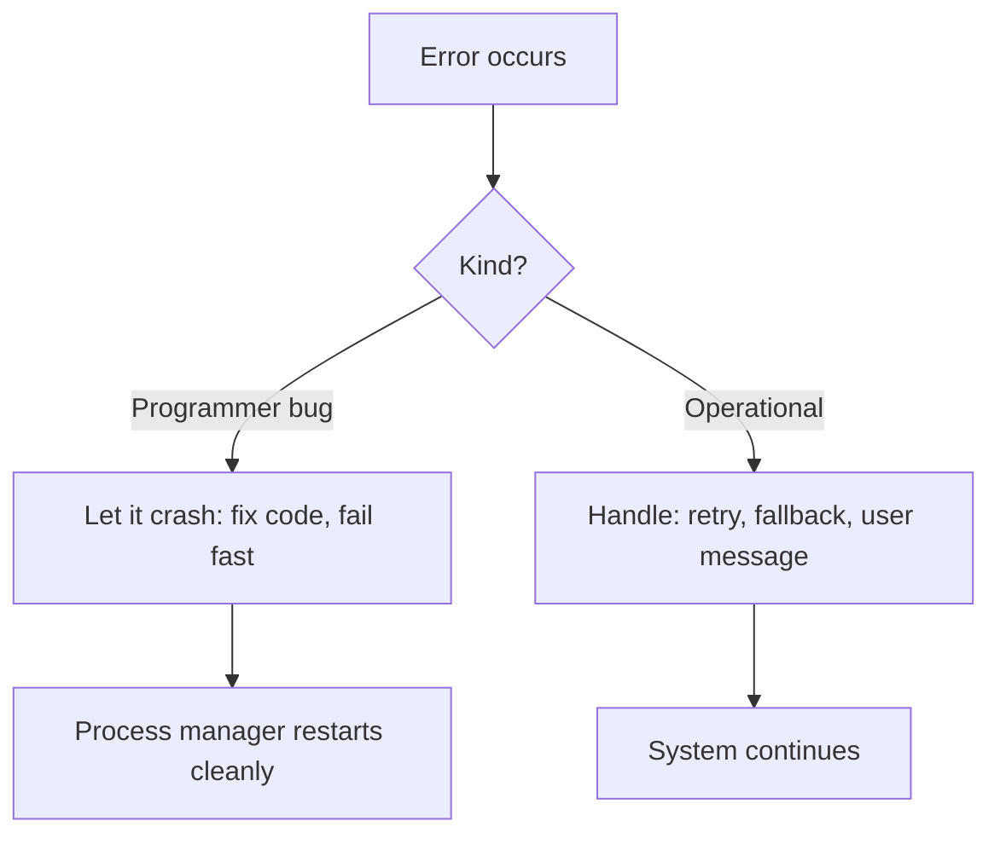
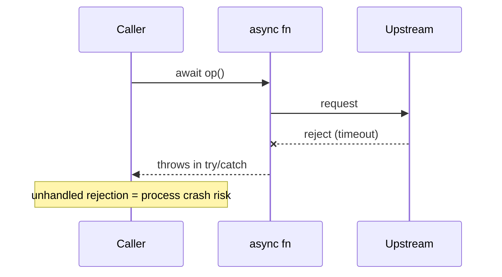
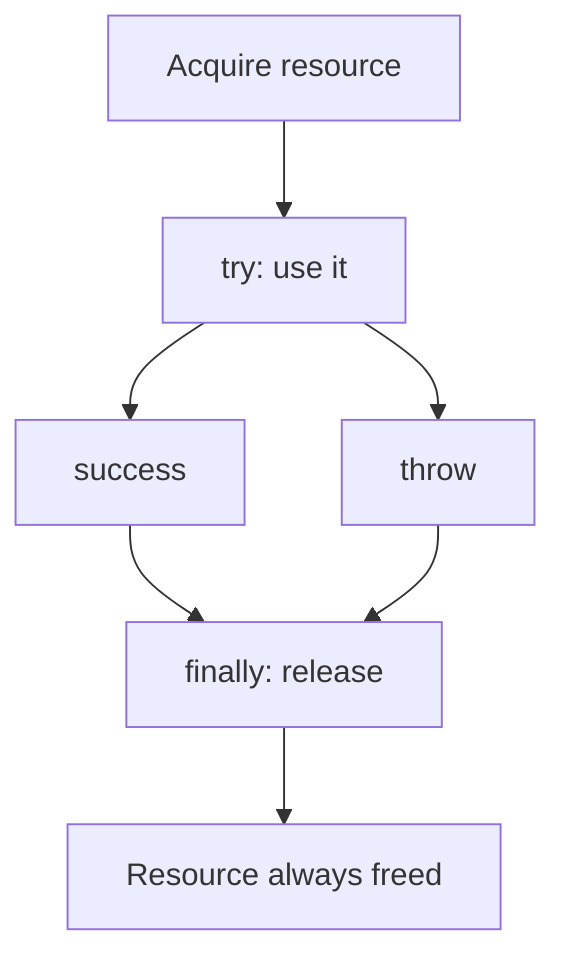

# Error Design and Exception Safety

## Overview

Error design is the deliberate engineering of how a program **represents, propagates, and recovers from failure**. In JavaScript this is unusually subtle: `throw` can raise *any* value (not just `Error`), errors cross synchronous and asynchronous boundaries with different mechanics, and a single unhandled rejection can crash a Node process. **Exception safety** is the property that, when an operation fails, your program is left in a well-defined, consistent state—no half-updated data, no leaked resources, no silently swallowed failures.

Good error design treats failures as **part of the API contract**, not accidents. It distinguishes **programmer errors** (bugs: `TypeError`, null access—should crash loudly in dev) from **operational errors** (expected runtime conditions: network timeouts, invalid input—should be handled). This note covers the *language-level* discipline of errors; how those errors surface to clients is [[02-JavaScript/07-Production-JavaScript/API Design and Defensive Programming|API Design]], and how they become alerts and metrics is [[02-JavaScript/07-Production-JavaScript/Observability and Operational Readiness|Observability]]. Async error mechanics build on [[02-JavaScript/05-Async-and-Concurrency/Errors Across Async Boundaries|Errors Across Async Boundaries]].

## Learning Objectives

- Distinguish programmer errors from operational errors and handle each correctly
- Design custom error hierarchies with `Error`, `cause`, and typed metadata
- Achieve exception safety: strong, basic, and no-throw guarantees
- Handle errors across sync, promise, and async/await boundaries
- Avoid error anti-patterns: swallowing, string-throwing, over-catching
- Connect error design to APIs, retries, and observability

## Prerequisites

- [[02-JavaScript/05-Async-and-Concurrency/Errors Across Async Boundaries|Errors Across Async Boundaries]]
- [[02-JavaScript/03-Objects-and-Metaprogramming/Classes and Private Fields|Classes and Private Fields]]
- [[02-JavaScript/05-Async-and-Concurrency/Promises Internals|Promises Internals]]

## Difficulty

`advanced`

## Estimated Time

- Reading: 2–3 hours
- Exercises: 3 hours
- Mini project: 5 hours

## History

Structured exception handling (`try`/`catch`) descends from Lisp and Ada, refined in C++ and Java. JavaScript inherited `try`/`catch`/`finally` and the `Error` object early, but async made it messy: callbacks used the **error-first** convention (`(err, result) => ...`), which made errors easy to ignore. Promises reified errors as rejections; `async`/`await` restored `try`/`catch` ergonomics. Key modern additions: **`Error.cause`** (ES2022) for error chaining, **`AggregateError`** (ES2021) for `Promise.any`, and the recognition (popularized by Node's error taxonomy and Joyent's "Error Handling in Node.js") that conflating bugs with expected failures is the root of unreliable systems.

## Problem It Solves

- **Undefined failure states**: without discipline, a failed operation may leave data half-written or resources leaked.
- **Lost context**: rethrowing a generic error discards the original cause and stack.
- **Silent failures**: swallowed errors turn crashes into invisible data corruption.
- **Misclassified errors**: treating bugs as recoverable (or vice versa) produces zombie processes or needless crashes.
- **Untyped failures**: callers can't branch on failure kind without structured error types.

## Internal Implementation

### The Error object and throwing anything

`throw` accepts any value, but you should always throw `Error` instances—they carry a `stack`, work with `instanceof`, and integrate with tooling.

```javascript
throw "boom";              // BAD: no stack, breaks instanceof checks
throw new Error("boom");   // GOOD: has stack + prototype chain
```

An `Error` has `name`, `message`, and (non-standard but universal) `stack`. Subclasses extend it.

### Custom error hierarchy with cause

```javascript
class AppError extends Error {
  constructor(message, { cause, code, retryable = false } = {}) {
    super(message, { cause });     // ES2022 cause chaining
    this.name = new.target.name;   // correct subclass name
    this.code = code;
    this.retryable = retryable;
  }
}
class ValidationError extends AppError {}          // operational, not retryable
class UpstreamTimeoutError extends AppError {}     // operational, retryable

try {
  await callUpstream();
} catch (err) {
  throw new UpstreamTimeoutError("payment gateway timed out", {
    cause: err, code: "PAYMENT_TIMEOUT", retryable: true,
  });
}
```

`cause` preserves the original error so you keep the full failure chain for [[02-JavaScript/07-Production-JavaScript/Observability and Operational Readiness|observability]] without losing the low-level detail.

### Programmer vs operational errors



- **Programmer errors** (`TypeError`, `ReferenceError`, failed invariants): don't try to recover; crash and restart via a process manager. Swallowing them hides bugs and corrupts state.
- **Operational errors** (timeouts, 404s, bad input): expected; handle explicitly with retries, fallbacks, or user-facing messages.

### Exception-safety guarantees

Borrowed from C++, applied to JS state mutations:

| Guarantee | Meaning |
| --- | --- |
| No-throw | Operation never throws (e.g., cleanup in `finally`). |
| Strong | If it throws, state is unchanged (commit-or-rollback). |
| Basic | If it throws, state is valid but possibly modified; no leaks. |

```javascript
// Strong guarantee: build the new value, swap only on success
function updateConfig(current, patch) {
  const next = structuredClone(current);
  applyPatch(next, patch);   // if this throws, `current` is untouched
  validate(next);            // throws before commit if invalid
  return next;               // caller swaps atomically
}
```

### Errors across async boundaries



A rejected promise that is never awaited/caught triggers `unhandledRejection`. Always attach a handler or `await` inside `try`/`catch`; register a last-resort `process.on("unhandledRejection")` to log and exit cleanly (see [[06-NodeJS/01-Process-and-Runtime/unhandledRejection uncaughtException and Fatal Errors|unhandledRejection uncaughtException and Fatal Errors]]).

## Mermaid Diagrams

### Error propagation and enrichment


### finally and resource safety



## Examples

### Minimal Example

```javascript
async function readJson(path) {
  let handle;
  try {
    handle = await fs.open(path, "r");
    const text = await handle.readFile("utf8");
    return JSON.parse(text); // may throw SyntaxError (programmer/data error)
  } catch (err) {
    if (err.code === "ENOENT") return null;         // operational: expected
    throw new AppError(`failed to read ${path}`, { cause: err });
  } finally {
    await handle?.close();                           // no-throw cleanup
  }
}
```

### Production-Shaped Example

An error boundary at the request layer that classifies, logs the full chain, maps to a safe client response, and never leaks internals—tying error design to [[02-JavaScript/07-Production-JavaScript/API Design and Defensive Programming|API design]] and [[18-Security/README|Security]]:

```javascript
function errorMiddleware(err, req, res, next) {
  const isOperational = err instanceof AppError;
  logger.error("request_failed", {
    requestId: req.id,
    name: err.name,
    code: err.code,
    // full chain incl. err.cause for debugging, server-side only
    stack: err.stack,
    cause: err.cause?.message,
  });

  if (!isOperational) {
    // Programmer error: don't trust process state; respond generically,
    // let the process manager recycle the worker.
    res.status(500).json({ error: "internal_error", requestId: req.id });
    return process.exitCode === undefined && gracefulShutdown();
  }

  const status = err.code === "VALIDATION" ? 400 : 502;
  res.status(status).json({ error: err.code, requestId: req.id }); // no internals
}
```

Combine with **retries + backoff** only for `retryable` operational errors and enforce idempotency to keep the strong guarantee under retry.

## Trade-offs

| Dimension | Upside | Downside | When it matters |
| --- | --- | --- | --- |
| Custom error classes | Typed branching, metadata | Boilerplate, hierarchy design | Larger systems |
| Crash on programmer error | Fails fast, no corruption | Requires restart infra | Servers |
| Strong guarantee | Predictable rollback | More copying/work | Stateful mutations |
| Result types (no throw) | Explicit, type-checked | Verbose, less idiomatic | Hot paths, TS-heavy code |
| Broad `catch` | Fewer crashes | Hides bugs | Almost never justified |

### When to Use

- Structured error hierarchies for any non-trivial service or library.
- Crash-and-restart for programmer errors in long-running processes.
- Strong-guarantee patterns around stateful updates and transactions.

### When Not to Use

- Don't over-engineer error hierarchies for tiny scripts.
- Don't use exceptions for ordinary control flow in hot loops (cost + clarity).
- Don't catch-all to suppress crashes; fix the underlying bug.

## Exercises

1. Build an `AppError` hierarchy with `cause`, `code`, and `retryable`; branch on type in a handler.
2. Convert a function to provide the **strong** exception guarantee and prove state is unchanged on failure.
3. Trigger an `unhandledRejection` and add a global handler that logs and exits cleanly.
4. Rewrite an error-first callback API into async/await preserving error context via `cause`.
5. Implement retry-with-backoff that retries only `retryable` errors and respects idempotency.

## Mini Project

**Resilient Fetch Wrapper**: Implement a `fetch` wrapper with typed errors (network, timeout, HTTP-status, parse), `AbortController` timeouts, retries with jittered backoff for retryable classes, and full `cause` chaining. Emit structured logs. Cross-link to [[02-JavaScript/05-Async-and-Concurrency/Cancellation Timeouts and AbortController|Cancellation Timeouts and AbortController]].

## Portfolio Project

Add an **error taxonomy + boundary framework** to the [[02-JavaScript/projects/JavaScript Runtime Toolkit/README|JavaScript Runtime Toolkit]]: a base error, classification rules, request/worker boundaries, and an integration that ships symbolicated chains to an error tracker.

## Interview Questions

1. Difference between programmer errors and operational errors; how do you handle each?
2. What does `Error.cause` provide and why does it matter?
3. Explain the strong vs basic vs no-throw exception guarantees.
4. Why is throwing non-Error values harmful?
5. How do unhandled promise rejections behave and how should you handle them?

### Stretch / Staff-Level

1. Design an error-handling strategy for a distributed system spanning retries, idempotency, and partial failure.
2. When would you choose `Result`/`Either` types over exceptions, and what do you give up?

## Common Mistakes

- Throwing strings or plain objects instead of `Error` subclasses.
- Swallowing errors (`catch {}`) and turning crashes into silent corruption.
- Catching programmer errors and continuing with corrupt state.
- Losing the original cause when wrapping/rethrowing.
- Leaking internal messages/stack traces to clients.

## Best Practices

- Always throw `Error` subclasses; chain with `cause`.
- Classify errors; crash on bugs, handle operational failures explicitly.
- Provide the strongest practical exception guarantee around state changes; use `finally` for cleanup.
- Never expose internals to clients; log the full chain server-side with correlation IDs.
- Retry only retryable, idempotent operations with backoff.

## Summary

Robust JavaScript treats errors as designed contracts: throw only `Error` subclasses, chain context with `cause`, and sharply distinguish programmer bugs (crash and restart) from operational failures (handle, retry, fall back). Exception safety—strong, basic, no-throw guarantees—keeps state consistent when things fail, and `finally` guarantees resource release. Async boundaries demand extra care because an unhandled rejection can take down a process. Wire this discipline into API boundaries and observability, and failures become diagnosable, recoverable events instead of silent corruption or mysterious crashes.

## Further Reading

- [[02-JavaScript/07-Production-JavaScript/API Design and Defensive Programming|API Design and Defensive Programming]]
- [[02-JavaScript/07-Production-JavaScript/Observability and Operational Readiness|Observability and Operational Readiness]]
- [[00-References/JavaScript/README|JavaScript References]]
- Node.js — *Error handling* guide; MDN — *Error*, *Error.cause*, *AggregateError*

## Related Notes

- [[02-JavaScript/05-Async-and-Concurrency/Errors Across Async Boundaries|Errors Across Async Boundaries]]
- [[02-JavaScript/07-Production-JavaScript/Debugging JavaScript|Debugging JavaScript]]
- [[02-JavaScript/code/README|JavaScript code labs]]
- [[06-NodeJS/01-Process-and-Runtime/unhandledRejection uncaughtException and Fatal Errors|unhandledRejection uncaughtException and Fatal Errors]] · [[06-NodeJS/README|Node.js]] · [[07-Backend/03-Validation-Errors-and-Versioning/Problem Details and Error Envelopes|Problem Details and Error Envelopes]] · [[07-Backend/README|Backend]] · [[18-Security/README|Security]]
- [[02-JavaScript/README|JavaScript Track]]

## Progress Checklist

- [ ] Explained from first principles
- [ ] Drew at least one Mermaid diagram
- [ ] Implemented a minimal version
- [ ] Documented trade-offs and non-goals
- [ ] Completed exercises
- [ ] Practiced interview questions aloud
- [ ] Linked prerequisites and dependents
