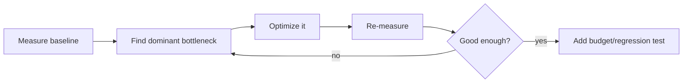
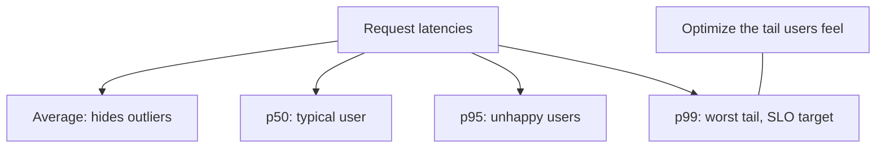
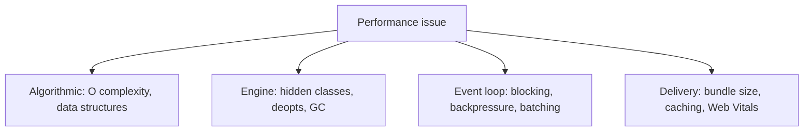
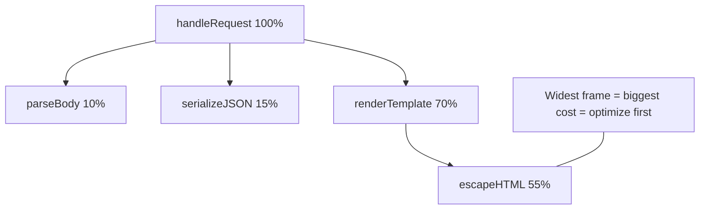
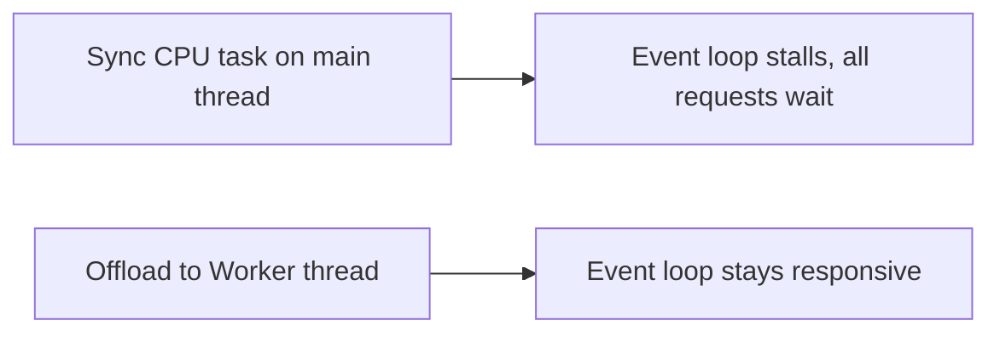

# Measuring and Optimizing Performance

## Overview

Performance work is the engineering of a system to meet **latency, throughput, and resource budgets** under realistic load. The defining principle is that performance must be **measured, not guessed**: intuition about what is slow is wrong often enough that optimizing without data usually wastes effort and can make things worse. The correct loop is **measure → find the bottleneck → optimize the bottleneck → measure again**, guided by Amdahl's Law—optimizing anything but the dominant cost yields negligible gains.

JavaScript performance spans several distinct domains that share this method but differ in tooling: **algorithmic complexity** (the highest-leverage lever), **engine behavior** (JIT, hidden classes, deopts—see [[02-JavaScript/04-Engines-and-Memory/Deoptimization and Performance Cliffs|Deoptimization and Performance Cliffs]]), **runtime/event-loop** costs (blocking the loop, backpressure), and **frontend delivery** (bundle size, Core Web Vitals). This note is about *measuring and optimizing JavaScript code*; server capacity planning belongs to [[07-Backend/README|Backend]] and infrastructure tuning to [[16-DevOps/README|DevOps]]. Performance regressions are tracked via [[02-JavaScript/07-Production-JavaScript/Observability and Operational Readiness|Observability]].

## Learning Objectives

- Apply the measure-first loop and Amdahl's Law to prioritize work
- Benchmark micro and macro correctly, avoiding common pitfalls
- Read CPU flame graphs and identify hot paths
- Reason about tail latency (p50/p95/p99) instead of averages
- Optimize algorithmic, engine, event-loop, and delivery costs distinctly
- Prevent regressions with performance budgets in CI

## Prerequisites

- [[02-JavaScript/04-Engines-and-Memory/Deoptimization and Performance Cliffs|Deoptimization and Performance Cliffs]]
- [[02-JavaScript/07-Production-JavaScript/Debugging JavaScript|Debugging JavaScript]]
- [[02-JavaScript/05-Async-and-Concurrency/Concurrency Control and Backpressure|Concurrency Control and Backpressure]]

## Difficulty

`advanced`

## Estimated Time

- Reading: 3 hours
- Exercises: 4 hours
- Mini project: 6 hours

## History

Early web performance meant "fewer HTTP requests." As apps grew, Steve Souders' *High Performance Web Sites* (2007) codified frontend rules. V8's arrival (2008) with JIT compilation made JavaScript fast enough for serious computation, shifting attention to engine-friendly code. The `performance.now()` high-resolution timer, the User Timing API, and `PerformanceObserver` standardized measurement. Google's **Core Web Vitals** (LCP, INP, CLS) turned user-perceived performance into ranked, measurable metrics. On the server, sampling profilers and flame graphs (Brendan Gregg) made CPU analysis systematic.

## Problem It Solves

- **Wasted optimization**: without measurement, effort goes to code that isn't the bottleneck.
- **Misleading averages**: mean latency hides the tail that actually hurts users.
- **Engine surprises**: "optimized" code can trigger deopts and run slower.
- **Event-loop blocking**: a single synchronous hot path can stall an entire Node server.
- **Silent regressions**: performance decays over releases without budgets to catch it.

## Internal Implementation

### The optimization loop and Amdahl's Law



Amdahl's Law: if a part accounts for fraction `p` of runtime, the maximum speedup from optimizing it fully is `1/(1-p)`. Optimizing a 5% cost can yield at most ~5% improvement—so **always profile to find the dominant `p` first**.

### Benchmarking correctly

Micro-benchmarks are notoriously deceptive. The JIT may **eliminate dead code**, cache results, or optimize your benchmark differently than real usage. Use a real benchmarking library (`tinybench`, `benchmark.js`) that warms up, runs many iterations, and reports statistics—and prevent dead-code elimination by consuming results.

```javascript
import { Bench } from "tinybench";
const bench = new Bench({ time: 1000 });
let sink;
bench
  .add("map+filter", () => { sink = data.map(f).filter(g); })
  .add("single reduce", () => { sink = data.reduce(reducer, []); });
await bench.run();
console.table(bench.table()); // report min/mean/p99, not one run
```

### Percentiles, not averages



A service with 10ms average latency can still have 2s p99. Users experience the tail; SLOs are defined on percentiles. Always report and alert on p95/p99.

### The four optimization domains



- **Algorithmic** (highest leverage): an O(n²) → O(n log n) fix beats any micro-tuning; pick the right data structure (Map vs array scan).
- **Engine**: keep object shapes stable (monomorphic call sites), avoid megamorphism and deopts, minimize GC pressure by reducing allocations in hot paths.
- **Event loop**: never block it with synchronous CPU work—offload to Workers, chunk the work, or stream; apply backpressure (see [[02-JavaScript/05-Async-and-Concurrency/Concurrency Control and Backpressure|Concurrency Control and Backpressure]]).
- **Delivery**: reduce bytes via [[02-JavaScript/06-Modules-and-Tooling/Bundling Tree Shaking and Code Splitting|code splitting/tree shaking]], cache aggressively, optimize LCP/INP.

## Mermaid Diagrams

### Flame graph reading



### Blocking vs offloading in Node



## Examples

### Minimal Example

```javascript
// O(n^2): scanning an array inside a loop
function hasDup(items) {
  for (const a of items)
    for (const b of items) if (a !== b && a.id === b.id) return true;
  return false;
}

// O(n): use a Set — the algorithmic win dwarfs micro-tuning
function hasDupFast(items) {
  const seen = new Set();
  for (const it of items) {
    if (seen.has(it.id)) return true;
    seen.add(it.id);
  }
  return false;
}
```

### Production-Shaped Example

Instrument real work with the User Timing API and offload a CPU-heavy task to keep the event loop responsive—directly protecting tail latency:

```javascript
import { performance, PerformanceObserver } from "node:perf_hooks";
import { Worker } from "node:worker_threads";

new PerformanceObserver((list) => {
  for (const e of list.getEntries())
    metrics.histogram("op_duration_ms", e.duration, { op: e.name });
}).observe({ entryTypes: ["measure"] });

async function handle(req) {
  performance.mark("start");
  // Heavy CPU (e.g., image transform) must not block the loop:
  const result = await runInWorker("./transform.js", req.payload);
  performance.mark("end");
  performance.measure("transform", "start", "end"); // feeds histogram
  return result;
}
```

Operational discipline: define **SLOs on p95/p99**, run performance budgets in CI (bundle size via `size-limit`, benchmark regressions), profile in production on demand, and treat a budget breach as a blocking failure. Optimize only after a profile names the bottleneck—premature micro-optimization adds complexity and risk (including deopts) for no measured gain.

## Trade-offs

| Dimension | Upside | Downside | When it matters |
| --- | --- | --- | --- |
| Algorithmic fix | Largest, durable gains | May need data-structure redesign | Hot loops, large N |
| Engine micro-tuning | Squeezes hot paths | Fragile, can cause deopts | Proven bottlenecks only |
| Caching/memoization | Avoids recomputation | Staleness, memory, invalidation | Repeated pure work |
| Worker offload | Frees event loop | IPC/serialization cost | CPU-bound tasks |
| Aggressive delivery opt | Faster loads | Build complexity | Frontend UX/SEO |

### When to Use

- Optimize after profiling identifies a dominant, measurable bottleneck.
- Offload CPU-bound work off the event loop in servers.
- Enforce budgets when performance is a product/SLO requirement.

### When Not to Use

- Don't micro-optimize before measuring or on non-dominant costs.
- Don't cache without an invalidation and memory plan.
- Don't sacrifice readability for gains you haven't verified.

## Exercises

1. Profile a slow function, identify the hot path from a flame graph, and optimize only that.
2. Write a correct benchmark that resists dead-code elimination; compare two implementations statistically.
3. Convert an O(n²) routine to O(n) and measure the crossover point.
4. Simulate an event-loop-blocking task and fix it with chunking or a Worker; measure p99 before/after.
5. Add a bundle-size budget to CI and make a change that breaks it.

## Mini Project

**Latency Lab**: Build a load generator + measurement harness that reports p50/p95/p99 and a histogram for an HTTP handler, then optimize the handler (algorithm, caching, offload) and document each change's measured effect. Cross-link to [[02-JavaScript/05-Async-and-Concurrency/Concurrency Control and Backpressure|Concurrency Control and Backpressure]].

## Portfolio Project

Add a **performance regression gate** to the [[02-JavaScript/projects/JavaScript Runtime Toolkit/README|JavaScript Runtime Toolkit]]: run benchmarks + bundle-size checks in CI, store historical baselines, and fail PRs that regress p99 or bundle budgets, with a trend visualization.

## Interview Questions

1. Why measure before optimizing, and how does Amdahl's Law guide priorities?
2. Why are averages misleading; what do p95/p99 tell you?
3. What makes micro-benchmarks unreliable and how do you write a valid one?
4. How does blocking the event loop affect a Node server, and how do you fix it?
5. Name the highest-leverage optimization category and why.

### Stretch / Staff-Level

1. Design an end-to-end performance strategy with SLOs, budgets, and production profiling.
2. Explain how engine deoptimization can make "optimized" code slower and how to detect it.

## Common Mistakes

- Optimizing without profiling; guessing the bottleneck.
- Reporting averages and ignoring tail latency.
- Trusting naive micro-benchmarks skewed by the JIT.
- Blocking the event loop with synchronous CPU work.
- Caching without invalidation/memory limits, trading a speed bug for a correctness/leak bug.

## Best Practices

- Measure first; optimize the dominant cost; re-measure.
- Track and alert on p95/p99; define SLOs on percentiles.
- Prefer algorithmic wins; keep object shapes stable for the JIT.
- Keep the event loop free; offload or chunk CPU-bound work.
- Enforce performance and bundle budgets in CI to prevent regressions.

## Summary

Performance is a measurement discipline: profile to find the dominant bottleneck, optimize it, and verify—guided by Amdahl's Law and judged on tail latency (p95/p99), not averages. JavaScript performance decomposes into algorithmic, engine, event-loop, and delivery domains, with algorithmic improvements offering the highest leverage and event-loop blocking being the classic server killer. Valid benchmarking resists JIT trickery, and budgets in CI stop silent regressions. Optimize what you can prove is slow, and leave the rest readable.

## Further Reading

- [[02-JavaScript/06-Modules-and-Tooling/Bundling Tree Shaking and Code Splitting|Bundling Tree Shaking and Code Splitting]]
- [[02-JavaScript/07-Production-JavaScript/Observability and Operational Readiness|Observability and Operational Readiness]]
- [[00-References/JavaScript/README|JavaScript References]]
- web.dev — *Core Web Vitals*; Node.js *perf_hooks*; Brendan Gregg — flame graphs

## Related Notes

- [[02-JavaScript/04-Engines-and-Memory/Deoptimization and Performance Cliffs|Deoptimization and Performance Cliffs]]
- [[02-JavaScript/07-Production-JavaScript/Debugging JavaScript|Debugging JavaScript]]
- [[02-JavaScript/code/README|JavaScript code labs]]
- [[06-NodeJS/08-Diagnostics-and-Performance/perf_hooks and Event Loop Delay|perf_hooks and Event Loop Delay]] · [[06-NodeJS/08-Diagnostics-and-Performance/Flamegraphs Bottlenecks and Production Profiling Discipline|Flamegraphs Bottlenecks and Production Profiling Discipline]] · [[06-NodeJS/README|Node.js]] · [[07-Backend/README|Backend]] · [[16-DevOps/README|DevOps]]
- [[02-JavaScript/README|JavaScript Track]]

## Progress Checklist

- [ ] Explained from first principles
- [ ] Drew at least one Mermaid diagram
- [ ] Implemented a minimal version
- [ ] Documented trade-offs and non-goals
- [ ] Completed exercises
- [ ] Practiced interview questions aloud
- [ ] Linked prerequisites and dependents
