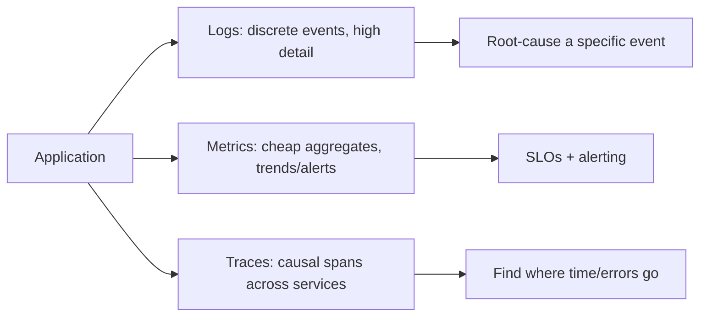
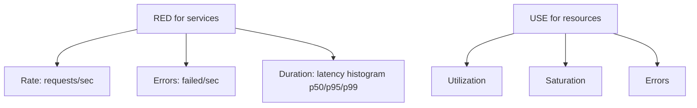
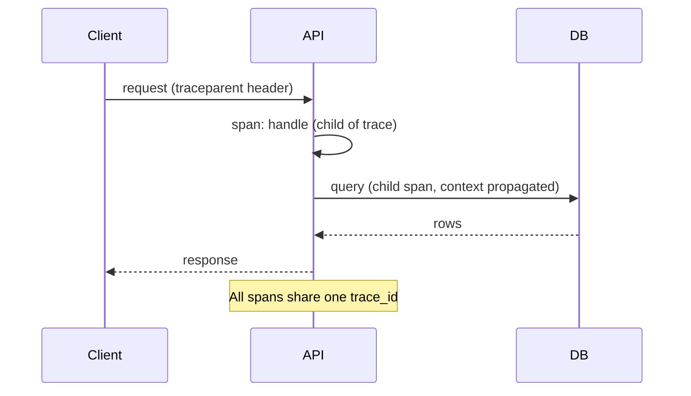
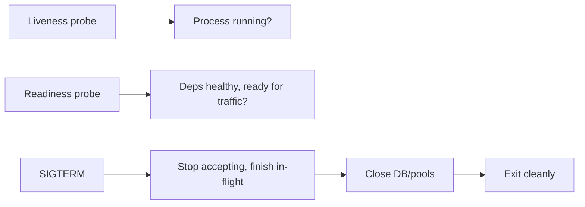
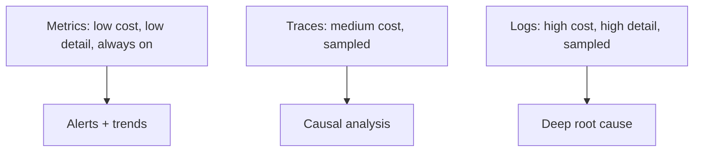
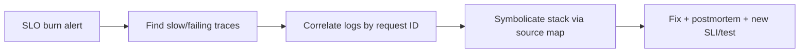

# Observability and Operational Readiness

## Overview

**Observability** is the property of a system that lets you understand its internal state from its external outputs—without shipping new code to answer new questions. It is distinct from **monitoring**, which watches known failure modes with predefined dashboards and alerts: monitoring tells you *that* something is wrong; observability lets you ask *why*, including for failures you never anticipated. The three classic **signals** are **logs** (discrete events), **metrics** (aggregatable numbers over time), and **traces** (causal request paths across components), increasingly unified under **OpenTelemetry**.

**Operational readiness** is the broader discipline of ensuring software can be run reliably in production: it adds health checks, graceful shutdown, structured error reporting, SLOs, alerting, and runbooks. This note covers the *JavaScript/application-level instrumentation* that produces these signals and the operational contracts your code must uphold; the platforms that store and visualize them (Prometheus, Grafana, Datadog) and infrastructure concerns live in [[16-DevOps/README|DevOps]], while service-level SLIs and API observability live in [[07-Backend/09-API-Observability-and-Testing/RED Metrics and SLIs for APIs|RED Metrics and SLIs for APIs]]. It consumes [[02-JavaScript/07-Production-JavaScript/Error Design and Exception Safety|error design]], [[02-JavaScript/07-Production-JavaScript/Measuring and Optimizing Performance|performance metrics]], and [[02-JavaScript/06-Modules-and-Tooling/Source Maps and Debug Builds|source-map symbolication]].

## Learning Objectives

- Distinguish observability from monitoring, and logs/metrics/traces
- Produce structured logs with correlation IDs and context propagation
- Emit meaningful metrics (RED/USE) and instrument traces with OpenTelemetry
- Define SLIs/SLOs/error budgets and actionable alerts
- Implement health checks, graceful shutdown, and readiness contracts
- Separate app instrumentation from platform/infra concerns

## Prerequisites

- [[02-JavaScript/07-Production-JavaScript/Error Design and Exception Safety|Error Design and Exception Safety]]
- [[02-JavaScript/07-Production-JavaScript/Measuring and Optimizing Performance|Measuring and Optimizing Performance]]
- [[02-JavaScript/05-Async-and-Concurrency/Cancellation Timeouts and AbortController|Cancellation Timeouts and AbortController]]

## Difficulty

`advanced`

## Estimated Time

- Reading: 3 hours
- Exercises: 3–4 hours
- Mini project: 6 hours

## History

Operations evolved from ad-hoc log-tailing to structured practice. Google's **SRE** book (2016) popularized SLIs/SLOs/error budgets and "monitoring the four golden signals." The term **observability** (borrowed from control theory) gained traction ~2018 to describe understanding *unknown-unknowns*, championed by Honeycomb and Charity Majors. Logs matured from unstructured text to **structured JSON**; metrics standardized around **Prometheus**; distributed tracing emerged from Google's Dapper into OpenTracing/OpenCensus, which merged into **OpenTelemetry (OTel)**—now the vendor-neutral standard for all three signals. In Node, `AsyncLocalStorage` (stable ~v16) finally made context propagation across async boundaries practical.

## Problem It Solves

- **Invisible production behavior**: without signals, failures are noticed by users, not engineers.
- **Unknown-unknowns**: dashboards for known failures can't explain novel incidents; high-cardinality observability can.
- **Lost causality**: in distributed systems, a slow request touches many services; traces reconstruct the path.
- **Alert fatigue / blind spots**: vague or missing SLOs produce noisy or absent alerts.
- **Unsafe deploys/restarts**: without health checks and graceful shutdown, deploys drop requests.

## Internal Implementation

### The three signals



- **Logs**: rich per-event detail; expensive at volume; use structured JSON and sampling.
- **Metrics**: numeric time series (counters, gauges, histograms); cheap, aggregatable; drive alerts and SLOs but lack per-event detail.
- **Traces**: spans forming a causal tree of a request; reveal *where* latency/errors originate across service boundaries.

### Structured logging with correlation

Human-readable strings don't aggregate. Emit **structured** logs keyed by a **correlation/request ID** propagated through async work via `AsyncLocalStorage`.

```javascript
import { AsyncLocalStorage } from "node:async_hooks";
const als = new AsyncLocalStorage();

function withRequestContext(req, res, next) {
  als.run({ requestId: req.headers["x-request-id"] ?? crypto.randomUUID() }, next);
}
function log(level, msg, fields = {}) {
  const { requestId } = als.getStore() ?? {};
  process.stdout.write(JSON.stringify({ ts: Date.now(), level, msg, requestId, ...fields }) + "\n");
}
```

Correlation IDs let you stitch every log line, metric exemplar, and trace span for a single request together—the difference between minutes and hours during an incident.

### Metrics: RED and USE



Use **histograms** (not averages) for latency so you can compute percentiles; keep label **cardinality** bounded (never put user IDs in metric labels—it explodes storage).

### Distributed tracing with OpenTelemetry

A **trace** has a `trace_id`; each unit of work is a **span** with a `span_id` and parent, propagated across process boundaries via context headers (W3C `traceparent`).



```javascript
import { trace } from "@opentelemetry/api";
const tracer = trace.getTracer("orders");
async function createOrder(input) {
  return tracer.startActiveSpan("createOrder", async (span) => {
    try {
      span.setAttribute("order.item_count", input.items.length);
      return await persist(input);
    } catch (err) {
      span.recordException(err);
      span.setStatus({ code: 2 }); // ERROR
      throw err;
    } finally {
      span.end();
    }
  });
}
```

### SLIs, SLOs, and error budgets

An **SLI** is a measured indicator (e.g., % of requests < 300ms); an **SLO** is the target (e.g., 99.9% over 30 days); the **error budget** is the allowed shortfall (0.1%). Alerts should fire on **SLO burn rate**, not raw thresholds—this ties alerting to user impact and controls noise.

### Operational readiness contracts



Your code must expose **liveness** (am I running?) and **readiness** (can I serve?) endpoints and handle **graceful shutdown**: on `SIGTERM`, stop accepting new work, drain in-flight requests within a timeout, close resources, then exit—so deploys and scaling don't drop requests.

## Mermaid Diagrams

### Signal cost vs detail



### Incident flow



## Examples

### Minimal Example

```javascript
// Health endpoints for orchestrators
app.get("/livez", (_req, res) => res.sendStatus(200)); // process is up
app.get("/readyz", async (_req, res) => {
  const ok = await db.ping().then(() => true).catch(() => false);
  res.sendStatus(ok ? 200 : 503); // only take traffic when deps are healthy
});
```

### Production-Shaped Example

Graceful shutdown plus RED metrics wired around request handling—so the service is safe to deploy and its user-facing health is measurable:

```javascript
import client from "prom-client";
const httpDuration = new client.Histogram({
  name: "http_request_duration_seconds",
  help: "Request duration",
  labelNames: ["method", "route", "status"],
  buckets: [0.01, 0.05, 0.1, 0.3, 1, 3],
});

app.use((req, res, next) => {
  const end = httpDuration.startTimer();
  res.on("finish", () =>
    end({ method: req.method, route: req.route?.path ?? "unknown", status: res.statusCode }),
  );
  next();
});

const server = app.listen(3000);
function shutdown() {
  logger.info("shutdown_start");
  server.close(async () => {          // stop accepting, drain in-flight
    await db.close();
    logger.info("shutdown_complete");
    process.exit(0);
  });
  setTimeout(() => process.exit(1), 10_000).unref(); // hard cap
}
process.on("SIGTERM", shutdown);
process.on("SIGINT", shutdown);
```

Operational discipline: instrument the **golden signals**, alert on **SLO burn rate**, keep a **runbook** per alert, ensure production errors are **symbolicated** (uploaded source maps) and tagged with correlation IDs, sample logs/traces to control cost, and rehearse incident response. Treat readiness—health checks, graceful shutdown, dashboards, alerts, runbooks—as a **launch gate**, not a post-incident retrofit.

## Trade-offs

| Dimension | Upside | Downside | When it matters |
| --- | --- | --- | --- |
| Verbose logging | Rich forensics | Cost, PII risk, noise | Debugging incidents |
| High-cardinality data | Powerful queries | Storage/cost blowup | Deep observability |
| Full trace sampling | Complete picture | Overhead, volume | Low-traffic/critical paths |
| Tight SLOs | Strong guarantees | Alert fatigue, cost | User-critical services |
| Graceful shutdown | Zero-drop deploys | More lifecycle code | Any deployed service |

### When to Use

- Any production service: emit the three signals and expose health endpoints.
- Distributed systems: propagate trace context and correlation IDs everywhere.
- User-facing paths: define SLOs and burn-rate alerts.

### When Not to Use

- Don't over-instrument trivial scripts or one-off jobs.
- Don't log everything at full volume—sample and bound cardinality.
- Don't put PII/secrets or unbounded IDs into logs/metric labels.

## Exercises

1. Add structured JSON logging with a request-scoped correlation ID via `AsyncLocalStorage`.
2. Instrument RED metrics with a latency histogram and compute p95/p99.
3. Add OpenTelemetry spans across two functions and view the trace tree.
4. Define an SLI/SLO for a route and write a burn-rate alert rule.
5. Implement graceful shutdown and prove no in-flight request is dropped during restart.

## Mini Project

**Observability Kit**: Build a small middleware bundle providing correlation-ID propagation, structured logging, RED metrics, an OTel trace wrapper, and health endpoints—drop-in for an Express-style app. Cross-link to [[02-JavaScript/07-Production-JavaScript/Measuring and Optimizing Performance|Measuring and Optimizing Performance]].

## Portfolio Project

Add an **operational-readiness scorecard** to the [[02-JavaScript/projects/JavaScript Runtime Toolkit/README|JavaScript Runtime Toolkit]]: check for health endpoints, graceful shutdown, structured logs, metrics, trace propagation, and source-map upload, producing a launch-gate report.

## Interview Questions

1. Difference between monitoring and observability, and between logs, metrics, and traces?
2. What are RED and USE metrics, and why use histograms over averages?
3. How do correlation IDs and trace context propagate across async/service boundaries?
4. What are SLIs/SLOs/error budgets and why alert on burn rate?
5. How do liveness/readiness probes and graceful shutdown make deploys safe?

### Stretch / Staff-Level

1. Design an end-to-end observability strategy for a multi-service system, balancing detail against cost.
2. How would you diagnose a novel production incident with no pre-built dashboard using high-cardinality observability?

## Common Mistakes

- Confusing monitoring (known failures) with observability (unknown-unknowns).
- Unstructured logs and missing correlation IDs, making incidents unsearchable.
- Averaging latency and missing the tail; high-cardinality metric labels blowing up cost.
- No graceful shutdown, dropping requests on every deploy.
- Alerting on raw thresholds (noisy) instead of SLO burn rate; logging PII/secrets.

## Best Practices

- Emit structured logs, RED/USE metrics, and OTel traces; propagate correlation/trace context.
- Define SLIs/SLOs/error budgets; alert on burn rate with a runbook per alert.
- Expose liveness/readiness and implement graceful shutdown with a hard timeout.
- Ensure production errors are symbolicated and tagged with request IDs.
- Sample and bound cardinality to control cost; never log secrets/PII.

## Summary

Observability turns a running JavaScript system from a black box into something you can interrogate, combining structured logs, aggregatable metrics, and causal traces—correlated by request/trace IDs propagated across async boundaries. Monitoring catches known failures; observability explains novel ones. Operational readiness wraps this with SLOs and burn-rate alerts, health checks, and graceful shutdown so the service can be deployed and run without dropping traffic. Instrument at the application layer, hand storage/visualization to your platform, and treat readiness as a launch gate—so production failures become diagnosable, bounded, and recoverable.

## Further Reading

- [[16-DevOps/README|DevOps]] (Prometheus, Grafana, OpenTelemetry collectors)
- [[02-JavaScript/07-Production-JavaScript/Measuring and Optimizing Performance|Measuring and Optimizing Performance]]
- [[00-References/JavaScript/README|JavaScript References]]
- Google *SRE* book; OpenTelemetry docs; Charity Majors — *Observability Engineering*

## Related Notes

- [[02-JavaScript/07-Production-JavaScript/Error Design and Exception Safety|Error Design and Exception Safety]]
- [[02-JavaScript/06-Modules-and-Tooling/Source Maps and Debug Builds|Source Maps and Debug Builds]]
- [[02-JavaScript/code/README|JavaScript code labs]]
- [[06-NodeJS/08-Diagnostics-and-Performance/perf_hooks and Event Loop Delay|perf_hooks and Event Loop Delay]] · [[06-NodeJS/10-Production-Node/Structured Logging and Correlation IDs|Structured Logging and Correlation IDs]] · [[06-NodeJS/README|Node.js]] · [[07-Backend/09-API-Observability-and-Testing/RED Metrics and SLIs for APIs|RED Metrics and SLIs for APIs]] · [[07-Backend/README|Backend]] · [[16-DevOps/README|DevOps]] · [[18-Security/README|Security]]
- [[02-JavaScript/README|JavaScript Track]]

## Progress Checklist

- [ ] Explained from first principles
- [ ] Drew at least one Mermaid diagram
- [ ] Implemented a minimal version
- [ ] Documented trade-offs and non-goals
- [ ] Completed exercises
- [ ] Practiced interview questions aloud
- [ ] Linked prerequisites and dependents
