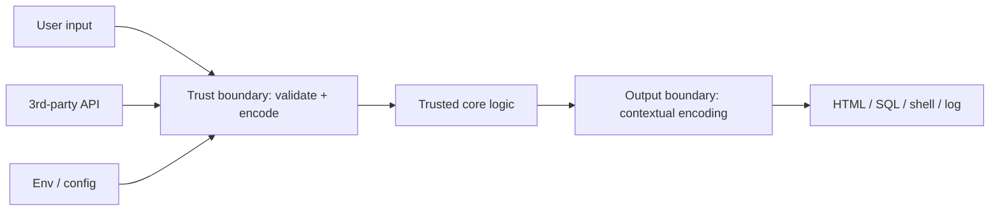
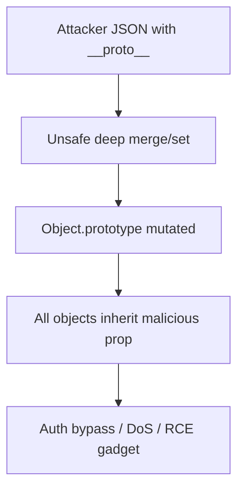
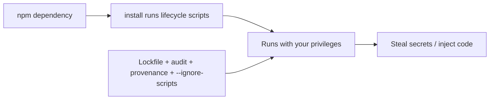
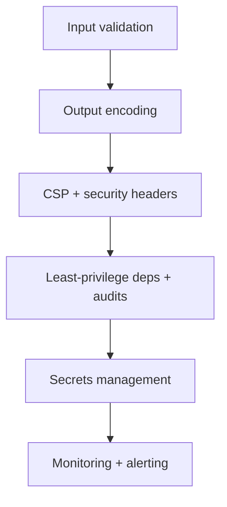
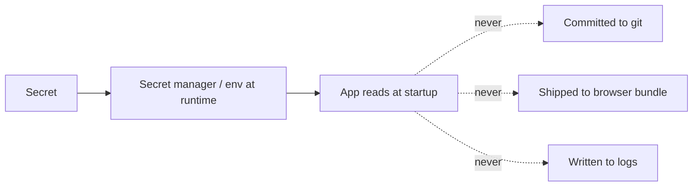

# Secure JavaScript Practices

## Overview

Security in JavaScript is the practice of writing code that behaves correctly **even when inputs, dependencies, and the environment are hostile**. Its foundational principle is that **all input is untrusted**—user data, upstream API responses, environment variables, and even your own transitive dependencies. JavaScript's ubiquity (it runs in browsers with access to user sessions, and on servers with access to databases and secrets) combined with its dynamic features (`eval`, prototype mutability, dynamic property access) makes it a rich target with several *language-specific* vulnerability classes not present elsewhere.

This note focuses on **language- and package-level security**—the vulnerability classes and defensive techniques that live in JavaScript code itself: injection (XSS), prototype pollution, unsafe deserialization, dynamic evaluation, and the npm supply chain. It is distinct from, and feeds into, the broader [[18-Security/README|Security]] track (authn/authz, crypto, network security) and server hardening in [[07-Backend/README|Backend]]. Secure code is inseparable from robust [[02-JavaScript/07-Production-JavaScript/API Design and Defensive Programming|input validation]] and observable enough for [[02-JavaScript/07-Production-JavaScript/Observability and Operational Readiness|incident detection]].

## Learning Objectives

- Treat all input as untrusted and validate at trust boundaries
- Prevent XSS via contextual output encoding and CSP
- Understand and block prototype pollution and injection attacks
- Avoid `eval`, unsafe deserialization, and `ReDoS`-prone regexes
- Manage the npm supply chain: lockfiles, audits, provenance, least privilege
- Handle secrets and error output without leakage

## Prerequisites

- [[02-JavaScript/07-Production-JavaScript/Error Design and Exception Safety|Error Design and Exception Safety]]
- [[02-JavaScript/03-Objects-and-Metaprogramming/Prototype Chain and Delegation|Prototype Chain and Delegation]]
- [[02-JavaScript/06-Modules-and-Tooling/Package JSON and Semantic Versioning|Package JSON and Semantic Versioning]]

## Difficulty

`advanced`

## Estimated Time

- Reading: 3 hours
- Exercises: 3–4 hours
- Mini project: 5 hours

## History

Web security co-evolved with JavaScript. **XSS** emerged in the late 1990s as sites echoed user input into HTML. The **Same-Origin Policy** and later **Content Security Policy** (CSP) were browser defenses. Server-side JS via Node opened it to classic backend risks (injection, SSRF). **Prototype pollution** was formalized as a JS-specific class around 2018 (widespread in lodash/jQuery `merge` utilities). The npm ecosystem's scale produced landmark supply-chain incidents (`event-stream` 2018, `node-ipc` 2022, repeated typosquatting), making dependency integrity a first-class concern. OWASP's Top 10 remains the canonical risk taxonomy.

## Problem It Solves

- **Injection (XSS/SQL/command)**: untrusted input executed as code/markup; encoding and parameterization stop it.
- **Prototype pollution**: attacker-controlled keys mutate `Object.prototype`, affecting all objects.
- **Unsafe deserialization / eval**: turning data into executable code grants remote code execution.
- **ReDoS**: pathological regexes let a small input hang the event loop (DoS).
- **Supply-chain compromise**: a malicious dependency runs with your full privileges.
- **Secret/error leakage**: exposed keys or stack traces aid attackers.

## Internal Implementation

### Trust boundaries and the untrusted-input model



Every place data crosses from untrusted to trusted (input) or from your app into a powerful sink (output) is a boundary requiring defense. Validate on the way in; encode for the specific sink on the way out.

### XSS and contextual output encoding

XSS occurs when untrusted data lands in an HTML/JS context without proper encoding. The fix is **context-aware encoding** (HTML body vs attribute vs URL vs JS differ) and never using `innerHTML` with untrusted data.

```javascript
// VULNERABLE: interpolating user input into HTML
el.innerHTML = `<div>${userName}</div>`;   //  executes

// SAFE: use text nodes (auto-escaped) or a sanitizer for rich HTML
el.textContent = userName;
// For untrusted HTML that must render: sanitize with DOMPurify
el.innerHTML = DOMPurify.sanitize(userHtml);
```

Defense in depth: a strict **Content Security Policy** (`script-src 'self'`, nonce-based) blocks injected inline scripts even if encoding is missed.

### Prototype pollution

Because objects delegate to `Object.prototype`, writing to `__proto__`/`constructor.prototype` via attacker-controlled keys poisons *all* objects.

```javascript
// VULNERABLE recursive merge
merge({}, JSON.parse('{"__proto__":{"isAdmin":true}}'));
({}).isAdmin; // true  <-- every object now "isAdmin"

// DEFENSE: reject dangerous keys, use null-prototype maps, or Map
function safeSet(obj, key, val) {
  if (key === "__proto__" || key === "constructor" || key === "prototype") return;
  obj[key] = val;
}
const store = Object.create(null); // no prototype to pollute
const m = new Map();               // keys never touch the prototype chain
```



### Dangerous evaluation and ReDoS

`eval`, `new Function`, and `setTimeout("code")` execute strings as code—never with untrusted input. Deserialization must never construct arbitrary code (use `JSON.parse`, not `eval`). Regexes with nested quantifiers (`(a+)+$`) can exhibit **catastrophic backtracking**; a crafted input freezes the single-threaded event loop.

```javascript
const bad = /(a+)+$/;              // ReDoS: "aaaa...!" hangs
// Mitigate: bounded quantifiers, linear-time engines (RE2), input length limits
```

### Supply-chain integrity



Mitigations: commit lockfiles and use frozen installs, run `npm audit`/Socket/Snyk in CI, pin and review dependency updates (Renovate/Dependabot with review), prefer packages with **provenance**, disable install scripts where possible (`--ignore-scripts`), and minimize dependency count (each is attack surface).

## Mermaid Diagrams

### Defense in depth



### Secret handling



## Examples

### Minimal Example

```javascript
// Parameterized query prevents SQL injection (never string-concat SQL)
await db.query("SELECT * FROM users WHERE email = $1", [email]);

// Command execution: avoid shell; pass args as an array (no shell parsing)
import { execFile } from "node:child_process";
execFile("convert", [inputPath, outputPath]); // not exec(`convert ${input}`)
```

### Production-Shaped Example

Hardened HTTP setup layering validation, headers/CSP, safe error output, and secret hygiene—defense in depth wired into an Express-style server (see [[07-Backend/README|Backend]]):

```javascript
import helmet from "helmet";
import rateLimit from "express-rate-limit";

app.use(helmet({
  contentSecurityPolicy: {
    directives: { defaultSrc: ["'self'"], scriptSrc: ["'self'"], objectSrc: ["'none'"] },
  },
}));
app.use(rateLimit({ windowMs: 60_000, max: 100 })); // basic DoS/brute-force guard

app.post("/api/users", validate(userSchema), async (req, res, next) => {
  try {
    const user = await createUser(req.body); // input already validated
    res.status(201).json({ id: user.id });   // no internal fields leaked
  } catch (err) {
    next(err); // centralized handler logs full detail, returns generic message
  }
});

// Secrets: read at runtime from a manager/env; never in the bundle or logs.
const dbUrl = process.env.DATABASE_URL; // provided by secret manager
```

Operationally: run SAST/dependency scanning in CI, rotate secrets, enforce least privilege on service credentials, and feed security-relevant events to [[02-JavaScript/07-Production-JavaScript/Observability and Operational Readiness|observability]] for detection. Security is a continuous process, not a checklist completed once.

## Trade-offs

| Dimension | Upside | Downside | When it matters |
| --- | --- | --- | --- |
| Strict CSP | Blocks injected scripts | Breaks inline scripts, setup effort | Public web apps |
| Input validation everywhere | Stops many attacks | Verbose, some latency | All boundaries |
| Minimal dependencies | Smaller attack surface | More code to write | Security-sensitive apps |
| Sanitizing rich HTML | Enables user content | Sanitizer bugs, upkeep | CMS/comment systems |
| Disabling install scripts | Blocks malicious hooks | Some packages need them | CI hardening |

### When to Use

- Validate/encode at every trust boundary in any networked app.
- Apply CSP and security headers to all public web surfaces.
- Harden the dependency pipeline for anything shipping to production.

### When Not to Use

- Don't skip validation for "internal" inputs—internal systems get compromised too.
- Don't rely on a single control (e.g., encoding alone); layer defenses.
- Don't hand-roll crypto or sanitizers; use vetted libraries.

## Exercises

1. Reproduce a reflected XSS in a toy app, then fix it with `textContent` and CSP.
2. Trigger prototype pollution via an unsafe merge and defend with key filtering and null-prototype objects.
3. Write a ReDoS-vulnerable regex, demonstrate the hang, and mitigate with bounds/RE2.
4. Convert a string-concatenated SQL query to a parameterized one.
5. Audit a project's dependencies, identify a vulnerable/over-privileged package, and remediate.

## Mini Project

**Input Firewall**: Build a middleware that validates/sanitizes request bodies against schemas, strips dangerous keys (`__proto__`, `constructor`), enforces size/length limits (anti-ReDoS/DoS), and emits security metrics. Cross-link to [[02-JavaScript/07-Production-JavaScript/API Design and Defensive Programming|API Design and Defensive Programming]].

## Portfolio Project

Add a **security scanner** to the [[02-JavaScript/projects/JavaScript Runtime Toolkit/README|JavaScript Runtime Toolkit]]: static checks for `eval`/`innerHTML`/unsafe merges, a dependency-risk report (audit + provenance + install-script flags), and a CSP/header validator, integrated into CI.

## Interview Questions

1. What does "all input is untrusted" mean in practice at trust boundaries?
2. How does XSS work and why is contextual output encoding the fix?
3. Explain prototype pollution and three ways to prevent it.
4. Why are `eval`/`new Function` dangerous, and what is ReDoS?
5. How do you secure the npm supply chain?

### Stretch / Staff-Level

1. Design a defense-in-depth strategy for a public web app spanning input, output, headers, deps, and secrets.
2. How would you detect and respond to a compromised transitive dependency in production?

## Common Mistakes

- Trusting input from "internal" sources or your own dependencies.
- Using `innerHTML` with untrusted data; relying on encoding without CSP.
- Deep-merging untrusted JSON without filtering dangerous keys.
- Building SQL/shell commands via string concatenation.
- Committing secrets or leaking stack traces/internal fields to clients.

## Best Practices

- Validate input and contextually encode output at every boundary.
- Apply CSP and security headers; use vetted sanitizers, not custom ones.
- Prevent prototype pollution with key filtering, `Object.create(null)`, and `Map`.
- Harden the supply chain: lockfiles, audits, provenance, least privilege, minimal deps.
- Manage secrets via a manager; never in code, bundles, or logs; scan continuously in CI.

## Summary

Secure JavaScript starts from the premise that input, dependencies, and environment are hostile, and defends at trust boundaries with validation on the way in and contextual encoding on the way out. Language-specific hazards—XSS, prototype pollution, unsafe `eval`/deserialization, ReDoS—demand specific countermeasures, while the npm supply chain requires lockfiles, audits, provenance, and least privilege. No single control suffices; security is layered defense-in-depth plus continuous scanning, secret hygiene, and monitoring. Combined with disciplined API validation and observability, these practices turn a broad attack surface into a defensible one.

## Further Reading

- [[18-Security/README|Security]] · [[07-Backend/README|Backend]]
- [[02-JavaScript/07-Production-JavaScript/API Design and Defensive Programming|API Design and Defensive Programming]]
- [[00-References/JavaScript/README|JavaScript References]]
- OWASP Top 10; OWASP Cheat Sheets (XSS, Node.js); Snyk/Socket security blogs

## Related Notes

- [[02-JavaScript/07-Production-JavaScript/Error Design and Exception Safety|Error Design and Exception Safety]]
- [[02-JavaScript/03-Objects-and-Metaprogramming/Prototype Chain and Delegation|Prototype Chain and Delegation]]
- [[02-JavaScript/code/README|JavaScript code labs]]
- [[06-NodeJS/README|Node.js]] · [[18-Security/README|Security]] · [[16-DevOps/README|DevOps]]
- [[02-JavaScript/README|JavaScript Track]]

## Progress Checklist

- [ ] Explained from first principles
- [ ] Drew at least one Mermaid diagram
- [ ] Implemented a minimal version
- [ ] Documented trade-offs and non-goals
- [ ] Completed exercises
- [ ] Practiced interview questions aloud
- [ ] Linked prerequisites and dependents
