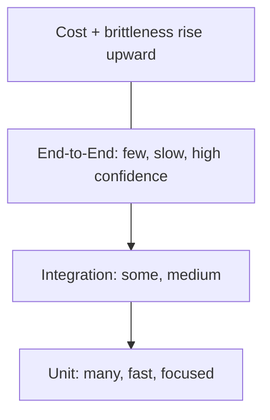
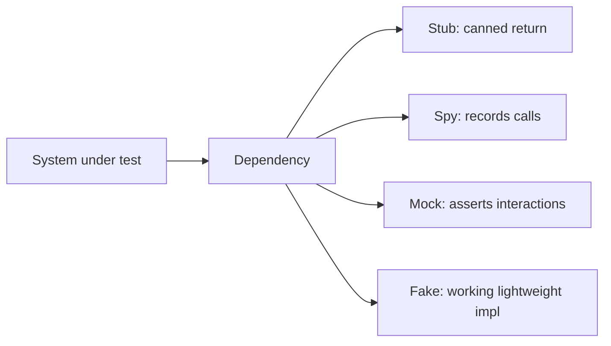
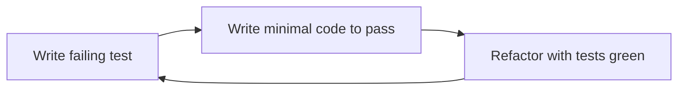
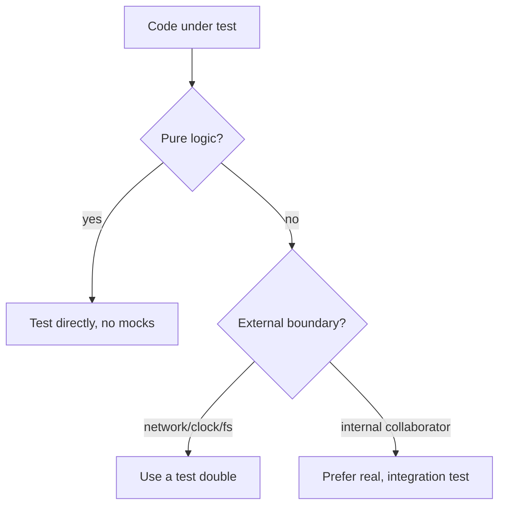

# Testing JavaScript

## Overview

Testing is the practice of writing executable specifications that verify code behaves as intended and *keeps* behaving that way as it changes. A test is fundamentally a **controlled experiment**: arrange a known state, act on the system, and assert an observable outcome. In JavaScript, testing carries extra weight because the language's dynamic typing and implicit coercion allow whole classes of bugs that a compiler would catch elsewhere—tests are your primary safety net (complemented by [[02-JavaScript/07-Production-JavaScript/TypeScript Interoperability|TypeScript]]).

Effective testing is not about coverage percentages; it is about **confidence per unit of maintenance cost**. The goal is a suite that catches real regressions, runs fast, and doesn't break on every refactor. This requires deliberate choices about test *level* (unit, integration, end-to-end), what to mock, and how to keep tests deterministic despite time, randomness, and async. This note is about testing *JavaScript code and packages*; testing running servers and databases extends into [[07-Backend/09-API-Observability-and-Testing/Contract Integration and Load Testing|Contract Integration and Load Testing]] and [[07-Backend/01-HTTP-APIs-and-Contracts/OpenAPI as Executable Contract|OpenAPI as Executable Contract]], and CI execution is a [[16-DevOps/README|DevOps]] concern.

## Learning Objectives

- Structure tests with Arrange-Act-Assert and clear naming
- Choose the right level: unit vs integration vs end-to-end (the test pyramid)
- Use test doubles (stubs, spies, mocks, fakes) without over-mocking
- Test asynchronous code and eliminate flakiness (time, randomness, order)
- Apply TDD and measure meaningful coverage
- Distinguish testing pure logic from testing systems

## Prerequisites

- [[02-JavaScript/07-Production-JavaScript/Error Design and Exception Safety|Error Design and Exception Safety]]
- [[02-JavaScript/05-Async-and-Concurrency/Async and Await|Async and Await]]

## Difficulty

`intermediate`

## Estimated Time

- Reading: 2–3 hours
- Exercises: 4 hours
- Mini project: 6 hours

## History

Early JS testing was ad hoc—manual browser checks and `console.log`. **JsUnit** and then **QUnit** (jQuery) formalized browser assertions. **Jasmine** popularized behavior-driven `describe`/`it`. **Mocha + Chai + Sinon** became the composable standard. **Jest** (Facebook, 2016) bundled runner, assertions, mocking, and snapshots with parallelism and a great DX, dominating for years. **Vitest** (Vite-native, ESM-first) offered Jest-compatible APIs with faster, native-ESM execution. Node also shipped a **built-in test runner** (`node:test`, stable ~v20), reducing dependency needs. Browser end-to-end tooling evolved from Selenium to **Playwright** and **Cypress**.

## Problem It Solves

- **Regression risk**: changes silently break existing behavior; tests catch it before users do.
- **Dynamic-typing bugs**: coercion and shape mismatches surface at runtime; tests exercise them.
- **Refactoring fear**: without tests, teams avoid improving code; a suite enables confident change.
- **Living documentation**: well-named tests describe intended behavior better than stale prose.
- **Design pressure**: hard-to-test code is usually poorly-coupled code; tests expose it.

## Internal Implementation

### Anatomy of a test and AAA

```javascript
import { describe, it, expect } from "vitest";
import { applyDiscount } from "../src/pricing.js";

describe("applyDiscount", () => {
  it("caps discount at the order total", () => {
    const order = { total: 100 };          // Arrange
    const result = applyDiscount(order, 150); // Act
    expect(result.total).toBe(0);           // Assert
  });
});
```

A test runner discovers files, executes each test in isolation, catches thrown assertions, and reports pass/fail with diffs. Isolation matters: shared mutable state between tests causes **order-dependent flakiness**.

### The test pyramid



- **Unit**: a single function/module in isolation; fast, deterministic; the bulk of tests.
- **Integration**: multiple units together (a service + real DB in a container); catches wiring bugs.
- **End-to-end**: the whole app through its real interface; highest confidence, slowest, most brittle.

Invert the pyramid at your peril: too many E2E tests yield slow, flaky suites that teams learn to ignore.

### Test doubles



- **Stub**: returns fixed values.
- **Spy**: wraps a real function, records how it was called.
- **Mock**: pre-programmed with expectations that it verifies.
- **Fake**: a real but simplified implementation (in-memory DB).

**Over-mocking** is a top anti-pattern: mocking everything tests your mocks, not your code, and locks tests to implementation details. Prefer testing real behavior; mock only true boundaries (network, clock, filesystem).

### Determinism: time, randomness, async

Flaky tests destroy trust. Control non-determinism explicitly:

```javascript
import { vi, it, expect } from "vitest";

it("expires after 30 minutes", () => {
  vi.useFakeTimers();
  vi.setSystemTime(new Date("2026-07-21T00:00:00Z"));
  const session = createSession();
  vi.advanceTimersByTime(30 * 60_000);   // deterministic time travel
  expect(session.isExpired()).toBe(true);
  vi.useRealTimers();
});
```

For async, always `await` the assertion or return the promise; never leave a floating promise a test won't observe.

## Mermaid Diagrams

### TDD cycle



### What to mock vs use real



## Examples

### Minimal Example

```javascript
import { describe, it, expect } from "vitest";
import { parseRange } from "../src/range.js";

describe("parseRange", () => {
  it.each([
    ["1-5", [1, 5]],
    ["10-10", [10, 10]],
  ])("parses %s", (input, expected) => {
    expect(parseRange(input)).toEqual(expected);
  });

  it("rejects reversed ranges", () => {
    expect(() => parseRange("5-1")).toThrow(/invalid range/);
  });
});
```

### Production-Shaped Example

An integration test hitting a real database in an ephemeral container (Testcontainers), asserting behavior end-to-end at the repository layer—far more trustworthy than a fully-mocked unit test for data code:

```javascript
import { beforeAll, afterAll, it, expect } from "vitest";
import { PostgreSqlContainer } from "@testcontainers/postgresql";
import { UserRepository } from "../src/repo.js";

let container, repo;
beforeAll(async () => {
  container = await new PostgreSqlContainer().start();
  repo = new UserRepository(container.getConnectionUri());
  await repo.migrate();
}, 60_000);
afterAll(async () => { await container.stop(); });

it("enforces unique email at the DB level", async () => {
  await repo.create({ email: "a@x.com" });
  await expect(repo.create({ email: "a@x.com" }))
    .rejects.toThrow(/unique/i);
});
```

Operational practices: run tests in CI on every PR, fail on regressions, track **flaky-test rate** as a metric, use coverage as a *guide* (branch coverage on critical paths) not a target, and keep the unit suite under a few seconds so developers actually run it. Property-based testing (`fast-check`) and mutation testing (`Stryker`) find bugs example-based tests miss.

## Trade-offs

| Dimension | Upside | Downside | When it matters |
| --- | --- | --- | --- |
| Many unit tests | Fast, precise failures | Miss integration bugs | Pure logic |
| Integration tests | Catch wiring/DB bugs | Slower, more setup | Data/service layers |
| E2E tests | Highest confidence | Slow, flaky, costly | Critical user flows |
| Heavy mocking | Isolation, speed | Tests implementation, false confidence | Rare true boundaries |
| High coverage target | Surface untested code | Gaming, brittle tests | Use as guide only |

### When to Use

- Unit tests for all non-trivial pure logic and edge cases.
- Integration tests for repositories, service wiring, and external contracts.
- E2E for a small set of business-critical journeys.

### When Not to Use

- Don't unit-test trivial getters or framework glue with no logic.
- Don't write E2E for what a unit test covers cheaply.
- Don't mock internal collaborators just to hit a coverage number.

## Exercises

1. Write parameterized tests for a pure function covering happy path, edges, and errors.
2. Replace a `Date.now()` dependency with fake timers and test time-based expiry deterministically.
3. Refactor an over-mocked test to use a real collaborator; observe improved confidence.
4. Add an integration test using an in-memory or containerized dependency.
5. Introduce a bug and confirm exactly which test fails; then fix and re-run.

## Mini Project

**Tiny Test Runner**: Build a minimal runner supporting `describe`/`it`, async tests, `beforeEach`/`afterEach`, and an `expect` with a few matchers and readable diffs. Run your own project's tests with it. Cross-link to [[02-JavaScript/07-Production-JavaScript/Error Design and Exception Safety|Error Design and Exception Safety]].

## Portfolio Project

Add a **test-quality dashboard** to the [[02-JavaScript/projects/JavaScript Runtime Toolkit/README|JavaScript Runtime Toolkit]]: parse coverage + timing reports, flag slow and flaky tests, and visualize the pyramid ratio (unit/integration/e2e) over time.

## Interview Questions

1. Explain the test pyramid and why inverting it is problematic.
2. Difference between a stub, spy, mock, and fake.
3. How do you make time- or randomness-dependent tests deterministic?
4. When is heavy mocking harmful?
5. Is 100% coverage a good goal? Why or why not?

### Stretch / Staff-Level

1. Design a testing strategy for a service with a database, external API, and background jobs.
2. Explain property-based and mutation testing and what they add over example-based tests.

## Common Mistakes

- Over-mocking, so tests verify mocks rather than behavior.
- Non-deterministic tests (real clocks, network, shared state) causing flakiness.
- Testing implementation details, breaking tests on every refactor.
- Chasing coverage numbers with meaningless assertions.
- Too many slow E2E tests, so the suite gets ignored.

## Best Practices

- Follow Arrange-Act-Assert with descriptive, behavior-focused names.
- Keep most tests as fast, isolated unit tests; add integration for wiring.
- Control time, randomness, and I/O explicitly for determinism.
- Mock only real boundaries; prefer real collaborators otherwise.
- Run tests in CI on every change; treat flakiness as a bug to fix.

## Summary

Testing is executable specification that provides confidence to change code safely. The discipline is choosing the right level (a wide base of fast unit tests, fewer integration tests, a thin layer of E2E), mocking only genuine boundaries, and eliminating non-determinism from time, randomness, and async. Coverage is a guide, not a goal; the real metric is regressions caught per maintenance cost. Combined with error design and TypeScript, a well-shaped suite turns refactoring from a gamble into routine engineering.

## Further Reading

- [[02-JavaScript/07-Production-JavaScript/Debugging JavaScript|Debugging JavaScript]]
- [[02-JavaScript/07-Production-JavaScript/TypeScript Interoperability|TypeScript Interoperability]]
- [[00-References/JavaScript/README|JavaScript References]]
- Vitest, Jest, `node:test`, Playwright, `fast-check`, Stryker docs

## Related Notes

- [[02-JavaScript/07-Production-JavaScript/Error Design and Exception Safety|Error Design and Exception Safety]]
- [[02-JavaScript/07-Production-JavaScript/API Design and Defensive Programming|API Design and Defensive Programming]]
- [[02-JavaScript/code/README|JavaScript code labs]]
- [[06-NodeJS/10-Production-Node/Testing Node Servers Integration and Contract Tests|Testing Node Servers Integration and Contract Tests]] · [[06-NodeJS/README|Node.js]] · [[07-Backend/09-API-Observability-and-Testing/Contract Integration and Load Testing|Contract Integration and Load Testing]] · [[07-Backend/README|Backend]] · [[16-DevOps/README|DevOps]]
- [[02-JavaScript/README|JavaScript Track]]

## Progress Checklist

- [ ] Explained from first principles
- [ ] Drew at least one Mermaid diagram
- [ ] Implemented a minimal version
- [ ] Documented trade-offs and non-goals
- [ ] Completed exercises
- [ ] Practiced interview questions aloud
- [ ] Linked prerequisites and dependents
