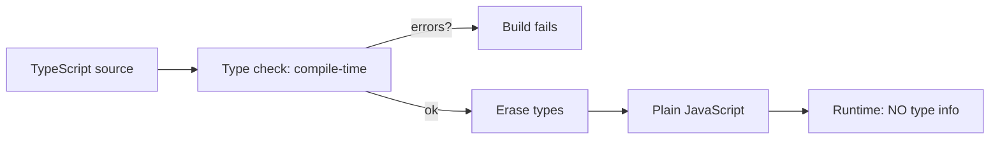
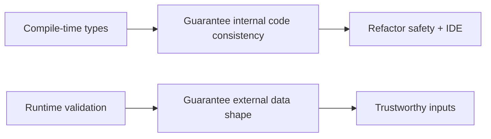
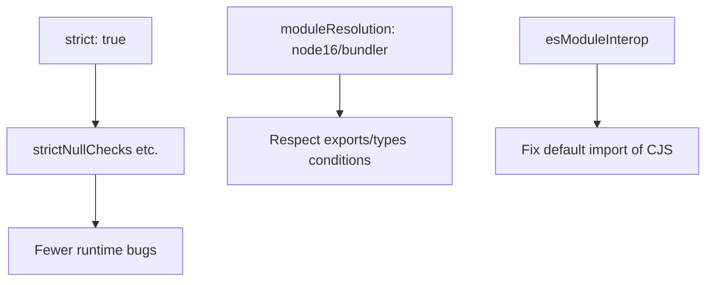

# TypeScript Interoperability

## Overview

TypeScript is a **structurally-typed superset of JavaScript** that adds a compile-time type system and **erases entirely** at build time—the runtime is plain JavaScript. This single fact drives everything about interoperability: types are a *development-time contract and tooling aid*, not a runtime guarantee. TypeScript cannot validate data crossing runtime boundaries (network, files, user input); it can only check that your *code* is internally consistent with the types you declared.

Interoperability is the discipline of making typed and untyped code coexist correctly: consuming JavaScript libraries from TypeScript (via `.d.ts` declaration files), publishing TypeScript libraries usable by both TS and JS consumers, and—critically—**bridging the gap between compile-time types and runtime reality** with validation. This note covers TypeScript as it *interoperates with the JavaScript language and package ecosystem*; it is not a full type-theory course. It depends on the [[02-JavaScript/01-Values-and-Types/JavaScript Type System|JavaScript type system]] and [[02-JavaScript/06-Modules-and-Tooling/Module Resolution and Package Exports|module resolution]], and complements [[02-JavaScript/07-Production-JavaScript/API Design and Defensive Programming|defensive programming]] and [[02-JavaScript/07-Production-JavaScript/Testing JavaScript|testing]].

## Learning Objectives

- Explain type erasure and its implications for runtime safety
- Understand structural typing vs nominal typing
- Consume JS libraries via `.d.ts` and DefinitelyTyped (`@types`)
- Publish libraries with correct `types` resolution for TS and JS consumers
- Bridge compile-time types to runtime with schema validation
- Configure strictness and interop flags (`strict`, `esModuleInterop`)

## Prerequisites

- [[02-JavaScript/01-Values-and-Types/JavaScript Type System|JavaScript Type System]]
- [[02-JavaScript/06-Modules-and-Tooling/Module Resolution and Package Exports|Module Resolution and Package Exports]]
- [[02-JavaScript/06-Modules-and-Tooling/Transpilation and Polyfills|Transpilation and Polyfills]]

## Difficulty

`advanced`

## Estimated Time

- Reading: 3 hours
- Exercises: 3–4 hours
- Mini project: 5 hours

## History

Microsoft released TypeScript in 2012 to bring optional static typing to large JavaScript codebases, deliberately choosing **structural** typing and **type erasure** to stay a true superset that compiles to idiomatic JS. **DefinitelyTyped** (community `.d.ts` repository, distributed as `@types/*`) let TypeScript consume the untyped npm world. As ESM/CJS interop grew complex, TypeScript added `esModuleInterop`, then multiple `moduleResolution` modes (`node16`, `bundler`) and support for the `exports`/`types` conditions. Runtime validation libraries (`zod`, `io-ts`, `valibot`) emerged to close the erasure gap. TypeScript now dominates professional JavaScript development.

## Problem It Solves

- **Lack of static typing**: large JS codebases suffer refactoring fear and shape bugs; types provide compile-time checking and IDE intelligence.
- **Consuming untyped libraries**: `.d.ts` files describe JS libraries so TS can type-check against them.
- **Publishing typed libraries**: correct `types` resolution gives consumers autocomplete and safety.
- **False confidence**: developers assume types protect at runtime; understanding erasure + validation prevents production data bugs.

## Internal Implementation

### Type erasure

The compiler checks types, then **removes them**, emitting plain JavaScript. There is no runtime type information from annotations.

```typescript
function greet(name: string): string { return `Hi ${name}`; }
// Emitted JS:  function greet(name) { return `Hi ${name}`; }
```

Consequence: at runtime `name` could be anything if the value came from outside type-checked code. Types are a *proof about your code*, not a *runtime gate*.



### Structural typing

TypeScript types are compatible if their **shapes** match, regardless of declared names ("duck typing" at compile time). This aligns with how JavaScript objects actually work.

```typescript
interface Point { x: number; y: number; }
function dist(p: Point) { return Math.hypot(p.x, p.y); }
dist({ x: 3, y: 4, label: "a" }); // OK: has x and y (extra props allowed via variable)
```

### Consuming JavaScript: declaration files

A `.d.ts` file describes the *types* of a JS module without implementation. Typed packages ship their own; untyped ones rely on community `@types/*`.

```typescript
// legacy-lib.d.ts — describes an untyped JS library
declare module "legacy-lib" {
  export function transform(input: string, opts?: { upper?: boolean }): string;
}
```

```mermaid
flowchart TD
    JSlib[Untyped JS library] --> DT{Ships types?}
    DT -- yes --> Bundled[.d.ts in package via exports types]
    DT -- no --> AT[@types/lib from DefinitelyTyped]
    Bundled --> TS[TypeScript consumer type-checks]
    AT --> TS
```

### Publishing: types resolution

A published TS library must expose `.d.ts` matching each runtime entry, via the `types` condition in [[02-JavaScript/06-Modules-and-Tooling/Module Resolution and Package Exports|`exports`]]. Getting the format wrong (e.g., CJS types for an ESM file) breaks consumers even though your code runs. Validate with `arethetypeswrong` and `publint`.

```json
{
  "exports": {
    ".": { "types": "./dist/index.d.ts", "import": "./dist/index.js" }
  }
}
```

### The erasure gap: runtime validation

Because types vanish, data from the network/DB/user must be **validated at runtime** and *inferred* back into types. Schema libraries do both at once.

```typescript
import { z } from "zod";
const User = z.object({ id: z.string().uuid(), age: z.number().int().min(0) });
type User = z.infer<typeof User>;              // static type
const user: User = User.parse(await res.json()); // runtime validation + typed result
```

`as` assertions (`json as User`) are a **lie to the compiler**—they assert without checking and are a common source of production bugs. Prefer validation over assertion at boundaries.

## Mermaid Diagrams

### Compile-time vs runtime responsibility



### Interop configuration flow



## Examples

### Minimal Example

```typescript
// Enable JS checking incrementally with JSDoc types (no rewrite needed)
// @ts-check
/** @param {number} a @param {number} b @returns {number} */
function add(a, b) { return a + b; }
add(1, "2"); // TS error even in a .js file with checkJs
```

### Production-Shaped Example

A typed API boundary that validates at runtime, so compile-time types and runtime reality agree—this is the crux of safe interop with untyped inputs:

```typescript
import { z } from "zod";

const CreateOrder = z.object({
  items: z.array(z.object({ sku: z.string(), qty: z.number().int().positive() })),
  couponCode: z.string().max(32).optional(),
});
type CreateOrder = z.infer<typeof CreateOrder>;

app.post("/orders", async (req, res, next) => {
  const parsed = CreateOrder.safeParse(req.body);
  if (!parsed.success) {
    return res.status(400).json({ error: "invalid_body", issues: parsed.error.issues });
  }
  const order: CreateOrder = parsed.data; // now genuinely this shape at runtime
  res.status(201).json(await createOrder(order));
});
```

Adopt TypeScript with `strict: true` (its individual flags catch the largest bug classes—null/undefined especially), pick `moduleResolution` matching your toolchain (`bundler` for Vite/webpack apps, `node16` for Node libraries), and validate published types in CI. Treat `any` and `as` as code smells to be justified. For gradual migration, enable `checkJs`/JSDoc on existing `.js` files before converting.

## Trade-offs

| Dimension | Upside | Downside | When it matters |
| --- | --- | --- | --- |
| Static types | Refactor safety, IDE, docs | Build step, learning curve | Any non-trivial codebase |
| `strict` mode | Catches null/shape bugs | More upfront annotations | New projects |
| `as` assertions | Quick escape hatch | Bypasses safety, hides bugs | Avoid at boundaries |
| Runtime validation | Real safety at boundaries | Extra code + latency | External input |
| DefinitelyTyped | Types for untyped libs | May lag/be inaccurate | Legacy dependencies |

### When to Use

- Any codebase beyond a small script; especially team/long-lived projects.
- Boundaries handling external data (pair types with schema validation).
- Published libraries (ship accurate `.d.ts`).

### When Not to Use

- Throwaway scripts where a build step adds no value.
- Don't use `as`/`any` to silence errors at trust boundaries—validate instead.
- Don't assume types replace tests or input validation.

## Exercises

1. Write a `.d.ts` for a small untyped JS module and consume it type-safely.
2. Demonstrate a bug that `strictNullChecks` catches that JS would not.
3. Show how an `as User` assertion lets malformed runtime data through; fix with `zod`.
4. Publish a tiny dual (ESM+types) package and validate it with `arethetypeswrong`.
5. Add `// @ts-check` + JSDoc to a `.js` file and fix the errors it surfaces.

## Mini Project

**Schema-to-Types Bridge**: Build (or wire) a validation schema that both validates at runtime and infers TypeScript types, then generate an OpenAPI/JSON-Schema from it for external consumers. Cross-link to [[02-JavaScript/07-Production-JavaScript/API Design and Defensive Programming|API Design and Defensive Programming]].

## Portfolio Project

Add a **types-health checker** to the [[02-JavaScript/projects/JavaScript Runtime Toolkit/README|JavaScript Runtime Toolkit]]: validate a package's `types` resolution across conditions, flag `any`/`as` hotspots, and report boundaries lacking runtime validation.

## Interview Questions

1. What is type erasure and why does it mean types don't protect at runtime?
2. Explain structural typing with an example.
3. How does TypeScript consume an untyped JS library?
4. Why is `as` dangerous at a data boundary, and what should you use instead?
5. How do you correctly publish types for both ESM and CJS consumers?

### Stretch / Staff-Level

1. Design a strategy to migrate a large JS codebase to strict TypeScript incrementally.
2. How do compile-time types and runtime validation divide responsibility in a service, and where do teams get it wrong?

## Common Mistakes

- Believing types provide runtime safety; skipping validation of external data.
- Overusing `any` and `as`, silencing the type checker instead of fixing shapes.
- Publishing mismatched types (CJS types for ESM files) that break consumers.
- Not enabling `strict`, missing null/undefined bugs.
- Choosing the wrong `moduleResolution`, causing resolution mismatches with the runtime.

## Best Practices

- Enable `strict`; treat `any`/`as` as smells needing justification.
- Validate all external data at runtime and infer types from schemas.
- Ship and CI-verify accurate `.d.ts` via the `types` export condition.
- Match `moduleResolution` to your toolchain; keep types and runtime aligned.
- Migrate gradually with `checkJs`/JSDoc before full conversion.

## Summary

TypeScript is erased, structurally-typed JavaScript: it guarantees your *code* is internally consistent and supercharges refactoring and tooling, but provides **no runtime protection**. Safe interoperability therefore has two halves—consuming/publishing accurate declaration files so typed and untyped code cooperate, and closing the erasure gap with runtime validation (schemas) at every boundary where external data enters. Use `strict` mode, avoid `as`/`any` escapes at boundaries, and align module/types resolution with your runtime. Types plus validation plus tests together produce JavaScript that is both maintainable and correct.

## Further Reading

- [[02-JavaScript/07-Production-JavaScript/API Design and Defensive Programming|API Design and Defensive Programming]]
- [[02-JavaScript/06-Modules-and-Tooling/Module Resolution and Package Exports|Module Resolution and Package Exports]]
- [[00-References/JavaScript/README|JavaScript References]]
- TypeScript Handbook; DefinitelyTyped; `arethetypeswrong`; zod docs

## Related Notes

- [[02-JavaScript/01-Values-and-Types/JavaScript Type System|JavaScript Type System]]
- [[02-JavaScript/07-Production-JavaScript/Testing JavaScript|Testing JavaScript]]
- [[02-JavaScript/code/README|JavaScript code labs]]
- [[06-NodeJS/README|Node.js]] · [[07-Backend/README|Backend]]
- [[02-JavaScript/README|JavaScript Track]]

## Progress Checklist

- [ ] Explained from first principles
- [ ] Drew at least one Mermaid diagram
- [ ] Implemented a minimal version
- [ ] Documented trade-offs and non-goals
- [ ] Completed exercises
- [ ] Practiced interview questions aloud
- [ ] Linked prerequisites and dependents
