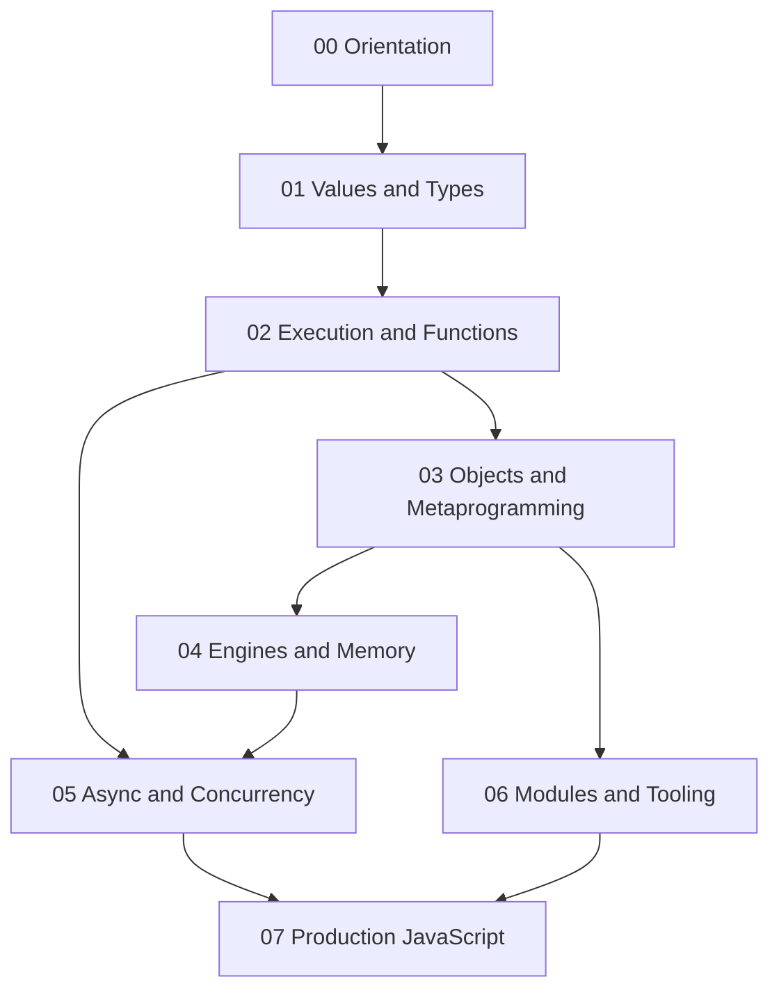

# 02 JavaScript

A first-principles track for understanding ECMAScript semantics, object models, execution contexts, engines, asynchronous behavior, modules, and production engineering.

## Objectives

- Distinguish ECMAScript, JavaScript engines, and host runtimes
- Predict coercion, scope, closure, `this`, and prototype behavior
- Understand parsing, bytecode, JIT optimization, and garbage collection
- Explain the event loop, promises, microtasks, cancellation, and workers
- Build core mechanisms such as Promise, EventEmitter, and a module loader
- Write secure, observable, testable JavaScript for production

## Why This Track Matters

JavaScript is deceptively accessible: syntax is easy, but production failures emerge from implicit conversion, mutable object graphs, closure lifetimes, asynchronous scheduling, module boundaries, and engine heuristics. Framework knowledge cannot replace the language model underneath it.

## Scope Boundaries

| This track owns | Handoff |
| --- | --- |
| ECMAScript syntax and semantics | — |
| Values, coercion, functions, objects, prototypes | — |
| Engine pipeline, JIT, GC, optimization behavior | [[01-Computer-Science/README\|Computer Science]] foundations |
| Event loop and async semantics across hosts | [[06-NodeJS/02-Event-Loop-and-libuv/Event Loop Phases\|Event Loop Phases]] and [[06-NodeJS/README\|Node.js]] for libuv/Node operations |
| ESM, CommonJS concepts, package/tooling contracts | Node.js for server deployment; frontend tracks for UI tooling |
| DOM/Web API boundary as a host concept | Future frontend/React material for browser application architecture |
| TypeScript interoperability principles | TypeScript usage inside projects; not a separate type-theory replacement |
| API/backend architecture | [[07-Backend/02-Frameworks-and-Middleware/Express Application and Router Internals\|Express Application and Router Internals]] · [[07-Backend/README\|Backend]] |

## Prerequisites

- [[01-Computer-Science/00-Orientation/How Computers Run Programs|How Computers Run Programs]]
- [[01-Computer-Science/03-Memory-and-Addressing/Garbage Collection Models|Garbage Collection Models]]
- [[01-Computer-Science/05-Concurrency-Fundamentals/Asynchronous Event-Driven Models|Asynchronous Event-Driven Models]]
- [[01-Computer-Science/08-Languages-and-Computation/Compilers Interpreters and Virtual Machines|Compilers Interpreters and Virtual Machines]]

## Roadmap

## Topics

### 00 — Orientation

- [[02-JavaScript/00-Orientation/Why JavaScript Exists|Why JavaScript Exists]]
- [[02-JavaScript/00-Orientation/ECMAScript Engines and Host Runtimes|ECMAScript Engines and Host Runtimes]]
- [[02-JavaScript/00-Orientation/JavaScript Program Lifecycle|JavaScript Program Lifecycle]]
- [[02-JavaScript/00-Orientation/Strict Mode|Strict Mode]]

### 01 — Values and Types

- [[02-JavaScript/01-Values-and-Types/JavaScript Type System|JavaScript Type System]]
- [[02-JavaScript/01-Values-and-Types/Primitive Values and Objects|Primitive Values and Objects]]
- [[02-JavaScript/01-Values-and-Types/Numbers BigInt and Numeric Precision|Numbers BigInt and Numeric Precision]]
- [[02-JavaScript/01-Values-and-Types/Strings Unicode and Template Literals|Strings Unicode and Template Literals]]
- [[02-JavaScript/01-Values-and-Types/Null Undefined and Missing Values|Null Undefined and Missing Values]]
- [[02-JavaScript/01-Values-and-Types/Symbols and Unique Property Keys|Symbols and Unique Property Keys]]
- [[02-JavaScript/01-Values-and-Types/Type Coercion|Type Coercion]]
- [[02-JavaScript/01-Values-and-Types/Equality and Sameness|Equality and Sameness]]
- [[02-JavaScript/01-Values-and-Types/Value Copying Sharing and Mutation|Value Copying Sharing and Mutation]]

### 02 — Execution and Functions

- [[02-JavaScript/02-Execution-and-Functions/Lexical Grammar and Automatic Semicolon Insertion|Lexical Grammar and Automatic Semicolon Insertion]]
- [[02-JavaScript/02-Execution-and-Functions/Declarations Hoisting and Temporal Dead Zone|Declarations Hoisting and Temporal Dead Zone]]
- [[02-JavaScript/02-Execution-and-Functions/Lexical Scope and Environment Records|Lexical Scope and Environment Records]]
- [[02-JavaScript/02-Execution-and-Functions/Execution Contexts and Call Stack|Execution Contexts and Call Stack]]
- [[02-JavaScript/02-Execution-and-Functions/Functions as Values|Functions as Values]]
- [[02-JavaScript/02-Execution-and-Functions/Closures|Closures]]
- [[02-JavaScript/02-Execution-and-Functions/This Binding|This Binding]]
- [[02-JavaScript/02-Execution-and-Functions/Arrow Functions|Arrow Functions]]
- [[02-JavaScript/02-Execution-and-Functions/Parameters Rest Spread and Destructuring|Parameters Rest Spread and Destructuring]]
- [[02-JavaScript/02-Execution-and-Functions/Recursion Tail Calls and Stack Limits|Recursion Tail Calls and Stack Limits]]

### 03 — Objects and Metaprogramming

- [[02-JavaScript/03-Objects-and-Metaprogramming/Objects and Property Keys|Objects and Property Keys]]
- [[02-JavaScript/03-Objects-and-Metaprogramming/Property Descriptors and Object Integrity|Property Descriptors and Object Integrity]]
- [[02-JavaScript/03-Objects-and-Metaprogramming/Prototype Chain and Delegation|Prototype Chain and Delegation]]
- [[02-JavaScript/03-Objects-and-Metaprogramming/Constructor Functions and New|Constructor Functions and New]]
- [[02-JavaScript/03-Objects-and-Metaprogramming/Classes and Private Fields|Classes and Private Fields]]
- [[02-JavaScript/03-Objects-and-Metaprogramming/Arrays and Array-Like Objects|Arrays and Array-Like Objects]]
- [[02-JavaScript/03-Objects-and-Metaprogramming/Map Set WeakMap and WeakSet|Map Set WeakMap and WeakSet]]
- [[02-JavaScript/03-Objects-and-Metaprogramming/Iterators and Generators|Iterators and Generators]]
- [[02-JavaScript/03-Objects-and-Metaprogramming/Proxy and Reflect|Proxy and Reflect]]
- [[02-JavaScript/03-Objects-and-Metaprogramming/JSON Structured Clone and Serialization|JSON Structured Clone and Serialization]]

### 04 — Engines and Memory

- [[02-JavaScript/04-Engines-and-Memory/Parsing AST and Bytecode|Parsing AST and Bytecode]]
- [[02-JavaScript/04-Engines-and-Memory/Interpreters JIT and Optimization Tiers|Interpreters JIT and Optimization Tiers]]
- [[02-JavaScript/04-Engines-and-Memory/Hidden Classes Shapes and Inline Caches|Hidden Classes Shapes and Inline Caches]]
- [[02-JavaScript/04-Engines-and-Memory/JavaScript Memory Model|JavaScript Memory Model]]
- [[02-JavaScript/04-Engines-and-Memory/Garbage Collection in JavaScript|Garbage Collection in JavaScript]]
- [[02-JavaScript/04-Engines-and-Memory/Memory Leaks and Retention|Memory Leaks and Retention]]
- [[02-JavaScript/04-Engines-and-Memory/Deoptimization and Performance Cliffs|Deoptimization and Performance Cliffs]]
- [[02-JavaScript/04-Engines-and-Memory/Host Environments and Web APIs|Host Environments and Web APIs]]

### 05 — Asynchronous JavaScript and Concurrency

- [[02-JavaScript/05-Async-and-Concurrency/Run to Completion and Event Loop|Run to Completion and Event Loop]]
- [[02-JavaScript/05-Async-and-Concurrency/Tasks Microtasks and Rendering|Tasks Microtasks and Rendering]]
- [[02-JavaScript/05-Async-and-Concurrency/Callbacks and Inversion of Control|Callbacks and Inversion of Control]]
- [[02-JavaScript/05-Async-and-Concurrency/Promises Internals|Promises Internals]]
- [[02-JavaScript/05-Async-and-Concurrency/Async and Await|Async and Await]]
- [[02-JavaScript/05-Async-and-Concurrency/Async Iteration and Streams|Async Iteration and Streams]]
- [[02-JavaScript/05-Async-and-Concurrency/Errors Across Async Boundaries|Errors Across Async Boundaries]]
- [[02-JavaScript/05-Async-and-Concurrency/Cancellation Timeouts and AbortController|Cancellation Timeouts and AbortController]]
- [[02-JavaScript/05-Async-and-Concurrency/Concurrency Control and Backpressure|Concurrency Control and Backpressure]]
- [[02-JavaScript/05-Async-and-Concurrency/Web Workers Shared Memory and Atomics|Web Workers Shared Memory and Atomics]]

### 06 — Modules and Tooling

- [[02-JavaScript/06-Modules-and-Tooling/ES Modules|ES Modules]]
- [[02-JavaScript/06-Modules-and-Tooling/CommonJS and Interoperability|CommonJS and Interoperability]]
- [[02-JavaScript/06-Modules-and-Tooling/Module Resolution and Package Exports|Module Resolution and Package Exports]]
- [[02-JavaScript/06-Modules-and-Tooling/Package JSON and Semantic Versioning|Package JSON and Semantic Versioning]]
- [[02-JavaScript/06-Modules-and-Tooling/Transpilation and Polyfills|Transpilation and Polyfills]]
- [[02-JavaScript/06-Modules-and-Tooling/Bundling Tree Shaking and Code Splitting|Bundling Tree Shaking and Code Splitting]]
- [[02-JavaScript/06-Modules-and-Tooling/Source Maps and Debug Builds|Source Maps and Debug Builds]]

### 07 — Production JavaScript

- [[02-JavaScript/07-Production-JavaScript/Error Design and Exception Safety|Error Design and Exception Safety]]
- [[02-JavaScript/07-Production-JavaScript/Testing JavaScript|Testing JavaScript]]
- [[02-JavaScript/07-Production-JavaScript/Debugging JavaScript|Debugging JavaScript]]
- [[02-JavaScript/07-Production-JavaScript/Measuring and Optimizing Performance|Measuring and Optimizing Performance]]
- [[02-JavaScript/07-Production-JavaScript/Secure JavaScript Practices|Secure JavaScript Practices]]
- [[02-JavaScript/07-Production-JavaScript/TypeScript Interoperability|TypeScript Interoperability]]
- [[02-JavaScript/07-Production-JavaScript/API Design and Defensive Programming|API Design and Defensive Programming]]
- [[02-JavaScript/07-Production-JavaScript/Observability and Operational Readiness|Observability and Operational Readiness]]

## Suggested Study Order

1. Orientation and values before relying on framework conventions
2. Execution/functions before objects and asynchronous behavior
3. Objects before engine optimization mechanics
4. Event loop and promises before Node.js or frontend frameworks
5. Modules/tooling before production packaging
6. Production module and projects as track synthesis

## Mini Projects

- [[02-JavaScript/projects/Promise From Scratch/README|Promise From Scratch]]
- [[02-JavaScript/projects/EventEmitter From Scratch/README|EventEmitter From Scratch]]
- [[02-JavaScript/projects/Module Loader Lab/README|Module Loader Lab]]
- [[02-JavaScript/projects/Reactive State with Proxy/README|Reactive State with Proxy]]
- [[02-JavaScript/projects/Concurrency Limiter/README|Concurrency Limiter]]

## Portfolio Project

- [[02-JavaScript/projects/JavaScript Runtime Toolkit/README|JavaScript Runtime Toolkit]]

## Exercises

Module sets live under [[02-JavaScript/_exercises/README|JavaScript Exercises]].

## Interview Questions

Module sets live under [[02-JavaScript/_interview/README|JavaScript Interview Questions]].

## Implementation Checklist

- [x] `ToPrimitive` / coercion demonstrator
- [x] Prototype-chain object model
- [x] `new`, `call`, `apply`, and `bind` mechanics
- [x] Iterator/generator protocol exercises
- [x] Promise/A+ inspired implementation
- [x] EventEmitter with listener lifecycle
- [x] Concurrency limiter with cancellation
- [x] Minimal ESM dependency graph loader
- [x] Proxy-based reactive state
- [x] Runtime toolkit portfolio project

## References

- [[00-References/JavaScript/README|JavaScript References]]

## Related Tracks

- [[01-Computer-Science/README|Computer Science]]
- [[03-Python/README|Python]]
- [[06-NodeJS/README|Node.js]]
- [[07-Backend/README|Backend]]
- [[17-Architecture/README|Architecture]]
- [[18-Security/README|Security]]

## Stage Gate Checklist

- [ ] Can predict coercion, closure, `this`, and prototype behavior
- [ ] Can explain event-loop ordering without memorized slogans
- [ ] Can read package/module boundaries and diagnose interop failures
- [ ] Code labs pass with edge-case tests
- [ ] At least three mini projects and portfolio documentation completed
- [ ] Interview sets practiced with first-principles explanations
