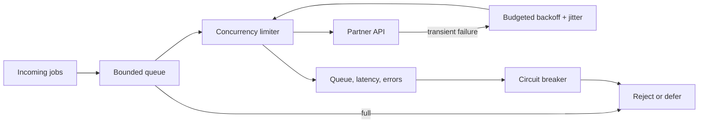

# Async and Concurrency Exercises

Treat asynchronous JavaScript as ordered jobs, host queues, resource ownership, cancellation, and bounded work.

## Linked Topic

- [[02-JavaScript/05-Async-and-Concurrency/Run to Completion and Event Loop|Run to Completion and Event Loop]]
- [[02-JavaScript/05-Async-and-Concurrency/Tasks Microtasks and Rendering|Tasks Microtasks and Rendering]]
- [[02-JavaScript/05-Async-and-Concurrency/Promises Internals|Promises Internals]]
- [[02-JavaScript/05-Async-and-Concurrency/Async and Await|Async and Await]]
- [[02-JavaScript/05-Async-and-Concurrency/Cancellation Timeouts and AbortController|Cancellation Timeouts and AbortController]]
- [[02-JavaScript/05-Async-and-Concurrency/Concurrency Control and Backpressure|Concurrency Control and Backpressure]]
- [[02-JavaScript/05-Async-and-Concurrency/Web Workers Shared Memory and Atomics|Web Workers Shared Memory and Atomics]]

## Warm-up

1. Predict ordering among synchronous code, promise reactions, `queueMicrotask`, and timers in a stated host.
2. Explain promise resolution versus fulfillment and thenable assimilation.
3. Distinguish concurrency, parallelism, backpressure, rate limiting, and mutual exclusion.

## Core Drills

### Exercise 1 — Understand

**Prompt:** Draw task and microtask checkpoints for a program mixing promises, `async`/`await`, timers, and nested scheduling. Identify starvation risks and every point at which errors change representation.

**Acceptance criteria:**

- [ ] Output order is justified queue operation by queue operation
- [ ] Host-specific assumptions are explicit
- [ ] Rejections, thrown errors, and cancellation are distinguished

### Exercise 2 — Implement

**Prompt:** Extend `promise.ts`, `event-emitter.ts`, and `concurrency.ts` in [[02-JavaScript/code/README|JavaScript code labs]]. Implement thenable resolution, ordered reactions, bounded concurrency, abort propagation, and listener cleanup.

**Acceptance criteria:**

- [ ] Thenable cycles and double settlement are handled
- [ ] Concurrency never exceeds the configured limit
- [ ] Queued and active operations define cancellation behavior
- [ ] Includes deterministic tests or reproducible verification

### Exercise 3 — Optimize

**Prompt:** Tune an image pipeline whose unbounded `Promise.all` exhausts sockets and memory.

**Constraints:**

- Latency / memory / throughput target: at least 200 items/s, no more than 16 active operations, peak additional heap below 256 MB
- What may not change: result ordering, per-item error attribution, or cancellation

Measure throughput across limits and explain the knee where contention outweighs parallelism.

## Debugging Drill

**Broken behavior:** A request times out for the caller but underlying retries continue, eventually writing duplicate records.

**Expected investigation path:**

1. Correlate request, retry, and write lifetimes with trace IDs.
2. Propagate one abort signal through queue, retry, I/O, and delay.
3. Enforce an absolute deadline and idempotency key.
4. Test cancellation before start, during I/O, and immediately before commit.

## Production Scenario

A partner outage causes queue growth and retry amplification.

Define queue capacity, fairness, timeout budgets, retry eligibility, jitter, circuit breaking, idempotency, load shedding, and SLO alerts.

## Stretch

- Implement an async iterator with bounded buffering and early-return cleanup.
- Use a worker for CPU-bound work; compare clone versus transferable payloads.

## Solutions Notes

- Promise reactions run as jobs; timers are host scheduling, and exact phase details vary by host.
- Cancellation is a cooperative protocol and must cross every owned boundary.
- Backpressure controls admitted work; concurrency limits only active work.

## Related Notes

- [[02-JavaScript/05-Async-and-Concurrency/Errors Across Async Boundaries|Errors Across Async Boundaries]]
- [[02-JavaScript/code/README|JavaScript code labs]]
- [[02-JavaScript/_interview/Async and Concurrency Interview Questions|Async and Concurrency Interview Questions]]
