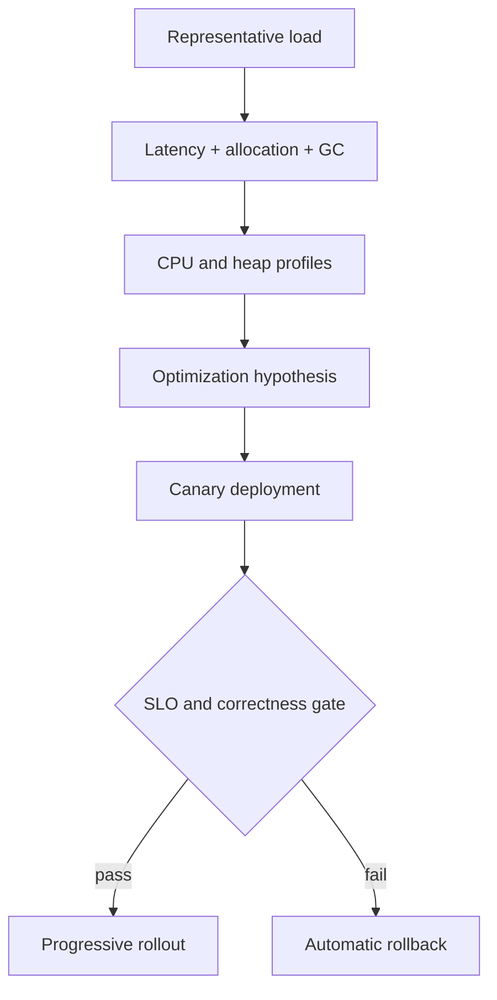

# Engines and Memory Exercises

Connect source semantics to parsing, execution tiers, object representation, reachability, and evidence-based performance work.

## Linked Topic

- [[02-JavaScript/04-Engines-and-Memory/Parsing AST and Bytecode|Parsing AST and Bytecode]]
- [[02-JavaScript/04-Engines-and-Memory/Interpreters JIT and Optimization Tiers|Interpreters JIT and Optimization Tiers]]
- [[02-JavaScript/04-Engines-and-Memory/Hidden Classes Shapes and Inline Caches|Hidden Classes Shapes and Inline Caches]]
- [[02-JavaScript/04-Engines-and-Memory/JavaScript Memory Model|JavaScript Memory Model]]
- [[02-JavaScript/04-Engines-and-Memory/Garbage Collection in JavaScript|Garbage Collection in JavaScript]]
- [[02-JavaScript/04-Engines-and-Memory/Memory Leaks and Retention|Memory Leaks and Retention]]
- [[02-JavaScript/04-Engines-and-Memory/Deoptimization and Performance Cliffs|Deoptimization and Performance Cliffs]]

## Warm-up

1. Order tokenization, parsing, bytecode generation, interpretation, profiling, optimization, and deoptimization.
2. Explain why “stack versus heap” is an implementation model, not a complete ECMAScript guarantee.
3. Distinguish allocation rate, live-set size, retained size, and garbage-collection pause.

## Core Drills

### Exercise 1 — Understand

**Prompt:** Analyze two semantically equivalent hot functions with stable versus varying object shapes and value types. Predict inline-cache states and likely deoptimization triggers, then mark which predictions are engine-specific.

**Acceptance criteria:**

- [ ] Language guarantees are separated from engine hypotheses
- [ ] Shape transitions and polymorphic call sites are traced
- [ ] Claims are framed for confirmation with profiler evidence

### Exercise 2 — Implement

**Prompt:** Add a benchmark and retention lab to [[02-JavaScript/code/README|JavaScript code labs]]. Compare stable and unstable object construction, then model roots and paths through a small object graph and report why a target remains reachable.

**Acceptance criteria:**

- [ ] Benchmark warms up, samples repeatedly, and reports distributions
- [ ] Correctness is checked outside timed sections
- [ ] Retention tests cover listeners, timers, closures, and weak metadata
- [ ] Includes tests or reproducible verification

### Exercise 3 — Optimize

**Prompt:** Reduce p99 latency in a parser processing 50,000 records per second.

**Constraints:**

- Latency / memory / throughput target: p99 below 20 ms, throughput at least 50,000 records/s, peak heap below 512 MB
- What may not change: accepted grammar, error positions, or output ordering

Profile CPU, allocation, and garbage collection; optimize only the measured bottleneck and compare confidence intervals.

## Debugging Drill

**Broken behavior:** A long-lived dashboard gains 30 MB per hour after users navigate repeatedly.

**Expected investigation path:**

1. Establish a repeatable navigation/GC baseline.
2. Compare heap snapshots and retained paths, not object counts alone.
3. Find detached views retained by a global listener registry.
4. Unsubscribe on teardown and add a soak-test memory budget.

## Production Scenario

A low-latency service deploys an optimization that improves average throughput but introduces periodic p99 stalls.

Define representative traffic, warm-up, canary gates, engine-version pinning, memory ceilings, and rollback. Reject benchmark conclusions based only on a single short run.

## Stretch

- Inspect AST and bytecode for optional chaining or generators and explain major lowering steps.
- Use finalization only for observation, then explain why correctness cannot depend on its timing.

## Solutions Notes

- JIT details are useful hypotheses but are not portable language contracts.
- A leak is unwanted retention relative to intended lifetime, even if every reference is valid.
- Tail latency often worsens through allocation bursts or deoptimization despite improved mean throughput.

## Related Notes

- [[02-JavaScript/04-Engines-and-Memory/Host Environments and Web APIs|Host Environments and Web APIs]]
- [[02-JavaScript/code/README|JavaScript code labs]]
- [[02-JavaScript/_interview/Engines and Memory Interview Questions|Engines and Memory Interview Questions]]
