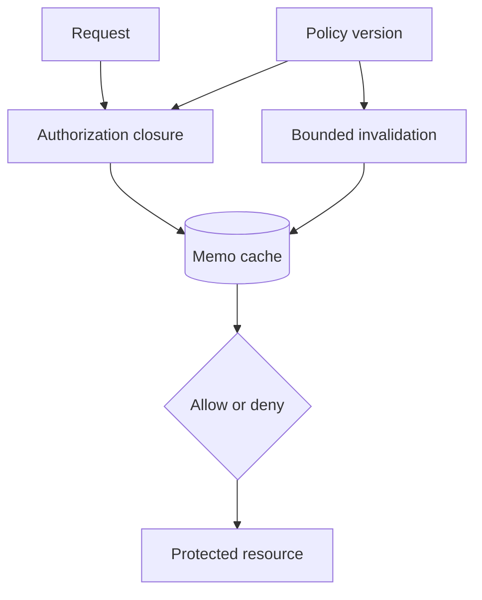

# Execution and Functions Exercises

Reason from lexical environments, execution contexts, call sites, and stack limits rather than syntax folklore.

## Linked Topic

- [[02-JavaScript/02-Execution-and-Functions/Declarations Hoisting and Temporal Dead Zone|Declarations Hoisting and Temporal Dead Zone]]
- [[02-JavaScript/02-Execution-and-Functions/Lexical Scope and Environment Records|Lexical Scope and Environment Records]]
- [[02-JavaScript/02-Execution-and-Functions/Execution Contexts and Call Stack|Execution Contexts and Call Stack]]
- [[02-JavaScript/02-Execution-and-Functions/Closures|Closures]]
- [[02-JavaScript/02-Execution-and-Functions/This Binding|This Binding]]
- [[02-JavaScript/02-Execution-and-Functions/Recursion Tail Calls and Stack Limits|Recursion Tail Calls and Stack Limits]]

## Warm-up

1. Predict access to `var`, `let`, function, and class declarations before their source positions.
2. Explain `this` for method, detached function, constructor, explicit binding, and arrow-function calls.
3. Identify which bindings a closure retains and why retained bindings can keep larger graphs alive.

## Core Drills

### Exercise 1 — Understand

**Prompt:** Annotate a nested program with environment records, binding initialization points, execution-context pushes, closure captures, and `this` resolution. Include default parameters and a loop containing asynchronous callbacks.

**Acceptance criteria:**

- [ ] Distinguishes binding creation from initialization
- [ ] Derives `this` from call form and lexical capture
- [ ] Predicts all output and errors before execution

### Exercise 2 — Implement

**Prompt:** In [[02-JavaScript/code/README|JavaScript code labs]], implement `once`, `memoize`, `partial`, and a teaching version of `bind`. Preserve receiver behavior, argument forwarding, thrown errors, and constructor use where the documented API promises it.

**Acceptance criteria:**

- [ ] Tests cover detached calls, explicit receivers, constructors, and exceptions
- [ ] Memoization documents key and lifetime policy
- [ ] Includes tests or reproducible verification

### Exercise 3 — Optimize

**Prompt:** Convert a recursive tree walk that overflows on deeply nested input into an iterative traversal.

**Constraints:**

- Latency / memory / throughput target: process depth 100,000 in under one second without stack overflow
- What may not change: preorder output, validation errors, or input immutability

Benchmark recursion and iteration on balanced and degenerate trees.

## Debugging Drill

**Broken behavior:** Event handlers all reference the final loop item, while a detached class method intermittently throws when reading `this.config`.

**Expected investigation path:**

1. Minimize each bug and inspect the call site and captured binding.
2. Replace shared `var` binding with per-iteration `let` or an explicit factory.
3. Preserve receiver through binding, wrapper, or API redesign.
4. Add tests that invoke callbacks exactly as the framework does.

## Production Scenario

A memoized authorization function captures a request object and returns stale decisions after policy changes.

Redesign cache keys, lifetime, invalidation, request-data capture, denial defaults, and metrics. Explain why a closure is not itself a leak but can create unintended reachability.

## Stretch

- Build a trampoline and compare it with an explicit stack.
- Demonstrate default-parameter scope differing from the function body scope.

## Solutions Notes

- Hoisting describes declaration processing; the temporal dead zone reflects an existing but uninitialized lexical binding.
- Ordinary-function `this` depends on invocation; arrow `this` resolves lexically.
- Optimization must preserve observable call and error semantics, not only returned values.

## Related Notes

- [[02-JavaScript/02-Execution-and-Functions/Arrow Functions|Arrow Functions]]
- [[02-JavaScript/code/README|JavaScript code labs]]
- [[02-JavaScript/_interview/Execution and Functions Interview Questions|Execution and Functions Interview Questions]]
