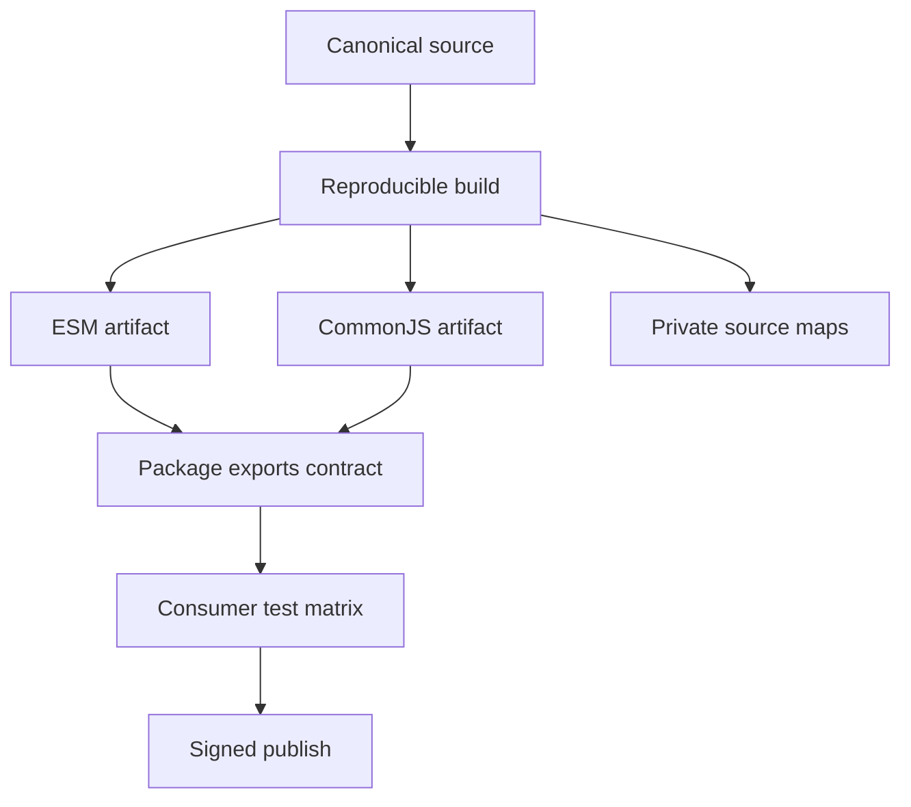

# Modules and Tooling Exercises

Treat modules and packages as executable graphs and versioned contracts rather than folders of source files.

## Linked Topic

- [[02-JavaScript/06-Modules-and-Tooling/ES Modules|ES Modules]]
- [[02-JavaScript/06-Modules-and-Tooling/CommonJS and Interoperability|CommonJS and Interoperability]]
- [[02-JavaScript/06-Modules-and-Tooling/Module Resolution and Package Exports|Module Resolution and Package Exports]]
- [[02-JavaScript/06-Modules-and-Tooling/Package JSON and Semantic Versioning|Package JSON and Semantic Versioning]]
- [[02-JavaScript/06-Modules-and-Tooling/Transpilation and Polyfills|Transpilation and Polyfills]]
- [[02-JavaScript/06-Modules-and-Tooling/Bundling Tree Shaking and Code Splitting|Bundling Tree Shaking and Code Splitting]]
- [[02-JavaScript/06-Modules-and-Tooling/Source Maps and Debug Builds|Source Maps and Debug Builds]]

## Warm-up

1. Contrast ESM live bindings with CommonJS exported values and cache behavior.
2. Explain module resolution as a host/tool contract rather than an ECMAScript filesystem rule.
3. Distinguish syntax transpilation, API polyfills, bundling, and minification.

## Core Drills

### Exercise 1 — Understand

**Prompt:** Trace linking and evaluation for an ESM graph with a cycle, top-level await, re-exports, and one CommonJS dependency. Identify temporal hazards and tool-specific interop assumptions.

**Acceptance criteria:**

- [ ] Separates parse, resolution, instantiation, and evaluation
- [ ] Explains live bindings and cycle visibility
- [ ] Marks behavior not guaranteed across runtimes or bundlers

### Exercise 2 — Implement

**Prompt:** Extend `module-graph.ts` in [[02-JavaScript/code/README|JavaScript code labs]] to parse a supplied dependency manifest, detect strongly connected components, produce deterministic evaluation groups, and explain missing or blocked exports.

**Acceptance criteria:**

- [ ] Cycles are reported without falsely treating every cycle as an error
- [ ] Ordering is deterministic for identical input
- [ ] Invalid specifiers and export paths produce actionable diagnostics
- [ ] Includes tests or reproducible verification

### Exercise 3 — Optimize

**Prompt:** Reduce initial JavaScript for a web entry point by analyzing the module graph.

**Constraints:**

- Latency / memory / throughput target: initial compressed payload below 150 KB and no more than 50 ms main-thread parse/evaluation on the reference device
- What may not change: public package API, first-render behavior, or source-map availability

Compare tree shaking, side-effect declarations, dynamic imports, and dependency replacement.

## Debugging Drill

**Broken behavior:** A dual ESM/CommonJS package creates two singleton instances and production stack traces point to minified generated lines.

**Expected investigation path:**

1. Inspect resolved entry points and package condition selection.
2. Confirm duplicate graph nodes and mixed import paths.
3. Unify exports around one implementation and test both consumers.
4. Publish and validate hidden production source maps with release identifiers.

## Production Scenario

A library must support Node.js ESM, CommonJS consumers, and bundlers while preventing accidental internal imports.

Specify `exports`, type declarations, side effects, supported runtimes, provenance, lockfile policy, compatibility tests, and rollback/deprecation rules.

## Stretch

- Write a source-map lookup demonstration for a transformed stack frame.
- Test a package through packed artifacts rather than its source workspace.

## Solutions Notes

- ESM cycles are supported, but reading an uninitialized binding can still fail.
- Package exports are both encapsulation and compatibility contracts.
- Bundle size work must include execution cost and behavior, not byte count alone.

## Related Notes

- [[02-JavaScript/code/README|JavaScript code labs]]
- [[02-JavaScript/_interview/Modules and Tooling Interview Questions|Modules and Tooling Interview Questions]]
- [[06-NodeJS/README|Node.js]]
