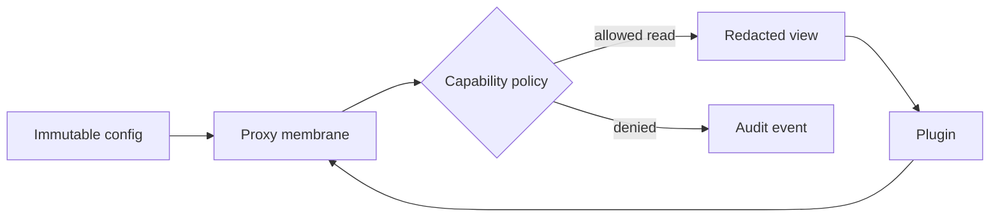

# Objects and Metaprogramming Exercises

Explore JavaScript objects as property records connected by delegation, then apply reflective power without breaking invariants.

## Linked Topic

- [[02-JavaScript/03-Objects-and-Metaprogramming/Property Descriptors and Object Integrity|Property Descriptors and Object Integrity]]
- [[02-JavaScript/03-Objects-and-Metaprogramming/Prototype Chain and Delegation|Prototype Chain and Delegation]]
- [[02-JavaScript/03-Objects-and-Metaprogramming/Constructor Functions and New|Constructor Functions and New]]
- [[02-JavaScript/03-Objects-and-Metaprogramming/Map Set WeakMap and WeakSet|Map Set WeakMap and WeakSet]]
- [[02-JavaScript/03-Objects-and-Metaprogramming/Iterators and Generators|Iterators and Generators]]
- [[02-JavaScript/03-Objects-and-Metaprogramming/Proxy and Reflect|Proxy and Reflect]]
- [[02-JavaScript/03-Objects-and-Metaprogramming/JSON Structured Clone and Serialization|JSON Structured Clone and Serialization]]

## Warm-up

1. Trace a property read and write through own descriptors and a three-level prototype chain.
2. Explain why `Map` is not merely an object with nicer keys and why weak collections are not enumerable.
3. State three Proxy invariants involving non-configurable properties or non-extensible targets.

## Core Drills

### Exercise 1 — Understand

**Prompt:** For an object containing data/accessor properties, symbols, inherited members, and a proxy, predict `in`, `hasOwn`, enumeration, assignment, deletion, and serialization behavior.

**Acceptance criteria:**

- [ ] Separates own, inherited, enumerable, and symbol-keyed properties
- [ ] Applies receiver-sensitive getter/setter behavior
- [ ] Identifies invalid proxy trap results

### Exercise 2 — Implement

**Prompt:** Extend `object-model.ts` and `reactive.ts` in [[02-JavaScript/code/README|JavaScript code labs]]. Implement prototype lookup, teaching versions of `new` and `bind`, an iterable range, and Proxy-based dependency tracking with cleanup.

**Acceptance criteria:**

- [ ] Prototype cycles and invalid constructors are rejected
- [ ] Iterator closes correctly on early termination
- [ ] Reactive effects unsubscribe from stale dependencies
- [ ] Includes tests or reproducible verification

### Exercise 3 — Optimize

**Prompt:** Select an index for millions of object-associated metadata entries.

**Constraints:**

- Latency / memory / throughput target: median lookup below 1 µs with no metadata-induced retention after owners become unreachable
- What may not change: object identity semantics and encapsulation

Compare object properties, `Map`, `WeakMap`, symbols, and private fields using measurements and lifecycle reasoning.

## Debugging Drill

**Broken behavior:** A reactive store triggers effects twice, leaks subscriptions, and violates a proxy invariant when a frozen target is inspected.

**Expected investigation path:**

1. Record dependency registration and trigger edges.
2. Deduplicate effects and remove prior dependencies before reruns.
3. Delegate default semantics through `Reflect`.
4. Test frozen, sealed, inherited, symbol, and accessor properties.

## Production Scenario

A plugin platform exposes a proxied configuration object to untrusted extensions.

Design revocation, identity preservation, nested-object wrapping, method receivers, serialization, and audit controls. Explain why a Proxy is not a complete security boundary without realm or process isolation.

## Stretch

- Implement a cycle-aware serializer with explicit type tags and prototype pollution defenses.
- Compare mixins, delegation, and composition for a resource with lifecycle state.

## Solutions Notes

- Property operations depend on descriptors and receivers, not only where a key is found.
- `Reflect` helps proxy traps preserve ordinary semantics, but policy must still enforce invariants.
- Weak keys allow metadata to follow owner reachability; they do not provide deterministic cleanup.

## Related Notes

- [[02-JavaScript/03-Objects-and-Metaprogramming/Classes and Private Fields|Classes and Private Fields]]
- [[02-JavaScript/code/README|JavaScript code labs]]
- [[02-JavaScript/_interview/Objects and Metaprogramming Interview Questions|Objects and Metaprogramming Interview Questions]]
