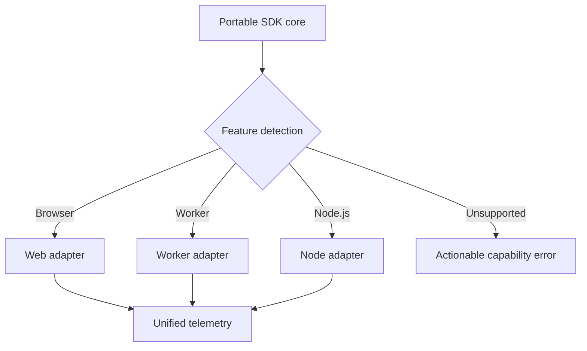

# Orientation Exercises

Separate language semantics from engine implementation and host capabilities before reasoning about JavaScript behavior.

## Linked Topic

- [[02-JavaScript/00-Orientation/Why JavaScript Exists|Why JavaScript Exists]]
- [[02-JavaScript/00-Orientation/ECMAScript Engines and Host Runtimes|ECMAScript Engines and Host Runtimes]]
- [[02-JavaScript/00-Orientation/JavaScript Program Lifecycle|JavaScript Program Lifecycle]]
- [[02-JavaScript/00-Orientation/Strict Mode|Strict Mode]]

## Warm-up

1. Classify `Array.prototype.map`, `fetch`, `setTimeout`, and `process.nextTick` as ECMAScript or host-provided facilities.
2. Explain why two conforming engines may have different performance but must produce the same observable language result.
3. Describe parse, instantiation, evaluation, and host scheduling in one sentence each.

## Core Drills

### Exercise 1 — Understand

**Prompt:** Given a browser script and a Node.js module using `globalThis`, timers, and an undeclared assignment, predict which behavior is specified by ECMAScript, which depends on the host, and which changes under strict mode. Draw the boundary between source, engine, and host.

**Acceptance criteria:**

- [ ] Every claim names its owner: specification, engine, or host
- [ ] Script and module strictness are distinguished
- [ ] Parse-time and runtime failures are separated

### Exercise 2 — Implement

**Prompt:** Add a runtime-capability probe to [[02-JavaScript/code/README|JavaScript code labs]]. Report engine/runtime versions and feature-detect `structuredClone`, `fetch`, `queueMicrotask`, and worker support without user-agent sniffing. Test present and absent capabilities through dependency injection.

**Acceptance criteria:**

- [ ] Probe never crashes when a global is absent
- [ ] Output distinguishes language, engine/runtime, and host APIs
- [ ] Includes deterministic tests and reproducible verification

### Exercise 3 — Optimize

**Prompt:** A CLI repeatedly performs expensive capability detection. Cache stable probe results while retaining a way to test dynamic or mocked hosts.

**Constraints:**

- Latency / memory / throughput target: 100,000 cached reads in under 25 ms on the documented machine
- What may not change: returned schema, feature-detection correctness, or test isolation

## Debugging Drill

**Broken behavior:** A library works in a classic browser script but throws `ReferenceError` as ESM because it assigns `telemetry = {}` without declaring it.

**Expected investigation path:**

1. Reproduce in classic-script and module contexts.
2. Identify implicit-global creation and automatic strict mode for modules.
3. Declare and export the binding explicitly.
4. Add an ESM regression test and lint rule against undeclared variables.

## Production Scenario

A shared SDK must run in browsers, workers, and Node.js without importing host-specific globals during module evaluation.

Define adapter contracts, lazy initialization, unsupported-host behavior, and a compatibility test matrix. Explain why bundler substitutions and global-name checks alone are insufficient.

## Stretch

- Compare the same syntax error and stack trace in two engines; document specified behavior versus diagnostics.
- Build a minimal realm experiment with an iframe or VM context and test cross-realm `instanceof`.

## Solutions Notes

- ECMAScript defines language semantics; hosts expose I/O and scheduling hooks; engines choose implementation strategies.
- Capability detection should ask whether required behavior exists, not infer it from a runtime name.
- ESM is strict by construction, so accidental globals fail instead of mutating the global object.

## Related Notes

- [[02-JavaScript/code/README|JavaScript code labs]]
- [[02-JavaScript/_interview/Orientation Interview Questions|Orientation Interview Questions]]
- [[02-JavaScript/README|JavaScript]]
