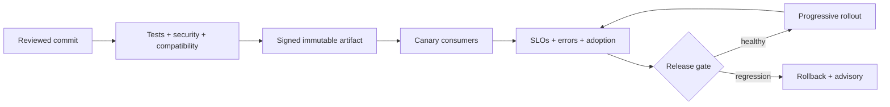

# Production JavaScript Exercises

Integrate correctness, security, testing, performance, type boundaries, observability, and safe delivery.

## Linked Topic

- [[02-JavaScript/07-Production-JavaScript/Error Design and Exception Safety|Error Design and Exception Safety]]
- [[02-JavaScript/07-Production-JavaScript/Testing JavaScript|Testing JavaScript]]
- [[02-JavaScript/07-Production-JavaScript/Debugging JavaScript|Debugging JavaScript]]
- [[02-JavaScript/07-Production-JavaScript/Measuring and Optimizing Performance|Measuring and Optimizing Performance]]
- [[02-JavaScript/07-Production-JavaScript/Secure JavaScript Practices|Secure JavaScript Practices]]
- [[02-JavaScript/07-Production-JavaScript/TypeScript Interoperability|TypeScript Interoperability]]
- [[02-JavaScript/07-Production-JavaScript/API Design and Defensive Programming|API Design and Defensive Programming]]
- [[02-JavaScript/07-Production-JavaScript/Observability and Operational Readiness|Observability and Operational Readiness]]

## Warm-up

1. Classify operational, programmer, validation, dependency, and cancellation errors and state who can recover.
2. Explain why TypeScript types disappear at runtime and where validation remains mandatory.
3. Distinguish logs, metrics, traces, profiles, and audit events by the question each answers.

## Core Drills

### Exercise 1 — Understand

**Prompt:** Review a payment workflow for unsafe parsing, mutable shared state, swallowed errors, non-idempotent retries, secret leakage, unbounded concurrency, and missing telemetry. Rank risks by impact and likelihood.

**Acceptance criteria:**

- [ ] Every risk names a failure mode and trust boundary
- [ ] Controls include prevention, detection, and recovery
- [ ] Business invariants and SLOs are explicit

### Exercise 2 — Implement

**Prompt:** Build a production facade around selected [[02-JavaScript/code/README|JavaScript code labs]]. Add runtime input validation, stable error codes with causes, abort-aware deadlines, structured redacted logs, metrics, tracing hooks, and unit/integration/fault-injection tests.

**Acceptance criteria:**

- [ ] Public API is documented and backward-compatible within its version
- [ ] Secrets and sensitive payloads are redacted by construction
- [ ] Tests cover timeout, cancellation, partial failure, and cleanup
- [ ] Includes tests or reproducible verification

### Exercise 3 — Optimize

**Prompt:** Improve a production endpoint only after establishing a benchmark and trace baseline.

**Constraints:**

- Latency / memory / throughput target: p95 below 100 ms, p99 below 250 ms, error rate below 0.1%, and peak heap below 512 MB
- What may not change: authorization, validation, error contract, telemetry, or correctness tests

Use canary comparison and include a rollback threshold.

## Debugging Drill

**Broken behavior:** Following a release, p99 latency and error rate rise only for large tenants; logs lack tenant-safe correlation and retries amplify load.

**Expected investigation path:**

1. Stop amplification with rollback, traffic shaping, or retry disablement.
2. Segment metrics by safe cardinality and correlate traces to the release.
3. Reproduce using size distributions and dependency faults.
4. Fix the bottleneck, add regression/load tests, and document the incident.

## Production Scenario

A security-sensitive SDK release needs progressive delivery across heterogeneous consumers.

Design provenance, dependency scanning, contract tests, feature flags, versioning, observability, support windows, incident ownership, and rollback.

## Stretch

- Threat-model prototype pollution, injection, supply-chain compromise, and sensitive-data exposure.
- Define a chaos test that proves cleanup and idempotency under repeated partial failures.

## Solutions Notes

- Runtime boundaries require validation regardless of static types.
- Observability should preserve correlation while constraining sensitive data and metric cardinality.
- A safe optimization has a baseline, correctness oracle, representative load, staged rollout, and rollback.

## Related Notes

- [[18-Security/README|Security]]
- [[02-JavaScript/code/README|JavaScript code labs]]
- [[02-JavaScript/_interview/Production JavaScript Interview Questions|Production JavaScript Interview Questions]]
