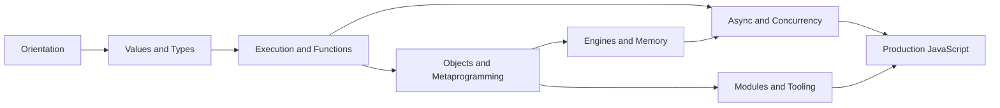

# JavaScript Exercises

Eight production-oriented sets move from semantic prediction to implementation, measurement, debugging, and operational design.

## Learning Path

## Exercise Sets

1. [[02-JavaScript/_exercises/Orientation Exercises|Orientation Exercises]] — standards, engines, hosts, lifecycle, and strict mode
2. [[02-JavaScript/_exercises/Values and Types Exercises|Values and Types Exercises]] — values, coercion, equality, Unicode, and mutation
3. [[02-JavaScript/_exercises/Execution and Functions Exercises|Execution and Functions Exercises]] — scope, closures, `this`, and stack behavior
4. [[02-JavaScript/_exercises/Objects and Metaprogramming Exercises|Objects and Metaprogramming Exercises]] — descriptors, prototypes, collections, iteration, and proxies
5. [[02-JavaScript/_exercises/Engines and Memory Exercises|Engines and Memory Exercises]] — parsing, JIT behavior, garbage collection, and retention
6. [[02-JavaScript/_exercises/Async and Concurrency Exercises|Async and Concurrency Exercises]] — event loops, promises, cancellation, and backpressure
7. [[02-JavaScript/_exercises/Modules and Tooling Exercises|Modules and Tooling Exercises]] — module graphs, package contracts, builds, and source maps
8. [[02-JavaScript/_exercises/Production JavaScript Exercises|Production JavaScript Exercises]] — reliability, security, testing, performance, and observability

## Completion Standard

- Predict behavior before running code, then explain mismatches from first principles.
- Implement the named mechanism with deterministic tests in [[02-JavaScript/code/README|JavaScript code labs]].
- Measure before optimizing and preserve a correctness oracle.
- Record a minimal reproduction, root cause, regression test, and operational guardrail for debugging drills.
- Complete each Mermaid production scenario with ownership, failure modes, telemetry, and rollback.

## Related Notes

- [[02-JavaScript/README|JavaScript]]
- [[02-JavaScript/code/README|JavaScript code labs]]
- [[02-JavaScript/_interview/README|JavaScript Interview Questions]]
