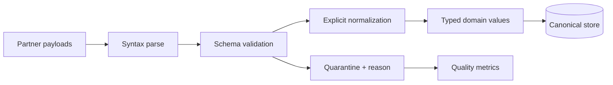

# Values and Types Exercises

Make conversion, sameness, numeric precision, Unicode, and reference sharing explicit at system boundaries.

## Linked Topic

- [[02-JavaScript/01-Values-and-Types/JavaScript Type System|JavaScript Type System]]
- [[02-JavaScript/01-Values-and-Types/Numbers BigInt and Numeric Precision|Numbers BigInt and Numeric Precision]]
- [[02-JavaScript/01-Values-and-Types/Strings Unicode and Template Literals|Strings Unicode and Template Literals]]
- [[02-JavaScript/01-Values-and-Types/Type Coercion|Type Coercion]]
- [[02-JavaScript/01-Values-and-Types/Equality and Sameness|Equality and Sameness]]
- [[02-JavaScript/01-Values-and-Types/Value Copying Sharing and Mutation|Value Copying Sharing and Mutation]]

## Warm-up

1. Predict `Object.is(NaN, NaN)`, `Object.is(0, -0)`, `0n == 0`, and `[] == ![]`; justify each algorithmically.
2. Explain why UTF-16 code units, Unicode code points, and grapheme clusters can yield different lengths.
3. Draw the object graph after a shallow spread of a nested configuration object.

## Core Drills

### Exercise 1 — Understand

**Prompt:** Trace `ToPrimitive`, `ToNumber`, and equality steps for five mixed-type comparisons, including an object with `Symbol.toPrimitive`, a `BigInt`, `null`, and an empty string. State where an exception can occur.

**Acceptance criteria:**

- [ ] Uses abstract-operation order rather than memorized outcomes
- [ ] Distinguishes `===`, `Object.is`, and SameValueZero
- [ ] Identifies precision and `BigInt` mixing hazards

### Exercise 2 — Implement

**Prompt:** Extend the coercion demonstrator in [[02-JavaScript/code/README|JavaScript code labs]] with trace output for simplified `ToPrimitive`, numeric parsing, and configurable equality. Add a money parser that rejects unsafe numbers, ambiguous separators, infinities, and implicit string coercion.

**Acceptance criteria:**

- [ ] Trace records each conversion decision
- [ ] Tests cover `NaN`, signed zero, numeric boundaries, symbols, and hostile coercion hooks
- [ ] Includes tests or reproducible verification

### Exercise 3 — Optimize

**Prompt:** Normalize and deduplicate one million user identifiers containing non-ASCII text.

**Constraints:**

- Latency / memory / throughput target: complete within 750 ms and 200 MB peak additional heap on the documented machine
- What may not change: NFC normalization, locale-independent comparison, first-seen ordering

Measure normalization cost, avoid repeated conversion, and compare `Set` with sort-and-unique.

## Debugging Drill

**Broken behavior:** Order totals occasionally differ by one cent, and customer names containing emoji are truncated by a validation rule using `string.length`.

**Expected investigation path:**

1. Reproduce floating-point accumulation and surrogate-pair cases.
2. Replace binary floating-point money with integer minor units or a decimal library.
3. Define length in grapheme clusters with `Intl.Segmenter` where supported.
4. Add boundary, property-based, and cross-locale tests.

## Production Scenario

An ingestion service receives loosely typed JSON from three partners and must produce canonical domain values.

Specify null-versus-missing semantics, numeric limits, Unicode normalization, unknown fields, error redaction, and versioned contracts. Never use truthiness as schema validation.

## Stretch

- Write a property-based test for equality reflexivity and explain why `NaN` is the deliberate exception for `===`.
- Compare `structuredClone`, JSON round-tripping, and a custom copier on dates, maps, cycles, and accessors.

## Solutions Notes

- Convert at boundaries and keep domain representations unambiguous.
- SameValueZero is useful for collections because it treats `NaN` as equal and signed zeros alike.
- A shallow copy creates a new container but retains references to nested objects.

## Related Notes

- [[02-JavaScript/01-Values-and-Types/Null Undefined and Missing Values|Null Undefined and Missing Values]]
- [[02-JavaScript/code/README|JavaScript code labs]]
- [[02-JavaScript/_interview/Values and Types Interview Questions|Values and Types Interview Questions]]
