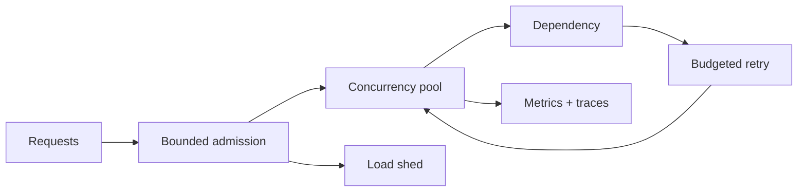

# Async and Concurrency Interview Questions

## Linked Topic

- [[02-JavaScript/05-Async-and-Concurrency/Run to Completion and Event Loop|Run to Completion and Event Loop]]
- [[02-JavaScript/05-Async-and-Concurrency/Tasks Microtasks and Rendering|Tasks Microtasks and Rendering]]
- [[02-JavaScript/05-Async-and-Concurrency/Promises Internals|Promises Internals]]
- [[02-JavaScript/05-Async-and-Concurrency/Async and Await|Async and Await]]
- [[02-JavaScript/05-Async-and-Concurrency/Cancellation Timeouts and AbortController|Cancellation Timeouts and AbortController]]
- [[02-JavaScript/05-Async-and-Concurrency/Concurrency Control and Backpressure|Concurrency Control and Backpressure]]

## How to Practice

1. Simulate queues and checkpoints in order.
2. Define operation ownership and lifetime.
3. Include cancellation, backpressure, retries, and partial failure.

## Conceptual

1. How can JavaScript be concurrent when one agent runs one job at a time?
2. Compare tasks, promise jobs/microtasks, rendering opportunities, and host phases.
3. What is the difference between promise resolution, fulfillment, and rejection?
4. Distinguish timeout, cancellation, concurrency limiting, rate limiting, and backpressure.

## Internal Implementation

1. Explain thenable assimilation and why double settlement or self-resolution must be guarded.
2. Translate an `async` function into promise reactions conceptually.
3. Describe structured clone, transferables, shared memory, and Atomics for workers.

## Trade-offs and Judgment

1. When should work use promises, async iterators, streams, workers, or another process?
2. How do you choose a concurrency limit using latency, capacity, and downstream constraints?
3. What breaks first when retries have no deadline, jitter, idempotency, or retry budget?

## Coding / Design Prompts

1. Implement an abort-aware concurrency limiter with stable output ordering.
2. Implement a subset of Promise resolution with deterministic tests.
3. Design an async iterator whose producer cannot outrun its consumer.

## Production Scenario

Explain deadlines, abort propagation, fairness, queue limits, retry policy, circuit breaking, idempotency, and overload behavior.

## Staff-Level Follow-ups

1. How would you standardize cancellation across libraries with inconsistent APIs?
2. How would you identify and remove unbounded queues across an architecture?
3. How would you define ownership for retry policy between clients, services, and infrastructure?

## Rubric

| Signal | Weak | Strong |
| --- | --- | --- |
| First principles | “Event loop makes it async” | Traces jobs, host queues, and checkpoints |
| Trade-offs | Maximizes parallel calls | Balances throughput, capacity, ordering, fairness |
| Production sense | Adds a timeout | Propagates deadlines and controls overload end-to-end |

## Related Notes

- [[Career/README|Career]]
- [[02-JavaScript/_exercises/Async and Concurrency Exercises|Async and Concurrency Exercises]]
- [[02-JavaScript/code/README|JavaScript code labs]]
