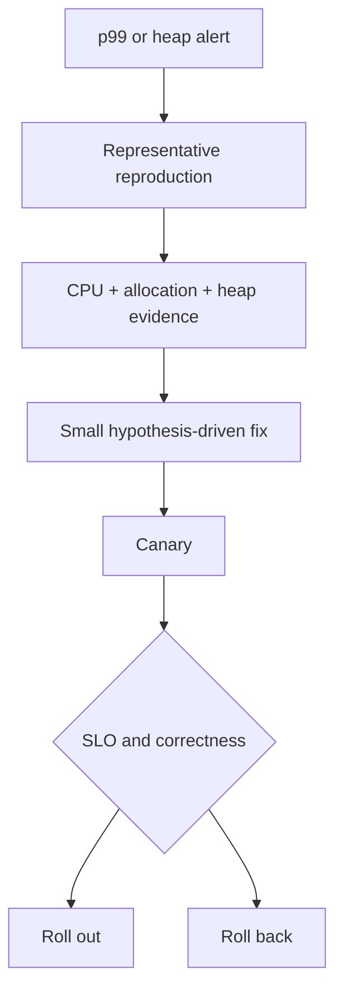

# Engines and Memory Interview Questions

## Linked Topic

- [[02-JavaScript/04-Engines-and-Memory/Parsing AST and Bytecode|Parsing AST and Bytecode]]
- [[02-JavaScript/04-Engines-and-Memory/Interpreters JIT and Optimization Tiers|Interpreters JIT and Optimization Tiers]]
- [[02-JavaScript/04-Engines-and-Memory/Hidden Classes Shapes and Inline Caches|Hidden Classes Shapes and Inline Caches]]
- [[02-JavaScript/04-Engines-and-Memory/Garbage Collection in JavaScript|Garbage Collection in JavaScript]]
- [[02-JavaScript/04-Engines-and-Memory/Memory Leaks and Retention|Memory Leaks and Retention]]
- [[02-JavaScript/04-Engines-and-Memory/Deoptimization and Performance Cliffs|Deoptimization and Performance Cliffs]]

## How to Practice

1. Label specification guarantees and engine-specific heuristics separately.
2. Base optimization answers on measurement.
3. Use roots and retained paths when discussing memory.

## Conceptual

1. Why do modern engines combine interpretation and compilation tiers?
2. What are object shapes and inline caches, and why are they not ECMAScript concepts?
3. What makes memory “leaked” in a garbage-collected runtime?
4. Compare latency, throughput, allocation rate, live set, and retained size.

## Internal Implementation

1. Walk source through AST, bytecode, profiling, optimized code, and deoptimization.
2. Explain generational collection and the weak generational hypothesis.
3. How can closures, listeners, timers, and caches create retained paths?

## Trade-offs and Judgment

1. When is shape stability worth considering, and when is it premature folklore?
2. Compare strong caches, weak metadata, bounded LRU, and explicit disposal.
3. What breaks first when a benchmark omits warm-up and representative data?

## Coding / Design Prompts

1. Design a statistically defensible microbenchmark harness with correctness checks.
2. Given heap-snapshot retained paths, identify likely owner and teardown fixes.
3. Rewrite a deep recursive traversal without changing output order.

## Production Scenario

Explain baselines, profiler overhead, engine versions, memory budgets, canary gates, and rollback.

## Staff-Level Follow-ups

1. How would you prevent engine folklore from becoming organization-wide coding rules?
2. How would you establish performance budgets and representative benchmark suites?
3. How would you lead an investigation when teams disagree over CPU versus memory root cause?

## Rubric

| Signal | Weak | Strong |
| --- | --- | --- |
| First principles | Repeats V8 trivia | Separates semantics, hypotheses, and evidence |
| Trade-offs | Optimizes syntax | Measures bottlenecks and lifecycle costs |
| Production sense | Uses one profile | Defines reproduction, canary, budgets, rollback |

## Related Notes

- [[Career/README|Career]]
- [[02-JavaScript/_exercises/Engines and Memory Exercises|Engines and Memory Exercises]]
- [[02-JavaScript/code/README|JavaScript code labs]]
