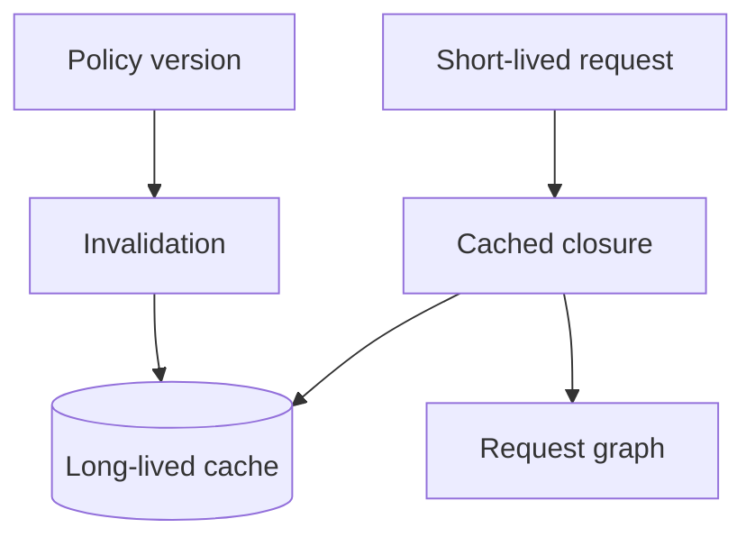

# Execution and Functions Interview Questions

## Linked Topic

- [[02-JavaScript/02-Execution-and-Functions/Declarations Hoisting and Temporal Dead Zone|Declarations Hoisting and Temporal Dead Zone]]
- [[02-JavaScript/02-Execution-and-Functions/Lexical Scope and Environment Records|Lexical Scope and Environment Records]]
- [[02-JavaScript/02-Execution-and-Functions/Execution Contexts and Call Stack|Execution Contexts and Call Stack]]
- [[02-JavaScript/02-Execution-and-Functions/Closures|Closures]]
- [[02-JavaScript/02-Execution-and-Functions/This Binding|This Binding]]
- [[02-JavaScript/02-Execution-and-Functions/Arrow Functions|Arrow Functions]]

## How to Practice

1. Draw environment records and call-stack transitions.
2. Derive `this` from the call expression.
3. Discuss lifetime, error propagation, and testability.

## Conceptual

1. What is lexical scope, and how does it differ from the dynamic call stack?
2. Why is “`let` is not hoisted” an inaccurate explanation of the temporal dead zone?
3. What does a closure close over: values, variables, or snapshots?
4. How do ordinary and arrow functions differ beyond shorter syntax?

## Internal Implementation

1. Describe execution-context creation and identifier resolution through environment records.
2. Walk `this` selection for method, detached, explicit, constructor, and arrow calls.
3. Why can recursion overflow even though heap memory remains available?

## Trade-offs and Judgment

1. When should a callback API bind receivers, accept explicit context, or avoid `this`?
2. What are the correctness and memory trade-offs of memoization closures?
3. When would iteration, a trampoline, or recursion be the clearest design?

## Coding / Design Prompts

1. Implement `once` and `memoize` with documented exception and cache-lifetime semantics.
2. Implement a teaching `bind` and discuss constructor behavior, prototypes, and limitations.

## Production Scenario

Diagnose stale authorization and retained requests. Redesign keying, invalidation, ownership, and telemetry.

## Staff-Level Follow-ups

1. How would you guide teams away from receiver-sensitive APIs without breaking consumers?
2. How would you establish memory-lifetime reviews for callback-heavy systems?
3. What abstractions would you reject because they obscure execution or ownership?

## Rubric

| Signal | Weak | Strong |
| --- | --- | --- |
| First principles | Uses “magic hoisting” | Models bindings, contexts, and call sites |
| Trade-offs | Prefers one function style | Connects style to receiver, construction, and API |
| Production sense | Stops at correct output | Covers lifetime, errors, observability, migration |

## Related Notes

- [[Career/README|Career]]
- [[02-JavaScript/_exercises/Execution and Functions Exercises|Execution and Functions Exercises]]
- [[02-JavaScript/code/README|JavaScript code labs]]
