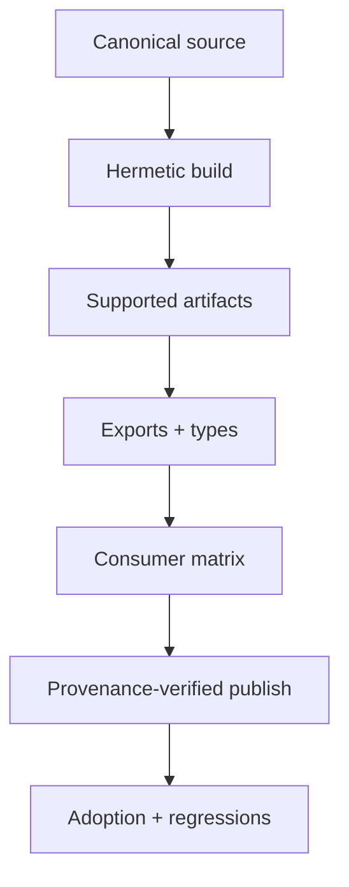

# Modules and Tooling Interview Questions

## Linked Topic

- [[02-JavaScript/06-Modules-and-Tooling/ES Modules|ES Modules]]
- [[02-JavaScript/06-Modules-and-Tooling/CommonJS and Interoperability|CommonJS and Interoperability]]
- [[02-JavaScript/06-Modules-and-Tooling/Module Resolution and Package Exports|Module Resolution and Package Exports]]
- [[02-JavaScript/06-Modules-and-Tooling/Package JSON and Semantic Versioning|Package JSON and Semantic Versioning]]
- [[02-JavaScript/06-Modules-and-Tooling/Transpilation and Polyfills|Transpilation and Polyfills]]
- [[02-JavaScript/06-Modules-and-Tooling/Bundling Tree Shaking and Code Splitting|Bundling Tree Shaking and Code Splitting]]
- [[02-JavaScript/06-Modules-and-Tooling/Source Maps and Debug Builds|Source Maps and Debug Builds]]

## How to Practice

1. Draw the module graph and separate resolution, linking, and evaluation.
2. Name runtime, package-manager, compiler, and bundler responsibilities.
3. Include compatibility, provenance, debugging, and release operations.

## Conceptual

1. Compare ESM live bindings with CommonJS module objects and caches.
2. How do cycles work, and why are they not automatically erroneous?
3. Distinguish transpilation, polyfilling, bundling, tree shaking, code splitting, and minification.
4. What contracts are encoded by `package.json`, `exports`, and semantic versions?

## Internal Implementation

1. Walk ESM from specifier resolution through instantiation and evaluation.
2. How can top-level await affect an importing graph?
3. How do source maps reconstruct original locations, and what can make them inaccurate?

## Trade-offs and Judgment

1. When should a package ship ESM only, dual formats, or separate major versions?
2. What breaks first when deep imports bypass package exports?
3. How do you trade bundle size against caching, request count, and execution cost?

## Coding / Design Prompts

1. Build a dependency graph analyzer with cycle groups and deterministic diagnostics.
2. Design an `exports` map for public entry points without duplicate singleton instances.
3. Diagnose a production stack using a release-matched source map.

## Production Scenario

Explain reproducibility, dependency pinning, compatibility tests, source-map custody, staged release, deprecation, and rollback.

## Staff-Level Follow-ups

1. How would you migrate a monorepo from CommonJS to ESM incrementally?
2. How would you define package-boundary and dependency-governance standards?
3. How would you respond to a compromised transitive package without freezing delivery indefinitely?

## Rubric

| Signal | Weak | Strong |
| --- | --- | --- |
| First principles | Lists bundler flags | Models graph phases and contracts |
| Trade-offs | Optimizes bytes only | Balances runtime, caching, compatibility, operations |
| Production sense | Builds locally | Tests packed artifacts with provenance and rollback |

## Related Notes

- [[Career/README|Career]]
- [[02-JavaScript/_exercises/Modules and Tooling Exercises|Modules and Tooling Exercises]]
- [[02-JavaScript/code/README|JavaScript code labs]]
