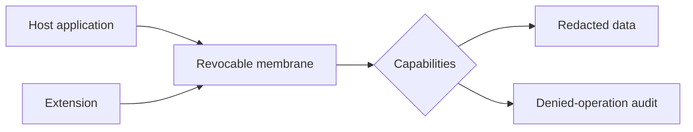

# Objects and Metaprogramming Interview Questions

## Linked Topic

- [[02-JavaScript/03-Objects-and-Metaprogramming/Property Descriptors and Object Integrity|Property Descriptors and Object Integrity]]
- [[02-JavaScript/03-Objects-and-Metaprogramming/Prototype Chain and Delegation|Prototype Chain and Delegation]]
- [[02-JavaScript/03-Objects-and-Metaprogramming/Constructor Functions and New|Constructor Functions and New]]
- [[02-JavaScript/03-Objects-and-Metaprogramming/Map Set WeakMap and WeakSet|Map Set WeakMap and WeakSet]]
- [[02-JavaScript/03-Objects-and-Metaprogramming/Iterators and Generators|Iterators and Generators]]
- [[02-JavaScript/03-Objects-and-Metaprogramming/Proxy and Reflect|Proxy and Reflect]]

## How to Practice

1. Trace object internal operations and property descriptors.
2. State proxy invariants before designing traps.
3. Include identity, lifetime, serialization, and security.

## Conceptual

1. Explain prototype delegation without saying classes are copied into instances.
2. Compare own, inherited, enumerable, configurable, writable, and accessor properties.
3. When should you choose object, `Map`, `Set`, `WeakMap`, or private fields?
4. How do iterator and iterable protocols differ?

## Internal Implementation

1. Walk the semantic steps of `new`.
2. Explain receiver use during inherited getter, setter, and method access.
3. Why do Proxy traps have invariants, and how does `Reflect` help preserve them?

## Trade-offs and Judgment

1. When does metaprogramming reduce duplication, and when does it destroy local reasoning?
2. Compare composition, delegation, classes, and mixins for evolving behavior.
3. Why is a Proxy membrane insufficient as the only untrusted-code boundary?

## Coding / Design Prompts

1. Implement prototype lookup and a teaching version of `new`.
2. Design a lazy iterable that closes resources on completion, error, or early break.
3. Review a reactive Proxy for duplicate subscriptions and stale dependencies.

## Production Scenario

Design nested wrapping, identity caching, revocation, method receivers, isolation, and auditability for extensions.

## Staff-Level Follow-ups

1. How would you standardize extension capabilities across multiple products?
2. How would you migrate from mutable shared objects to explicit domain interfaces?
3. Which metaprogramming techniques would require architecture review, and why?

## Rubric

| Signal | Weak | Strong |
| --- | --- | --- |
| First principles | “Classes create copies” | Explains descriptors, delegation, and receivers |
| Trade-offs | Proxy solves everything | Names invariant, debugging, performance, security costs |
| Production sense | Handles reads only | Covers identity, lifecycle, revocation, and isolation |

## Related Notes

- [[Career/README|Career]]
- [[02-JavaScript/_exercises/Objects and Metaprogramming Exercises|Objects and Metaprogramming Exercises]]
- [[02-JavaScript/code/README|JavaScript code labs]]
