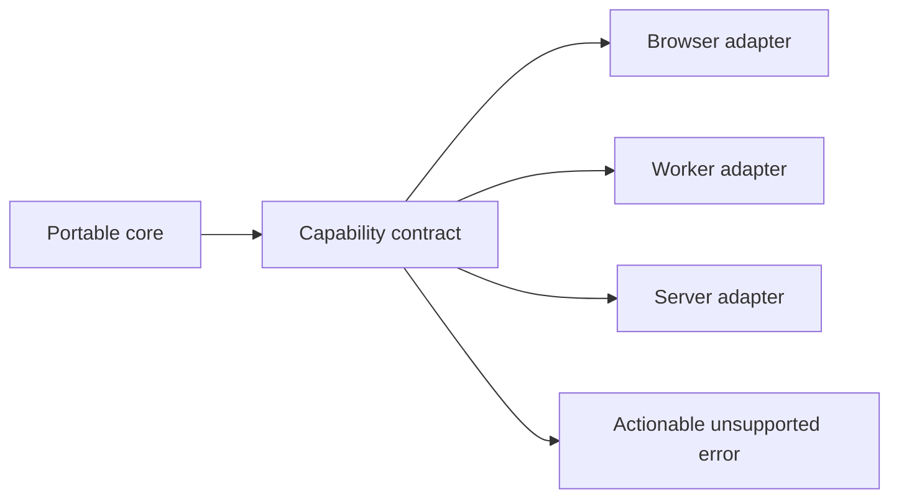

# Orientation Interview Questions

## Linked Topic

- [[02-JavaScript/00-Orientation/Why JavaScript Exists|Why JavaScript Exists]]
- [[02-JavaScript/00-Orientation/ECMAScript Engines and Host Runtimes|ECMAScript Engines and Host Runtimes]]
- [[02-JavaScript/00-Orientation/JavaScript Program Lifecycle|JavaScript Program Lifecycle]]
- [[02-JavaScript/00-Orientation/Strict Mode|Strict Mode]]

## How to Practice

1. Answer out loud in 2–5 minutes.
2. Draw the specification–engine–host boundary.
3. State portable guarantees before runtime-specific behavior.
4. Give a production compatibility example.

## Conceptual

1. What are ECMAScript, JavaScript, an engine, and a host runtime?
2. Which parts of `fetch`, promises, timers, modules, and the event loop belong to which layer?
3. Why did JavaScript retain backward-compatible behavior that modern code often avoids?
4. How do scripts and modules differ in scope and strictness?

## Internal Implementation

1. Walk source through parsing, declaration instantiation, evaluation, and host callbacks.
2. What can an engine optimize without changing observable semantics?
3. How can separate realms share a specification yet have distinct intrinsic objects?

## Trade-offs and Judgment

1. When should a library use feature detection, explicit adapters, or separate builds?
2. What breaks first when code assumes a browser global during module evaluation?
3. Which compatibility promises would you avoid before measuring consumer demand?

## Coding / Design Prompts

1. Implement a safe capability report for browser, worker, and Node-like hosts.
2. Review a module that mutates `window` at import time and redesign it for portability and tests.

## Production Scenario

An SDK must support heterogeneous hosts:

Explain compatibility testing, lazy adapter selection, telemetry, deprecation, and what must happen when a capability is missing.

## Staff-Level Follow-ups

1. How would you create an organization-wide runtime support policy and exception process?
2. How would you migrate host-coupled libraries without forcing a flag-day release?
3. What evidence would justify dropping an old runtime, and how would you communicate it?

## Rubric

| Signal | Weak | Strong |
| --- | --- | --- |
| First principles | Lists runtime names | Separates specification, engine, and host ownership |
| Trade-offs | “Feature detection is best” | Balances portability, size, testing, and support |
| Production sense | Checks one environment | Defines matrix, telemetry, fallback, and deprecation |

## Related Notes

- [[Career/README|Career]]
- [[02-JavaScript/_exercises/Orientation Exercises|Orientation Exercises]]
- [[02-JavaScript/code/README|JavaScript code labs]]
