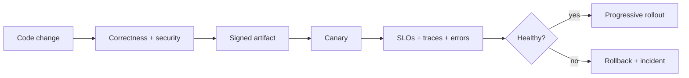

# Production JavaScript Interview Questions

## Linked Topic

- [[02-JavaScript/07-Production-JavaScript/Error Design and Exception Safety|Error Design and Exception Safety]]
- [[02-JavaScript/07-Production-JavaScript/Testing JavaScript|Testing JavaScript]]
- [[02-JavaScript/07-Production-JavaScript/Debugging JavaScript|Debugging JavaScript]]
- [[02-JavaScript/07-Production-JavaScript/Measuring and Optimizing Performance|Measuring and Optimizing Performance]]
- [[02-JavaScript/07-Production-JavaScript/Secure JavaScript Practices|Secure JavaScript Practices]]
- [[02-JavaScript/07-Production-JavaScript/TypeScript Interoperability|TypeScript Interoperability]]
- [[02-JavaScript/07-Production-JavaScript/API Design and Defensive Programming|API Design and Defensive Programming]]
- [[02-JavaScript/07-Production-JavaScript/Observability and Operational Readiness|Observability and Operational Readiness]]

## How to Practice

1. Tie language choices to business invariants and SLOs.
2. Cover prevention, detection, mitigation, and recovery.
3. Discuss security, compatibility, ownership, and migration.

## Conceptual

1. How should an API distinguish validation, operational, programmer, dependency, and cancellation errors?
2. Why do static types not remove runtime validation or contract testing?
3. What questions are best answered by logs, metrics, traces, profiles, and audit events?
4. What makes a JavaScript API defensive without making it hostile to consumers?

## Internal Implementation

1. Explain error causes, stack preservation, async boundaries, and stable machine-readable codes.
2. How can prototype pollution occur, and which parsing/merge practices reduce exposure?
3. What creates high-cardinality telemetry, and how can it destabilize observability systems?

## Trade-offs and Judgment

1. Compare exceptions, result objects, and typed error unions across public boundaries.
2. When should tests use mocks, fakes, contract environments, or production shadowing?
3. What would you refuse to optimize until correctness and measurement prerequisites exist?

## Coding / Design Prompts

1. Design a validated, abort-aware API facade with structured errors and redacted telemetry.
2. Review a retry helper for deadlines, idempotency, cleanup, jitter, and observability.
3. Build a test plan spanning unit, integration, contract, load, security, and fault injection.

## Production Scenario

Describe release gates, feature flags, tenant-safe diagnosis, incident command, rollback, post-incident actions, and long-term prevention.

## Staff-Level Follow-ups

1. How would you define a JavaScript production-readiness standard that teams can adopt incrementally?
2. How would you lead a cross-team migration of an unsafe public API?
3. How would you decide whether a recurring incident needs code, platform, process, or ownership changes?
4. How do you balance delivery speed against supply-chain and compatibility risk?

## Rubric

| Signal | Weak | Strong |
| --- | --- | --- |
| First principles | Lists best practices | Connects controls to invariants and failure modes |
| Trade-offs | Demands maximum rigor everywhere | Scales controls by risk, evidence, and reversibility |
| Production sense | Handles happy path | Owns rollout, observability, mitigation, and learning |

## Related Notes

- [[Career/README|Career]]
- [[02-JavaScript/_exercises/Production JavaScript Exercises|Production JavaScript Exercises]]
- [[02-JavaScript/code/README|JavaScript code labs]]
- [[18-Security/README|Security]]
