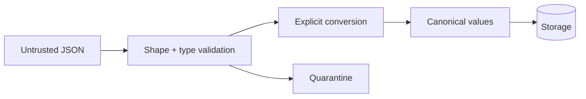

# Values and Types Interview Questions

## Linked Topic

- [[02-JavaScript/01-Values-and-Types/JavaScript Type System|JavaScript Type System]]
- [[02-JavaScript/01-Values-and-Types/Numbers BigInt and Numeric Precision|Numbers BigInt and Numeric Precision]]
- [[02-JavaScript/01-Values-and-Types/Strings Unicode and Template Literals|Strings Unicode and Template Literals]]
- [[02-JavaScript/01-Values-and-Types/Type Coercion|Type Coercion]]
- [[02-JavaScript/01-Values-and-Types/Equality and Sameness|Equality and Sameness]]
- [[02-JavaScript/01-Values-and-Types/Value Copying Sharing and Mutation|Value Copying Sharing and Mutation]]

## How to Practice

1. Trace abstract conversions instead of quoting surprising outputs.
2. Test boundary cases: `NaN`, signed zero, unsafe integers, symbols, and Unicode.
3. State the domain representation before choosing operators.

## Conceptual

1. What does JavaScript dynamically type: variables, values, or both?
2. Compare `undefined`, `null`, absence, and an explicitly empty domain value.
3. Compare `===`, `Object.is`, and SameValueZero and give a use case for each.
4. Why are strings iterable by code point but indexed by UTF-16 code unit?

## Internal Implementation

1. Walk through `ToPrimitive` and explain how `valueOf`, `toString`, and `Symbol.toPrimitive` participate.
2. Why does IEEE 754 make `0.1 + 0.2` inexact, and when does that matter?
3. What is shared after object assignment, shallow spread, JSON round-trip, and `structuredClone`?

## Trade-offs and Judgment

1. When is coercive equality defensible, and what constraints make it safe?
2. When should money use integer minor units, `BigInt`, or a decimal library?
3. What breaks first when truthiness is used to validate external payloads?

## Coding / Design Prompts

1. Implement a strict amount parser with explicit units, range checks, and structured errors.
2. Build a deduplicator with configurable equality and stable first-seen order.

## Production Scenario

Design null/missing semantics, numeric limits, Unicode normalization, schema evolution, and error telemetry for partner ingestion.

## Staff-Level Follow-ups

1. How would you migrate a company from floating-point monetary values without corrupting historical data?
2. How would you standardize boundary validation across many services while preserving team autonomy?
3. Which correctness properties would you enforce with property-based tests?

## Rubric

| Signal | Weak | Strong |
| --- | --- | --- |
| First principles | Memorizes coercion trivia | Traces abstract operations and representations |
| Trade-offs | Always bans coercion | Connects operator choice to validated domain |
| Production sense | Parses happy paths | Covers precision, Unicode, schema, and migration |

## Related Notes

- [[Career/README|Career]]
- [[02-JavaScript/_exercises/Values and Types Exercises|Values and Types Exercises]]
- [[02-JavaScript/code/README|JavaScript code labs]]
