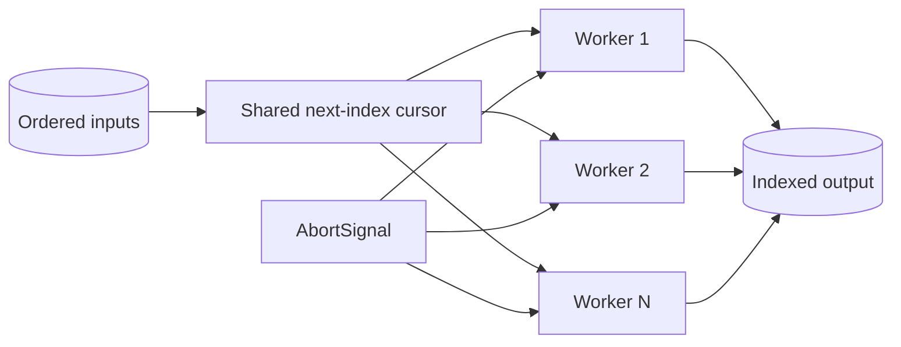

# Architecture — Concurrency Limiter

## Summary

The lab isolates one runtime mechanism behind a small typed API. Source of truth: [[02-JavaScript/code/src/concurrency.ts|concurrency.ts]]. Tests call public behavior rather than private state.

## Component and Data Flow

## Invariants

- Active mapper calls never exceed the positive integer limit.
- Results preserve input order despite completion order.
- Pre-aborted and mid-flight signals reject with the signal reason.
- Timeout timers and parent abort listeners are removed on settlement.

## Failure Model

Invalid input fails synchronously where validation is possible. Runtime failures propagate through the API's explicit error channel; no failure is silently logged or swallowed. Callers remain responsible for resource cleanup outside this in-memory component.

## Complexity and Ownership

The component owns only transient in-process state. It performs no file, network, process, or database I/O. Complexity should be assessed against input size and registered dependencies/listeners/tasks, then verified before production reuse.

## Trade-offs and Native Gaps

| Gap | Engineering consequence |
| --- | --- |
| 1 | A failure rejects the aggregate but cannot forcibly stop mappers that ignore their signal. |
| 2 | No retries, priorities, rate-per-time-window policy, streaming input, or adaptive concurrency. |
| 3 | `withTimeout` depends on cooperative cancellation; the underlying operation may continue. |

A fixed worker pool avoids creating one promise per queued task, but a shared cursor provides no priority or fairness beyond input order.

## Evolution Rules

- Preserve current observable ordering unless a versioned contract documents a change.
- Add a failing test in [[02-JavaScript/code/tests/labs.test|labs.test.ts]] before fixing a discovered edge case.
- Do not claim standards compliance without running the relevant conformance suite.
- Keep production concerns such as telemetry, cancellation, and resource limits explicit.

## Related Documents

- [[02-JavaScript/projects/Concurrency Limiter/README|Project README]]
- [[02-JavaScript/projects/JavaScript Runtime Toolkit/Architecture|Toolkit Architecture]]
- [[02-JavaScript/projects/JavaScript Runtime Toolkit/Testing|Toolkit Testing]]
