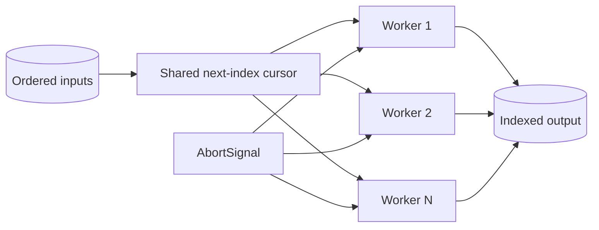

# Concurrency Limiter

## One-Line Purpose

Bound asynchronous work, preserve output order, propagate cancellation, and make timeout cleanup observable.

## Status

**Active.** The implementation lives in [[02-JavaScript/code/src/concurrency.ts|concurrency.ts]] and its executable checks live in [[02-JavaScript/code/tests/labs.test|labs.test.ts]].

## Prerequisites

promises, async functions, `AbortController`, race conditions, and backpressure.

## Architecture



The public learning surface is `mapLimit` and `withTimeout`. Read [[02-JavaScript/projects/Concurrency Limiter/Architecture|Architecture]] before extending behavior.

## Acceptance Criteria

- [ ] Active mapper calls never exceed the positive integer limit.
- [ ] Results preserve input order despite completion order.
- [ ] Pre-aborted and mid-flight signals reject with the signal reason.
- [ ] Timeout timers and parent abort listeners are removed on settlement.

## Run and Test

From the repository root:

```bash
cd 02-JavaScript/code
npm install
npm test -- tests/labs.test.ts -t "mapLimit"
```

Run the complete JavaScript lab suite with `npm test`. Keep experiments in `02-JavaScript/code`; this directory contains documentation, not a second implementation.

## Limitations Versus Native Behavior

- A failure rejects the aggregate but cannot forcibly stop mappers that ignore their signal.
- No retries, priorities, rate-per-time-window policy, streaming input, or adaptive concurrency.
- `withTimeout` depends on cooperative cancellation; the underlying operation may continue.

## Production Trade-off

A fixed worker pool avoids creating one promise per queued task, but a shared cursor provides no priority or fairness beyond input order.

## Exercises and Reflection

1. Add a fail-slow mode that returns per-item outcomes.
2. Support `AsyncIterable` input with bounded buffering.
3. Measure throughput and latency for I/O-bound and CPU-bound mappers.

Reflect: identify one invariant the tests prove, one they do not prove, and one production failure mode hidden by the lab's small scale.

## Interview Questions

- How is concurrency limiting different from rate limiting?
- Why can an aborted promise leave underlying work running?

## Related Notes

- [[02-JavaScript/projects/Concurrency Limiter/Architecture|Architecture]]
- [[02-JavaScript/projects/JavaScript Runtime Toolkit/README|JavaScript Runtime Toolkit]]
- [[02-JavaScript/code/tests/labs.test|JavaScript lab tests]]
