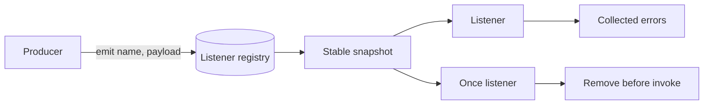

# Architecture — EventEmitter From Scratch

## Summary

The lab isolates one runtime mechanism behind a small typed API. Source of truth: [[02-JavaScript/code/src/event-emitter.ts|event-emitter.ts]]. Tests call public behavior rather than private state.

## Component and Data Flow

## Invariants

- `on` returns an idempotent unsubscribe closure.
- `once` runs at most once, including when it throws.
- Dispatch uses a snapshot so additions and removals do not corrupt iteration.
- Listener failures are returned without preventing later listeners.

## Failure Model

Invalid input fails synchronously where validation is possible. Runtime failures propagate through the API's explicit error channel; no failure is silently logged or swallowed. Callers remain responsible for resource cleanup outside this in-memory component.

## Complexity and Ownership

The component owns only transient in-process state. It performs no file, network, process, or database I/O. Complexity should be assessed against input size and registered dependencies/listeners/tasks, then verified before production reuse.

## Trade-offs and Native Gaps

| Gap | Engineering consequence |
| --- | --- |
| 1 | Unlike Node.js `EventEmitter`, the `error` event has no special process-level semantics. |
| 2 | No listener leak warnings, prepend methods, async iterator, or symbol inspection hooks. |
| 3 | Dispatch is synchronous; returned promises are not awaited. |

Collecting listener errors improves isolation for educational and batch use, while Node's default throw-on-unhandled-error behavior makes failures harder to ignore.

## Evolution Rules

- Preserve current observable ordering unless a versioned contract documents a change.
- Add a failing test in [[02-JavaScript/code/tests/labs.test|labs.test.ts]] before fixing a discovered edge case.
- Do not claim standards compliance without running the relevant conformance suite.
- Keep production concerns such as telemetry, cancellation, and resource limits explicit.

## Related Documents

- [[02-JavaScript/projects/EventEmitter From Scratch/README|Project README]]
- [[02-JavaScript/projects/JavaScript Runtime Toolkit/Architecture|Toolkit Architecture]]
- [[02-JavaScript/projects/JavaScript Runtime Toolkit/Testing|Toolkit Testing]]
