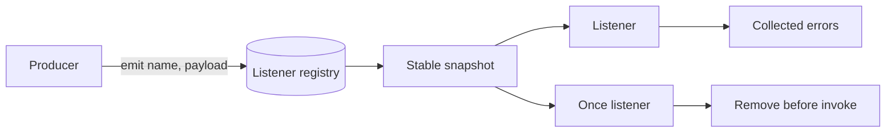

# EventEmitter From Scratch

## One-Line Purpose

Build a typed synchronous publish/subscribe primitive that exposes listener lifecycle, mutation during dispatch, and failure-isolation decisions.

## Status

**Active.** The implementation lives in [[02-JavaScript/code/src/event-emitter.ts|event-emitter.ts]] and its executable checks live in [[02-JavaScript/code/tests/labs.test|labs.test.ts]].

## Prerequisites

functions, generics, `Map`, array snapshots, and [[02-JavaScript/03-Asynchronous-JavaScript/Event Loop|Event Loop]].

## Architecture



The public learning surface is `EventEmitter<Events>`. Read [[02-JavaScript/projects/EventEmitter From Scratch/Architecture|Architecture]] before extending behavior.

## Acceptance Criteria

- [ ] `on` returns an idempotent unsubscribe closure.
- [ ] `once` runs at most once, including when it throws.
- [ ] Dispatch uses a snapshot so additions and removals do not corrupt iteration.
- [ ] Listener failures are returned without preventing later listeners.

## Run and Test

From the repository root:

```bash
cd 02-JavaScript/code
npm install
npm test -- tests/labs.test.ts -t "EventEmitter"
```

Run the complete JavaScript lab suite with `npm test`. Keep experiments in `02-JavaScript/code`; this directory contains documentation, not a second implementation.

## Limitations Versus Native Behavior

- Unlike Node.js `EventEmitter`, the `error` event has no special process-level semantics.
- No listener leak warnings, prepend methods, async iterator, or symbol inspection hooks.
- Dispatch is synchronous; returned promises are not awaited.

## Production Trade-off

Collecting listener errors improves isolation for educational and batch use, while Node's default throw-on-unhandled-error behavior makes failures harder to ignore.

## Exercises and Reflection

1. Add wildcard subscriptions with a documented ordering rule.
2. Add a configurable maximum listener warning.
3. Compare snapshot dispatch with linked-list dispatch under churn.

Reflect: identify one invariant the tests prove, one they do not prove, and one production failure mode hidden by the lab's small scale.

## Interview Questions

- Why remove a once-listener before invoking it?
- Should one listener failure stop the remaining listeners?

## Related Notes

- [[02-JavaScript/projects/EventEmitter From Scratch/Architecture|Architecture]]
- [[02-JavaScript/projects/JavaScript Runtime Toolkit/README|JavaScript Runtime Toolkit]]
- [[02-JavaScript/code/tests/labs.test|JavaScript lab tests]]
