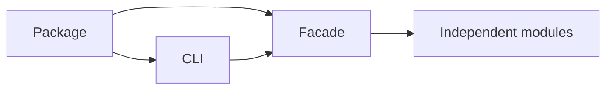

# ADR-0001: Use One Package with Independent Internal Modules

## Status

Accepted on 2026-07-21.

## Context

Six related labs need a coherent portfolio surface without erasing their distinct invariants or creating operationally meaningless services.

## Decision

Publish one ESM package with explicit subpath-friendly exports and one thin CLI. Keep each mechanism in its existing file under [[02-JavaScript/code/src|code/src]]; add a facade and adapter without moving domain logic into the CLI.

## Options Considered

- One package: simple installation, integration tests, and version story; releases are coupled.
- Six packages: independent versions and smaller imports; excessive repository and release overhead for educational modules.
- Services: process isolation; unjustified networking, deployment, latency, and failure complexity.

## Consequences

Public exports and CLI JSON become compatibility surfaces. Internal modules remain testable in isolation. A defect in one module may require a package release, but no module may import the CLI.

## Follow-ups

- Add facade export and package smoke tests.
- Enforce dependency direction in review.
- Revisit only if release cadence or consumer evidence justifies package splitting.
