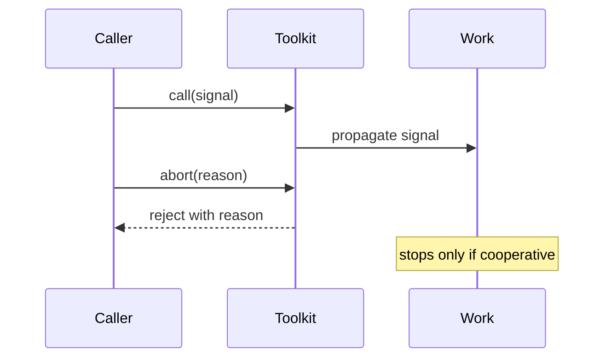

# ADR-0002: Make Async Ordering and Cancellation Explicit

## Status

Accepted on 2026-07-21.

## Context

Promise reactions, reactive effects, listener dispatch, and limited workers have observable ordering. Cancellation is cooperative and cannot guarantee work termination.

## Decision

Document and test microtask scheduling, synchronous event dispatch, stable result ordering, once-only settlement, and `AbortSignal` propagation. Use stable errors/exit codes. Never describe timeout rejection as proof that underlying work stopped.

## Options Considered

- Explicit contracts: more tests and compatibility obligations, but deterministic learning and safer consumers.
- Best-effort unspecified ordering: simpler implementation, but race-prone and unteachable.
- Forceful worker/process isolation: stronger termination, but outside this in-process toolkit's scope.

## Consequences

Ordering changes require a compatibility decision. Mappers and operations must cooperate with signals. Tests use controlled microtasks and fake timers instead of timing sleeps.

## Follow-ups

- Add timeout cleanup and mid-flight abort tests.
- Specify CLI mapping for abort and timeout.
- Link all native behavior gaps from [[02-JavaScript/projects/JavaScript Runtime Toolkit/API|API]].
